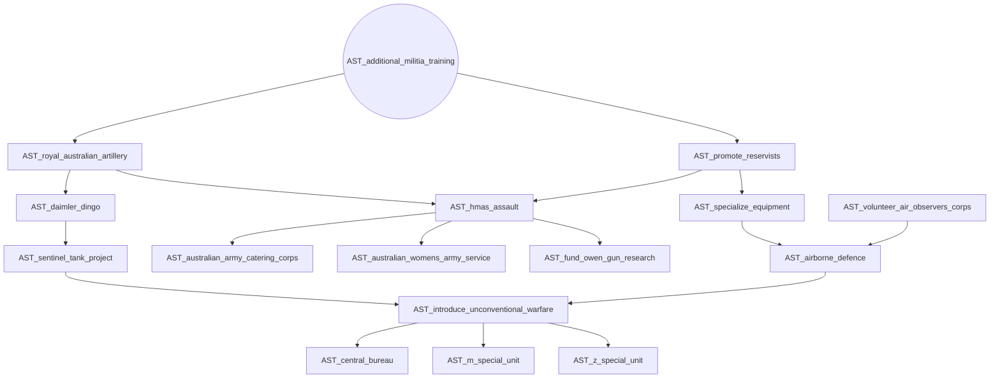
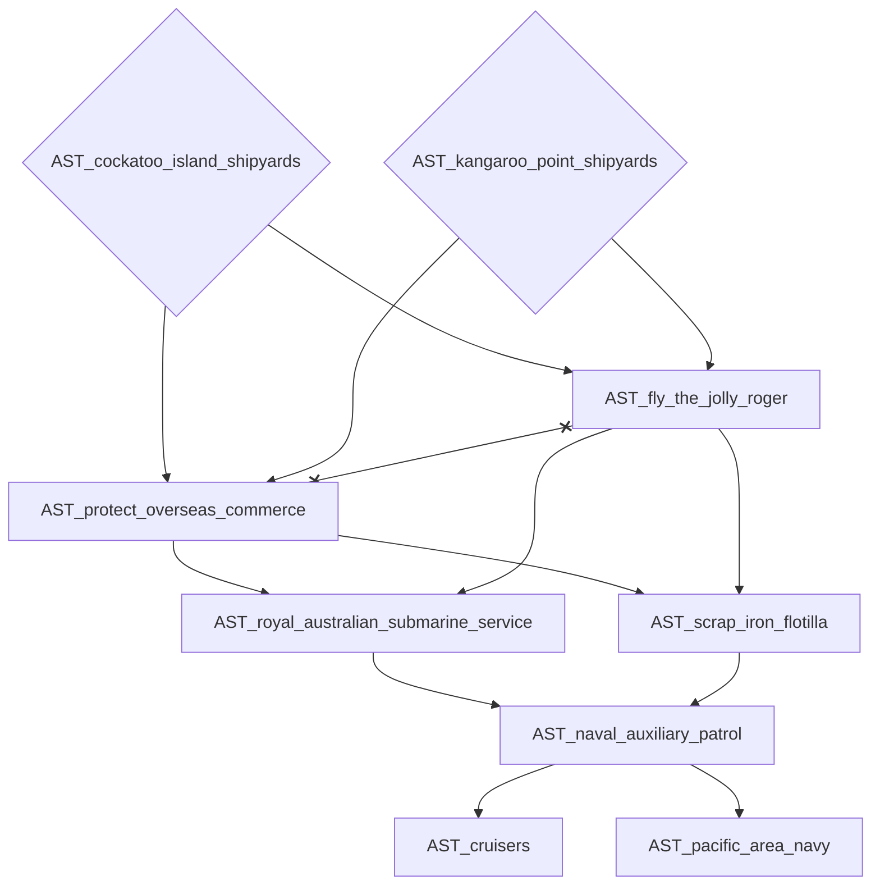
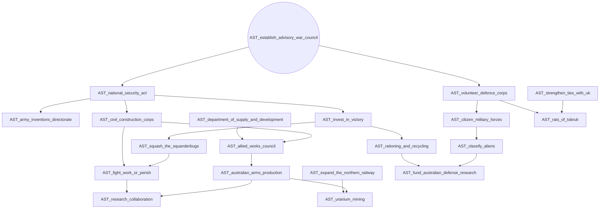
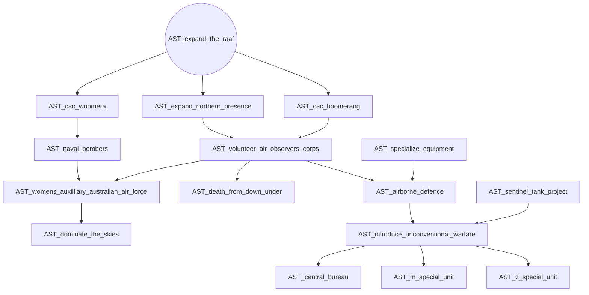
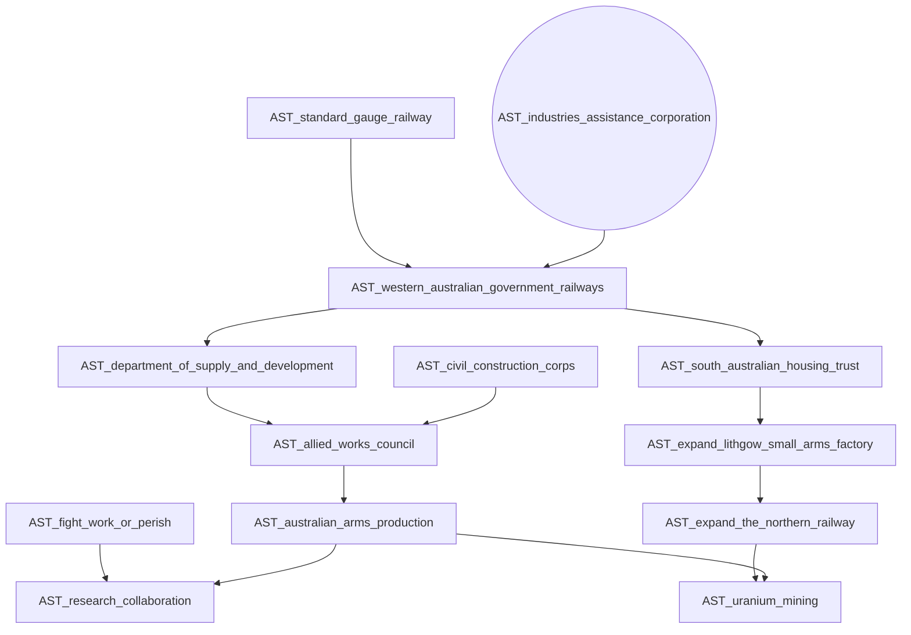
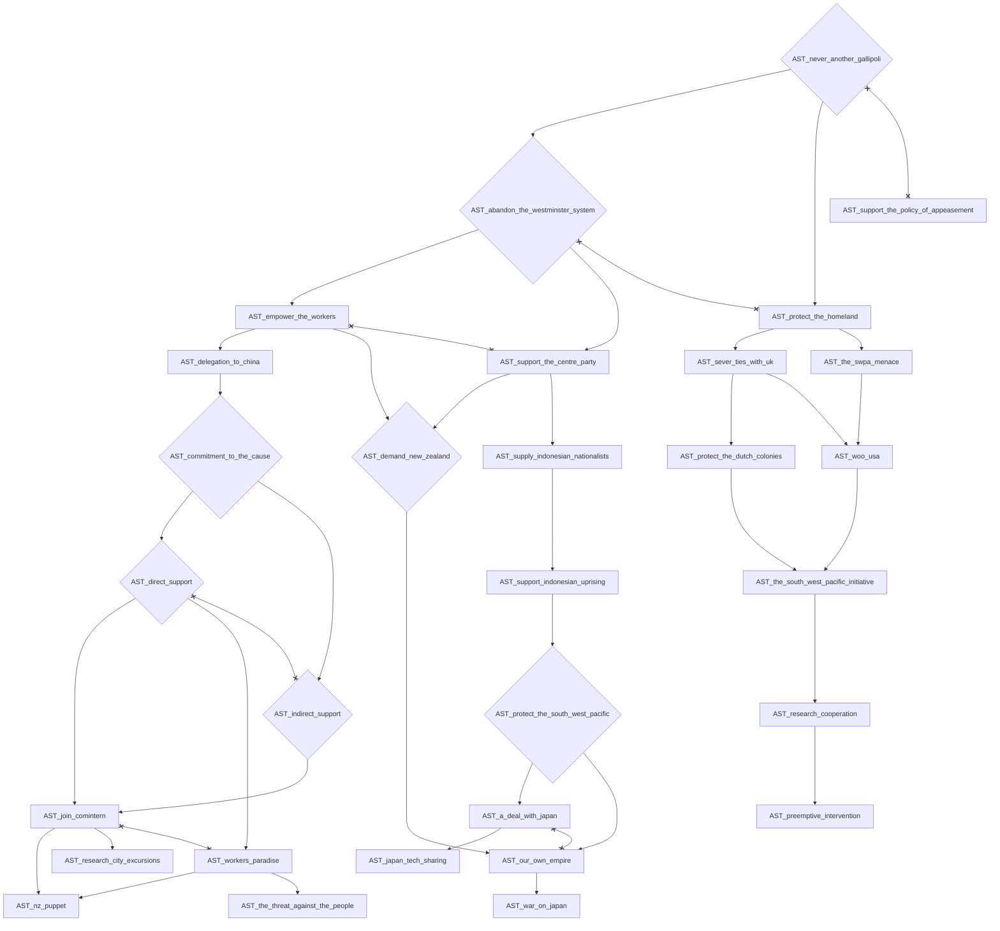
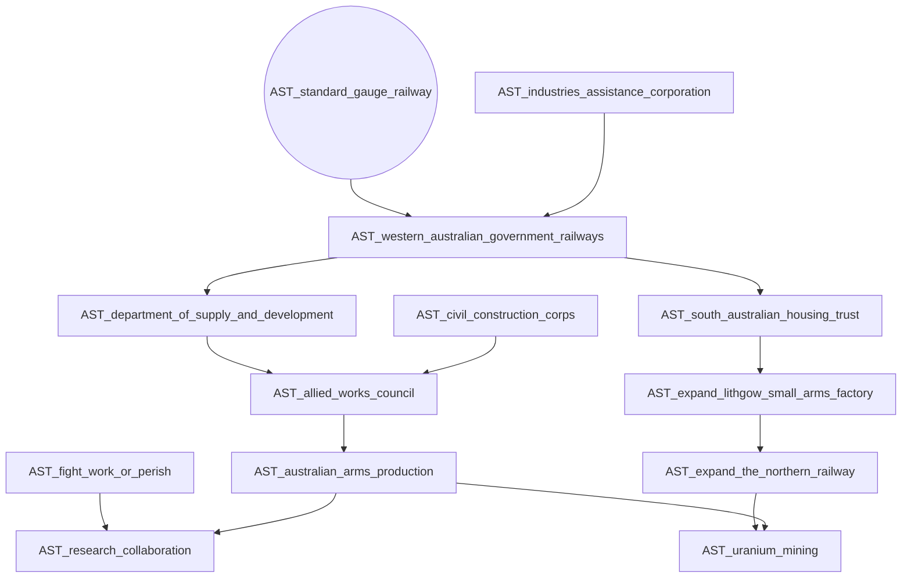
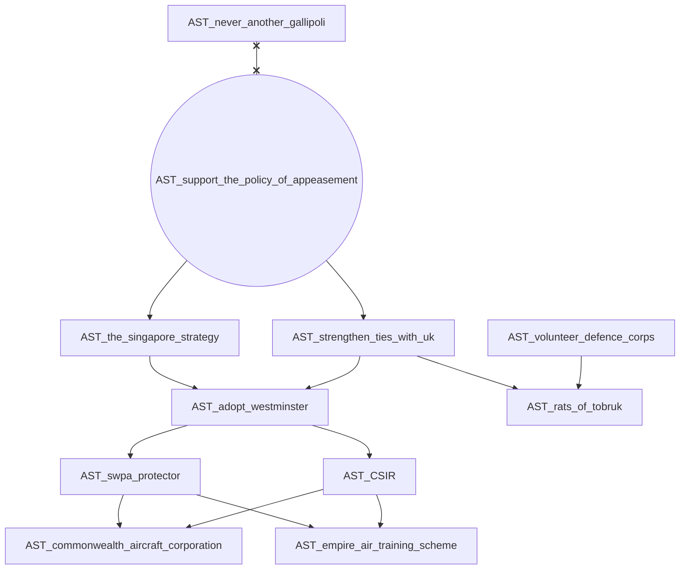

# AST_additional_militia_training

# AST_cockatoo_island_shipyards

# AST_establish_advisory_war_council

# AST_expand_the_raaf

# AST_industries_assistance_corporation

# AST_kangaroo_point_shipyards

# AST_never_another_gallipoli

# AST_standard_gauge_railway

# AST_support_the_policy_of_appeasement

