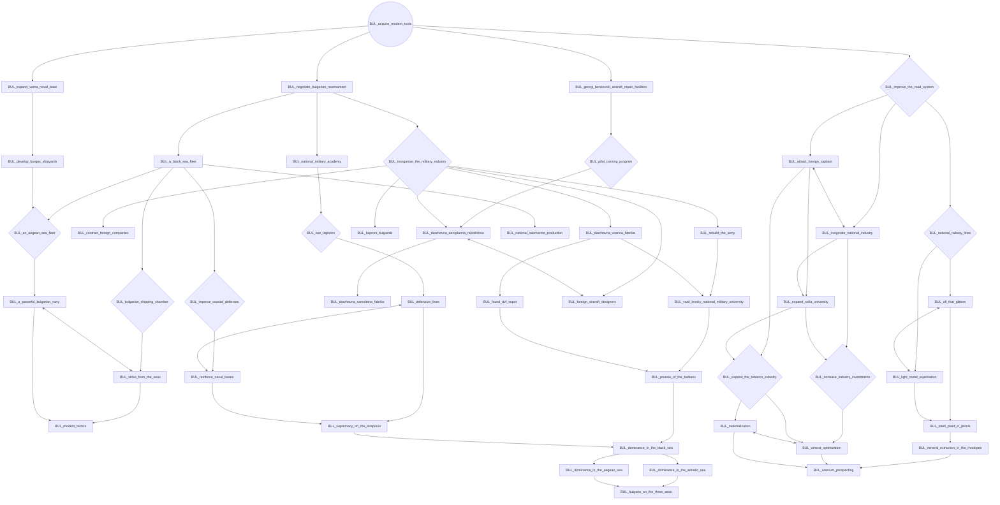
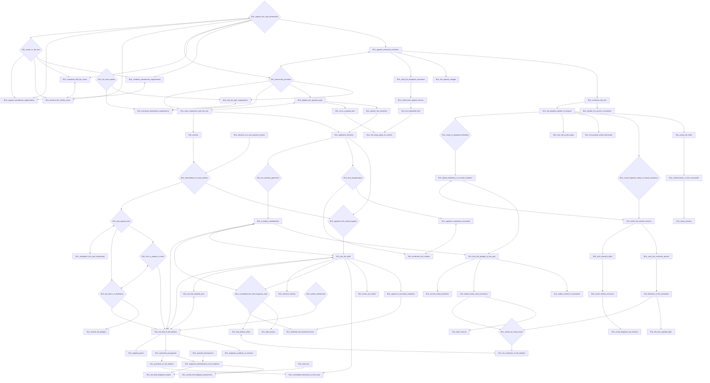
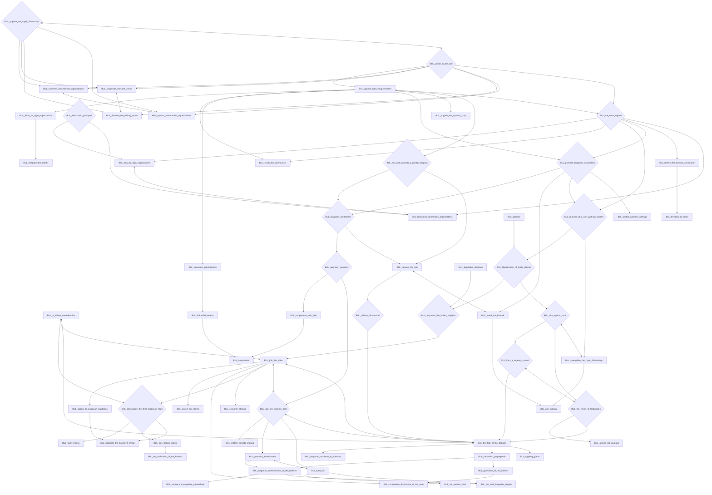

# BUL_acquire_modern_tools

```mermaid
flowchart TD
    n1["BUL_a_black_sea_fleet"]
    n2["BUL_a_powerful_bulgarian_navy"]
    n3(("BUL_acquire_modern_tools"))
    n4["BUL_all_that_glitters"]
    n5{"BUL_an_aegean_sea_fleet"}
    n6["BUL_attract_foreign_capitals"]
    n7["BUL_bulgaria_on_the_three_seas"]
    n8{"BUL_bulgarian_shipping_chamber"}
    n9["BUL_contract_foreign_companies"]
    n10["BUL_darzhavna_aeroplanna_rabotilnitsa"]
    n11["BUL_darzhavna_samoletna_fabrika"]
    n12["BUL_darzhavna_voenna_fabrika"]
    n13["BUL_defensive_lines"]
    n14["BUL_develop_burgas_shipyards"]
    n15["BUL_dominance_in_the_adriatic_sea"]
    n16["BUL_dominance_in_the_aegean_sea"]
    n17["BUL_dominance_in_the_black_sea"]
    n18["BUL_expand_sofia_university"]
    n19{"BUL_expand_the_tobacco_industry"}
    n20["BUL_expand_varna_naval_base"]
    n21["BUL_foreign_aircraft_designers"]
    n22["BUL_found_dvf_sopot"]
    n23["BUL_georgi_benkovski_aircraft_repair_facilities"]
    n24{"BUL_improve_coastal_defenses"}
    n25{"BUL_improve_the_road_system"}
    n26{"BUL_increase_industry_investments"}
    n27["BUL_invigorate_national_industry"]
    n28["BUL_kaproni_bulgarski"]
    n29["BUL_light_metal_exploitation"]
    n30["BUL_mineral_extraction_in_the_rhodopes"]
    n31["BUL_modern_tactics"]
    n32["BUL_national_military_academy"]
    n33{"BUL_national_railway_lines"}
    n34["BUL_national_submarine_production"]
    n35["BUL_nationalization"]
    n36["BUL_negotiate_bulgarian_rearmament"]
    n37{"BUL_pilot_training_program"}
    n38["BUL_prussia_of_the_balkans"]
    n39["BUL_rebuild_the_army"]
    n40["BUL_reinforce_naval_bases"]
    n41{"BUL_reorganize_the_military_industry"}
    n42["BUL_steel_plant_in_pernik"]
    n43["BUL_strike_from_the_seas"]
    n44["BUL_supremacy_on_the_bosporus"]
    n45["BUL_uranium_prospecting"]
    n46["BUL_utmost_optimization"]
    n47["BUL_vasil_levsky_national_military_university"]
    n48{"BUL_war_logistics"}
    n36 --> n1
    n5 --> n2
    n33 --> n4
    n1 --> n5
    n14 --> n5
    n25 --> n6
    n15 --> n7
    n16 --> n7
    n1 --> n8
    n41 --> n9
    n37 --> n10
    n41 --> n10
    n10 --> n11
    n41 --> n12
    n48 --> n13
    n20 --> n14
    n17 --> n15
    n17 --> n16
    n38 --> n17
    n44 --> n17
    n6 --> n18
    n27 --> n18
    n6 --> n19
    n18 --> n19
    n3 --> n20
    n41 --> n21
    n12 --> n22
    n3 --> n23
    n1 --> n24
    n3 --> n25
    n27 --> n26
    n18 --> n26
    n25 --> n27
    n41 --> n28
    n33 --> n29
    n42 --> n30
    n43 --> n31
    n2 --> n31
    n36 --> n32
    n25 --> n33
    n1 --> n34
    n19 --> n35
    n3 --> n36
    n23 --> n37
    n47 --> n38
    n22 --> n38
    n41 --> n39
    n24 --> n40
    n36 --> n41
    n4 --> n42
    n29 --> n42
    n8 --> n43
    n13 --> n44
    n40 --> n44
    n30 --> n45
    n46 --> n45
    n35 --> n45
    n26 --> n46
    n19 --> n46
    n39 --> n47
    n12 --> n47
    n32 --> n48
    n2 x--x n43
    n4 x--x n29
    n6 x--x n27
    n10 x--x n21
    n13 x--x n40
    n35 x--x n46
```

# BUL_oppose_the_royal_dictatorship

```mermaid
flowchart TD
    n49["BUL_a_balkan_confederation"]
    n50["BUL_abolish_the_monarchy"]
    n51["BUL_abolish_the_tarnovo_constitution"]
    n52["BUL_agrarian_cooperative_movement"]
    n53["BUL_amend_old_grudges"]
    n54["BUL_appeal_to_european_capitalists"]
    n55["BUL_appoint_communist_ministers"]
    n56{"BUL_approach_the_united_kingdom"}
    n57["BUL_assert_our_claims"]
    n58["BUL_balkan_federation_of_socialist_republics"]
    n59["BUL_balkan_research_cooperation"]
    n60["BUL_balkan_trade_union_secretariat"]
    n61["BUL_ban_far_right_organizations"]
    n62["BUL_bulgarian_academy_of_sciences"]
    n63["BUL_bulgarian_administration_of_the_balkans"]
    n64["BUL_bury_the_grudges_of_the_past"]
    n65["BUL_carry_the_revolution_abroad"]
    n66["BUL_collectivization_of_the_countryside"]
    n67["BUL_condemn_macedonian_organizations"]
    n68["BUL_consolidate_dominance_of_the_seas"]
    n69{"BUL_consolidate_the_third_bulgarian_state"}
    n70["BUL_cooperate_with_the_zveno"]
    n71["BUL_defy_moscow"]
    n72{"BUL_democratic_principles"}
    n73["BUL_dissolve_the_military_union"]
    n74["BUL_fight_tyranny"]
    n75["BUL_follow_the_stalinist_doctrine"]
    n76["BUL_form_a_popular_bloc"]
    n77{"BUL_form_a_regency_council"}
    n78["BUL_free_balkan_states"]
    n79["BUL_full_voting_rights_for_women"]
    n80["BUL_guardians_of_the_balkans"]
    n81["BUL_heavy_industry"]
    n82["BUL_illusions_of_a_non_partisan_system"]
    n83["BUL_join_the_allies"]
    n84["BUL_join_the_tripartite_pact"]
    n85["BUL_joint_research_effort"]
    n86{"BUL_land_reorganization"}
    n87["BUL_legalize_the_agrarian_party"]
    n88["BUL_legislative_elections"]
    n89{"BUL_liberalization_of_trade_policies"}
    n90["BUL_liberation_of_the_proletariat"]
    n91{"BUL_military_dictatorship"}
    n92["BUL_modernize_the_industry"]
    n93["BUL_nationalist_propaganda"]
    n94["BUL_obliterate_the_bolshevik_threat"]
    n95{"BUL_oppose_the_royal_dictatorship"}
    n96["BUL_overthrow_the_tsar"]
    n97["BUL_peaceful_development"]
    n98["BUL_petorka"]
    n99{"BUL_plot_against_boris"}
    n100{"BUL_power_to_the_tsar"}
    n101["BUL_purge_the_elites"]
    n102["BUL_recover_italian_territories"]
    n103["BUL_research_sharing"]
    n104["BUL_restore_the_bulgarian_patriarchate"]
    n105["BUL_restrained_paramilitary_organizations"]
    n106["BUL_seek_cooperation_with_the_tsar"]
    n107{"BUL_soviet_bulgarian_treaty_of_mutual_assistance"}
    n108["BUL_soviet_bulgarian_war_industry"]
    n109["BUL_soviet_military_exercises"]
    n110["BUL_strengthen_the_royal_dictatorship"]
    n111["BUL_support_macedonian_organizations"]
    n112["BUL_the_anti_capitalist_fight"]
    n113["BUL_the_fate_of_the_balkans"]
    n114["BUL_the_fatherland_front"]
    n115["BUL_the_peoples_militia_directorate"]
    n116["BUL_the_peoples_republic_of_bulgaria"]
    n117{"BUL_the_return_of_ferdinand_i"}
    n118{"BUL_the_salonika_agreement"}
    n119["BUL_the_spanish_struggle"]
    n120["BUL_the_third_bulgarian_empire"]
    n121{"BUL_the_tsars_regime"}
    n122["BUL_the_unification_of_the_balkans"]
    n123["BUL_toppling_giants"]
    n124["BUL_total_war"]
    n125["BUL_train_the_youth_wings"]
    n126{"BUL_treaty_of_perpetual_friendship"}
    n127["BUL_unify_the_bourgeois_movement"]
    n128["BUL_united_front_against_fascism"]
    n129{"BUL_united_we_shall_prevail"}
    n118 --> n49
    n87 --> n50
    n96 --> n51
    n86 --> n52
    n117 --> n53
    n83 --> n54
    n95 --> n55
    n88 --> n56
    n89 --> n56
    n83 --> n57
    n126 --> n58
    n64 --> n59
    n64 --> n60
    n121 --> n61
    n72 --> n61
    n113 --> n62
    n97 --> n63
    n93 --> n63
    n58 --> n64
    n49 --> n64
    n75 --> n65
    n101 --> n66
    n100 --> n67
    n95 --> n67
    n80 --> n68
    n83 --> n68
    n83 --> n69
    n49 --> n69
    n100 --> n70
    n95 --> n70
    n60 --> n71
    n95 --> n72
    n100 --> n73
    n95 --> n73
    n69 --> n74
    n107 --> n75
    n87 --> n76
    n99 --> n77
    n69 --> n78
    n114 --> n79
    n76 --> n79
    n93 --> n80
    n66 --> n81
    n56 --> n83
    n75 --> n85
    n88 --> n86
    n72 --> n87
    n50 --> n88
    n106 --> n88
    n82 --> n89
    n98 --> n89
    n65 --> n90
    n86 --> n92
    n113 --> n93
    n54 --> n94
    n69 --> n94
    n55 --> n96
    n106 --> n98
    n89 --> n99
    n116 --> n101
    n64 --> n102
    n83 --> n103
    n63 --> n104
    n121 --> n105
    n72 --> n105
    n72 --> n106
    n116 --> n107
    n109 --> n108
    n85 --> n109
    n100 --> n111
    n95 --> n111
    n90 --> n112
    n77 --> n113
    n117 --> n113
    n91 --> n113
    n128 --> n114
    n116 --> n115
    n96 --> n116
    n99 --> n117
    n88 --> n118
    n55 --> n119
    n124 --> n120
    n63 --> n120
    n129 --> n122
    n113 --> n123
    n116 --> n125
    n116 --> n126
    n55 --> n127
    n127 --> n128
    n90 --> n129
    n60 --> n129
    n49 x--x n83
    n49 x--x n113
    n52 x--x n92
    n55 x--x n72
    n58 x--x n75
    n61 x--x n105
    n67 x--x n111
    n70 x--x n73
    n77 x--x n117
    n78 x--x n122
    n83 x--x n84
    n83 x--x n113
    n84 x--x n113
    n87 x--x n106
    n95 x--x n100
    n99 x--x n110
```

# BUL_power_to_the_tsar

```mermaid
flowchart TD
    n49["BUL_a_balkan_confederation"]
    n130["BUL_allow_far_right_organizations"]
    n53["BUL_amend_old_grudges"]
    n54["BUL_appeal_to_european_capitalists"]
    n131["BUL_appoint_right_wing_ministers"]
    n132{"BUL_approach_germany"}
    n56{"BUL_approach_the_united_kingdom"}
    n57["BUL_assert_our_claims"]
    n61["BUL_ban_far_right_organizations"]
    n62["BUL_bulgarian_academy_of_sciences"]
    n63["BUL_bulgarian_administration_of_the_balkans"]
    n133{"BUL_bulgarian_irredentism"}
    n67["BUL_condemn_macedonian_organizations"]
    n68["BUL_consolidate_dominance_of_the_seas"]
    n69{"BUL_consolidate_the_third_bulgarian_state"}
    n70["BUL_cooperate_with_the_zveno"]
    n134["BUL_cooperation_with_italy"]
    n135["BUL_corporatism"]
    n136["BUL_crush_the_communists"]
    n72{"BUL_democratic_principles"}
    n137["BUL_depose_the_tsar"]
    n73["BUL_dissolve_the_military_union"]
    n138["BUL_economic_protectionism"]
    n74["BUL_fight_tyranny"]
    n77{"BUL_form_a_regency_council"}
    n139["BUL_found_the_brannik"]
    n78["BUL_free_balkan_states"]
    n140["BUL_freedom_of_press"]
    n80["BUL_guardians_of_the_balkans"]
    n82{"BUL_illusions_of_a_non_partisan_system"}
    n141["BUL_industrial_autarky"]
    n142["BUL_integrate_the_ratniks"]
    n83["BUL_join_the_allies"]
    n84{"BUL_join_the_tripartite_pact"}
    n88["BUL_legislative_elections"]
    n89{"BUL_liberalization_of_trade_policies"}
    n143["BUL_limited_womens_suffrage"]
    n91{"BUL_military_dictatorship"}
    n144["BUL_military_secrets_sharing"]
    n93["BUL_nationalist_propaganda"]
    n94["BUL_obliterate_the_bolshevik_threat"]
    n95{"BUL_oppose_the_royal_dictatorship"}
    n97["BUL_peaceful_development"]
    n98["BUL_petorka"]
    n99{"BUL_plot_against_boris"}
    n100{"BUL_power_to_the_tsar"}
    n145{"BUL_promote_bulgarian_nationalism"}
    n103["BUL_research_sharing"]
    n104["BUL_restore_the_bulgarian_patriarchate"]
    n146["BUL_restore_the_tarnovo_constitution"]
    n105["BUL_restrained_paramilitary_organizations"]
    n110["BUL_strengthen_the_royal_dictatorship"]
    n111["BUL_support_macedonian_organizations"]
    n147["BUL_support_the_spanish_coup"]
    n148["BUL_the_eastern_front"]
    n113["BUL_the_fate_of_the_balkans"]
    n149{"BUL_the_path_towards_a_greater_bulgaria"}
    n117{"BUL_the_return_of_ferdinand_i"}
    n120["BUL_the_third_bulgarian_empire"]
    n121{"BUL_the_tsars_regime"}
    n122["BUL_the_unification_of_the_balkans"]
    n123["BUL_toppling_giants"]
    n124["BUL_total_war"]
    n150["BUL_war_industry"]
    n131 --> n130
    n117 --> n53
    n83 --> n54
    n100 --> n131
    n133 --> n132
    n88 --> n56
    n89 --> n56
    n83 --> n57
    n121 --> n61
    n72 --> n61
    n113 --> n62
    n97 --> n63
    n93 --> n63
    n145 --> n133
    n149 --> n133
    n100 --> n67
    n95 --> n67
    n80 --> n68
    n83 --> n68
    n83 --> n69
    n49 --> n69
    n100 --> n70
    n95 --> n70
    n132 --> n134
    n141 --> n135
    n134 --> n135
    n121 --> n136
    n131 --> n136
    n149 --> n137
    n133 --> n137
    n100 --> n73
    n95 --> n73
    n131 --> n138
    n69 --> n74
    n99 --> n77
    n145 --> n139
    n69 --> n78
    n146 --> n140
    n93 --> n80
    n121 --> n82
    n145 --> n82
    n138 --> n141
    n130 --> n142
    n56 --> n83
    n132 --> n84
    n82 --> n89
    n98 --> n89
    n145 --> n143
    n137 --> n91
    n84 --> n144
    n113 --> n93
    n54 --> n94
    n69 --> n94
    n84 --> n97
    n89 --> n99
    n121 --> n145
    n131 --> n145
    n83 --> n103
    n63 --> n104
    n121 --> n146
    n121 --> n105
    n72 --> n105
    n82 --> n110
    n100 --> n111
    n95 --> n111
    n131 --> n147
    n124 --> n148
    n77 --> n113
    n117 --> n113
    n91 --> n113
    n131 --> n149
    n99 --> n117
    n124 --> n120
    n63 --> n120
    n100 --> n121
    n113 --> n123
    n84 --> n124
    n110 --> n150
    n139 --> n150
    n49 x--x n83
    n49 x--x n113
    n131 x--x n121
    n61 x--x n105
    n67 x--x n111
    n70 x--x n73
    n137 x--x n139
    n77 x--x n117
    n78 x--x n122
    n83 x--x n84
    n83 x--x n113
    n84 x--x n113
    n95 x--x n100
    n97 x--x n124
    n99 x--x n110
```
