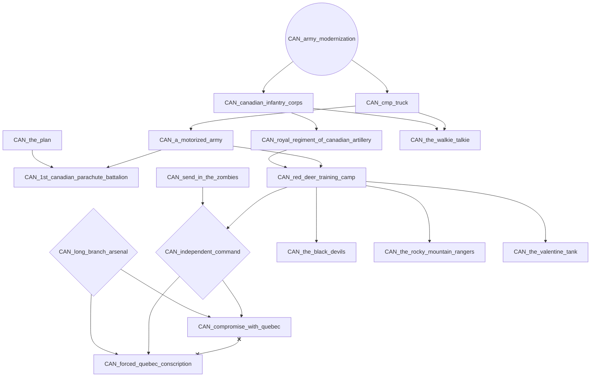
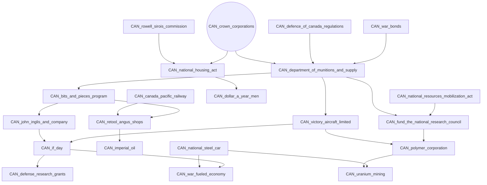
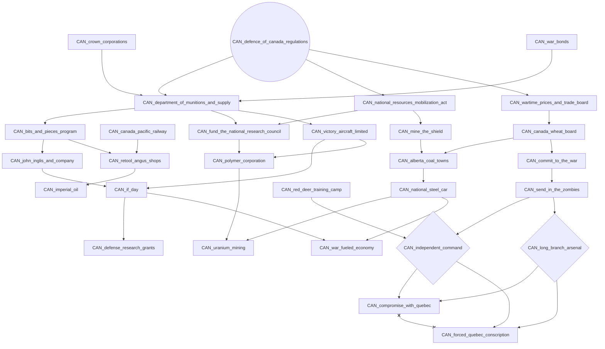
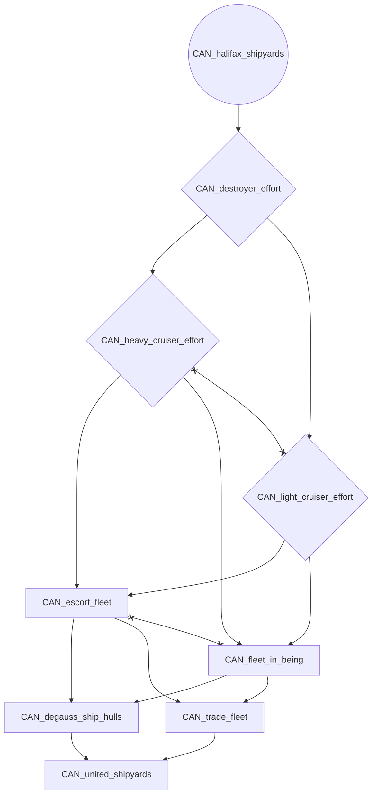
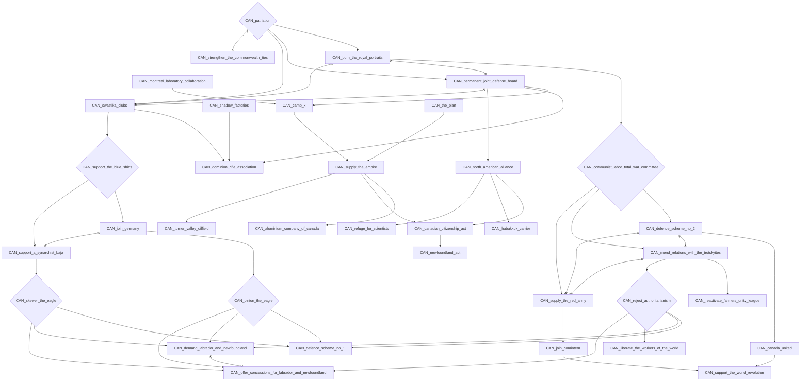
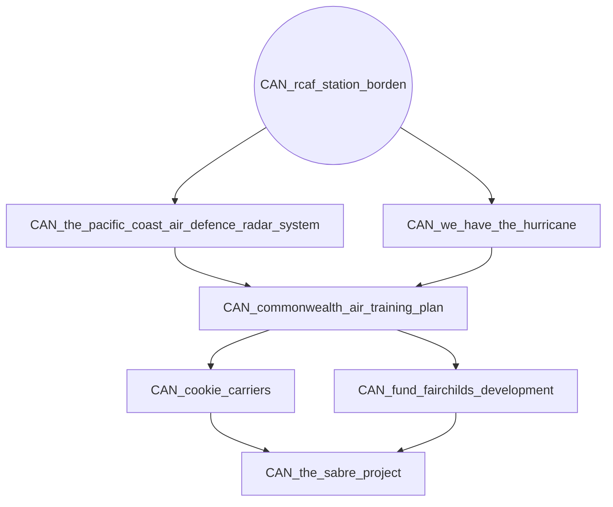
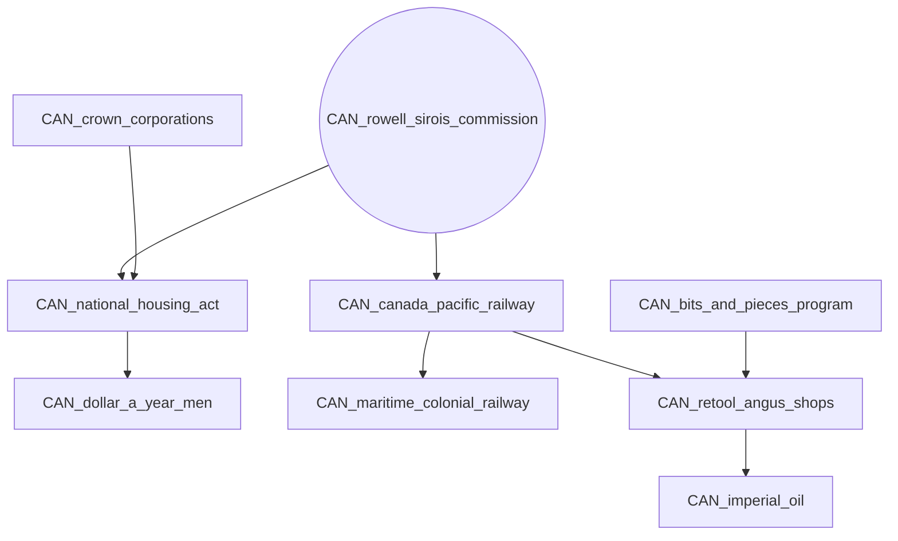
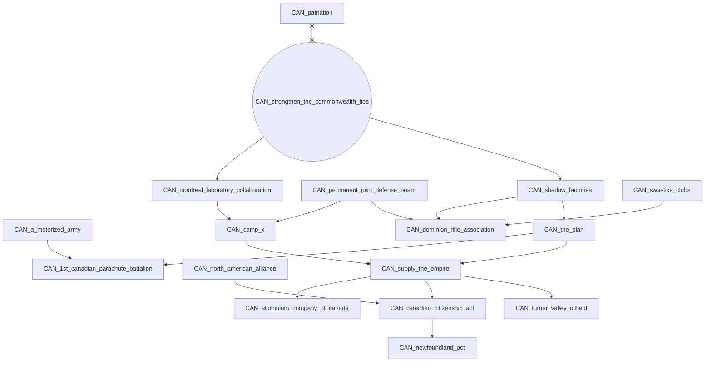
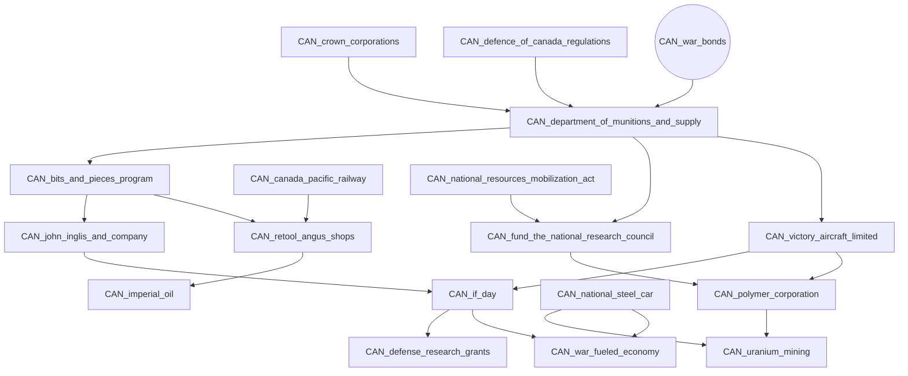

# CAN_army_modernization

# CAN_crown_corporations

# CAN_defence_of_canada_regulations

# CAN_halifax_shipyards

# CAN_patriation

# CAN_rcaf_station_borden

# CAN_rowell_sirois_commission

# CAN_strengthen_the_commonwealth_ties

# CAN_war_bonds

