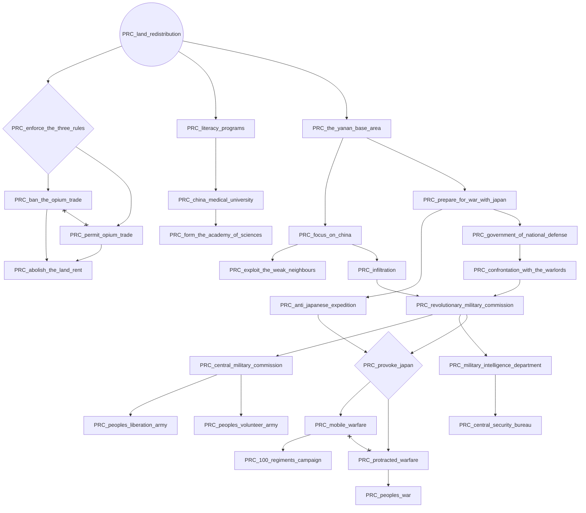
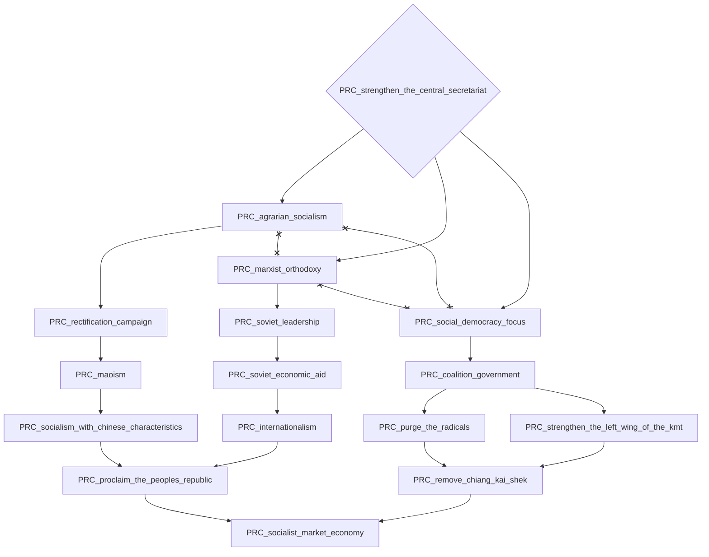

# PRC_land_redistribution

```mermaid
flowchart TD
    n1["PRC_100_regiments_campaign"]
    n2["PRC_abolish_the_land_rent"]
    n3["PRC_anti_japanese_expedition"]
    n4["PRC_ban_the_opium_trade"]
    n5["PRC_central_military_commission"]
    n6["PRC_central_security_bureau"]
    n7["PRC_china_medical_university"]
    n8["PRC_confrontation_with_the_warlords"]
    n9{"PRC_enforce_the_three_rules"}
    n10["PRC_exploit_the_weak_neighbours"]
    n11["PRC_focus_on_china"]
    n12["PRC_form_the_academy_of_sciences"]
    n13["PRC_government_of_national_defense"]
    n14["PRC_infiltration"]
    n15(("PRC_land_redistribution"))
    n16["PRC_literacy_programs"]
    n17["PRC_military_intelligence_department"]
    n18["PRC_mobile_warfare"]
    n19["PRC_peoples_liberation_army"]
    n20["PRC_peoples_volunteer_army"]
    n21["PRC_peoples_war"]
    n22["PRC_permit_opium_trade"]
    n23["PRC_prepare_for_war_with_japan"]
    n24["PRC_protracted_warfare"]
    n25{"PRC_provoke_japan"}
    n26["PRC_revolutionary_military_commission"]
    n27["PRC_the_yanan_base_area"]
    n18 --> n1
    n22 --> n2
    n4 --> n2
    n23 --> n3
    n9 --> n4
    n26 --> n5
    n17 --> n6
    n16 --> n7
    n13 --> n8
    n15 --> n9
    n11 --> n10
    n27 --> n11
    n7 --> n12
    n23 --> n13
    n11 --> n14
    n15 --> n16
    n26 --> n17
    n25 --> n18
    n5 --> n19
    n5 --> n20
    n24 --> n21
    n9 --> n22
    n27 --> n23
    n25 --> n24
    n26 --> n25
    n3 --> n25
    n8 --> n26
    n14 --> n26
    n15 --> n27
    n4 x--x n22
    n18 x--x n24
```

# PRC_strengthen_the_central_secretariat

```mermaid
flowchart TD
    n28["PRC_agrarian_socialism"]
    n29["PRC_coalition_government"]
    n30["PRC_internationalism"]
    n31["PRC_maoism"]
    n32["PRC_marxist_orthodoxy"]
    n33["PRC_proclaim_the_peoples_republic"]
    n34["PRC_purge_the_radicals"]
    n35["PRC_rectification_campaign"]
    n36["PRC_remove_chiang_kai_shek"]
    n37["PRC_social_democracy_focus"]
    n38["PRC_socialism_with_chinese_characteristics"]
    n39["PRC_socialist_market_economy"]
    n40["PRC_soviet_economic_aid"]
    n41["PRC_soviet_leadership"]
    n42{"PRC_strengthen_the_central_secretariat"}
    n43["PRC_strengthen_the_left_wing_of_the_kmt"]
    n42 --> n28
    n37 --> n29
    n40 --> n30
    n35 --> n31
    n42 --> n32
    n38 --> n33
    n30 --> n33
    n29 --> n34
    n28 --> n35
    n43 --> n36
    n34 --> n36
    n42 --> n37
    n31 --> n38
    n33 --> n39
    n36 --> n39
    n41 --> n40
    n32 --> n41
    n29 --> n43
    n28 x--x n32
    n28 x--x n37
    n32 x--x n37
```
