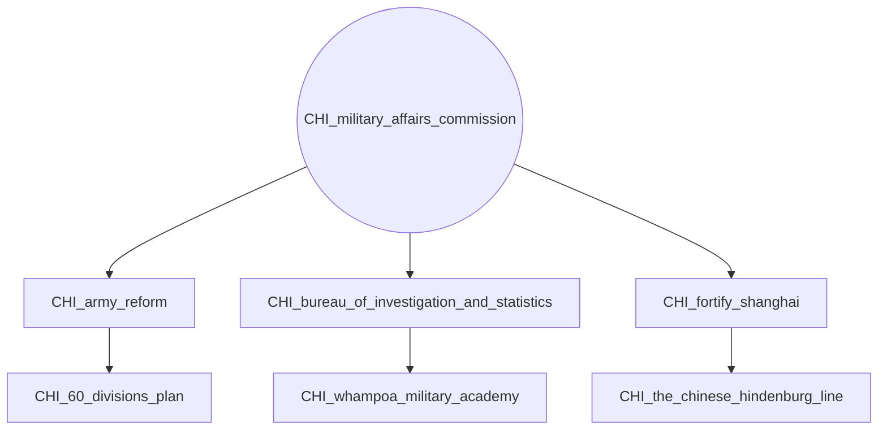
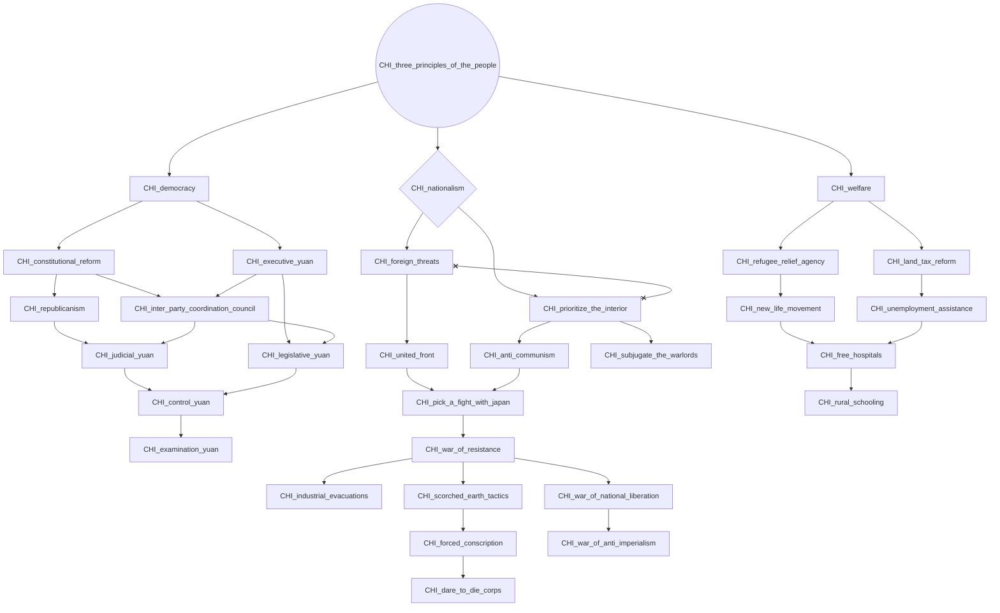
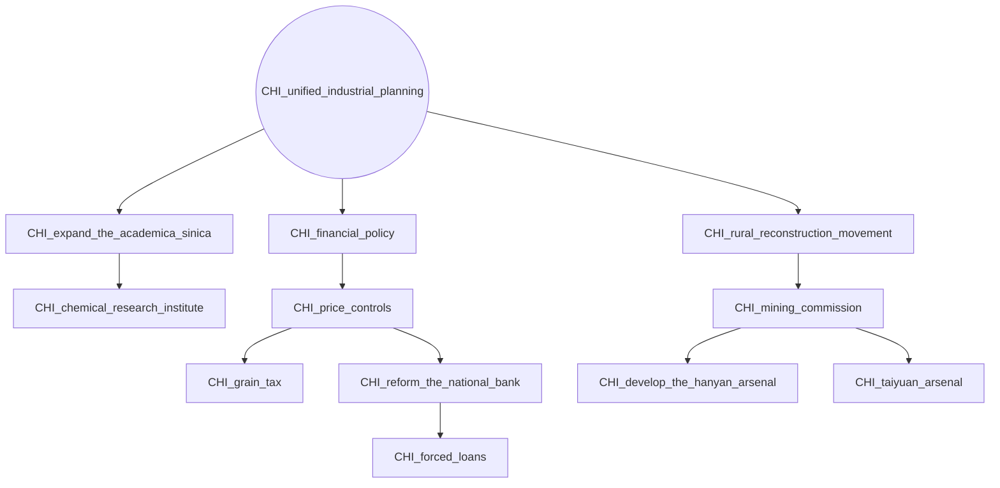

# CHI_military_affairs_commission

```mermaid
flowchart TD
    n1["CHI_60_divisions_plan"]
    n2["CHI_army_reform"]
    n3["CHI_bureau_of_investigation_and_statistics"]
    n4["CHI_fortify_shanghai"]
    n5(("CHI_military_affairs_commission"))
    n6["CHI_the_chinese_hindenburg_line"]
    n7["CHI_whampoa_military_academy"]
    n2 --> n1
    n5 --> n2
    n5 --> n3
    n5 --> n4
    n4 --> n6
    n3 --> n7
```

# CHI_three_principles_of_the_people

```mermaid
flowchart TD
    n8["CHI_anti_communism"]
    n9["CHI_constitutional_reform"]
    n10["CHI_control_yuan"]
    n11["CHI_dare_to_die_corps"]
    n12["CHI_democracy"]
    n13["CHI_examination_yuan"]
    n14["CHI_executive_yuan"]
    n15["CHI_forced_conscription"]
    n16["CHI_foreign_threats"]
    n17["CHI_free_hospitals"]
    n18["CHI_industrial_evacuations"]
    n19["CHI_inter_party_coordination_council"]
    n20["CHI_judicial_yuan"]
    n21["CHI_land_tax_reform"]
    n22["CHI_legislative_yuan"]
    n23{"CHI_nationalism"}
    n24["CHI_new_life_movement"]
    n25["CHI_pick_a_fight_with_japan"]
    n26["CHI_prioritize_the_interior"]
    n27["CHI_refugee_relief_agency"]
    n28["CHI_republicanism"]
    n29["CHI_rural_schooling"]
    n30["CHI_scorched_earth_tactics"]
    n31["CHI_subjugate_the_warlords"]
    n32(("CHI_three_principles_of_the_people"))
    n33["CHI_unemployment_assistance"]
    n34["CHI_united_front"]
    n35["CHI_war_of_anti_imperialism"]
    n36["CHI_war_of_national_liberation"]
    n37["CHI_war_of_resistance"]
    n38["CHI_welfare"]
    n26 --> n8
    n12 --> n9
    n20 --> n10
    n22 --> n10
    n15 --> n11
    n32 --> n12
    n10 --> n13
    n12 --> n14
    n30 --> n15
    n23 --> n16
    n24 --> n17
    n33 --> n17
    n37 --> n18
    n9 --> n19
    n14 --> n19
    n28 --> n20
    n19 --> n20
    n38 --> n21
    n14 --> n22
    n19 --> n22
    n32 --> n23
    n27 --> n24
    n34 --> n25
    n8 --> n25
    n23 --> n26
    n38 --> n27
    n9 --> n28
    n17 --> n29
    n37 --> n30
    n26 --> n31
    n21 --> n33
    n16 --> n34
    n36 --> n35
    n37 --> n36
    n25 --> n37
    n32 --> n38
    n16 x--x n26
```

# CHI_unified_industrial_planning

```mermaid
flowchart TD
    n39["CHI_chemical_research_institute"]
    n40["CHI_develop_the_hanyan_arsenal"]
    n41["CHI_expand_the_academica_sinica"]
    n42["CHI_financial_policy"]
    n43["CHI_forced_loans"]
    n44["CHI_grain_tax"]
    n45["CHI_mining_commission"]
    n46["CHI_price_controls"]
    n47["CHI_reform_the_national_bank"]
    n48["CHI_rural_reconstruction_movement"]
    n49["CHI_taiyuan_arsenal"]
    n50(("CHI_unified_industrial_planning"))
    n41 --> n39
    n45 --> n40
    n50 --> n41
    n50 --> n42
    n47 --> n43
    n46 --> n44
    n48 --> n45
    n42 --> n46
    n46 --> n47
    n50 --> n48
    n45 --> n49
```
