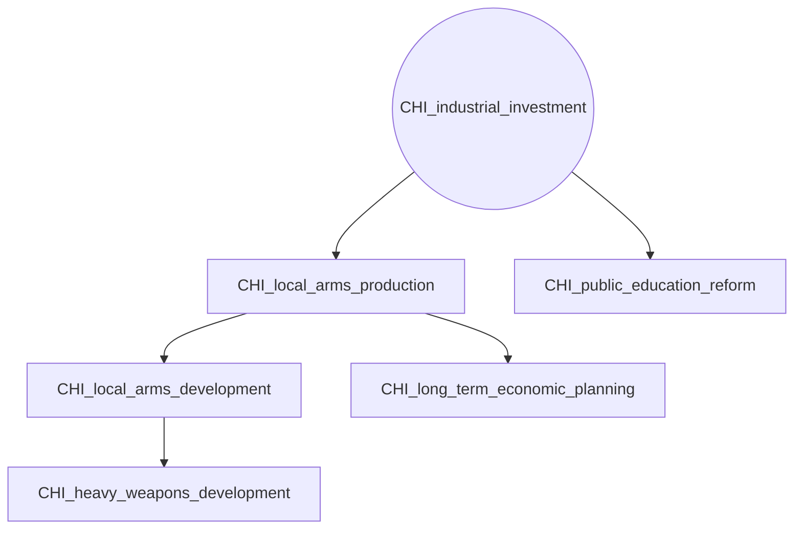
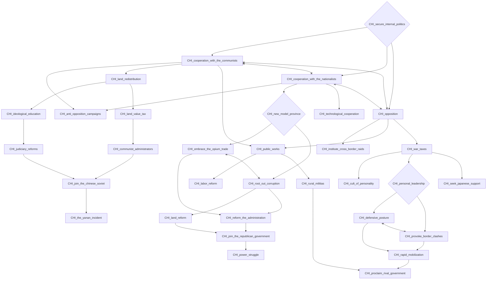
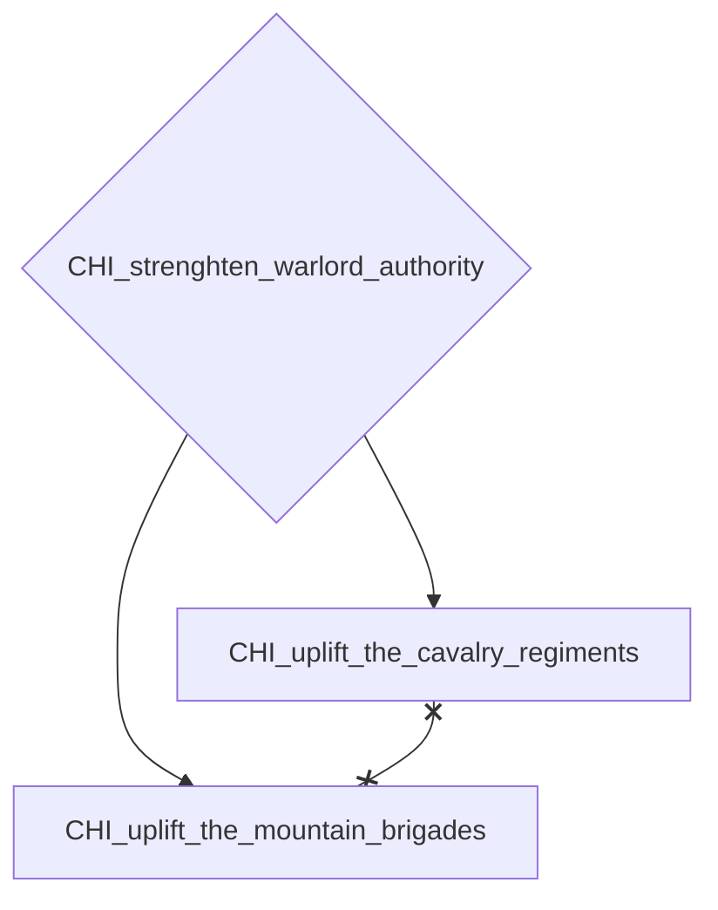

# CHI_industrial_investment

```mermaid
flowchart TD
    n1["CHI_heavy_weapons_development"]
    n2(("CHI_industrial_investment"))
    n3["CHI_local_arms_development"]
    n4["CHI_local_arms_production"]
    n5["CHI_long_term_economic_planning"]
    n6["CHI_public_education_reform"]
    n3 --> n1
    n4 --> n3
    n2 --> n4
    n4 --> n5
    n2 --> n6
```

# CHI_secure_internal_politics

```mermaid
flowchart TD
    n7["CHI_anti_opposition_campaigns"]
    n8["CHI_communist_administrators"]
    n9["CHI_cooperation_with_the_communists"]
    n10["CHI_cooperation_with_the_nationalists"]
    n11["CHI_cult_of_personality"]
    n12["CHI_defensive_posture"]
    n13["CHI_embrace_the_opium_trade"]
    n14["CHI_ideological_education"]
    n15["CHI_institute_cross_border_raids"]
    n16["CHI_join_the_chinese_soviet"]
    n17["CHI_join_the_republican_government"]
    n18["CHI_judiciary_reforms"]
    n19["CHI_labor_reform"]
    n20["CHI_land_redistribution"]
    n21["CHI_land_reform"]
    n22["CHI_land_value_tax"]
    n23{"CHI_new_model_province"}
    n24["CHI_opposition"]
    n25{"CHI_personal_leadership"}
    n26["CHI_power_struggle"]
    n27["CHI_proclaim_rival_government"]
    n28["CHI_provoke_border_clashes"]
    n29["CHI_public_works"]
    n30["CHI_rapid_mobilization"]
    n31["CHI_reform_the_administration"]
    n32["CHI_root_out_corruption"]
    n33["CHI_rural_militias"]
    n34{"CHI_secure_internal_politics"}
    n35["CHI_seek_japanese_support"]
    n36["CHI_technological_cooperation"]
    n37["CHI_the_yanan_incident"]
    n38["CHI_war_taxes"]
    n10 --> n7
    n9 --> n7
    n22 --> n8
    n34 --> n9
    n34 --> n10
    n38 --> n11
    n25 --> n12
    n23 --> n13
    n20 --> n14
    n24 --> n15
    n18 --> n16
    n8 --> n16
    n21 --> n17
    n31 --> n17
    n14 --> n18
    n29 --> n19
    n9 --> n20
    n32 --> n21
    n20 --> n22
    n10 --> n23
    n34 --> n24
    n38 --> n25
    n17 --> n26
    n33 --> n27
    n30 --> n27
    n25 --> n28
    n9 --> n29
    n24 --> n29
    n28 --> n30
    n12 --> n30
    n32 --> n31
    n13 --> n31
    n23 --> n32
    n29 --> n33
    n38 --> n35
    n10 --> n36
    n16 --> n37
    n24 --> n38
    n9 x--x n10
    n9 x--x n24
    n10 x--x n24
    n12 x--x n28
    n13 x--x n32
```

# CHI_strenghten_warlord_authority

```mermaid
flowchart TD
    n39{"CHI_strenghten_warlord_authority"}
    n40["CHI_uplift_the_cavalry_regiments"]
    n41["CHI_uplift_the_mountain_brigades"]
    n39 --> n40
    n39 --> n41
    n40 x--x n41
```
