# CHI_sea_develop_capital

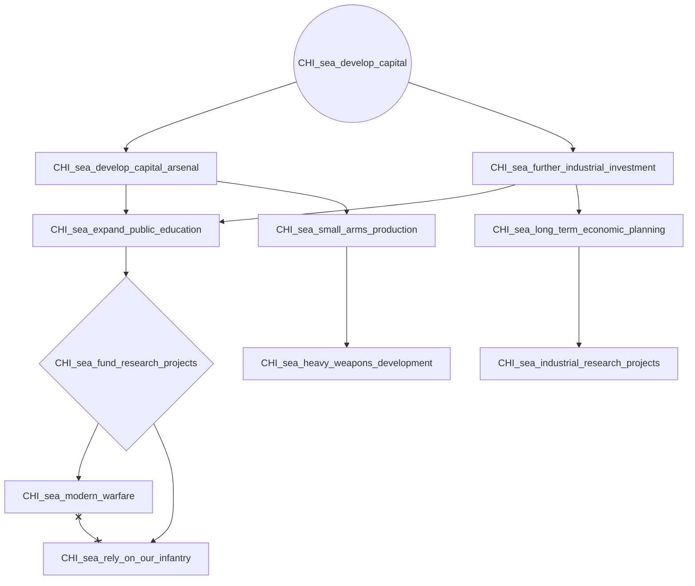

# CHI_sea_secure_internal_politics

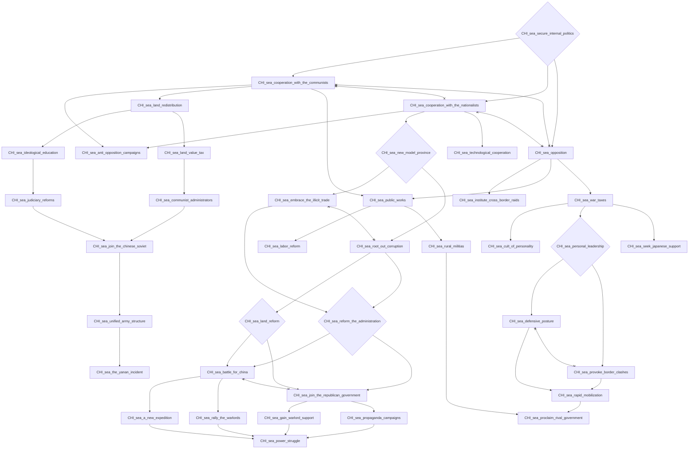

# CHI_sea_strenghten_warlord_authority

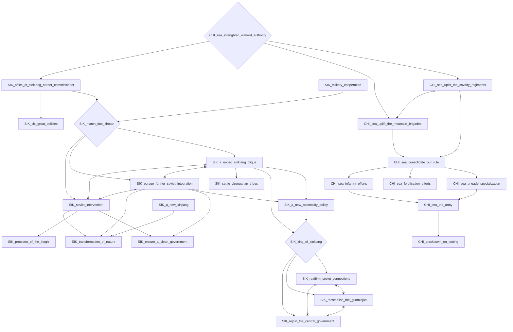

# KHM_call_for_aid

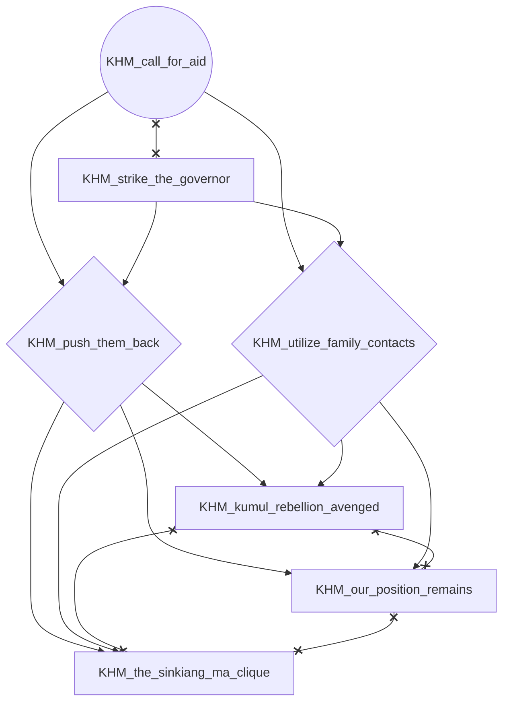

# KHM_strike_the_governor

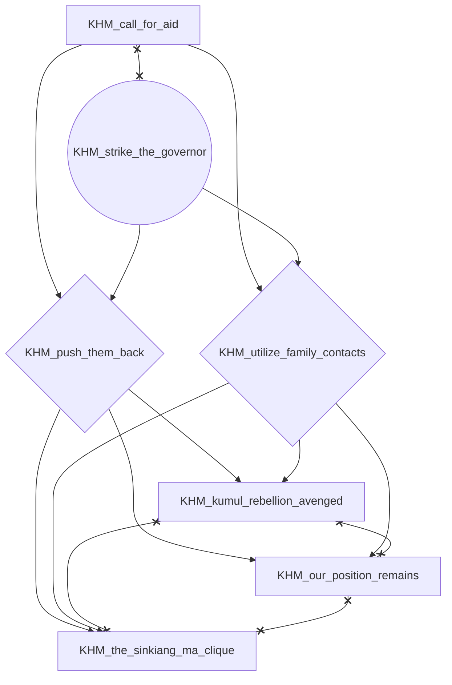

# KHM_undermine_kmt_rule

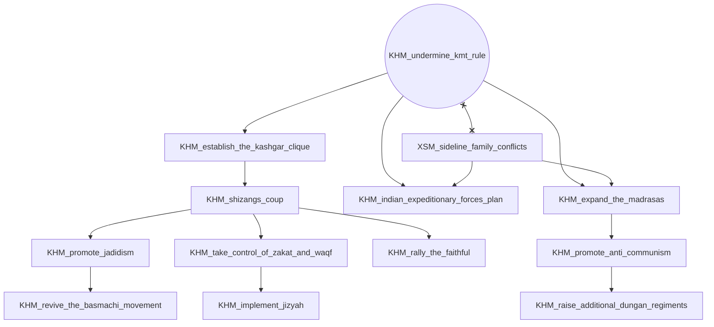

# KUM_victory_in_tihwa

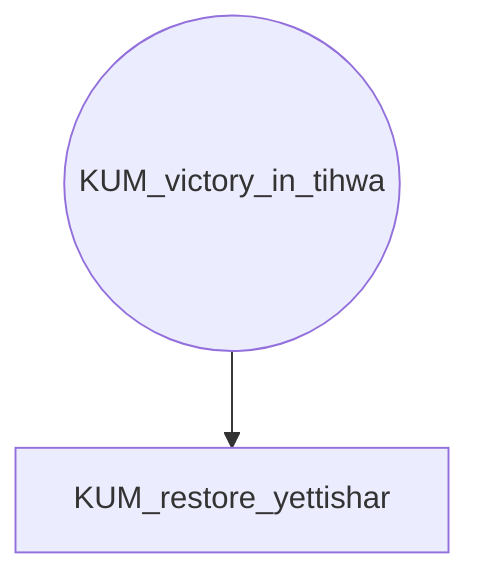

# SIC_the_sichuan_clique

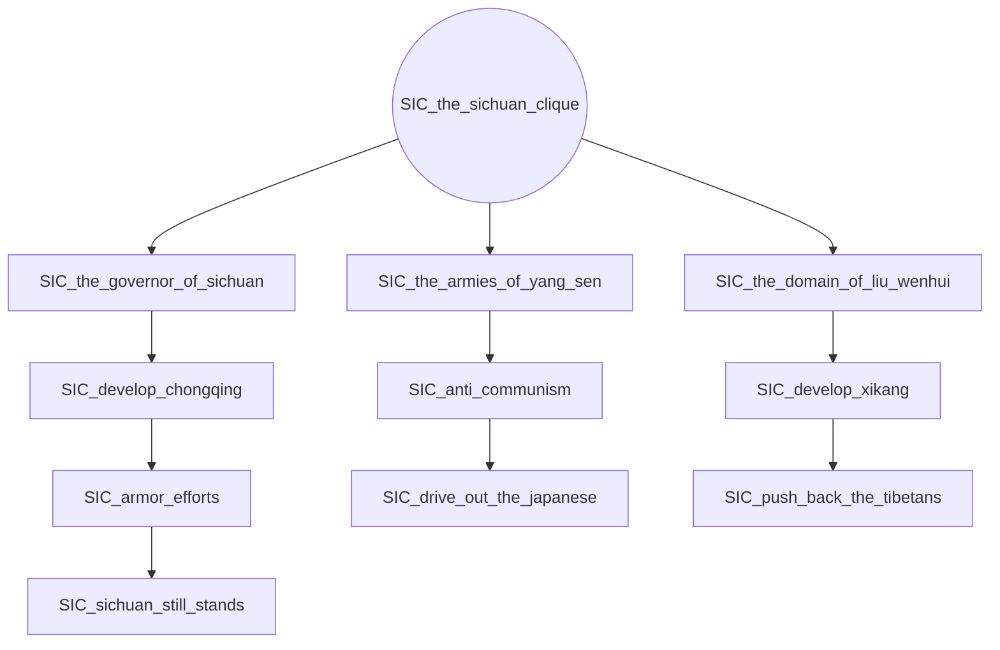

# SIK_cooperate_with_the_ussr

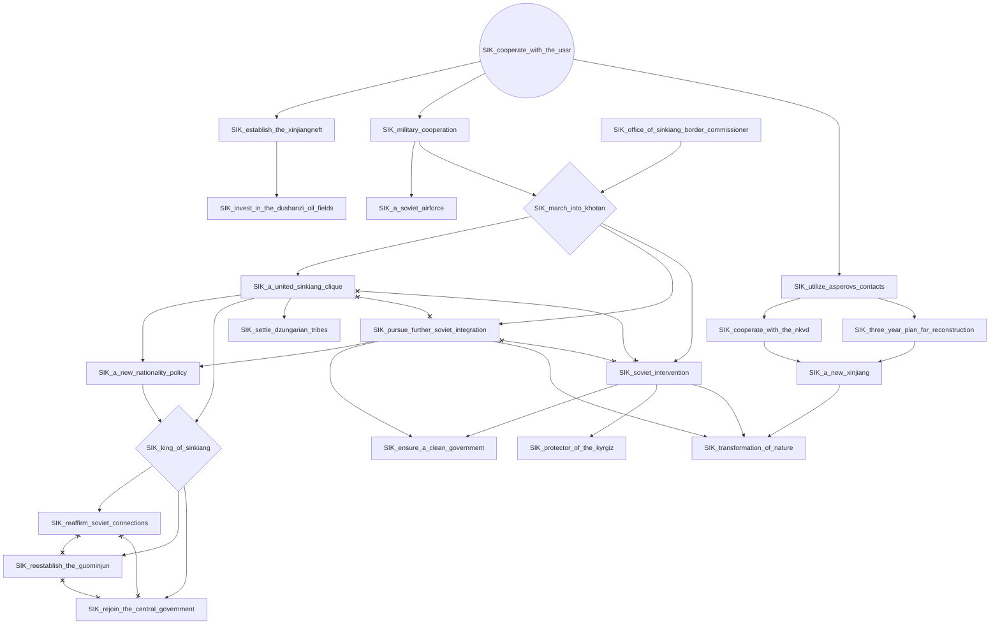

# XIC_northwest_bandit_suppression_headquarters

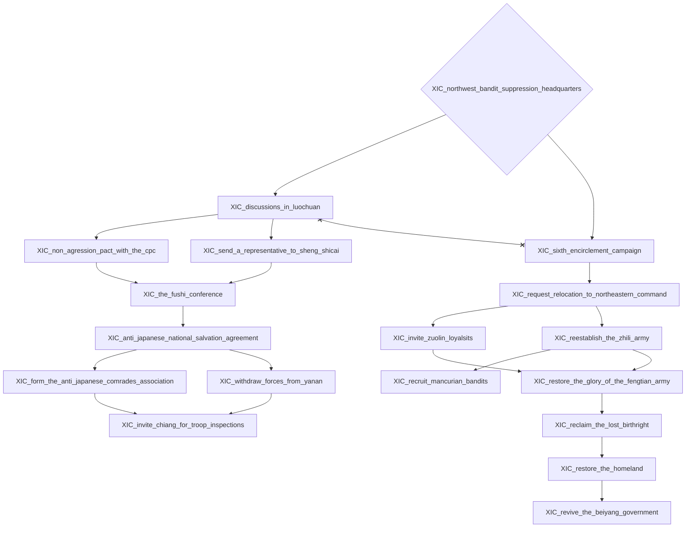

# XSM_sideline_family_conflicts

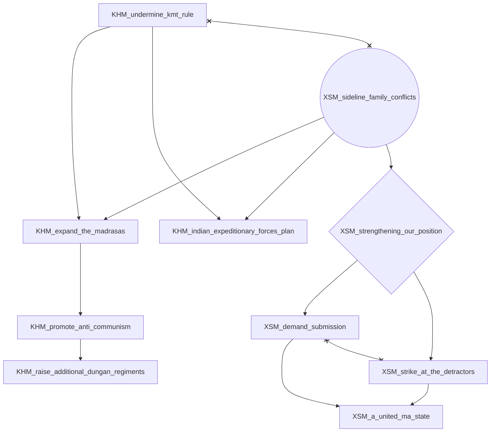

# XSM_the_military_governor

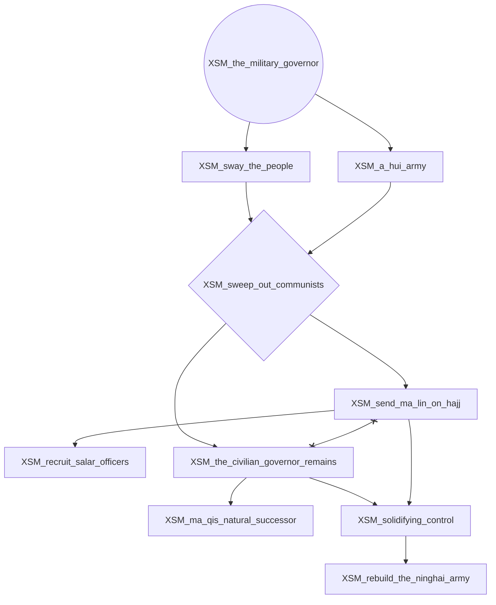

# YUN_rally_around_long_yun

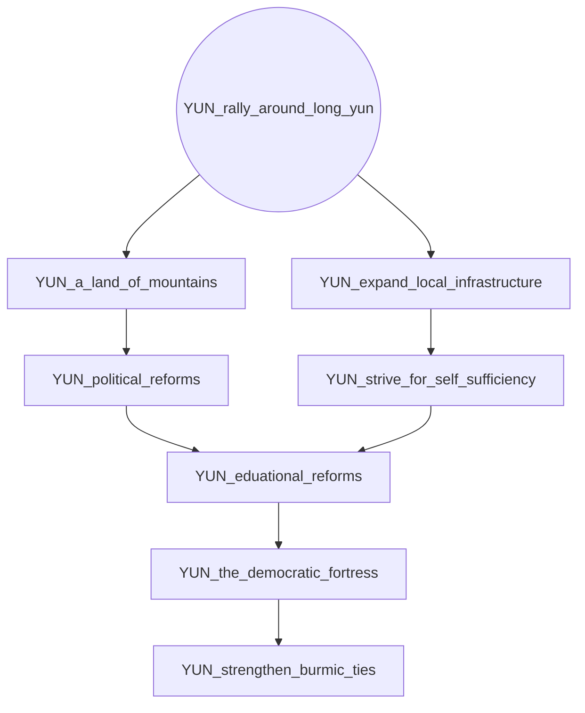
