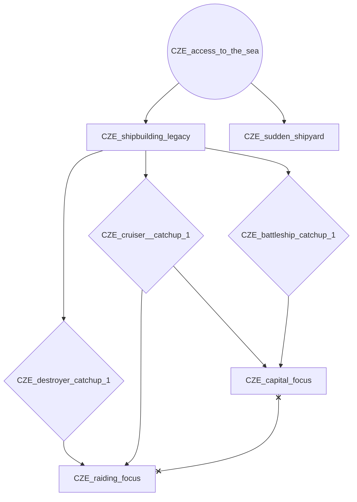
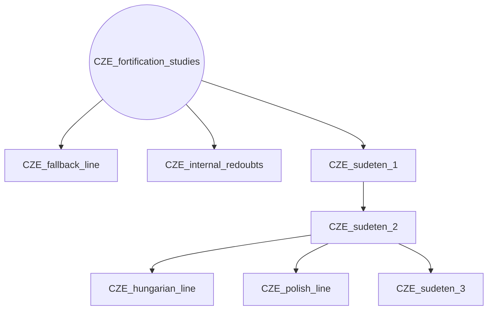
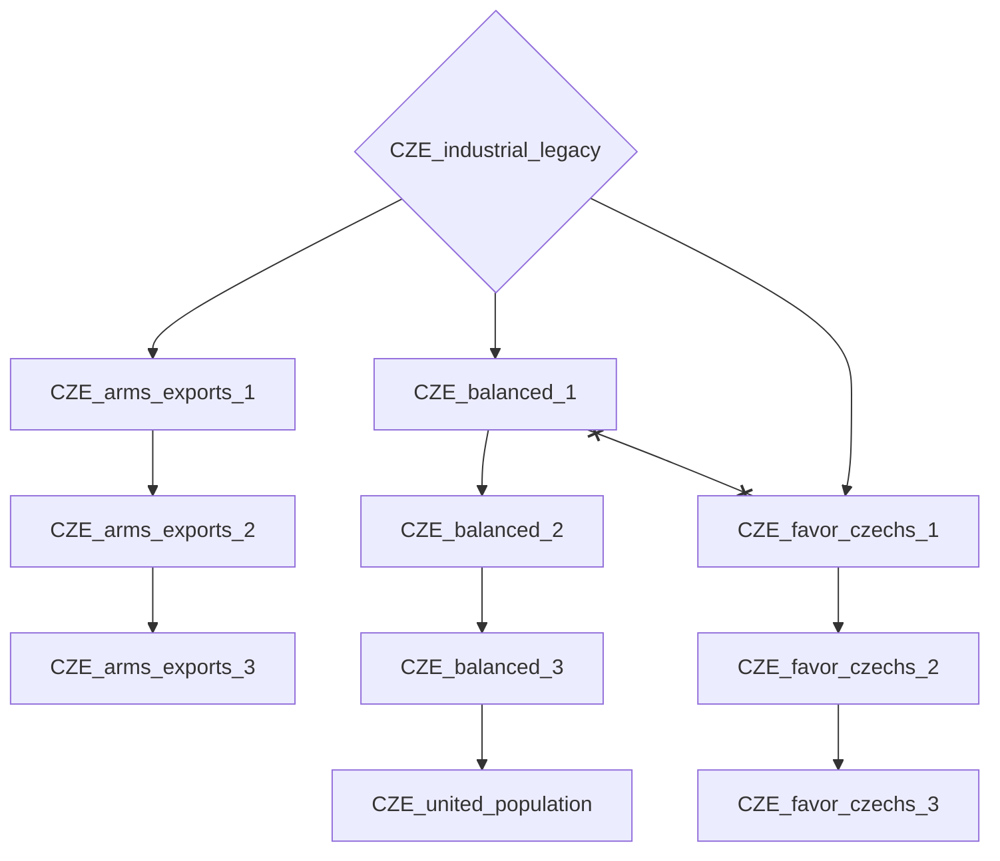
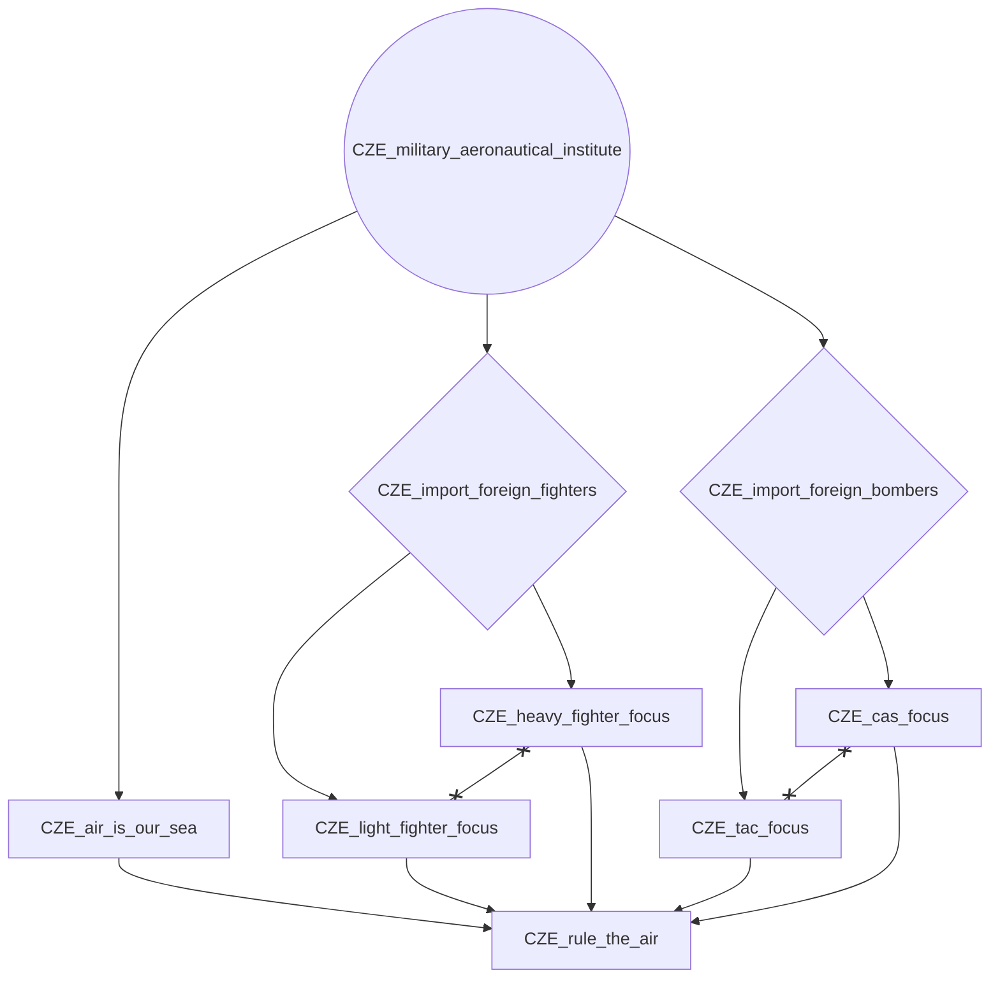
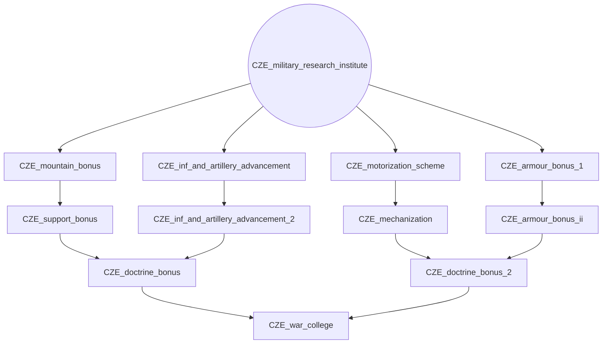
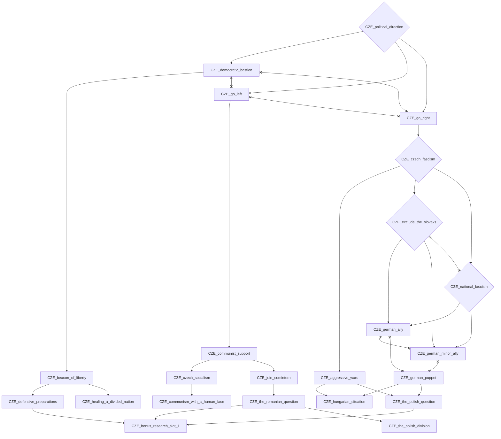
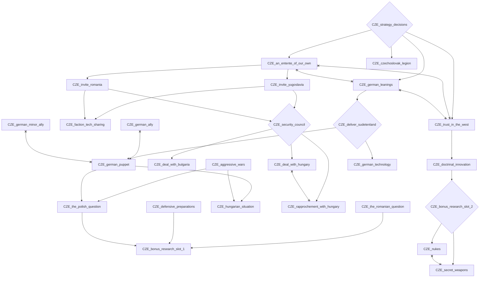

# CZE_access_to_the_sea

# CZE_fortification_studies

# CZE_industrial_legacy

# CZE_military_aeronautical_institute

# CZE_military_research_institute

# CZE_political_direction

# CZE_strategy_decisions

