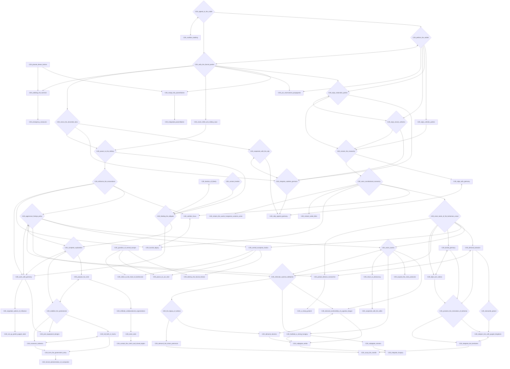
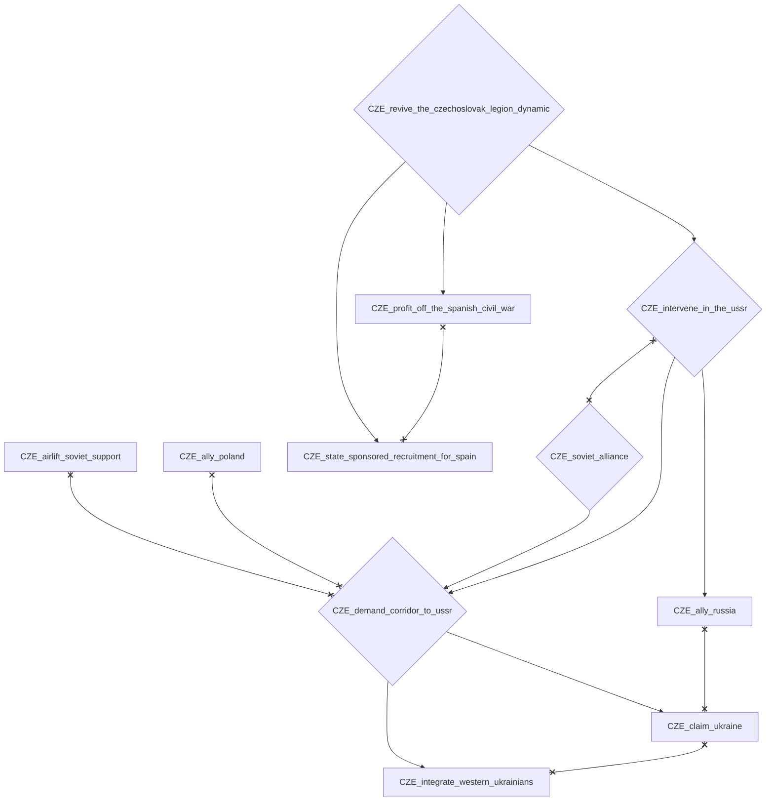
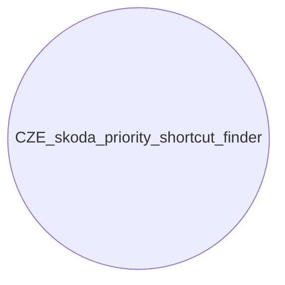

# CZE_appeal_to_the_castle

```mermaid
flowchart TD
    n1["CZE_a_strong_poland"]
    n2{"CZE_aggressive_foreign_policy"}
    n3["CZE_align_catholic_parties"]
    n4{"CZE_align_nationalist_parties"}
    n5{"CZE_align_slovak_catholics"}
    n6["CZE_align_with_germany"]
    n7{"CZE_appeal_to_the_castle"}
    n8{"CZE_assist_austria"}
    n9["CZE_bastion_of_liberty"]
    n10["CZE_catholic_focus"]
    n11["CZE_central_european_faction"]
    n12{"CZE_claim_lands_of_the_bohemian_crown"}
    n13["CZE_coalition_building"]
    n14{"CZE_complete_capitulation"}
    n15{"CZE_contact_henlein"}
    n16["CZE_contact_the_czech_and_slovak_legion"]
    n17["CZE_cooperate_with_the_allies"]
    n18{"CZE_cooperate_with_the_sdp"}
    n19["CZE_deepen_ties_with_puppet_kingdoms"]
    n20["CZE_demand_katowice"]
    n21["CZE_demand_overlordship_of_yugoslav_league"]
    n22["CZE_demand_slovenia"]
    n23["CZE_demand_the_istrian_peninsula"]
    n24["CZE_destroy_the_fascist_threats"]
    n25{"CZE_dismantle_poland"}
    n26["CZE_divide_germany"]
    n27{"CZE_eliminate_austrian_defeatists"}
    n28["CZE_emergency_measures"]
    n29["CZE_enter_exile"]
    n30["CZE_expand_the_rome_protocols"]
    n31["CZE_facilitate_a_strong_hungary"]
    n32{"CZE_feeding_the_alligator"}
    n33["CZE_fight_over_silesia"]
    n34["CZE_forced_administration_of_companies"]
    n35["CZE_form_the_government_army"]
    n36["CZE_full_faith_in_hacha"]
    n37["CZE_guardian_of_central_europe"]
    n38["CZE_hussite_legacy"]
    n39["CZE_infiltrate_collaborationist_organizations"]
    n40["CZE_integrate_hungary"]
    n41["CZE_integrate_lost_territories"]
    n42{"CZE_integrate_sudeten_germans"}
    n43["CZE_integrated_paramilitaries"]
    n44["CZE_joint_equipment_designs"]
    n45["CZE_merge_the_paramilitaries"]
    n46{"CZE_militarize_the_associations"}
    n47["CZE_moravecs_bohemia"]
    n48["CZE_negotiate_sphere_of_influence"]
    n49["CZE_peace_on_our_time"]
    n50{"CZE_petition_the_nobles"}
    n51["CZE_placate_benes_faction"]
    n52["CZE_poland_alliance_monarchist"]
    n53{"CZE_power_to_the_military"}
    n54["CZE_prepare_for_exile"]
    n55["CZE_pro_rearmament_propaganda"]
    n56{"CZE_proclaim_the_restoration_of_bohemia"}
    n57["CZE_rally_against_germany"]
    n58["CZE_restore_noble_titles"]
    n59["CZE_restore_the_austro_hungarian_customs_union"]
    n60{"CZE_restore_the_monarchy"}
    n61["CZE_return_to_democracy"]
    n62["CZE_revert_1926_anti_military_laws"]
    n63{"CZE_revive_the_december_bloc"}
    n64{"CZE_semi_constitutional_monarchy"}
    n65["CZE_set_up_polish_puppet_state"]
    n66{"CZE_stabilize_the_protectorate"}
    n67["CZE_strike_at_the_heart_of_bolshevism"]
    n68["CZE_subjegate_romania"]
    n69["CZE_subjegate_serbia"]
    n70{"CZE_the_legacy_of_ottokar"}
    n71{"CZE_unify_the_fascist_parties"}
    n72["CZE_usurp_the_mantle"]
    n73["CZE_wielding_the_hammer"]
    n74["CZE_work_with_germany"]
    n52 --> n1
    n46 --> n2
    n50 --> n3
    n50 --> n4
    n71 --> n4
    n50 --> n5
    n60 --> n6
    n2 --> n8
    n12 --> n8
    n46 --> n10
    n64 --> n10
    n12 --> n11
    n2 --> n11
    n64 --> n12
    n32 --> n14
    n29 --> n16
    n61 --> n17
    n63 --> n18
    n25 --> n19
    n56 --> n19
    n12 --> n20
    n27 --> n21
    n8 --> n21
    n70 --> n22
    n70 --> n23
    n37 --> n24
    n11 --> n24
    n20 --> n25
    n12 --> n26
    n12 --> n27
    n2 --> n27
    n73 --> n28
    n39 --> n29
    n8 --> n30
    n27 --> n31
    n8 --> n31
    n15 --> n32
    n53 --> n32
    n12 --> n33
    n35 --> n34
    n36 --> n35
    n47 --> n35
    n66 --> n36
    n46 --> n38
    n64 --> n38
    n54 --> n39
    n68 --> n40
    n69 --> n40
    n56 --> n41
    n63 --> n42
    n4 --> n42
    n5 --> n42
    n45 --> n43
    n66 --> n44
    n74 --> n44
    n51 --> n45
    n71 --> n45
    n53 --> n46
    n66 --> n47
    n74 --> n48
    n37 --> n49
    n11 --> n49
    n7 --> n50
    n12 --> n52
    n2 --> n52
    n62 --> n53
    n63 --> n53
    n14 --> n54
    n50 --> n55
    n71 --> n55
    n33 --> n56
    n26 --> n56
    n20 --> n56
    n42 --> n57
    n18 --> n57
    n64 --> n58
    n64 --> n59
    n3 --> n60
    n4 --> n60
    n5 --> n60
    n8 --> n61
    n71 --> n62
    n71 --> n63
    n60 --> n64
    n48 --> n65
    n14 --> n66
    n37 --> n67
    n11 --> n67
    n31 --> n68
    n22 --> n69
    n21 --> n69
    n31 --> n69
    n27 --> n70
    n7 --> n71
    n41 --> n72
    n23 --> n72
    n51 --> n73
    n71 --> n73
    n46 --> n74
    n32 --> n74
    n2 x--x n14
    n2 x--x n74
    n4 x--x n5
    n6 x--x n57
    n7 x--x n13
    n8 x--x n27
    n9 x--x n32
    n10 x--x n38
    n14 x--x n74
    n18 x--x n42
    n19 x--x n41
    n20 x--x n52
    n21 x--x n22
    n26 x--x n33
    n36 x--x n47
    n50 x--x n71
    n54 x--x n66
```

# CZE_coalition_building

```mermaid
flowchart TD
    n2["CZE_aggressive_foreign_policy"]
    n75["CZE_agrarian_reform"]
    n76["CZE_airlift_soviet_support"]
    n77["CZE_ally_austria"]
    n78{"CZE_ally_hungary"}
    n79["CZE_ally_poland"]
    n80["CZE_ally_romania"]
    n81["CZE_ally_russia"]
    n82{"CZE_ally_with_moderate_socialists"}
    n83{"CZE_ally_yugoslavia"}
    n84{"CZE_anti_democratic_propaganda"}
    n85{"CZE_anti_rearmament_propaganda"}
    n86["CZE_apart_but_togather"]
    n7["CZE_appeal_to_the_castle"]
    n87["CZE_balkan_union"]
    n9["CZE_bastion_of_liberty"]
    n88["CZE_bend_the_bars"]
    n11["CZE_central_european_faction"]
    n89["CZE_change_the_narrative"]
    n90["CZE_claim_ukraine"]
    n91["CZE_closer_ties_with_the_moderate_germany_parties"]
    n13{"CZE_coalition_building"}
    n14{"CZE_complete_capitulation"}
    n92["CZE_complete_reconciliation"]
    n93["CZE_comprise_with_the_carpathians"]
    n94["CZE_compromise_with_the_veteran_agrarian"]
    n95["CZE_confiscate_church_lands"]
    n15{"CZE_contact_henlein"}
    n16["CZE_contact_the_czech_and_slovak_legion"]
    n96["CZE_control_the_associations"]
    n97["CZE_cooperate_with_tito"]
    n98["CZE_cooperation_with_the_ussr"]
    n99["CZE_create_a_secret_police_branch"]
    n100["CZE_cut_carpathia_loose"]
    n101["CZE_czechoslovak_union"]
    n102["CZE_deepend_ties_with_the_trademans"]
    n103{"CZE_demand_corridor_to_ussr"}
    n104["CZE_demand_guarantees"]
    n105["CZE_demand_the_czech_corridor"]
    n106["CZE_denounce_stalinism"]
    n107["CZE_destabilize_potential_adversaries"]
    n24["CZE_destroy_the_fascist_threats"]
    n108["CZE_double_down_on_heavy_industry"]
    n28["CZE_emergency_measures"]
    n29["CZE_enter_exile"]
    n109["CZE_exchange_military_expertise"]
    n110["CZE_exchange_technology"]
    n111{"CZE_expand_the_communist_press"}
    n32{"CZE_feeding_the_alligator"}
    n34["CZE_forced_administration_of_companies"]
    n112["CZE_forgive_trading_debts"]
    n113["CZE_form_a_federation"]
    n35["CZE_form_the_government_army"]
    n114{"CZE_form_workers_brigades"}
    n115["CZE_free_tuka"]
    n36["CZE_full_faith_in_hacha"]
    n116["CZE_german_nonagressionpact"]
    n117{"CZE_gottwald_faction"}
    n118["CZE_grow_the_anglo_czechoslovak_prague_credit_bank"]
    n37["CZE_guardian_of_central_europe"]
    n119{"CZE_improve_balkan_trade_relations"}
    n120["CZE_increase_food_and_resource_imports"]
    n121["CZE_increase_funding_from_moscow"]
    n39["CZE_infiltrate_collaborationist_organizations"]
    n122["CZE_integrate_western_ukrainians"]
    n43["CZE_integrated_paramilitaries"]
    n123{"CZE_intervene_in_the_ussr"}
    n124["CZE_join_comintern_pfot"]
    n44["CZE_joint_equipment_designs"]
    n125["CZE_king_of_the_castle"]
    n126{"CZE_kohler_faction"}
    n127["CZE_leverage_sokol"]
    n128["CZE_limited_cooperation"]
    n45["CZE_merge_the_paramilitaries"]
    n46{"CZE_militarize_the_associations"}
    n47["CZE_moravecs_bohemia"]
    n129["CZE_mutual_protection_agreement_with_switzerland"]
    n130{"CZE_nationalize_key_industries"}
    n48["CZE_negotiate_sphere_of_influence"]
    n131["CZE_negotiations_with_the_autonomous_bloc"]
    n132{"CZE_neutralize_the_hungarian_threat"}
    n133{"CZE_no_compromise_with_the_sdp"}
    n134["CZE_outreach_to_the_western_powers"]
    n49["CZE_peace_on_our_time"]
    n51["CZE_placate_benes_faction"]
    n53{"CZE_power_to_the_military"}
    n54["CZE_prepare_for_exile"]
    n135["CZE_pressure_romania"]
    n136["CZE_promote_urbanization"]
    n137["CZE_protect_neutrality"]
    n138["CZE_realign_the_church"]
    n139["CZE_realize_the_polish_czechoslovak_confederation"]
    n140["CZE_reassure_the_army"]
    n141["CZE_recruit_communist_exiles"]
    n142["CZE_recruit_ideologically_aligned_generals"]
    n143["CZE_rehabilitate_the_army"]
    n144["CZE_reintegrate_cross_border_rail_connections"]
    n145["CZE_reorient_the_broad_coalition"]
    n146["CZE_revisit_custom_union_talks"]
    n147["CZE_revolutionary_brigades"]
    n148["CZE_seek_french_leadership"]
    n65["CZE_set_up_polish_puppet_state"]
    n149{"CZE_slovakia_autonomy_agreement"}
    n150{"CZE_soviet_alliance"}
    n151["CZE_spread_the_revolution"]
    n66{"CZE_stabilize_the_protectorate"}
    n152["CZE_standing_against_the_storm"]
    n153{"CZE_strengthen_the_little_entente"}
    n67["CZE_strike_at_the_heart_of_bolshevism"]
    n154["CZE_supply_fighters_for_allies"]
    n155["CZE_topple_the_king"]
    n156["CZE_truth_prevails"]
    n71["CZE_unify_the_fascist_parties"]
    n157{"CZE_vonapo_20"}
    n73["CZE_wielding_the_hammer"]
    n74["CZE_work_with_germany"]
    n158{"CZE_zapotocky_faction"}
    n158 --> n75
    n117 --> n75
    n126 --> n75
    n150 --> n76
    n78 --> n77
    n132 --> n77
    n153 --> n78
    n119 --> n78
    n153 --> n79
    n119 --> n80
    n153 --> n80
    n158 --> n82
    n119 --> n83
    n153 --> n83
    n111 --> n84
    n111 --> n85
    n93 --> n86
    n100 --> n86
    n101 --> n87
    n151 --> n87
    n133 --> n9
    n113 --> n88
    n104 --> n88
    n158 --> n89
    n117 --> n89
    n126 --> n89
    n103 --> n90
    n133 --> n91
    n32 --> n14
    n91 --> n92
    n149 --> n93
    n145 --> n94
    n75 --> n95
    n138 --> n95
    n51 --> n15
    n29 --> n16
    n158 --> n96
    n117 --> n96
    n126 --> n96
    n158 --> n97
    n117 --> n98
    n126 --> n98
    n130 --> n98
    n138 --> n99
    n89 --> n99
    n149 --> n100
    n82 --> n101
    n98 --> n101
    n145 --> n102
    n150 --> n103
    n123 --> n103
    n154 --> n104
    n83 --> n105
    n82 --> n106
    n141 --> n107
    n37 --> n24
    n11 --> n24
    n120 --> n108
    n110 --> n108
    n73 --> n28
    n39 --> n29
    n98 --> n109
    n77 --> n110
    n80 --> n110
    n105 --> n110
    n121 --> n111
    n15 --> n32
    n53 --> n32
    n35 --> n34
    n13 --> n112
    n146 --> n113
    n36 --> n35
    n47 --> n35
    n111 --> n114
    n131 --> n115
    n51 --> n115
    n66 --> n36
    n157 --> n116
    n85 --> n117
    n84 --> n117
    n134 --> n118
    n104 --> n37
    n113 --> n37
    n112 --> n119
    n77 --> n120
    n105 --> n120
    n80 --> n120
    n13 --> n121
    n54 --> n39
    n103 --> n122
    n45 --> n43
    n109 --> n124
    n66 --> n44
    n74 --> n44
    n51 --> n125
    n84 --> n126
    n114 --> n126
    n131 --> n127
    n51 --> n127
    n82 --> n128
    n51 --> n45
    n71 --> n45
    n66 --> n47
    n137 --> n129
    n158 --> n130
    n117 --> n130
    n126 --> n130
    n74 --> n48
    n13 --> n131
    n153 --> n132
    n51 --> n133
    n9 --> n134
    n94 --> n134
    n37 --> n49
    n11 --> n49
    n13 --> n51
    n14 --> n54
    n124 --> n135
    n75 --> n136
    n77 --> n137
    n105 --> n137
    n80 --> n137
    n158 --> n138
    n117 --> n138
    n126 --> n138
    n79 --> n139
    n156 --> n140
    n147 --> n141
    n143 --> n142
    n126 --> n143
    n117 --> n143
    n102 --> n144
    n131 --> n144
    n51 --> n145
    n131 --> n145
    n144 --> n146
    n126 --> n147
    n75 --> n147
    n143 --> n147
    n153 --> n148
    n48 --> n65
    n131 --> n149
    n157 --> n150
    n82 --> n151
    n98 --> n151
    n14 --> n66
    n140 --> n152
    n112 --> n153
    n37 --> n67
    n11 --> n67
    n134 --> n154
    n131 --> n155
    n94 --> n156
    n102 --> n156
    n13 --> n157
    n51 --> n73
    n71 --> n73
    n46 --> n74
    n32 --> n74
    n85 --> n158
    n84 --> n158
    n2 x--x n14
    n2 x--x n74
    n76 x--x n79
    n76 x--x n103
    n77 x--x n105
    n78 x--x n132
    n79 x--x n103
    n81 x--x n90
    n82 x--x n98
    n84 x--x n85
    n7 x--x n13
    n9 x--x n32
    n89 x--x n138
    n90 x--x n122
    n14 x--x n74
    n93 x--x n100
    n106 x--x n128
    n36 x--x n47
    n117 x--x n126
    n117 x--x n158
    n121 x--x n131
    n121 x--x n51
    n123 x--x n150
    n126 x--x n158
    n131 x--x n51
    n54 x--x n66
```

# CZE_raise_more_industrial_funds

```mermaid
flowchart TD
    n159["CZE_a_modern_navy"]
    n160["CZE_across_the_atlantic"]
    n161{"CZE_air_force_officer_recruitment"}
    n162["CZE_air_intelligence"]
    n163["CZE_air_training_abroad"]
    n164["CZE_an_industrial_legacy"]
    n165["CZE_anti_tank_development"]
    n166["CZE_bailout_moser"]
    n167["CZE_balance_industrial_invevestments"]
    n168["CZE_bolster_domestic_construction"]
    n169["CZE_bribery_investigations"]
    n170["CZE_bring_kramer_and_lobel_under_state_control"]
    n171["CZE_build_additional_rail_stations"]
    n172["CZE_build_off_old_ganz_danubius_designs"]
    n173["CZE_build_the_slapy_reservoir"]
    n174["CZE_car_and_oil_rationing"]
    n175["CZE_complete_the_power_grid"]
    n176["CZE_concealment_efforts"]
    n177["CZE_consolidate_mining_operations"]
    n178["CZE_continue_armed_force_reform"]
    n179["CZE_continue_avia_expansion"]
    n180["CZE_continue_industrial_relocation_schemes"]
    n181["CZE_continue_the_central_bohemia_plan"]
    n182{"CZE_continue_with_snejdareks_plan_dynamic"}
    n183["CZE_department_two_expansion"]
    n184["CZE_devaluate_the_koruna"]
    n185["CZE_develop_horska_artillery"]
    n186["CZE_develop_sudetenland_resources"]
    n187["CZE_diversify_airframe_production"]
    n188["CZE_diversify_bata"]
    n189["CZE_diversify_our_specialists"]
    n190["CZE_diversify_refinery_processes"]
    n191["CZE_elevate_slovak_officers"]
    n192{"CZE_elevate_the_vsv"}
    n193["CZE_embrace_corporatism"]
    n194["CZE_enlarge_smaller_wells"]
    n195["CZE_establish_a_armament_factory_in_uhersky_brod"]
    n196["CZE_establish_air_defense_zones"]
    n197["CZE_establish_the_fall_backlines"]
    n198["CZE_expand_airfield_capacity"]
    n199["CZE_expand_central_bohemian_mines"]
    n200["CZE_expand_existing_armory_plants"]
    n201["CZE_expand_praga"]
    n202["CZE_expand_prf_science_facilities"]
    n203{"CZE_expand_skoda_offices"}
    n204["CZE_expand_the_aero_clubs"]
    n205{"CZE_expand_the_horska_divisions"}
    n206["CZE_expand_the_land_department_of_vtu"]
    n207["CZE_expand_the_river_monitor_fleet"]
    n208["CZE_expand_trinec_ironworks"]
    n209["CZE_expand_vitkovice_ironworks"]
    n210["CZE_finish_double_tracking_efforts"]
    n211["CZE_for_the_homeland"]
    n212["CZE_force_the_industrialists_hand"]
    n213["CZE_form_the_state_defense_guard"]
    n214["CZE_fund_vladimir_mandl_research"]
    n215["CZE_giant_of_central_europe_industry"]
    n216{"CZE_go_with_vojcechovskys_plan_dynamic"}
    n217["CZE_grow_ckd_secondary_facilities"]
    n218["CZE_grow_tatras_capabilities"]
    n219["CZE_improve_the_current_officer_pool"]
    n220["CZE_increase_bauxite_imports"]
    n221{"CZE_increase_military_aeronautical_institute_funding"}
    n222["CZE_integrate_fortification_engineers"]
    n223["CZE_invest_in_the_smaller_air_plants"]
    n224["CZE_invest_in_vhht"]
    n225["CZE_jachymov_uranium_mine"]
    n226["CZE_joint_stock_schemes"]
    n227{"CZE_keep_focus_on_weapon_exports"}
    n228{"CZE_kickstart_rapid_rearmanent"}
    n229["CZE_legacy_of_the_kriegsmarine"]
    n230["CZE_lessons_of_war"]
    n231["CZE_leverage_gunboat_experience"]
    n232["CZE_logistics_beyond_the_sudetes"]
    n233["CZE_master_of_armaments"]
    n234["CZE_merge_skodas_consumer_good_plants"]
    n235["CZE_merge_the_financial_and_state_guard"]
    n236["CZE_merge_the_oil_companies"]
    n237["CZE_military_intelligence"]
    n238["CZE_mobilize_the_reserves"]
    n239["CZE_modernize_trieste_designs"]
    n240{"CZE_national_defense_act"}
    n241["CZE_naval_aviation"]
    n242["CZE_only_the_best_is_good_enough"]
    n243["CZE_opl_exercises"]
    n244["CZE_powerhouse_of_europe"]
    n245["CZE_projekt_l_52"]
    n246["CZE_promote_moravec_writings"]
    n247["CZE_raider_lineage"]
    n248{"CZE_raise_more_industrial_funds"}
    n249["CZE_rapid_response_divisions"]
    n250["CZE_realize_motorway_proposals"]
    n251["CZE_rearmed_and_retooled"]
    n252["CZE_recon_in_force"]
    n253["CZE_redirect_the_fortification_councils_funds"]
    n254["CZE_redouble_tank_development_efforts"]
    n255["CZE_reform_the_naval_detachment"]
    n256["CZE_restart_naval_gun_production"]
    n257["CZE_revive_kraljevica_designs"]
    n258["CZE_second_to_none"]
    n259["CZE_shrink_educational_disparities"]
    n260["CZE_skoda_increase_cooperation"]
    n261["CZE_skoda_internal_competition"]
    n262{"CZE_skoda_naval_yards"}
    n263["CZE_the_air_is_our_sea"]
    n264["CZE_the_lions_roar"]
    n265["CZE_the_second_fortification_program"]
    n266["CZE_the_slovak_arrow"]
    n267["CZE_the_tvp_project"]
    n268["CZE_three_kings"]
    n269["CZE_trust_in_old_guard"]
    n270["CZE_within_the_eagles_nest"]
    n271["CZE_wolfs_of_bohemia"]
    n172 --> n159
    n239 --> n159
    n257 --> n159
    n247 --> n159
    n159 --> n160
    n178 --> n161
    n183 --> n162
    n269 --> n163
    n215 --> n164
    n242 --> n164
    n243 --> n165
    n188 --> n166
    n248 --> n167
    n217 --> n168
    n213 --> n169
    n221 --> n170
    n210 --> n171
    n250 --> n171
    n229 --> n172
    n175 --> n173
    n240 --> n174
    n248 --> n175
    n252 --> n176
    n222 --> n176
    n209 --> n177
    n186 --> n177
    n248 --> n178
    n240 --> n179
    n161 --> n179
    n228 --> n180
    n227 --> n180
    n248 --> n181
    n192 --> n182
    n178 --> n183
    n248 --> n184
    n205 --> n185
    n224 --> n186
    n221 --> n187
    n226 --> n188
    n205 --> n189
    n168 --> n190
    n216 --> n191
    n182 --> n191
    n169 --> n192
    n227 --> n193
    n168 --> n194
    n180 --> n195
    n200 --> n195
    n269 --> n196
    n249 --> n197
    n165 --> n197
    n161 --> n198
    n209 --> n199
    n228 --> n200
    n227 --> n200
    n168 --> n201
    n226 --> n201
    n181 --> n202
    n195 --> n203
    n227 --> n203
    n269 --> n204
    n213 --> n205
    n267 --> n206
    n251 --> n206
    n178 --> n207
    n168 --> n208
    n226 --> n208
    n224 --> n209
    n266 --> n210
    n230 --> n211
    n206 --> n211
    n197 --> n211
    n227 --> n212
    n178 --> n213
    n258 --> n214
    n187 --> n214
    n234 --> n215
    n177 --> n215
    n236 --> n215
    n192 --> n216
    n181 --> n217
    n167 --> n217
    n201 --> n218
    n216 --> n219
    n182 --> n219
    n186 --> n220
    n223 --> n221
    n179 --> n221
    n235 --> n222
    n240 --> n223
    n161 --> n223
    n168 --> n224
    n224 --> n225
    n248 --> n226
    n248 --> n227
    n248 --> n228
    n262 --> n229
    n191 --> n230
    n219 --> n230
    n262 --> n231
    n235 --> n232
    n261 --> n233
    n260 --> n233
    n218 --> n234
    n166 --> n234
    n213 --> n235
    n194 --> n236
    n190 --> n236
    n183 --> n237
    n240 --> n238
    n229 --> n239
    n231 --> n239
    n178 --> n240
    n159 --> n241
    n233 --> n242
    n234 --> n242
    n213 --> n243
    n164 --> n244
    n258 --> n245
    n187 --> n245
    n192 --> n246
    n271 --> n247
    n243 --> n249
    n266 --> n250
    n254 --> n251
    n235 --> n252
    n248 --> n253
    n240 --> n254
    n178 --> n255
    n178 --> n256
    n231 --> n257
    n271 --> n257
    n221 --> n258
    n167 --> n259
    n203 --> n260
    n203 --> n261
    n256 --> n262
    n255 --> n262
    n163 --> n263
    n196 --> n263
    n204 --> n263
    n211 --> n264
    n263 --> n264
    n248 --> n265
    n248 --> n266
    n254 --> n267
    n178 --> n268
    n198 --> n269
    n162 --> n270
    n237 --> n270
    n262 --> n271
    n167 x--x n181
    n179 x--x n223
    n180 x--x n200
    n182 x--x n216
    n185 x--x n189
    n187 x--x n258
    n191 x--x n219
    n193 x--x n212
    n227 x--x n228
    n229 x--x n231
    n229 x--x n271
    n231 x--x n271
    n253 x--x n265
    n260 x--x n261
```

# CZE_revive_the_czechoslovak_legion_dynamic

```mermaid
flowchart TD
    n76["CZE_airlift_soviet_support"]
    n79["CZE_ally_poland"]
    n81["CZE_ally_russia"]
    n90["CZE_claim_ukraine"]
    n103{"CZE_demand_corridor_to_ussr"}
    n122["CZE_integrate_western_ukrainians"]
    n123{"CZE_intervene_in_the_ussr"}
    n272["CZE_profit_off_the_spanish_civil_war"]
    n273{"CZE_revive_the_czechoslovak_legion_dynamic"}
    n150{"CZE_soviet_alliance"}
    n274["CZE_state_sponsored_recruitment_for_spain"]
    n123 --> n81
    n103 --> n90
    n150 --> n103
    n123 --> n103
    n103 --> n122
    n273 --> n123
    n273 --> n272
    n273 --> n274
    n76 x--x n103
    n79 x--x n103
    n81 x--x n90
    n90 x--x n122
    n123 x--x n150
    n272 x--x n274
```

# CZE_skoda_priority_shortcut_finder

```mermaid
flowchart TD
    n275(("CZE_skoda_priority_shortcut_finder"))
```
