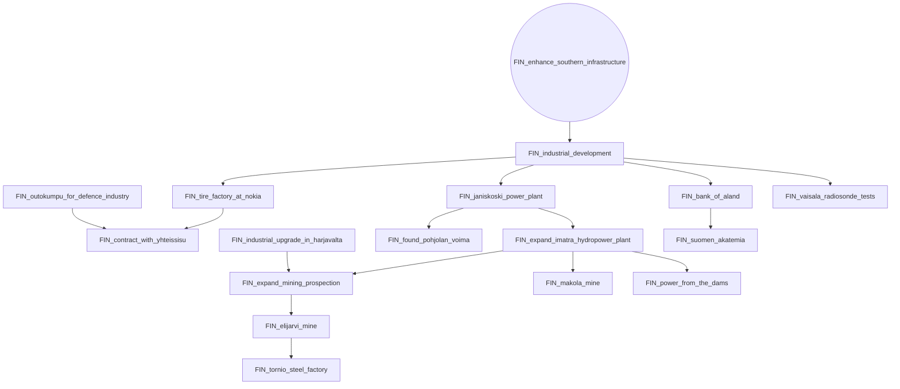
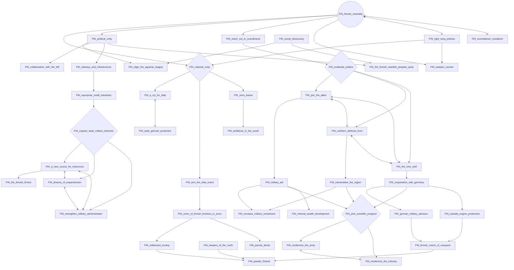
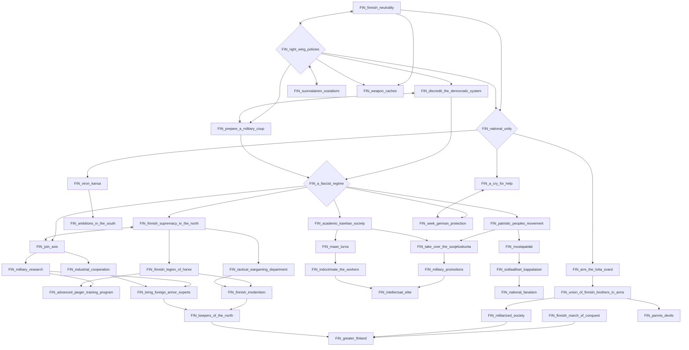
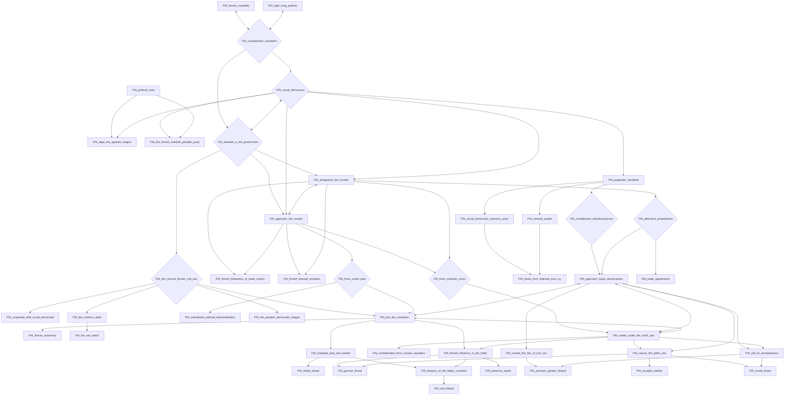

# FIN_enhance_southern_infrastructure

```mermaid
flowchart TD
    n1["FIN_bank_of_aland"]
    n2["FIN_contract_with_yhteissisu"]
    n3["FIN_elijarvi_mine"]
    n4(("FIN_enhance_southern_infrastructure"))
    n5["FIN_expand_imatra_hydropower_plant"]
    n6["FIN_expand_mining_prospection"]
    n7["FIN_found_pohjolan_voima"]
    n8["FIN_industrial_development"]
    n9["FIN_industrial_upgrade_in_harjavalta"]
    n10["FIN_janiskoski_power_plant"]
    n11["FIN_makola_mine"]
    n12["FIN_outokumpu_for_defence_industry"]
    n13["FIN_power_from_the_dams"]
    n14["FIN_suomen_akatemia"]
    n15["FIN_tire_factory_at_nokia"]
    n16["FIN_tornio_steel_factory"]
    n17["FIN_vaisala_radiosonde_tests"]
    n8 --> n1
    n15 --> n2
    n12 --> n2
    n6 --> n3
    n10 --> n5
    n5 --> n6
    n9 --> n6
    n10 --> n7
    n4 --> n8
    n8 --> n10
    n5 --> n11
    n5 --> n13
    n1 --> n14
    n8 --> n15
    n3 --> n16
    n8 --> n17
```

# FIN_finnish_neutrality

```mermaid
flowchart TD
    n18["FIN_a_cry_for_help"]
    n19["FIN_a_new_course_for_kokoomus"]
    n20["FIN_align_the_agrarian_league"]
    n21["FIN_ambitions_in_the_south"]
    n22["FIN_arm_the_lotta_svard"]
    n23["FIN_collaboration_with_the_left"]
    n24["FIN_cooperation_with_germany"]
    n25["FIN_dreams_of_expansionism"]
    n26{"FIN_expand_state_military_factories"}
    n27["FIN_finnish_march_of_conquest"]
    n28(("FIN_finnish_neutrality"))
    n29["FIN_german_military_advisors"]
    n30["FIN_greater_finland"]
    n31["FIN_increase_military_investment"]
    n32["FIN_industrialize_the_region"]
    n33["FIN_join_the_allies"]
    n34{"FIN_joint_scientific_program"}
    n35["FIN_keepers_of_the_north"]
    n36["FIN_militarized_society"]
    n37["FIN_military_aid"]
    n38["FIN_mineral_wealth_development"]
    n39{"FIN_moderate_politics"}
    n40["FIN_modernize_the_army"]
    n41["FIN_modernize_the_industry"]
    n42{"FIN_national_unity"}
    n43["FIN_northern_defense_front"]
    n44["FIN_parmis_devils"]
    n45["FIN_political_unity"]
    n46["FIN_railways_and_infrastructure"]
    n47["FIN_reach_out_to_scandinavia"]
    n48["FIN_repurpose_small_industries"]
    n49["FIN_right_wing_policies"]
    n50["FIN_seek_german_protection"]
    n51["FIN_social_democracy"]
    n52["FIN_strengthen_military_administration"]
    n53["FIN_suomalainen_sosialismi"]
    n54["FIN_the_finnish_swedish_peoples_party"]
    n55["FIN_the_finnish_throne"]
    n56["FIN_the_lone_wolf"]
    n57["FIN_union_of_finnish_brothers_in_arms"]
    n58["FIN_viron_kansa"]
    n59["FIN_wartsila_engine_production"]
    n60["FIN_weapon_caches"]
    n42 --> n18
    n26 --> n19
    n45 --> n20
    n51 --> n20
    n58 --> n21
    n42 --> n22
    n45 --> n23
    n56 --> n24
    n26 --> n25
    n48 --> n26
    n59 --> n27
    n29 --> n27
    n24 --> n29
    n27 --> n30
    n36 --> n30
    n35 --> n30
    n37 --> n31
    n32 --> n31
    n43 --> n32
    n39 --> n33
    n32 --> n34
    n24 --> n34
    n37 --> n34
    n57 --> n36
    n33 --> n37
    n37 --> n38
    n47 --> n39
    n34 --> n40
    n34 --> n41
    n28 --> n42
    n49 --> n42
    n39 --> n43
    n57 --> n44
    n28 --> n45
    n45 --> n46
    n28 --> n47
    n46 --> n48
    n26 --> n52
    n51 --> n54
    n45 --> n54
    n19 --> n55
    n39 --> n56
    n22 --> n57
    n42 --> n58
    n24 --> n59
    n28 --> n60
    n49 --> n60
    n18 x--x n50
    n19 x--x n25
    n19 x--x n52
    n25 x--x n52
    n28 x--x n49
    n28 x--x n53
    n33 x--x n43
    n33 x--x n56
    n40 x--x n41
    n43 x--x n56
```

# FIN_increase_military_budget

```mermaid
flowchart TD
    n61["FIN_acquire_andros_dockyards"]
    n62{"FIN_coastal_defense"}
    n2["FIN_contract_with_yhteissisu"]
    n63["FIN_conversion_of_civilian_vessels"]
    n64["FIN_deep_sea_raiders"]
    n65["FIN_defense_in_depth"]
    n66{"FIN_dominate_the_skies"}
    n3["FIN_elijarvi_mine"]
    n67["FIN_expand_air_bases"]
    n68["FIN_expand_air_force_academy"]
    n5["FIN_expand_imatra_hydropower_plant"]
    n6["FIN_expand_mining_prospection"]
    n69["FIN_expand_production_lines"]
    n70["FIN_expand_ship_building_industry"]
    n71["FIN_expansion_towards_the_atlantic"]
    n72["FIN_extra_refresher_exercises"]
    n73{"FIN_finnish_radio_intelligence"}
    n74["FIN_foreign_aircraft"]
    n75["FIN_foreign_armor"]
    n76["FIN_helsinki_air_defense"]
    n77(("FIN_increase_military_budget"))
    n9["FIN_industrial_upgrade_in_harjavalta"]
    n78["FIN_innovative_designs"]
    n79["FIN_integrate_oy_tikkakoski"]
    n80["FIN_jaeger_movement"]
    n81{"FIN_long_range_patrols"}
    n82["FIN_mannerheim_line"]
    n83["FIN_marine_jaeger_divisions"]
    n84["FIN_modernize_production_lines"]
    n85["FIN_motti_tactics"]
    n86{"FIN_national_aircraft_production"}
    n87["FIN_national_armor_focus"]
    n88["FIN_national_firepower"]
    n89{"FIN_naval_airforce"}
    n90["FIN_operation_kilpapurjehdus"]
    n12["FIN_outokumpu_for_defence_industry"]
    n91["FIN_oy_alkoholiliike"]
    n92["FIN_pilot_training"]
    n93["FIN_rapid_raiders"]
    n94{"FIN_salvaged_and_retooled"}
    n95["FIN_sea_mines_strategy"]
    n96["FIN_sissi"]
    n97["FIN_strengthen_the_naval_bases"]
    n98["FIN_suomen_ilmavoimat"]
    n99["FIN_suomen_maavoimat"]
    n100["FIN_suomen_merivoimat"]
    n101{"FIN_support_for_ground_forces"}
    n102["FIN_the_cold_front"]
    n103["FIN_the_merchant_fleet"]
    n15["FIN_tire_factory_at_nokia"]
    n16["FIN_tornio_steel_factory"]
    n104["FIN_underground_resistance_cells"]
    n105{"FIN_utilize_the_sami"}
    n106["FIN_winter_warfare"]
    n100 --> n61
    n100 --> n62
    n15 --> n2
    n12 --> n2
    n103 --> n63
    n62 --> n63
    n62 --> n64
    n82 --> n65
    n86 --> n66
    n6 --> n3
    n98 --> n67
    n92 --> n68
    n5 --> n6
    n9 --> n6
    n101 --> n69
    n66 --> n69
    n97 --> n70
    n61 --> n70
    n95 --> n71
    n70 --> n71
    n99 --> n72
    n85 --> n73
    n67 --> n74
    n94 --> n75
    n82 --> n76
    n67 --> n76
    n12 --> n9
    n87 --> n78
    n12 --> n79
    n72 --> n80
    n106 --> n81
    n85 --> n81
    n99 --> n82
    n62 --> n83
    n66 --> n84
    n101 --> n84
    n89 --> n84
    n80 --> n85
    n94 --> n85
    n102 --> n85
    n67 --> n86
    n92 --> n86
    n94 --> n87
    n73 --> n87
    n79 --> n88
    n98 --> n89
    n100 --> n89
    n99 --> n90
    n99 --> n12
    n12 --> n91
    n98 --> n92
    n62 --> n93
    n72 --> n94
    n93 --> n95
    n64 --> n95
    n81 --> n96
    n73 --> n96
    n105 --> n96
    n100 --> n97
    n77 --> n98
    n77 --> n99
    n77 --> n100
    n86 --> n101
    n72 --> n102
    n100 --> n103
    n3 --> n16
    n99 --> n104
    n106 --> n105
    n102 --> n106
    n64 x--x n93
    n66 x--x n101
    n69 x--x n84
    n87 x--x n96
```

# FIN_right_wing_policies

```mermaid
flowchart TD
    n18["FIN_a_cry_for_help"]
    n107{"FIN_a_fascist_regime"}
    n108["FIN_academic_karelian_society"]
    n109["FIN_advanced_jaeger_training_program"]
    n21["FIN_ambitions_in_the_south"]
    n22["FIN_arm_the_lotta_svard"]
    n110["FIN_bring_foreign_armor_experts"]
    n111["FIN_discredit_the_democratic_system"]
    n112["FIN_finnish_irredentism"]
    n113["FIN_finnish_legion_of_honor"]
    n27["FIN_finnish_march_of_conquest"]
    n28["FIN_finnish_neutrality"]
    n114["FIN_finnish_supremacy_in_the_north"]
    n30["FIN_greater_finland"]
    n115["FIN_indoctrinate_the_workers"]
    n116["FIN_industrial_cooperation"]
    n117["FIN_intellectual_elite"]
    n118["FIN_join_axis"]
    n35["FIN_keepers_of_the_north"]
    n119["FIN_maan_turva"]
    n36["FIN_militarized_society"]
    n120["FIN_military_promotions"]
    n121["FIN_military_research"]
    n122["FIN_mustapaidat"]
    n123["FIN_national_fanatism"]
    n42{"FIN_national_unity"}
    n44["FIN_parmis_devils"]
    n124["FIN_patriotic_peoples_movement"]
    n125["FIN_prepare_a_military_coup"]
    n49{"FIN_right_wing_policies"}
    n50["FIN_seek_german_protection"]
    n126["FIN_sotilaalliset_kappalaiset"]
    n53["FIN_suomalainen_sosialismi"]
    n127["FIN_tactical_wargaming_department"]
    n128["FIN_take_over_the_suojeluskunta"]
    n57["FIN_union_of_finnish_brothers_in_arms"]
    n58["FIN_viron_kansa"]
    n60["FIN_weapon_caches"]
    n42 --> n18
    n111 --> n107
    n125 --> n107
    n107 --> n108
    n121 --> n109
    n113 --> n109
    n58 --> n21
    n42 --> n22
    n121 --> n110
    n116 --> n110
    n49 --> n111
    n113 --> n112
    n127 --> n112
    n114 --> n113
    n107 --> n114
    n27 --> n30
    n36 --> n30
    n35 --> n30
    n119 --> n115
    n118 --> n116
    n120 --> n117
    n115 --> n117
    n107 --> n118
    n112 --> n35
    n110 --> n35
    n108 --> n119
    n57 --> n36
    n128 --> n120
    n118 --> n121
    n124 --> n122
    n126 --> n123
    n28 --> n42
    n49 --> n42
    n57 --> n44
    n107 --> n124
    n49 --> n125
    n107 --> n50
    n122 --> n126
    n114 --> n127
    n124 --> n128
    n108 --> n128
    n22 --> n57
    n42 --> n58
    n28 --> n60
    n49 --> n60
    n18 x--x n50
    n111 x--x n125
    n28 x--x n49
    n114 x--x n118
    n49 x--x n53
```

# FIN_suomalainen_sosialismi

```mermaid
flowchart TD
    n129["FIN_aid_for_entrepreneurs"]
    n20["FIN_align_the_agrarian_league"]
    n130["FIN_antagonize_the_soviets"]
    n131["FIN_approach_major_democracies"]
    n132["FIN_approach_the_soviets"]
    n133["FIN_british_threat"]
    n134["FIN_confederated_finno_russian_republics"]
    n135["FIN_control_the_flux_of_iron_ore"]
    n136["FIN_cooperate_with_social_democrats"]
    n137{"FIN_defensive_preparations"}
    n138["FIN_finnish_autonomy"]
    n139["FIN_finnish_federation_of_trade_unions"]
    n140["FIN_finnish_influence_in_the_baltic"]
    n141["FIN_finnish_learned_societies"]
    n28["FIN_finnish_neutrality"]
    n142{"FIN_finno_estonian_union"}
    n143{"FIN_finno_soviet_pact"}
    n144["FIN_funds_from_kalevala_koru_oy"]
    n145["FIN_german_threat"]
    n146["FIN_integrate_kola_and_karelia"]
    n147["FIN_join_the_comintern"]
    n148["FIN_keepers_of_the_baltic_countries"]
    n149["FIN_mineral_wealth"]
    n45["FIN_political_unity"]
    n150["FIN_pragmatic_socialism"]
    n151["FIN_preserve_sapmi"]
    n152["FIN_proclaim_greater_finland"]
    n153["FIN_red_finland"]
    n49["FIN_right_wing_policies"]
    n154["FIN_secure_the_baltic_sea"]
    n51{"FIN_social_democracy"}
    n155["FIN_social_democratic_womens_union"]
    n156["FIN_socialist_welfare"]
    n157{"FIN_sosialistinen_eduskuntaryhma"}
    n158["FIN_soviet_threat"]
    n159["FIN_subsidized_national_industrialization"]
    n53{"FIN_suomalainen_sosialismi"}
    n54["FIN_the_finnish_swedish_peoples_party"]
    n160["FIN_the_peoples_democratic_league"]
    n161["FIN_the_red_watch"]
    n162{"FIN_the_second_finnish_civil_war"}
    n163["FIN_the_workers_state"]
    n164{"FIN_towards_a_red_government"}
    n165["FIN_trade_agreements"]
    n166["FIN_united_under_the_north_star"]
    n131 --> n129
    n166 --> n129
    n45 --> n20
    n51 --> n20
    n164 --> n130
    n51 --> n130
    n157 --> n131
    n137 --> n131
    n164 --> n132
    n51 --> n132
    n146 --> n133
    n166 --> n134
    n131 --> n135
    n162 --> n136
    n130 --> n137
    n147 --> n138
    n130 --> n139
    n132 --> n139
    n147 --> n140
    n166 --> n140
    n132 --> n141
    n130 --> n141
    n132 --> n142
    n130 --> n142
    n132 --> n143
    n155 --> n144
    n149 --> n144
    n140 --> n145
    n154 --> n145
    n147 --> n146
    n162 --> n147
    n143 --> n147
    n146 --> n148
    n140 --> n148
    n150 --> n149
    n51 --> n150
    n140 --> n151
    n135 --> n152
    n129 --> n152
    n148 --> n153
    n166 --> n154
    n131 --> n154
    n53 --> n51
    n150 --> n155
    n154 --> n156
    n150 --> n157
    n154 --> n158
    n129 --> n158
    n143 --> n159
    n51 --> n54
    n45 --> n54
    n162 --> n160
    n163 --> n161
    n164 --> n162
    n162 --> n163
    n53 --> n164
    n137 --> n165
    n142 --> n166
    n130 x--x n132
    n131 x--x n147
    n131 x--x n166
    n28 x--x n53
    n147 x--x n166
    n49 x--x n53
    n51 x--x n164
```
