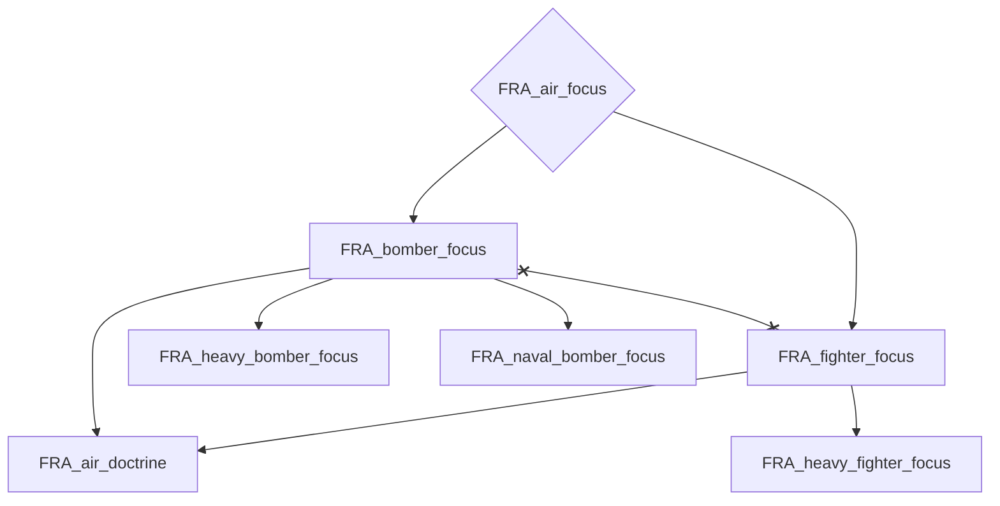
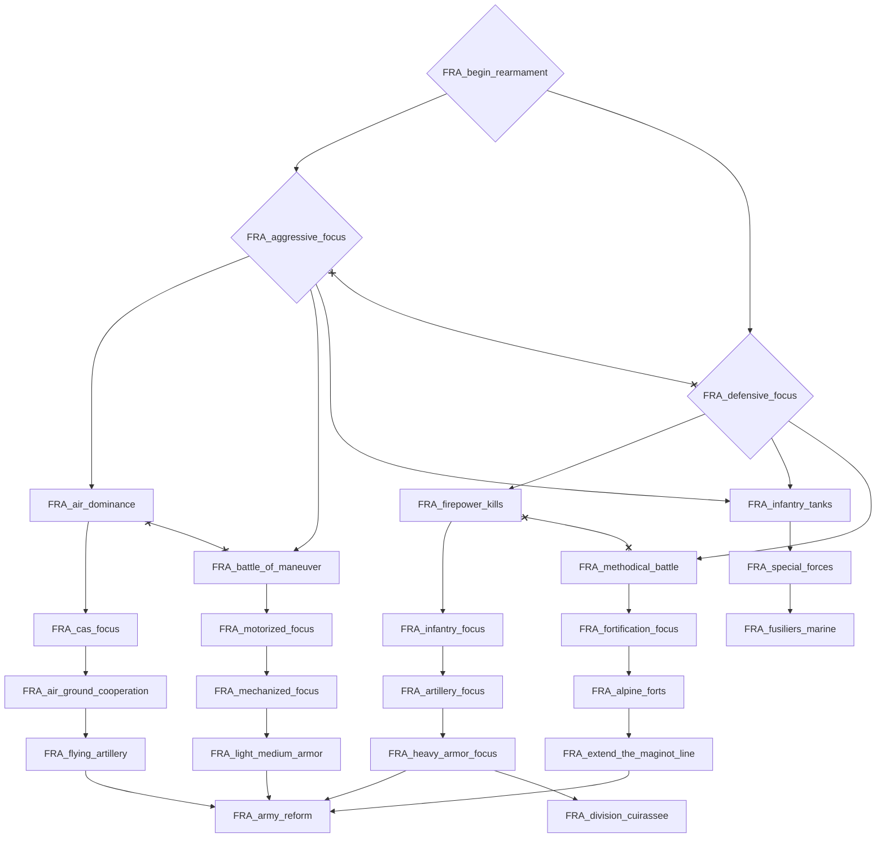
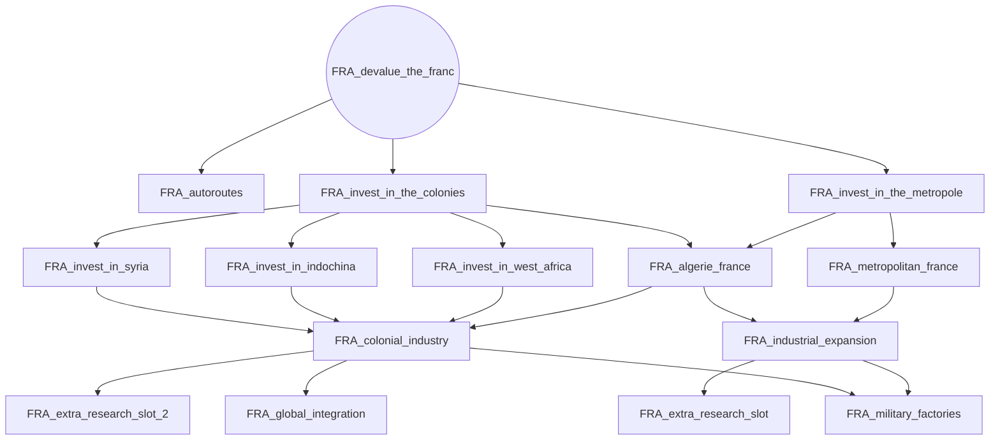
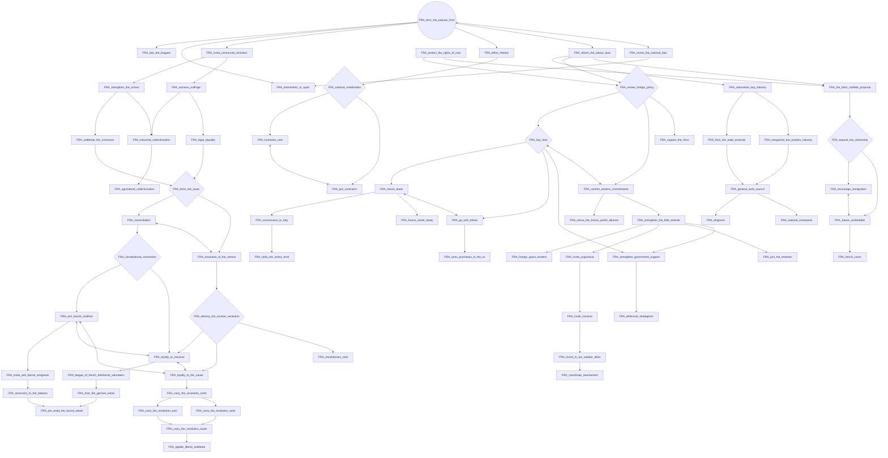
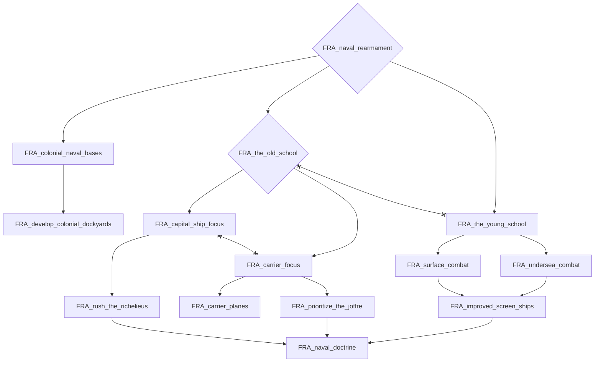

# FRA_air_focus

```mermaid
flowchart TD
    n1["FRA_air_doctrine"]
    n2{"FRA_air_focus"}
    n3["FRA_bomber_focus"]
    n4["FRA_fighter_focus"]
    n5["FRA_heavy_bomber_focus"]
    n6["FRA_heavy_fighter_focus"]
    n7["FRA_naval_bomber_focus"]
    n4 --> n1
    n3 --> n1
    n2 --> n3
    n2 --> n4
    n3 --> n5
    n4 --> n6
    n3 --> n7
    n3 x--x n4
```

# FRA_begin_rearmament

```mermaid
flowchart TD
    n8{"FRA_aggressive_focus"}
    n9["FRA_air_dominance"]
    n10["FRA_air_ground_cooperation"]
    n11["FRA_alpine_forts"]
    n12["FRA_army_reform"]
    n13["FRA_artillery_focus"]
    n14["FRA_battle_of_maneuver"]
    n15{"FRA_begin_rearmament"}
    n16["FRA_cas_focus"]
    n17{"FRA_defensive_focus"}
    n18["FRA_division_cuirassee"]
    n19["FRA_extend_the_maginot_line"]
    n20["FRA_firepower_kills"]
    n21["FRA_flying_artillery"]
    n22["FRA_fortification_focus"]
    n23["FRA_fusiliers_marine"]
    n24["FRA_heavy_armor_focus"]
    n25["FRA_infantry_focus"]
    n26["FRA_infantry_tanks"]
    n27["FRA_light_medium_armor"]
    n28["FRA_mechanized_focus"]
    n29["FRA_methodical_battle"]
    n30["FRA_motorized_focus"]
    n31["FRA_special_forces"]
    n15 --> n8
    n8 --> n9
    n16 --> n10
    n22 --> n11
    n27 --> n12
    n24 --> n12
    n19 --> n12
    n21 --> n12
    n25 --> n13
    n8 --> n14
    n9 --> n16
    n15 --> n17
    n24 --> n18
    n11 --> n19
    n17 --> n20
    n10 --> n21
    n29 --> n22
    n31 --> n23
    n13 --> n24
    n20 --> n25
    n17 --> n26
    n8 --> n26
    n28 --> n27
    n30 --> n28
    n17 --> n29
    n14 --> n30
    n26 --> n31
    n8 x--x n17
    n9 x--x n14
    n20 x--x n29
```

# FRA_devalue_the_franc

```mermaid
flowchart TD
    n32["FRA_algerie_france"]
    n33["FRA_autoroutes"]
    n34["FRA_colonial_industry"]
    n35(("FRA_devalue_the_franc"))
    n36["FRA_extra_research_slot"]
    n37["FRA_extra_research_slot_2"]
    n38["FRA_global_integration"]
    n39["FRA_industrial_expansion"]
    n40["FRA_invest_in_indochina"]
    n41["FRA_invest_in_syria"]
    n42["FRA_invest_in_the_colonies"]
    n43["FRA_invest_in_the_metropole"]
    n44["FRA_invest_in_west_africa"]
    n45["FRA_metropolitan_france"]
    n46["FRA_military_factories"]
    n43 --> n32
    n42 --> n32
    n35 --> n33
    n32 --> n34
    n44 --> n34
    n40 --> n34
    n41 --> n34
    n39 --> n36
    n34 --> n37
    n34 --> n38
    n45 --> n39
    n32 --> n39
    n42 --> n40
    n42 --> n41
    n35 --> n42
    n35 --> n43
    n42 --> n44
    n43 --> n45
    n39 --> n46
    n34 --> n46
```

# FRA_form_the_popular_front

```mermaid
flowchart TD
    n47["FRA_agricultural_collectivization"]
    n48["FRA_anti_fascist_coalition"]
    n49["FRA_arms_purchases_in_the_us"]
    n50["FRA_ban_the_leagues"]
    n51{"FRA_buy_time"}
    n52["FRA_carry_the_revolution_east"]
    n53["FRA_carry_the_revolution_north"]
    n54["FRA_carry_the_revolution_south"]
    n55["FRA_carry_the_revolution_west"]
    n56["FRA_celebrate_the_commune"]
    n57["FRA_concessions_to_italy"]
    n58["FRA_confirm_eastern_commitments"]
    n59{"FRA_constitutional_convention"}
    n60["FRA_coordinate_rearmament"]
    n61["FRA_defensive_strategems"]
    n62{"FRA_destroy_the_counter_revolution"}
    n63["FRA_dirigisme"]
    n64["FRA_egalite_liberte_solidarite"]
    n65["FRA_encourage_immigration"]
    n66{"FRA_expand_the_citizenship"}
    n67{"FRA_force_the_issue"}
    n68["FRA_foreign_guest_workers"]
    n69(("FRA_form_the_popular_front"))
    n70["FRA_form_the_state_arsenals"]
    n71["FRA_france_leads"]
    n72["FRA_france_undividable"]
    n73["FRA_franco_soviet_treaty"]
    n74["FRA_french_union"]
    n75["FRA_general_work_council"]
    n76["FRA_go_with_britain"]
    n77["FRA_host_the_german_exiles"]
    n78["FRA_humanite_unie"]
    n79["FRA_industrial_collectivization"]
    n80["FRA_intervention_in_spain"]
    n81["FRA_invest_in_our_weaker_allies"]
    n82["FRA_invite_anti_fascist_emigrants"]
    n83["FRA_invite_communist_ministers"]
    n84["FRA_invite_romania"]
    n85["FRA_invite_yugoslavia"]
    n86["FRA_join_comintern"]
    n87["FRA_join_the_ententes"]
    n88["FRA_league_of_french_bolshevist_volunteers"]
    n89["FRA_leftist_rhetoric"]
    n90["FRA_legal_equality"]
    n91["FRA_loyalty_to_moscow"]
    n92["FRA_loyalty_to_the_cause"]
    n93["FRA_national_champions"]
    n94{"FRA_national_mobilization"}
    n95["FRA_nationalize_key_industry"]
    n96["FRA_pre_empt_the_fascist_attack"]
    n97["FRA_protect_the_rights_of_man"]
    n98["FRA_ratify_the_stresa_front"]
    n99["FRA_reconciliation"]
    n100["FRA_reconnect_to_the_balkans"]
    n101["FRA_reform_the_labour_laws"]
    n102["FRA_reorganize_the_aviation_industry"]
    n103{"FRA_review_foreign_policy"}
    n104["FRA_revive_the_franco_polish_alliance"]
    n105["FRA_revive_the_national_bloc"]
    n106["FRA_revolution_to_the_utmost"]
    n107["FRA_revolutionary_zeal"]
    n108["FRA_strengthen_government_support"]
    n109["FRA_strengthen_the_little_entente"]
    n110["FRA_strengthen_the_unions"]
    n111["FRA_support_the_finns"]
    n112["FRA_the_blum_viollette_proposal"]
    n113["FRA_womens_suffrage"]
    n79 --> n47
    n59 --> n48
    n76 --> n49
    n69 --> n50
    n103 --> n51
    n53 --> n52
    n92 --> n53
    n55 --> n54
    n52 --> n54
    n53 --> n55
    n110 --> n56
    n71 --> n57
    n103 --> n58
    n99 --> n59
    n81 --> n60
    n108 --> n61
    n106 --> n62
    n75 --> n63
    n54 --> n64
    n66 --> n65
    n112 --> n66
    n56 --> n67
    n90 --> n67
    n109 --> n68
    n95 --> n70
    n51 --> n71
    n66 --> n72
    n71 --> n73
    n72 --> n74
    n102 --> n75
    n70 --> n75
    n51 --> n76
    n88 --> n77
    n94 --> n78
    n113 --> n79
    n110 --> n79
    n69 --> n80
    n105 --> n80
    n84 --> n81
    n48 --> n82
    n69 --> n83
    n85 --> n84
    n109 --> n85
    n94 --> n86
    n109 --> n87
    n91 --> n88
    n69 --> n89
    n113 --> n90
    n59 --> n91
    n62 --> n91
    n62 --> n92
    n75 --> n93
    n89 --> n94
    n101 --> n95
    n100 --> n96
    n77 --> n96
    n57 --> n98
    n67 --> n99
    n82 --> n100
    n69 --> n101
    n95 --> n102
    n101 --> n103
    n97 --> n103
    n58 --> n104
    n67 --> n106
    n62 --> n107
    n109 --> n108
    n51 --> n108
    n58 --> n109
    n83 --> n110
    n103 --> n111
    n101 --> n112
    n97 --> n112
    n83 --> n113
    n48 x--x n91
    n48 x--x n92
    n51 x--x n58
    n65 x--x n72
    n69 x--x n105
    n71 x--x n76
    n78 x--x n86
    n91 x--x n92
    n99 x--x n106
```

# FRA_naval_rearmament

```mermaid
flowchart TD
    n114["FRA_capital_ship_focus"]
    n115["FRA_carrier_focus"]
    n116["FRA_carrier_planes"]
    n117["FRA_colonial_naval_bases"]
    n118["FRA_develop_colonial_dockyards"]
    n119["FRA_improved_screen_ships"]
    n120["FRA_naval_doctrine"]
    n121{"FRA_naval_rearmament"}
    n122["FRA_prioritize_the_joffre"]
    n123["FRA_rush_the_richelieus"]
    n124["FRA_surface_combat"]
    n125{"FRA_the_old_school"}
    n126["FRA_the_young_school"]
    n127["FRA_undersea_combat"]
    n125 --> n114
    n125 --> n115
    n115 --> n116
    n121 --> n117
    n117 --> n118
    n124 --> n119
    n127 --> n119
    n122 --> n120
    n123 --> n120
    n119 --> n120
    n115 --> n122
    n114 --> n123
    n126 --> n124
    n121 --> n125
    n121 --> n126
    n126 --> n127
    n114 x--x n115
    n125 x--x n126
```

# FRA_revive_the_national_bloc

```mermaid
flowchart TD
    n128["FRA_agricultural_protectionism"]
    n129["FRA_align_belgium"]
    n49["FRA_arms_purchases_in_the_us"]
    n130{"FRA_army_of_aggression"}
    n131["FRA_avenge_waterloo"]
    n132["FRA_ban_communism"]
    n133["FRA_bring_home_quebec"]
    n51{"FRA_buy_time"}
    n134["FRA_compensate_italy"]
    n57["FRA_concessions_to_italy"]
    n58["FRA_confirm_eastern_commitments"]
    n60["FRA_coordinate_rearmament"]
    n135["FRA_counter_action"]
    n61["FRA_defensive_strategems"]
    n136["FRA_destroy_decadence"]
    n137{"FRA_diplomatic_freedom"}
    n138["FRA_dismantle_the_democracies"]
    n139["FRA_disunite_germany"]
    n140["FRA_dominate_the_middle_east"]
    n141["FRA_economic_devolution"]
    n65["FRA_encourage_immigration"]
    n142{"FRA_establish_spheres_of_influence"}
    n66{"FRA_expand_the_citizenship"}
    n143["FRA_expand_to_the_suez"]
    n144["FRA_family"]
    n145["FRA_fatherland"]
    n68["FRA_foreign_guest_workers"]
    n69["FRA_form_the_popular_front"]
    n146["FRA_france_first"]
    n71["FRA_france_leads"]
    n72["FRA_france_undividable"]
    n73["FRA_franco_soviet_treaty"]
    n147["FRA_freedom_front"]
    n74["FRA_french_union"]
    n76["FRA_go_with_britain"]
    n148["FRA_grow_the_empire"]
    n149["FRA_guarantee_the_constitution"]
    n150{"FRA_integralism"}
    n151["FRA_intervention_in_greece"]
    n80["FRA_intervention_in_spain"]
    n81["FRA_invest_in_our_weaker_allies"]
    n152["FRA_invite_portugal"]
    n84["FRA_invite_romania"]
    n85["FRA_invite_yugoslavia"]
    n153["FRA_je_suis_la_deluge"]
    n154["FRA_join_germany"]
    n87["FRA_join_the_ententes"]
    n155["FRA_laissez_faire"]
    n156["FRA_latin_entente"]
    n157["FRA_national_regeneration"]
    n158["FRA_no_further_humiliations"]
    n159["FRA_orleanist_restoration"]
    n160["FRA_political_unity"]
    n161["FRA_proclaim_the_third_empire"]
    n162["FRA_promote_entrepeneurship"]
    n97["FRA_protect_the_rights_of_man"]
    n163["FRA_public_welfare"]
    n98["FRA_ratify_the_stresa_front"]
    n164["FRA_reach_out_to_spain"]
    n101["FRA_reform_the_labour_laws"]
    n165["FRA_reorganize_the_dutch"]
    n166{"FRA_repeal_the_law_of_exile"}
    n167["FRA_retribution_for_sedan"]
    n168["FRA_return_to_borodino"]
    n103{"FRA_review_foreign_policy"}
    n169["FRA_revise_the_constitution"]
    n104["FRA_revive_the_franco_polish_alliance"]
    n105{"FRA_revive_the_national_bloc"}
    n170["FRA_right_wing_rhetoric"]
    n171{"FRA_secure_the_crown_of_spain"}
    n172["FRA_slum_clearing"]
    n173["FRA_split_belgium"]
    n174["FRA_stimulate_the_dynamic_market"]
    n108["FRA_strengthen_government_support"]
    n109["FRA_strengthen_the_little_entente"]
    n111["FRA_support_the_finns"]
    n112["FRA_the_blum_viollette_proposal"]
    n175["FRA_the_congress_of_paris"]
    n176["FRA_the_council_of_rambouillet"]
    n177["FRA_the_first_citizen_of_the_state"]
    n178["FRA_the_legitimate_heir"]
    n179["FRA_the_natural_borders_of_france"]
    n180["FRA_towards_a_new_europe"]
    n181["FRA_two_countries_two_crowns"]
    n182["FRA_unite_the_crowns"]
    n183{"FRA_utilize_the_leagues"}
    n184["FRA_woo_italy"]
    n185["FRA_work"]
    n105 --> n128
    n142 --> n129
    n76 --> n49
    n170 --> n130
    n161 --> n131
    n105 --> n132
    n148 --> n133
    n103 --> n51
    n156 --> n134
    n71 --> n57
    n103 --> n58
    n81 --> n60
    n149 --> n135
    n177 --> n135
    n108 --> n61
    n157 --> n136
    n157 --> n137
    n184 --> n138
    n167 --> n139
    n143 --> n140
    n128 --> n141
    n155 --> n141
    n66 --> n65
    n180 --> n142
    n112 --> n66
    n151 --> n143
    n148 --> n143
    n150 --> n144
    n150 --> n145
    n109 --> n68
    n130 --> n146
    n51 --> n71
    n66 --> n72
    n71 --> n73
    n97 --> n147
    n72 --> n74
    n51 --> n76
    n173 --> n148
    n129 --> n148
    n159 --> n149
    n157 --> n150
    n134 --> n151
    n69 --> n80
    n105 --> n80
    n84 --> n81
    n164 --> n152
    n85 --> n84
    n109 --> n85
    n168 --> n153
    n130 --> n154
    n109 --> n87
    n105 --> n155
    n137 --> n156
    n183 --> n157
    n135 --> n158
    n166 --> n159
    n157 --> n160
    n166 --> n161
    n141 --> n162
    n155 --> n97
    n128 --> n97
    n172 --> n163
    n57 --> n98
    n156 --> n164
    n131 --> n165
    n169 --> n166
    n131 --> n167
    n167 --> n168
    n101 --> n103
    n97 --> n103
    n176 --> n169
    n58 --> n104
    n105 --> n170
    n178 --> n171
    n135 --> n172
    n142 --> n173
    n147 --> n174
    n162 --> n174
    n109 --> n108
    n51 --> n108
    n58 --> n109
    n103 --> n111
    n101 --> n112
    n97 --> n112
    n152 --> n175
    n151 --> n175
    n183 --> n176
    n159 --> n177
    n166 --> n178
    n175 --> n179
    n137 --> n180
    n171 --> n181
    n171 --> n182
    n105 --> n183
    n130 --> n184
    n150 --> n185
    n128 x--x n155
    n129 x--x n173
    n51 x--x n58
    n65 x--x n72
    n144 x--x n145
    n144 x--x n185
    n145 x--x n185
    n69 x--x n105
    n146 x--x n154
    n146 x--x n184
    n71 x--x n76
    n154 x--x n184
    n156 x--x n180
    n157 x--x n176
    n159 x--x n161
    n159 x--x n178
    n161 x--x n178
    n181 x--x n182
```
