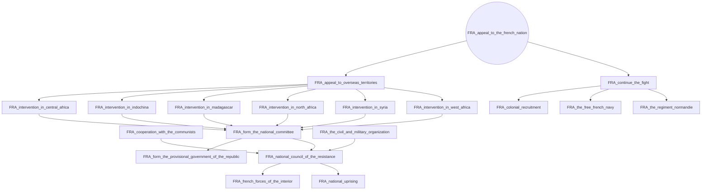
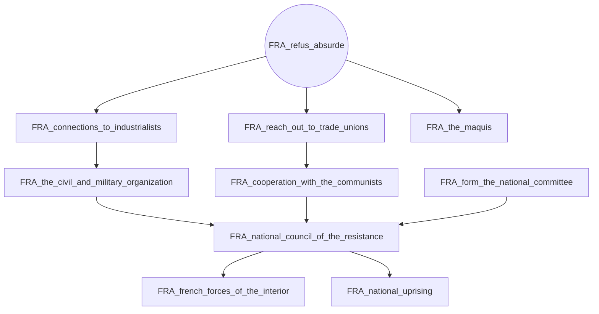

# FRA_appeal_to_the_french_nation

```mermaid
flowchart TD
    n1["FRA_appeal_to_overseas_territories"]
    n2(("FRA_appeal_to_the_french_nation"))
    n3["FRA_colonial_recruitment"]
    n4["FRA_continue_the_fight"]
    n5["FRA_cooperation_with_the_communists"]
    n6["FRA_form_the_national_committee"]
    n7["FRA_form_the_provisional_government_of_the_republic"]
    n8["FRA_french_forces_of_the_interior"]
    n9["FRA_intervention_in_central_africa"]
    n10["FRA_intervention_in_indochina"]
    n11["FRA_intervention_in_madagascar"]
    n12["FRA_intervention_in_north_africa"]
    n13["FRA_intervention_in_syria"]
    n14["FRA_intervention_in_west_africa"]
    n15["FRA_national_council_of_the_resistance"]
    n16["FRA_national_uprising"]
    n17["FRA_the_civil_and_military_organization"]
    n18["FRA_the_free_french_navy"]
    n19["FRA_the_regiment_normandie"]
    n2 --> n1
    n4 --> n3
    n2 --> n4
    n11 --> n6
    n13 --> n6
    n10 --> n6
    n12 --> n6
    n14 --> n6
    n9 --> n6
    n6 --> n7
    n15 --> n8
    n1 --> n9
    n1 --> n10
    n1 --> n11
    n1 --> n12
    n1 --> n13
    n1 --> n14
    n17 --> n15
    n5 --> n15
    n6 --> n15
    n15 --> n16
    n4 --> n18
    n4 --> n19
```

# FRA_refus_absurde

```mermaid
flowchart TD
    n20["FRA_connections_to_industrialists"]
    n5["FRA_cooperation_with_the_communists"]
    n6["FRA_form_the_national_committee"]
    n8["FRA_french_forces_of_the_interior"]
    n15["FRA_national_council_of_the_resistance"]
    n16["FRA_national_uprising"]
    n21["FRA_reach_out_to_trade_unions"]
    n22(("FRA_refus_absurde"))
    n17["FRA_the_civil_and_military_organization"]
    n23["FRA_the_maquis"]
    n22 --> n20
    n21 --> n5
    n15 --> n8
    n17 --> n15
    n5 --> n15
    n6 --> n15
    n15 --> n16
    n22 --> n21
    n20 --> n17
    n22 --> n23
```
