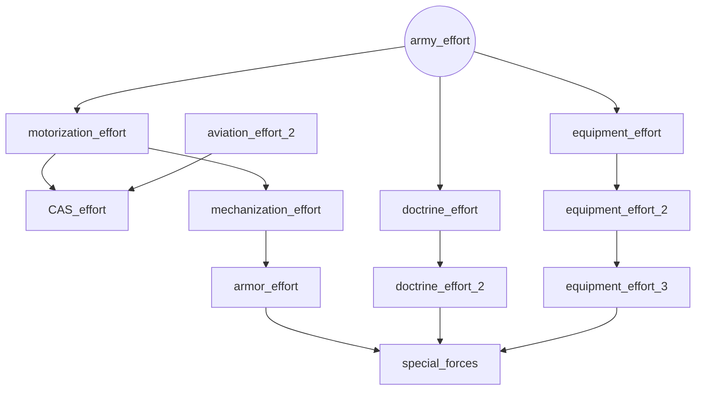
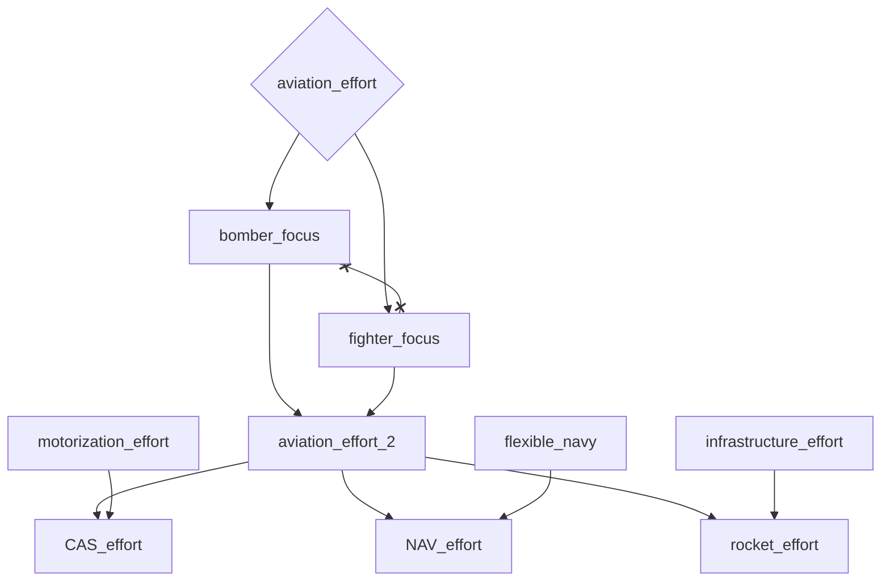
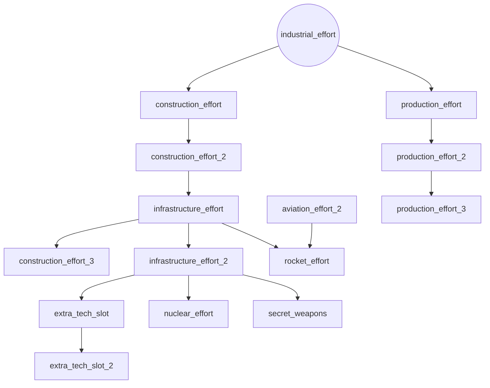
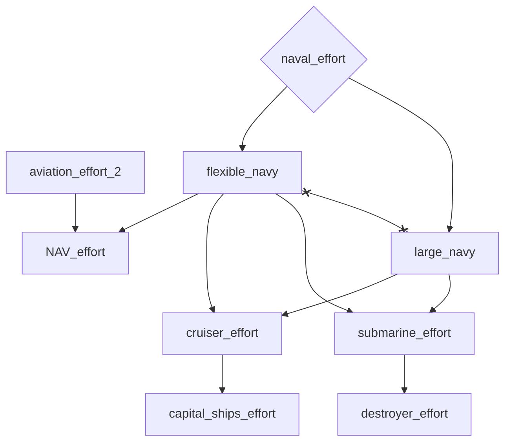
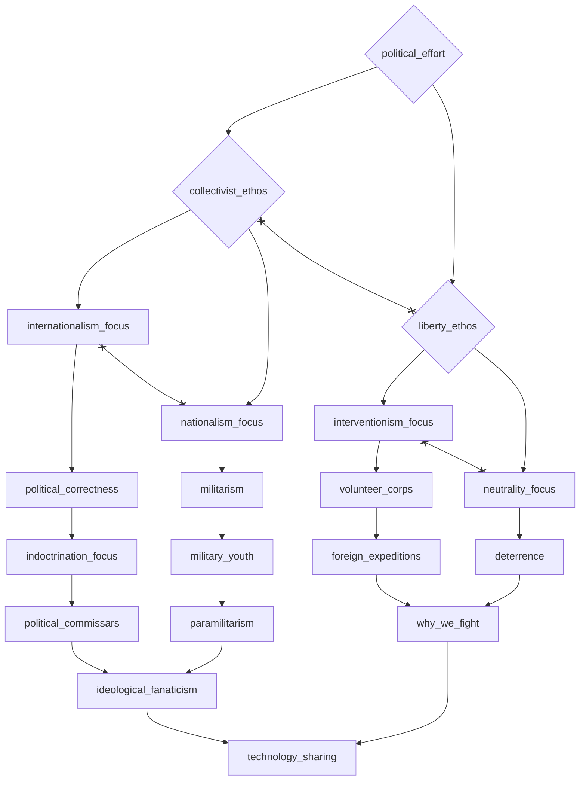

# army_effort

```mermaid
flowchart TD
    n1["CAS_effort"]
    n2["armor_effort"]
    n3(("army_effort"))
    n4["aviation_effort_2"]
    n5["doctrine_effort"]
    n6["doctrine_effort_2"]
    n7["equipment_effort"]
    n8["equipment_effort_2"]
    n9["equipment_effort_3"]
    n10["mechanization_effort"]
    n11["motorization_effort"]
    n12["special_forces"]
    n4 --> n1
    n11 --> n1
    n10 --> n2
    n3 --> n5
    n5 --> n6
    n3 --> n7
    n7 --> n8
    n8 --> n9
    n11 --> n10
    n3 --> n11
    n9 --> n12
    n6 --> n12
    n2 --> n12
```

# aviation_effort

```mermaid
flowchart TD
    n1["CAS_effort"]
    n13["NAV_effort"]
    n14{"aviation_effort"}
    n4["aviation_effort_2"]
    n15["bomber_focus"]
    n16["fighter_focus"]
    n17["flexible_navy"]
    n18["infrastructure_effort"]
    n11["motorization_effort"]
    n19["rocket_effort"]
    n4 --> n1
    n11 --> n1
    n4 --> n13
    n17 --> n13
    n15 --> n4
    n16 --> n4
    n14 --> n15
    n14 --> n16
    n4 --> n19
    n18 --> n19
    n15 x--x n16
```

# industrial_effort

```mermaid
flowchart TD
    n4["aviation_effort_2"]
    n20["construction_effort"]
    n21["construction_effort_2"]
    n22["construction_effort_3"]
    n23["extra_tech_slot"]
    n24["extra_tech_slot_2"]
    n25(("industrial_effort"))
    n18["infrastructure_effort"]
    n26["infrastructure_effort_2"]
    n27["nuclear_effort"]
    n28["production_effort"]
    n29["production_effort_2"]
    n30["production_effort_3"]
    n19["rocket_effort"]
    n31["secret_weapons"]
    n25 --> n20
    n20 --> n21
    n18 --> n22
    n26 --> n23
    n23 --> n24
    n21 --> n18
    n18 --> n26
    n26 --> n27
    n25 --> n28
    n28 --> n29
    n29 --> n30
    n4 --> n19
    n18 --> n19
    n26 --> n31
```

# naval_effort

```mermaid
flowchart TD
    n13["NAV_effort"]
    n4["aviation_effort_2"]
    n32["capital_ships_effort"]
    n33["cruiser_effort"]
    n34["destroyer_effort"]
    n17["flexible_navy"]
    n35["large_navy"]
    n36{"naval_effort"}
    n37["submarine_effort"]
    n4 --> n13
    n17 --> n13
    n33 --> n32
    n35 --> n33
    n17 --> n33
    n37 --> n34
    n36 --> n17
    n36 --> n35
    n17 --> n37
    n35 --> n37
    n17 x--x n35
```

# political_effort

```mermaid
flowchart TD
    n38{"collectivist_ethos"}
    n39["deterrence"]
    n40["foreign_expeditions"]
    n41["ideological_fanaticism"]
    n42["indoctrination_focus"]
    n43["internationalism_focus"]
    n44["interventionism_focus"]
    n45{"liberty_ethos"}
    n46["militarism"]
    n47["military_youth"]
    n48["nationalism_focus"]
    n49["neutrality_focus"]
    n50["paramilitarism"]
    n51["political_commissars"]
    n52["political_correctness"]
    n53{"political_effort"}
    n54["technology_sharing"]
    n55["volunteer_corps"]
    n56["why_we_fight"]
    n53 --> n38
    n49 --> n39
    n55 --> n40
    n50 --> n41
    n51 --> n41
    n52 --> n42
    n38 --> n43
    n45 --> n44
    n53 --> n45
    n48 --> n46
    n46 --> n47
    n38 --> n48
    n45 --> n49
    n47 --> n50
    n42 --> n51
    n43 --> n52
    n41 --> n54
    n56 --> n54
    n44 --> n55
    n40 --> n56
    n39 --> n56
    n38 x--x n45
    n43 x--x n48
    n44 x--x n49
```
