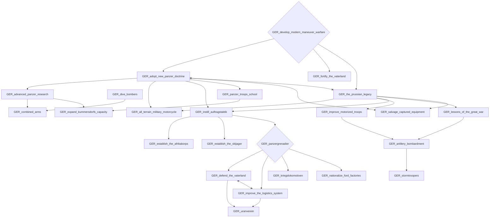
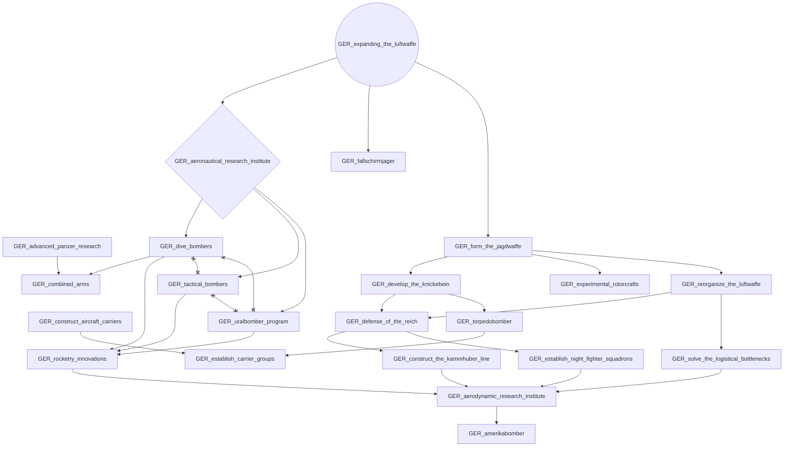
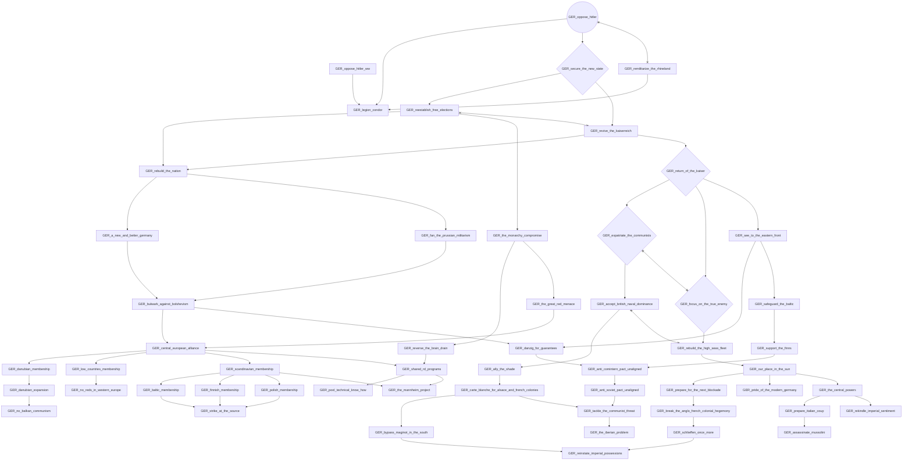
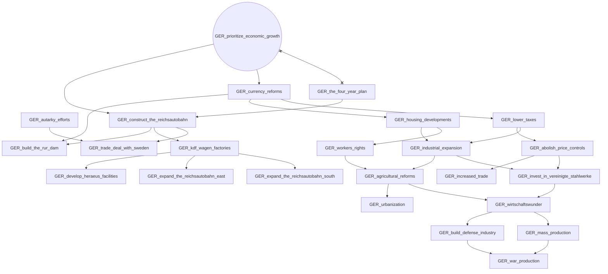
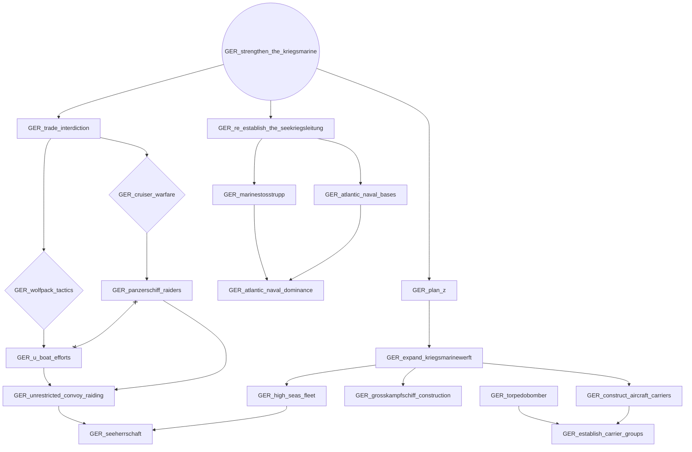
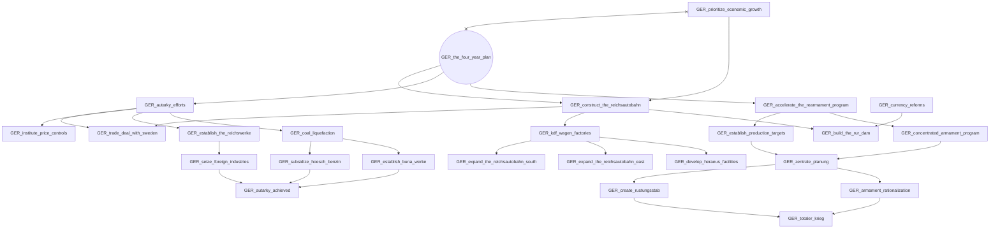

# GER_develop_modern_maneuver_warfare

# GER_expanding_the_luftwaffe

# GER_oppose_hitler

# GER_oppose_hitler_ww

```mermaid
flowchart TD
    n98["GER_accept_british_naval_dominance_ww"]
    n99["GER_african_allies"]
    n100["GER_align_czechoslovakia"]
    n101{"GER_align_italy"}
    n102["GER_align_south_america"]
    n103["GER_all_for_the_front"]
    n104["GER_ally_white_russian_forces"]
    n105["GER_anglo_germanic_cooperation_program"]
    n106{"GER_anglo_germanic_defense_pact"}
    n107["GER_asian_allies"]
    n108["GER_assassinate_mussolini_ww"]
    n109["GER_assemble_red_orchestra"]
    n110["GER_assist_our_eastern_comrades"]
    n111["GER_backdoor_negotiations"]
    n112{"GER_ban_political_uniforms"}
    n113{"GER_break_anglo_french_colonial_hegemony_ww"}
    n114["GER_bring_turkey_into_the_fold"]
    n115{"GER_brothers_in_arms"}
    n116["GER_build_the_eastern_bulwark"]
    n117["GER_bypass_maginot_in_the_south_ww"]
    n118{"GER_carte_blanche_for_alsace_and_french_colonies_ww"}
    n119["GER_carve_up_congo"]
    n120["GER_carve_up_czechoslovakia"]
    n121["GER_central_planning"]
    n122["GER_civil_liberties"]
    n123["GER_closer_sino_germanic_relations"]
    n124{"GER_conquer_italy"}
    n125["GER_czechoslovakia"]
    n126["GER_danzig_for_guarantees_ww"]
    n127["GER_defense_treaty_with_the_soviet"]
    n128["GER_demand_further_polish_concessions"]
    n129["GER_demand_lithuanian_integration"]
    n130{"GER_demand_the_return_of_southern_jutland"}
    n131["GER_democratic_shield"]
    n132["GER_denazification_campaigns"]
    n133["GER_divide_and_conquer"]
    n134["GER_effective_operations"]
    n135["GER_effectivize_the_volkswerke"]
    n136["GER_embrace_democratic_institutions"]
    n137["GER_embrace_liberal_leanings"]
    n138["GER_end_european_communism"]
    n139["GER_establish_a_customs_union"]
    n140["GER_establish_eastern_grand_duchies"]
    n141["GER_establish_volkskommissariats"]
    n142["GER_establish_western_grand_duchies"]
    n143{"GER_european_confederation"}
    n144["GER_expand_african_reach"]
    n145["GER_expand_pacific_holdings"]
    n146["GER_expand_social_welfare"]
    n147["GER_expatriate_the_communists_ww"]
    n148["GER_extend_mitteleuropas_bounderies"]
    n149["GER_factories_for_resources"]
    n150["GER_fan_prussian_militarism"]
    n151["GER_form_agricultural_cooperatives"]
    n152["GER_form_the_stasi"]
    n153["GER_formalize_the_intelligence_wing"]
    n154["GER_franco_germanic_pact"]
    n155["GER_german_hegemony_in_the_middle_east"]
    n156["GER_glorious_mechanical_machinations"]
    n157["GER_glory_to_the_imperial_army"]
    n158["GER_hegemony_over_europe"]
    n159["GER_hold_joint_military_drills"]
    n160["GER_hungary"]
    n161["GER_incorporate_the_polish_rump_state"]
    n162["GER_industrial_cooperation"]
    n163["GER_industrial_investments"]
    n164["GER_industrialize_volkskommissariats"]
    n165["GER_instigate_middle_eastern_revolutions"]
    n166["GER_instill_german_discipline"]
    n167["GER_integrate_subjects_economies"]
    n168["GER_integrate_volkskommissariats"]
    n169["GER_integrate_western_german_speakers"]
    n170["GER_integrated_economies"]
    n171["GER_intervene_in_spain"]
    n172["GER_invite_scientists_back"]
    n173["GER_labor_rights_and_union_stuff"]
    n174["GER_launch_sino_germanic_joint_research_program"]
    n175["GER_legacy_of_the_spartacus_league"]
    n63["GER_legion_condor"]
    n176["GER_liberate_austria"]
    n177["GER_liberate_italy"]
    n178["GER_liberate_oppressed_people"]
    n179["GER_memel_ultimatum"]
    n180["GER_military_dictatorship"]
    n181{"GER_mitteleuropa"}
    n182["GER_mitteleuropa_cooperation_sphere"]
    n183{"GER_monarchist_sentiment"}
    n184["GER_nationalize_industries"]
    n185["GER_offer_military_production_support"]
    n186["GER_offer_trade_proposal"]
    n67["GER_oppose_hitler"]
    n68(("GER_oppose_hitler_ww"))
    n187["GER_our_place_in_the_sun_ww"]
    n188{"GER_petition_for_the_return_of_old_colonies"}
    n189["GER_poland"]
    n190["GER_political_commissars"]
    n191["GER_pool_technical_know_how_ww"]
    n192["GER_prepare_for_the_next_naval_blockade"]
    n193{"GER_prepare_italian_coup_ww"}
    n194["GER_proletarian_dictatorship"]
    n195["GER_proletarian_solidarity"]
    n196["GER_protect_the_revolution"]
    n197["GER_prussian_artillery"]
    n198["GER_puppet_finland"]
    n199["GER_rally_the_nation"]
    n200["GER_rapid_army_expansion"]
    n201["GER_re_establish_free_elections_ww"]
    n202["GER_re_establish_the_landwehr"]
    n203["GER_re_form_the_freikorps"]
    n204["GER_re_ratify_the_locarno_treaty"]
    n205["GER_reach_out_to_scandinavia"]
    n206["GER_realize_mittelafrika"]
    n207{"GER_realpolitik"}
    n208["GER_rebuild_the_high_seas_fleet_ww"]
    n209["GER_rebuild_the_nation_ww"]
    n210["GER_red_europe"]
    n211["GER_reinstate_imperial_possessions_ww"]
    n212{"GER_reject_the_locarno_treaty"}
    n213["GER_rekindle_imperial_sentiment_ww"]
    n80["GER_remilitarize_the_rhineland"]
    n214["GER_reorganize_nationale_volksarmee"]
    n215["GER_request_the_return_of_french_held_colonies"]
    n216["GER_request_the_return_of_qingdao"]
    n217["GER_resource_trade"]
    n218["GER_ressurect_the_red_front_fighters_league"]
    n219["GER_restore_eastern_imperial_possessions"]
    n220["GER_restore_the_brest_litovsk_borders"]
    n221["GER_restore_the_holy_roman_empire"]
    n222["GER_return_of_the_kaiser_ww"]
    n223["GER_reverse_the_brain_drain_ww"]
    n224["GER_revitalize_the_nation"]
    n225{"GER_revive_the_kaiserreich_ww"}
    n226["GER_root_out_imperialism"]
    n227["GER_safeguard_poland"]
    n228["GER_safeguard_the_baltic_ww"]
    n229["GER_schlieffen_once_more_ww"]
    n230{"GER_see_to_the_eastern_front_ww"}
    n231["GER_send_military_aid"]
    n232["GER_send_volunteers"]
    n233["GER_shared_rd_programs_ww"]
    n234["GER_sign_the_second_treaty_of_berlin"]
    n235["GER_social_ownership"]
    n236["GER_spark_the_flame_of_revolution"]
    n237["GER_spheres_of_influence"]
    n238["GER_start_the_proletarian_revolution"]
    n239["GER_state_controlled_economy"]
    n240["GER_strengthen_the_proletarian_international"]
    n241["GER_strengthen_the_welfare_state"]
    n242["GER_strike_at_the_rising_sun"]
    n243["GER_strike_eastward"]
    n244["GER_strive_for_conservative_values"]
    n245["GER_subduing_the_baltic_states"]
    n246["GER_support_the_finns_ww"]
    n247["GER_support_the_proletarian_uprising"]
    n248["GER_sway_the_balkans"]
    n249["GER_tech_sharing"]
    n250{"GER_tend_to_the_future_of_germany"}
    n251{"GER_the_austrian_question"}
    n252["GER_the_end_to_fascist_europe"]
    n253["GER_the_first_berlin_award"]
    n254["GER_the_german_stakhanovite_movement"]
    n255["GER_the_mannheim_project_ww"]
    n256["GER_the_monarchy_compromise_ww"]
    n257["GER_the_northern_shield"]
    n258{"GER_the_peoples_victory"}
    n259["GER_the_proletarian_legion"]
    n260{"GER_the_second_berlin_award"}
    n261["GER_the_second_naval_race"]
    n262{"GER_the_sino_germanic_pact"}
    n263{"GER_trade_agreements"}
    n264["GER_tributes_for_guarantees"]
    n265["GER_unify_west_africa"]
    n266["GER_wage_war_on_capitalism"]
    n267{"GER_weltpolitik"}
    n268["GER_womens_rights_and_equality"]
    n267 --> n98
    n144 --> n99
    n251 --> n100
    n115 --> n100
    n263 --> n101
    n226 --> n102
    n192 --> n103
    n185 --> n104
    n178 --> n104
    n116 --> n104
    n106 --> n105
    n119 --> n106
    n113 --> n107
    n193 --> n108
    n152 --> n109
    n134 --> n109
    n175 --> n110
    n194 --> n110
    n212 --> n111
    n201 --> n112
    n208 --> n113
    n124 --> n114
    n143 --> n114
    n101 --> n114
    n193 --> n114
    n181 --> n115
    n228 --> n116
    n264 --> n116
    n126 --> n116
    n227 --> n116
    n212 --> n117
    n118 --> n117
    n106 --> n118
    n98 --> n119
    n251 --> n120
    n115 --> n120
    n239 --> n121
    n235 --> n122
    n98 --> n123
    n261 --> n123
    n260 --> n124
    n263 --> n124
    n237 --> n125
    n230 --> n126
    n234 --> n127
    n219 --> n128
    n179 --> n129
    n222 --> n130
    n180 --> n130
    n241 --> n131
    n199 --> n132
    n262 --> n133
    n153 --> n134
    n151 --> n135
    n173 --> n135
    n235 --> n136
    n112 --> n137
    n243 --> n138
    n100 --> n139
    n128 --> n140
    n129 --> n140
    n196 --> n141
    n111 --> n142
    n229 --> n142
    n117 --> n142
    n170 --> n143
    n113 --> n144
    n188 --> n145
    n151 --> n146
    n173 --> n146
    n222 --> n147
    n180 --> n147
    n139 --> n148
    n185 --> n148
    n178 --> n148
    n116 --> n148
    n249 --> n149
    n217 --> n149
    n222 --> n150
    n180 --> n150
    n184 --> n151
    n153 --> n152
    n238 --> n153
    n204 --> n154
    n124 --> n155
    n143 --> n155
    n101 --> n155
    n193 --> n155
    n172 --> n156
    n203 --> n157
    n202 --> n157
    n226 --> n158
    n185 --> n159
    n178 --> n159
    n116 --> n159
    n125 --> n160
    n189 --> n160
    n128 --> n161
    n140 --> n161
    n234 --> n162
    n123 --> n163
    n141 --> n164
    n226 --> n165
    n141 --> n166
    n164 --> n167
    n166 --> n167
    n167 --> n168
    n142 --> n169
    n211 --> n169
    n139 --> n170
    n182 --> n170
    n175 --> n171
    n194 --> n171
    n222 --> n172
    n184 --> n173
    n163 --> n174
    n258 --> n175
    n80 --> n63
    n68 --> n63
    n67 --> n63
    n235 --> n176
    n239 --> n176
    n176 --> n177
    n228 --> n178
    n264 --> n178
    n126 --> n178
    n227 --> n178
    n220 --> n179
    n225 --> n180
    n207 --> n181
    n120 --> n182
    n100 --> n182
    n250 --> n183
    n235 --> n184
    n239 --> n184
    n228 --> n185
    n264 --> n185
    n126 --> n185
    n227 --> n185
    n204 --> n186
    n113 --> n187
    n106 --> n188
    n237 --> n189
    n218 --> n190
    n223 --> n191
    n180 --> n192
    n260 --> n193
    n258 --> n194
    n210 --> n195
    n122 --> n196
    n136 --> n196
    n236 --> n196
    n172 --> n197
    n192 --> n197
    n246 --> n198
    n140 --> n198
    n68 --> n199
    n214 --> n200
    n190 --> n200
    n256 --> n201
    n150 --> n202
    n150 --> n203
    n201 --> n204
    n148 --> n205
    n144 --> n206
    n256 --> n207
    n225 --> n207
    n261 --> n208
    n199 --> n209
    n259 --> n210
    n240 --> n210
    n111 --> n211
    n229 --> n211
    n117 --> n211
    n207 --> n212
    n130 --> n212
    n115 --> n213
    n218 --> n214
    n154 --> n215
    n163 --> n216
    n231 --> n216
    n162 --> n217
    n238 --> n218
    n220 --> n219
    n207 --> n220
    n124 --> n221
    n193 --> n221
    n225 --> n222
    n201 --> n223
    n132 --> n224
    n209 --> n224
    n183 --> n225
    n252 --> n226
    n210 --> n226
    n230 --> n227
    n230 --> n228
    n212 --> n229
    n207 --> n230
    n123 --> n231
    n231 --> n232
    n223 --> n233
    n258 --> n234
    n175 --> n235
    n176 --> n236
    n239 --> n237
    n127 --> n237
    n250 --> n238
    n194 --> n239
    n247 --> n240
    n244 --> n241
    n137 --> n241
    n165 --> n242
    n245 --> n243
    n159 --> n243
    n112 --> n244
    n140 --> n245
    n228 --> n246
    n264 --> n246
    n179 --> n246
    n236 --> n247
    n100 --> n248
    n162 --> n249
    n68 --> n250
    n181 --> n251
    n177 --> n252
    n120 --> n253
    n121 --> n254
    n233 --> n255
    n191 --> n255
    n183 --> n256
    n160 --> n257
    n238 --> n258
    n247 --> n259
    n196 --> n259
    n253 --> n260
    n267 --> n261
    n216 --> n262
    n182 --> n263
    n230 --> n264
    n188 --> n265
    n102 --> n266
    n183 --> n267
    n146 --> n268
    n135 --> n268
    n98 x--x n261
    n100 x--x n120
    n101 x--x n124
    n101 x--x n193
    n111 x--x n117
    n111 x--x n229
    n114 x--x n155
    n115 x--x n251
    n117 x--x n229
    n118 x--x n212
    n124 x--x n193
    n126 x--x n227
    n133 x--x n145
    n133 x--x n187
    n137 x--x n244
    n145 x--x n187
    n175 x--x n194
    n180 x--x n222
    n183 x--x n238
    n68 x--x n80
    n220 x--x n230
    n225 x--x n256
    n228 x--x n264
```

# GER_prioritize_economic_growth

# GER_remilitarize_the_rhineland

```mermaid
flowchart TD
    n293["GER_a_strong_successor"]
    n294["GER_absorb_the_abwehr"]
    n295["GER_alliance_with_portugal"]
    n296{"GER_alliance_with_spain"}
    n297["GER_alliance_with_the_ussr"]
    n298["GER_ally_chiang_kai_shek"]
    n299["GER_an_invincible_army"]
    n300{"GER_anschluss"}
    n301{"GER_anti_comintern_pact"}
    n302["GER_anti_soviet_pact"]
    n303["GER_army_indoctrination"]
    n304{"GER_around_maginot"}
    n305["GER_ascension_of_goebbels"]
    n306["GER_ascension_of_goring"]
    n307{"GER_ascension_of_himmler"}
    n308["GER_ascension_of_speer"]
    n309["GER_ascension_of_todt"]
    n310["GER_autonomous_organization_todt"]
    n311["GER_autonomy_in_the_kriegsschulen"]
    n312["GER_befriend_china"]
    n313["GER_befriend_czechoslovakia"]
    n314["GER_befriend_japan"]
    n315["GER_befriend_poland"]
    n316["GER_befriend_turkey"]
    n317["GER_blitzkrieg_across_the_pacific"]
    n318{"GER_bribe_senior_officers"}
    n319["GER_challenge_the_monroe_doctrine"]
    n320["GER_claim_old_colonies_in_the_east"]
    n321["GER_create_asian_reichskommissariat"]
    n322["GER_crossing_the_atlantic"]
    n323{"GER_danzig_for_slovakia"}
    n324{"GER_danzig_or_war"}
    n325["GER_demand_slovenia"]
    n326["GER_demand_sudetenland"]
    n327["GER_demands_to_sweden"]
    n328["GER_demonstration_of_military_achievements"]
    n329{"GER_employ_philipp_holzmann"}
    n330["GER_establish_protectorates_in_america"]
    n331["GER_expand_claims_in_baltic"]
    n332["GER_expand_gestapo"]
    n333["GER_expand_ss_recruitment"]
    n334["GER_expand_ss_security_duties"]
    n335["GER_expand_the_truppenschulen"]
    n336{"GER_fate_of_czechoslovakia"}
    n337["GER_fate_of_greece"]
    n338{"GER_fate_of_yugoslavia"}
    n339["GER_first_ljubljana_award"]
    n340["GER_first_vienna_award"]
    n341{"GER_form_organization_todt"}
    n342{"GER_form_rome_berlin_axis"}
    n343{"GER_fuhrerprinzip"}
    n344["GER_fund_the_film_department"]
    n345["GER_glorify_party_rallies"]
    n346["GER_heed_von_neuraths_concerns"]
    n347{"GER_hegemony_of_the_ss"}
    n348{"GER_influence_the_baltics"}
    n349{"GER_influence_the_benelux"}
    n350["GER_influence_the_middle_east"]
    n351["GER_innovative_warfare"]
    n352["GER_integrate_czech_manufacturers"]
    n353{"GER_integrate_czechoslovakia"}
    n354{"GER_integration_of_puppet_economies"}
    n355{"GER_invade_italy"}
    n356["GER_japanese_naval_cooperation"]
    n63["GER_legion_condor"]
    n357["GER_loyalty_to_the_fuhrer"]
    n358["GER_ministry_of_public_enlightenment"]
    n359["GER_mittelafrika"]
    n360["GER_molotov_ribbentrop_pact"]
    n361["GER_negotiate_old_colonies_in_the_east"]
    n362{"GER_operation_felix"}
    n363["GER_operation_green"]
    n364["GER_operation_isabella"]
    n365["GER_operation_sea_lion"]
    n366["GER_operation_tannenbaum"]
    n367["GER_operation_weserubung"]
    n67["GER_oppose_hitler"]
    n68["GER_oppose_hitler_ww"]
    n368["GER_optimize_reich_labour_service"]
    n369["GER_party_chancellor_bormann"]
    n370["GER_party_chancellor_hess"]
    n371["GER_plenipotentiary_of_armaments"]
    n372["GER_plenipotentiary_of_the_four_year_plan"]
    n373["GER_prepare_for_the_next_blockade_ww"]
    n374{"GER_prioritize_the_four_year_plan"}
    n375{"GER_propaganda_master"}
    n376["GER_puppet_turkey"]
    n377["GER_rally_the_industrialists"]
    n378["GER_re_establish_german_control_over_qingdao"]
    n379{"GER_reassert_eastern_claims"}
    n380["GER_reclaim_former_african_colonies"]
    n381["GER_reintegrate_luxemburg_and_alsace_lorraine"]
    n80{"GER_remilitarize_the_rhineland"}
    n382["GER_reorganize_secret_services"]
    n383{"GER_reorganize_the_wehrmacht"}
    n384["GER_second_ljubljana_award"]
    n385["GER_secure_finland"]
    n386["GER_sentinels_of_the_pacific"]
    n387["GER_shatter_usas_hegemony"]
    n388["GER_south_east_asian_natural_wealth"]
    n389["GER_strafbataillon"]
    n390["GER_strengthen_the_waffen_ss"]
    n391["GER_subjugate_romanian_economy"]
    n392["GER_subversive_infiltrators"]
    n393["GER_support_a_coup_in_liechtenstein"]
    n394["GER_support_finland"]
    n395["GER_the_final_blow_to_communism"]
    n396["GER_the_proud_eagle_and_the_resurgent_dragon"]
    n397["GER_the_supreme_leader"]
    n398["GER_the_swiss_gold"]
    n399["GER_the_triumphant_will"]
    n400{"GER_total_control_over_domestic_affairs"}
    n401{"GER_treaty_with_the_ussr"}
    n402["GER_uplift_the_rosenberg_office"]
    n403["GER_utilize_the_nordliche_gesellschaft"]
    n404{"GER_war_preparations"}
    n405{"GER_war_with_france"}
    n406["GER_war_with_greece"]
    n407["GER_war_with_the_ussr"]
    n408{"GER_wunderwaffe"}
    n347 --> n293
    n408 --> n293
    n354 --> n293
    n375 --> n293
    n400 --> n293
    n332 --> n294
    n296 --> n295
    n362 --> n295
    n342 --> n296
    n355 --> n296
    n401 --> n297
    n378 --> n298
    n320 --> n298
    n328 --> n299
    n383 --> n300
    n346 --> n300
    n80 --> n301
    n301 --> n302
    n318 --> n303
    n323 --> n304
    n324 --> n304
    n343 --> n305
    n343 --> n306
    n343 --> n307
    n343 --> n308
    n343 --> n309
    n341 --> n310
    n318 --> n311
    n301 --> n312
    n404 --> n313
    n301 --> n314
    n323 --> n315
    n407 --> n316
    n386 --> n317
    n388 --> n317
    n80 --> n318
    n322 --> n319
    n312 --> n320
    n298 --> n321
    n361 --> n321
    n365 --> n322
    n336 --> n323
    n353 --> n323
    n379 --> n324
    n300 --> n325
    n300 --> n326
    n367 --> n327
    n300 --> n328
    n308 --> n329
    n319 --> n330
    n387 --> n330
    n379 --> n331
    n307 --> n332
    n402 --> n333
    n307 --> n334
    n311 --> n335
    n340 --> n336
    n384 --> n337
    n339 --> n338
    n325 --> n339
    n326 --> n340
    n309 --> n341
    n336 --> n342
    n353 --> n342
    n80 --> n343
    n358 --> n344
    n368 --> n345
    n369 --> n345
    n80 --> n346
    n294 --> n347
    n390 --> n347
    n379 --> n348
    n323 --> n349
    n324 --> n349
    n376 --> n350
    n316 --> n350
    n303 --> n351
    n311 --> n351
    n353 --> n352
    n336 --> n352
    n313 --> n353
    n372 --> n354
    n304 --> n355
    n349 --> n355
    n314 --> n356
    n80 --> n63
    n68 --> n63
    n67 --> n63
    n347 --> n357
    n408 --> n357
    n354 --> n357
    n375 --> n357
    n400 --> n357
    n305 --> n358
    n380 --> n359
    n383 --> n360
    n314 --> n361
    n342 --> n362
    n355 --> n362
    n365 --> n363
    n362 --> n364
    n296 --> n364
    n405 --> n365
    n355 --> n365
    n405 --> n366
    n324 --> n367
    n370 --> n368
    n369 --> n368
    n343 --> n369
    n343 --> n370
    n329 --> n371
    n374 --> n372
    n404 --> n373
    n306 --> n374
    n344 --> n375
    n297 --> n376
    n368 --> n377
    n370 --> n377
    n312 --> n378
    n300 --> n379
    n312 --> n380
    n314 --> n380
    n405 --> n381
    n404 --> n382
    n80 --> n383
    n338 --> n384
    n367 --> n385
    n403 --> n385
    n356 --> n386
    n361 --> n386
    n322 --> n387
    n298 --> n388
    n361 --> n388
    n303 --> n389
    n334 --> n390
    n323 --> n391
    n324 --> n391
    n382 --> n392
    n300 --> n393
    n302 --> n394
    n407 --> n395
    n298 --> n396
    n321 --> n396
    n299 --> n397
    n405 --> n398
    n300 --> n399
    n345 --> n400
    n377 --> n400
    n360 --> n401
    n346 --> n402
    n383 --> n402
    n348 --> n403
    n346 --> n404
    n304 --> n405
    n367 --> n405
    n338 --> n406
    n301 --> n407
    n310 --> n408
    n371 --> n408
    n293 x--x n357
    n295 x--x n364
    n296 x--x n362
    n297 x--x n407
    n302 x--x n360
    n303 x--x n311
    n304 x--x n349
    n310 x--x n371
    n310 x--x n372
    n312 x--x n314
    n313 x--x n326
    n323 x--x n324
    n331 x--x n348
    n332 x--x n334
    n342 x--x n355
    n346 x--x n383
    n366 x--x n398
    n367 x--x n403
    n67 x--x n80
    n68 x--x n80
    n369 x--x n370
    n371 x--x n372
    n384 x--x n406
```

# GER_strengthen_the_kriegsmarine

# GER_the_four_year_plan

