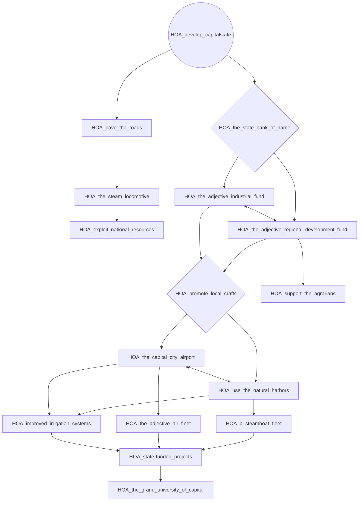
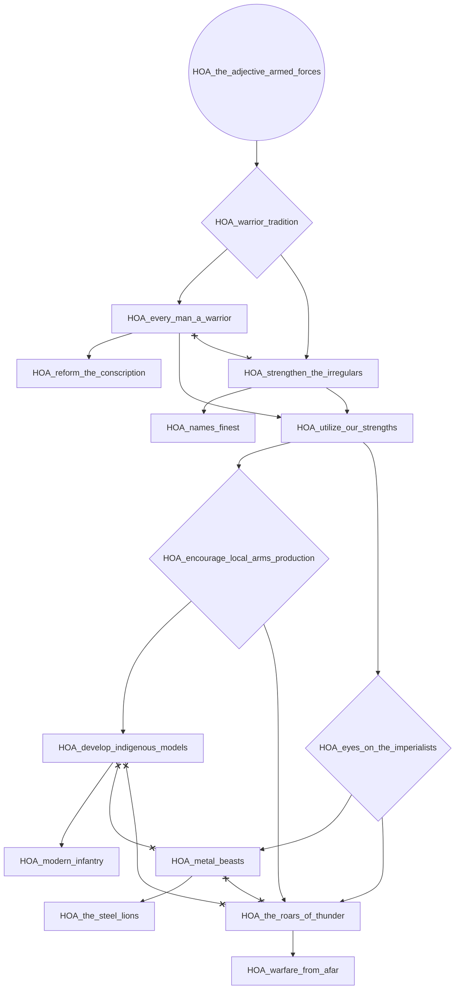
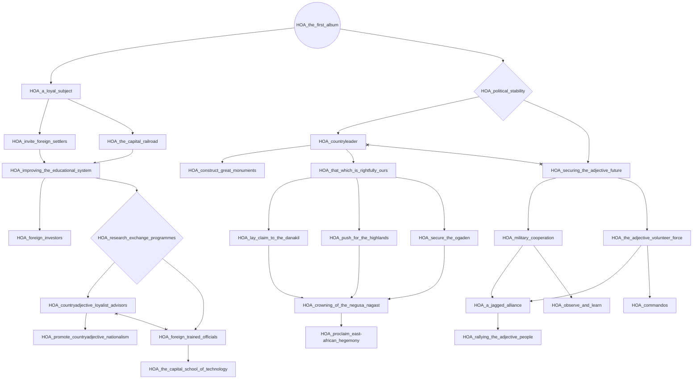

# HOA_develop_capitalstate

```mermaid
flowchart TD
    n1["HOA_a_steamboat_fleet"]
    n2(("HOA_develop_capitalstate"))
    n3["HOA_exploit_national_resources"]
    n4["HOA_improved_irrigation_systems"]
    n5["HOA_pave_the_roads"]
    n6{"HOA_promote_local_crafts"}
    n7["HOA_state-funded_projects"]
    n8["HOA_support_the_agrarians"]
    n9["HOA_the_adjective_air_fleet"]
    n10["HOA_the_adjective_industrial_fund"]
    n11["HOA_the_adjective_regional_development_fund"]
    n12["HOA_the_capital_city_airport"]
    n13["HOA_the_grand_university_of_capital"]
    n14{"HOA_the_state_bank_of_name"}
    n15["HOA_the_steam_locomotive"]
    n16["HOA_use_the_natural_harbors"]
    n16 --> n1
    n15 --> n3
    n16 --> n4
    n12 --> n4
    n2 --> n5
    n11 --> n6
    n10 --> n6
    n1 --> n7
    n9 --> n7
    n4 --> n7
    n11 --> n8
    n12 --> n9
    n14 --> n10
    n14 --> n11
    n6 --> n12
    n7 --> n13
    n2 --> n14
    n5 --> n15
    n6 --> n16
    n10 x--x n11
    n12 x--x n16
```

# HOA_the_adjective_armed_forces

```mermaid
flowchart TD
    n17["HOA_develop_indigenous_models"]
    n18{"HOA_encourage_local_arms_production"}
    n19["HOA_every_man_a_warrior"]
    n20{"HOA_eyes_on_the_imperialists"}
    n21["HOA_metal_beasts"]
    n22["HOA_modern_infantry"]
    n23["HOA_names_finest"]
    n24["HOA_reform_the_conscription"]
    n25["HOA_strengthen_the_irregulars"]
    n26(("HOA_the_adjective_armed_forces"))
    n27["HOA_the_roars_of_thunder"]
    n28["HOA_the_steel_lions"]
    n29["HOA_utilize_our_strengths"]
    n30["HOA_warfare_from_afar"]
    n31{"HOA_warrior_tradition"}
    n18 --> n17
    n29 --> n18
    n31 --> n19
    n29 --> n20
    n20 --> n21
    n17 --> n22
    n25 --> n23
    n19 --> n24
    n31 --> n25
    n20 --> n27
    n18 --> n27
    n21 --> n28
    n25 --> n29
    n19 --> n29
    n27 --> n30
    n26 --> n31
    n17 x--x n21
    n17 x--x n27
    n19 x--x n25
    n21 x--x n27
```

# HOA_the_first_album

```mermaid
flowchart TD
    n32["HOA_a_jagged_alliance"]
    n33["HOA_a_loyal_subject"]
    n34["HOA_commandos"]
    n35["HOA_construct_great_monuments"]
    n36["HOA_countryadjective_loyalist_advisors"]
    n37["HOA_countryleader"]
    n38["HOA_crowning_of_the_negusa_nagast"]
    n39["HOA_foreign_investors"]
    n40["HOA_foreign_trained_officials"]
    n41["HOA_improving_the_educational_system"]
    n42["HOA_invite_foreign_settlers"]
    n43["HOA_lay_claim_to_the_danakil"]
    n44["HOA_military_cooperation"]
    n45["HOA_observe_and_learn"]
    n46{"HOA_political_stability"}
    n47["HOA_proclaim_east-african_hegemony"]
    n48["HOA_promote_countryadjective_nationalism"]
    n49["HOA_push_for_the_highlands"]
    n50["HOA_rallying_the_adjective_people"]
    n51{"HOA_research_exchange_programmes"}
    n52["HOA_secure_the_ogaden"]
    n53["HOA_securing_the_adjective_future"]
    n54["HOA_that_which_is_rightfully_ours"]
    n55["HOA_the_adjective_volunteer_force"]
    n56["HOA_the_capital_railroad"]
    n57["HOA_the_capital_school_of_technology"]
    n58(("HOA_the_first_album"))
    n55 --> n32
    n44 --> n32
    n58 --> n33
    n55 --> n34
    n37 --> n35
    n51 --> n36
    n46 --> n37
    n49 --> n38
    n52 --> n38
    n43 --> n38
    n41 --> n39
    n51 --> n40
    n56 --> n41
    n42 --> n41
    n33 --> n42
    n54 --> n43
    n53 --> n44
    n44 --> n45
    n58 --> n46
    n38 --> n47
    n36 --> n48
    n54 --> n49
    n32 --> n50
    n41 --> n51
    n54 --> n52
    n46 --> n53
    n37 --> n54
    n53 --> n55
    n33 --> n56
    n40 --> n57
    n36 x--x n40
    n37 x--x n53
```
