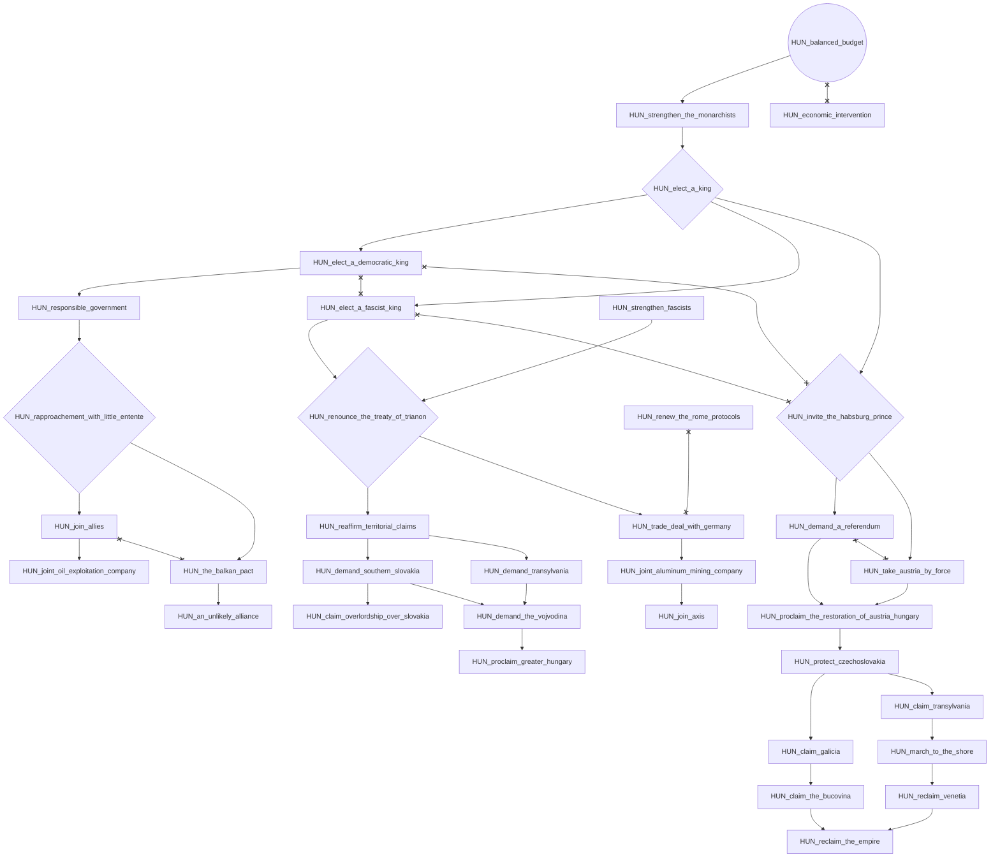
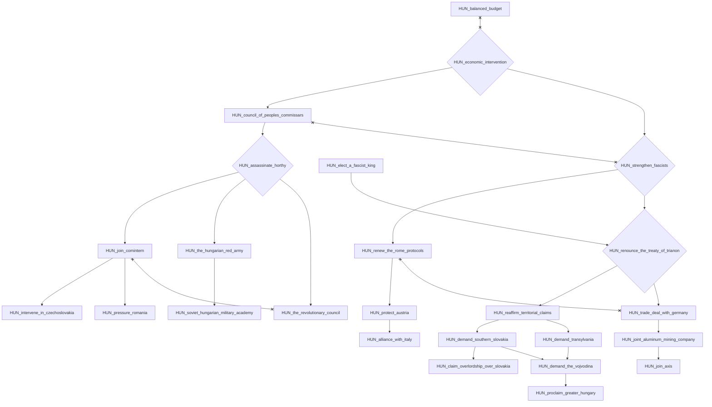
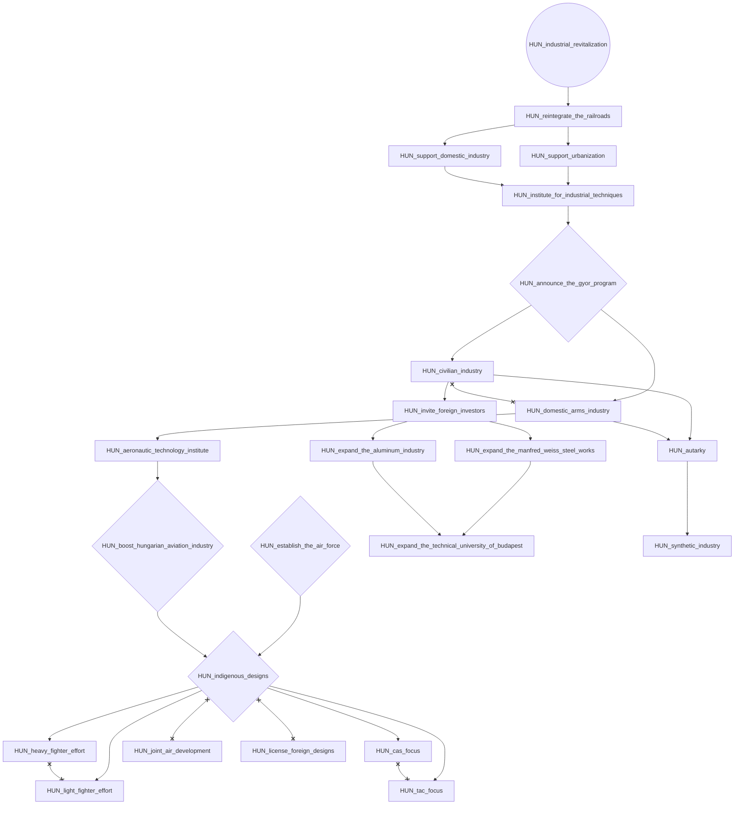
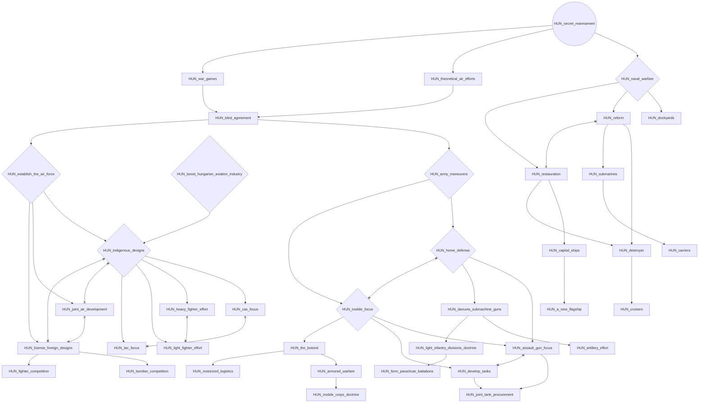

# HUN_balanced_budget

```mermaid
flowchart TD
    n1["HUN_an_unlikely_alliance"]
    n2(("HUN_balanced_budget"))
    n3["HUN_claim_galicia"]
    n4["HUN_claim_overlordship_over_slovakia"]
    n5["HUN_claim_the_bucovina"]
    n6["HUN_claim_transylvania"]
    n7["HUN_demand_a_referendum"]
    n8["HUN_demand_southern_slovakia"]
    n9["HUN_demand_the_vojvodina"]
    n10["HUN_demand_transylvania"]
    n11["HUN_economic_intervention"]
    n12["HUN_elect_a_democratic_king"]
    n13["HUN_elect_a_fascist_king"]
    n14{"HUN_elect_a_king"}
    n15{"HUN_invite_the_habsburg_prince"}
    n16["HUN_join_allies"]
    n17["HUN_join_axis"]
    n18["HUN_joint_aluminum_mining_company"]
    n19["HUN_joint_oil_exploitation_company"]
    n20["HUN_march_to_the_shore"]
    n21["HUN_proclaim_greater_hungary"]
    n22["HUN_proclaim_the_restoration_of_austria_hungary"]
    n23["HUN_protect_czechoslovakia"]
    n24{"HUN_rapproachement_with_little_entente"}
    n25["HUN_reaffirm_territorial_claims"]
    n26["HUN_reclaim_the_empire"]
    n27["HUN_reclaim_venetia"]
    n28["HUN_renew_the_rome_protocols"]
    n29{"HUN_renounce_the_treaty_of_trianon"}
    n30["HUN_responsible_government"]
    n31["HUN_strengthen_fascists"]
    n32["HUN_strengthen_the_monarchists"]
    n33["HUN_take_austria_by_force"]
    n34["HUN_the_balkan_pact"]
    n35["HUN_trade_deal_with_germany"]
    n34 --> n1
    n23 --> n3
    n8 --> n4
    n3 --> n5
    n23 --> n6
    n15 --> n7
    n25 --> n8
    n10 --> n9
    n8 --> n9
    n25 --> n10
    n14 --> n12
    n14 --> n13
    n32 --> n14
    n14 --> n15
    n24 --> n16
    n18 --> n17
    n35 --> n18
    n16 --> n19
    n6 --> n20
    n9 --> n21
    n7 --> n22
    n33 --> n22
    n22 --> n23
    n30 --> n24
    n29 --> n25
    n27 --> n26
    n5 --> n26
    n20 --> n27
    n31 --> n29
    n13 --> n29
    n12 --> n30
    n2 --> n32
    n15 --> n33
    n24 --> n34
    n29 --> n35
    n2 x--x n11
    n7 x--x n33
    n12 x--x n13
    n12 x--x n15
    n13 x--x n15
    n16 x--x n34
    n28 x--x n35
```

# HUN_economic_intervention

```mermaid
flowchart TD
    n36["HUN_alliance_with_italy"]
    n37{"HUN_assassinate_horthy"}
    n2["HUN_balanced_budget"]
    n4["HUN_claim_overlordship_over_slovakia"]
    n38["HUN_council_of_peoples_commissars"]
    n8["HUN_demand_southern_slovakia"]
    n9["HUN_demand_the_vojvodina"]
    n10["HUN_demand_transylvania"]
    n11{"HUN_economic_intervention"}
    n13["HUN_elect_a_fascist_king"]
    n39["HUN_intervene_in_czechoslovakia"]
    n17["HUN_join_axis"]
    n40["HUN_join_comintern"]
    n18["HUN_joint_aluminum_mining_company"]
    n41["HUN_pressure_romania"]
    n21["HUN_proclaim_greater_hungary"]
    n42["HUN_protect_austria"]
    n25["HUN_reaffirm_territorial_claims"]
    n28["HUN_renew_the_rome_protocols"]
    n29{"HUN_renounce_the_treaty_of_trianon"}
    n43["HUN_soviet_hungarian_military_academy"]
    n31{"HUN_strengthen_fascists"}
    n44["HUN_the_hungarian_red_army"]
    n45["HUN_the_revolutionary_council"]
    n35["HUN_trade_deal_with_germany"]
    n42 --> n36
    n38 --> n37
    n8 --> n4
    n11 --> n38
    n25 --> n8
    n10 --> n9
    n8 --> n9
    n25 --> n10
    n40 --> n39
    n18 --> n17
    n37 --> n40
    n35 --> n18
    n40 --> n41
    n9 --> n21
    n28 --> n42
    n29 --> n25
    n31 --> n28
    n31 --> n29
    n13 --> n29
    n44 --> n43
    n11 --> n31
    n37 --> n44
    n37 --> n45
    n29 --> n35
    n2 x--x n11
    n38 x--x n31
    n40 x--x n45
    n28 x--x n35
```

# HUN_industrial_revitalization

```mermaid
flowchart TD
    n46["HUN_aeronautic_technology_institute"]
    n47{"HUN_announce_the_gyor_program"}
    n48["HUN_autarky"]
    n49{"HUN_boost_hungarian_aviation_industry"}
    n50["HUN_cas_focus"]
    n51["HUN_civilian_industry"]
    n52["HUN_domestic_arms_industry"]
    n53{"HUN_establish_the_air_force"}
    n54["HUN_expand_the_aluminum_industry"]
    n55["HUN_expand_the_manfred_weiss_steel_works"]
    n56["HUN_expand_the_technical_university_of_budapest"]
    n57["HUN_heavy_fighter_effort"]
    n58{"HUN_indigenous_designs"}
    n59(("HUN_industrial_revitalization"))
    n60["HUN_institute_for_industrial_techniques"]
    n61["HUN_invite_foreign_investors"]
    n62["HUN_joint_air_development"]
    n63["HUN_license_foreign_designs"]
    n64["HUN_light_fighter_effort"]
    n65["HUN_reintegrate_the_railroads"]
    n66["HUN_support_domestic_industry"]
    n67["HUN_support_urbanization"]
    n68["HUN_synthetic_industry"]
    n69["HUN_tac_focus"]
    n52 --> n46
    n60 --> n47
    n51 --> n48
    n52 --> n48
    n46 --> n49
    n58 --> n50
    n47 --> n51
    n47 --> n52
    n61 --> n54
    n61 --> n55
    n55 --> n56
    n54 --> n56
    n58 --> n57
    n53 --> n58
    n49 --> n58
    n67 --> n60
    n66 --> n60
    n51 --> n61
    n58 --> n64
    n59 --> n65
    n65 --> n66
    n65 --> n67
    n48 --> n68
    n58 --> n69
    n50 x--x n69
    n51 x--x n52
    n57 x--x n64
    n58 x--x n62
    n58 x--x n63
```

# HUN_secret_rearmament

```mermaid
flowchart TD
    n70["HUN_a_new_flagship"]
    n71["HUN_armored_warfare"]
    n72{"HUN_army_maneuvers"}
    n73["HUN_artillery_effort"]
    n74["HUN_assault_gun_focus"]
    n75["HUN_bled_agreement"]
    n76["HUN_bomber_competition"]
    n49{"HUN_boost_hungarian_aviation_industry"}
    n77["HUN_capital_ships"]
    n78["HUN_carriers"]
    n50["HUN_cas_focus"]
    n79["HUN_cruisers"]
    n80["HUN_danuvia_submachine_guns"]
    n81["HUN_destroyer"]
    n82["HUN_develop_tanks"]
    n83["HUN_dockyards"]
    n53{"HUN_establish_the_air_force"}
    n84["HUN_fighter_competition"]
    n85["HUN_form_parachute_battalions"]
    n57["HUN_heavy_fighter_effort"]
    n86{"HUN_home_defense"}
    n58{"HUN_indigenous_designs"}
    n62["HUN_joint_air_development"]
    n87["HUN_joint_tank_procurement"]
    n63["HUN_license_foreign_designs"]
    n64["HUN_light_fighter_effort"]
    n88["HUN_light_infantry_divisions_doctrine"]
    n89["HUN_mobile_corps_doctrine"]
    n90{"HUN_mobile_focus"}
    n91["HUN_motorized_logistics"]
    n92{"HUN_naval_warfare"}
    n93["HUN_reform"]
    n94["HUN_restauration"]
    n95(("HUN_secret_rearmament"))
    n96["HUN_submarines"]
    n69["HUN_tac_focus"]
    n97["HUN_the_botond"]
    n98["HUN_theoretical_air_efforts"]
    n99["HUN_war_games"]
    n77 --> n70
    n97 --> n71
    n75 --> n72
    n80 --> n73
    n90 --> n74
    n86 --> n74
    n99 --> n75
    n98 --> n75
    n63 --> n76
    n94 --> n77
    n96 --> n78
    n58 --> n50
    n81 --> n79
    n86 --> n80
    n94 --> n81
    n93 --> n81
    n90 --> n82
    n92 --> n83
    n75 --> n53
    n63 --> n84
    n88 --> n85
    n58 --> n57
    n72 --> n86
    n53 --> n58
    n49 --> n58
    n53 --> n62
    n82 --> n87
    n74 --> n87
    n53 --> n63
    n58 --> n64
    n80 --> n88
    n71 --> n89
    n72 --> n90
    n97 --> n91
    n95 --> n92
    n92 --> n93
    n92 --> n94
    n93 --> n96
    n58 --> n69
    n90 --> n97
    n95 --> n98
    n95 --> n99
    n74 x--x n82
    n50 x--x n69
    n57 x--x n64
    n86 x--x n90
    n58 x--x n62
    n58 x--x n63
    n62 x--x n63
    n93 x--x n94
```
