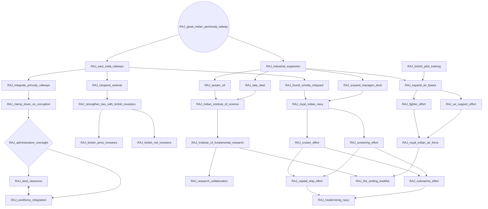
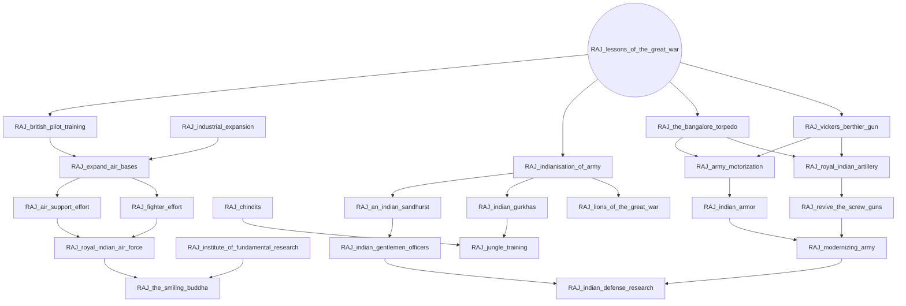
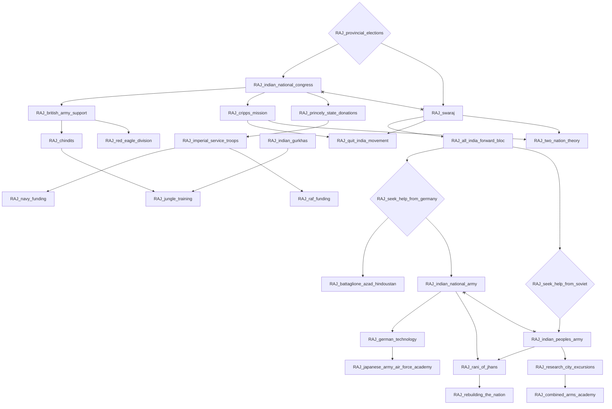

# RAJ_great_indian_peninsula_railway

```mermaid
flowchart TD
    n1{"RAJ_administrative_oversight"}
    n2["RAJ_air_support_effort"]
    n3["RAJ_assam_oil"]
    n4["RAJ_british_arms_investors"]
    n5["RAJ_british_pilot_training"]
    n6["RAJ_british_rail_investors"]
    n7["RAJ_capital_ship_effort"]
    n8["RAJ_clamp_down_on_corruption"]
    n9["RAJ_cruiser_effort"]
    n10["RAJ_east_india_railways"]
    n11["RAJ_expand_air_bases"]
    n12["RAJ_expand_mazagon_dock"]
    n13["RAJ_fighter_effort"]
    n14["RAJ_found_scindia_shipyard"]
    n15(("RAJ_great_indian_peninsula_railway"))
    n16["RAJ_indian_institute_of_science"]
    n17["RAJ_industrial_expansion"]
    n18["RAJ_institute_of_fundamental_research"]
    n19["RAJ_integrate_princely_railways"]
    n20["RAJ_ishapore_arsenal"]
    n21["RAJ_land_clearance"]
    n22["RAJ_modernizing_navy"]
    n23["RAJ_research_collaboration"]
    n24["RAJ_royal_indian_air_force"]
    n25["RAJ_royal_indian_navy"]
    n26["RAJ_screening_effort"]
    n27["RAJ_strengthen_ties_with_british_investors"]
    n28["RAJ_submarine_effort"]
    n29["RAJ_tata_steel"]
    n30["RAJ_the_smiling_buddha"]
    n31["RAJ_workforce_integration"]
    n8 --> n1
    n11 --> n2
    n17 --> n3
    n27 --> n4
    n27 --> n6
    n26 --> n7
    n9 --> n7
    n19 --> n8
    n25 --> n9
    n15 --> n10
    n5 --> n11
    n17 --> n11
    n17 --> n12
    n11 --> n13
    n10 --> n14
    n29 --> n16
    n3 --> n16
    n15 --> n17
    n16 --> n18
    n10 --> n19
    n10 --> n20
    n1 --> n21
    n28 --> n22
    n7 --> n22
    n18 --> n23
    n2 --> n24
    n13 --> n24
    n12 --> n25
    n14 --> n25
    n25 --> n26
    n20 --> n27
    n26 --> n28
    n9 --> n28
    n17 --> n29
    n24 --> n30
    n18 --> n30
    n1 --> n31
    n21 x--x n31
```

# RAJ_lessons_of_the_great_war

```mermaid
flowchart TD
    n2["RAJ_air_support_effort"]
    n32["RAJ_an_indian_sandhurst"]
    n33["RAJ_army_motorization"]
    n5["RAJ_british_pilot_training"]
    n34["RAJ_chindits"]
    n11["RAJ_expand_air_bases"]
    n13["RAJ_fighter_effort"]
    n35["RAJ_indian_armor"]
    n36["RAJ_indian_defense_research"]
    n37["RAJ_indian_gentlemen_officers"]
    n38["RAJ_indian_gurkhas"]
    n39["RAJ_indianisation_of_army"]
    n17["RAJ_industrial_expansion"]
    n18["RAJ_institute_of_fundamental_research"]
    n40["RAJ_jungle_training"]
    n41(("RAJ_lessons_of_the_great_war"))
    n42["RAJ_lions_of_the_great_war"]
    n43["RAJ_modernizing_army"]
    n44["RAJ_revive_the_screw_guns"]
    n24["RAJ_royal_indian_air_force"]
    n45["RAJ_royal_indian_artillery"]
    n46["RAJ_the_bangalore_torpedo"]
    n30["RAJ_the_smiling_buddha"]
    n47["RAJ_vickers_berthier_gun"]
    n11 --> n2
    n39 --> n32
    n46 --> n33
    n47 --> n33
    n41 --> n5
    n5 --> n11
    n17 --> n11
    n11 --> n13
    n33 --> n35
    n43 --> n36
    n37 --> n36
    n32 --> n37
    n39 --> n38
    n41 --> n39
    n34 --> n40
    n38 --> n40
    n39 --> n42
    n44 --> n43
    n35 --> n43
    n45 --> n44
    n2 --> n24
    n13 --> n24
    n46 --> n45
    n47 --> n45
    n41 --> n46
    n24 --> n30
    n18 --> n30
    n41 --> n47
```

# RAJ_provincial_elections

```mermaid
flowchart TD
    n48["RAJ_all_india_forward_bloc"]
    n49["RAJ_battaglione_azad_hindoustan"]
    n50["RAJ_british_army_support"]
    n34["RAJ_chindits"]
    n51["RAJ_combined_arms_academy"]
    n52["RAJ_cripps_mission"]
    n53["RAJ_german_technology"]
    n54["RAJ_imperial_service_troops"]
    n38["RAJ_indian_gurkhas"]
    n55["RAJ_indian_national_army"]
    n56["RAJ_indian_national_congress"]
    n57["RAJ_indian_peoples_army"]
    n58["RAJ_japanese_army_air_force_academy"]
    n40["RAJ_jungle_training"]
    n59["RAJ_navy_funding"]
    n60["RAJ_princely_state_donations"]
    n61{"RAJ_provincial_elections"}
    n62["RAJ_quit_india_movement"]
    n63["RAJ_raf_funding"]
    n64["RAJ_rani_of_jhans"]
    n65["RAJ_rebuilding_the_nation"]
    n66["RAJ_red_eagle_division"]
    n67["RAJ_research_city_excursions"]
    n68{"RAJ_seek_help_from_germany"}
    n69{"RAJ_seek_help_from_soviet"}
    n70["RAJ_swaraj"]
    n71["RAJ_two_nation_theory"]
    n70 --> n48
    n68 --> n49
    n56 --> n50
    n50 --> n34
    n67 --> n51
    n56 --> n52
    n55 --> n53
    n60 --> n54
    n68 --> n55
    n61 --> n56
    n69 --> n57
    n53 --> n58
    n34 --> n40
    n38 --> n40
    n54 --> n59
    n56 --> n60
    n70 --> n62
    n52 --> n62
    n54 --> n63
    n57 --> n64
    n55 --> n64
    n64 --> n65
    n50 --> n66
    n57 --> n67
    n48 --> n68
    n48 --> n69
    n61 --> n70
    n52 --> n71
    n70 --> n71
    n55 x--x n57
    n56 x--x n70
```
