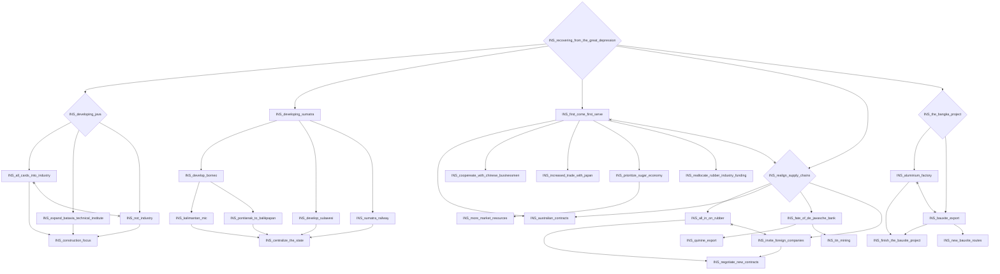
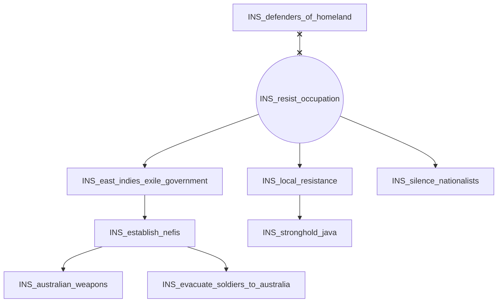
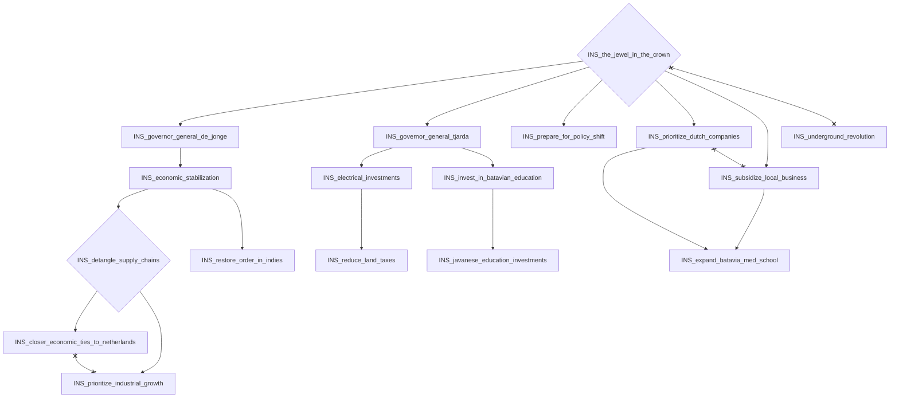

# INS_defenders_of_homeland

```mermaid
flowchart TD
    n1["INS_a_cheap_navy"]
    n2["INS_abolish_national_committee"]
    n3["INS_acquire_modern_blueprints"]
    n4["INS_admiral_mas_pardi"]
    n5["INS_agrarian_reform"]
    n6["INS_akademi_angkatan_laut"]
    n7["INS_all_toward_the_war_effort"]
    n8["INS_arm_the_revolutionaries"]
    n9["INS_arm_the_students"]
    n10["INS_arm_the_youth"]
    n11["INS_assist_the_pemuda"]
    n12{"INS_centralization"}
    n13["INS_commander_oerip"]
    n14["INS_commander_sudirman"]
    n15["INS_concessions_to_communists"]
    n16["INS_continue_hybrid_politics"]
    n17["INS_darul_islam_focus"]
    n18{"INS_defenders_of_homeland"}
    n19["INS_demand_northern_malay"]
    n20["INS_deploy_the_kris"]
    n21["INS_destroy_pacific_colonialism"]
    n22["INS_develop_a_functioning_airforce"]
    n23["INS_dissolve_national_party"]
    n24["INS_divert_army_funds_to_navy"]
    n25["INS_divert_javanese_education_funding_the_east"]
    n26["INS_domestic_shipbuilding"]
    n27["INS_dominion_of_atjeh"]
    n28["INS_eastern_universities"]
    n29["INS_education_subsidies"]
    n30["INS_embrace_co_prosp_sphere"]
    n31["INS_expanding_the_union"]
    n32{"INS_fair_election"}
    n33["INS_federation_of_aslia"]
    n34["INS_guerilla_industry"]
    n35{"INS_guided_democracy"}
    n36["INS_guided_economy"]
    n37["INS_hatta_focus_2"]
    n38["INS_hatta_princely_advisors"]
    n39["INS_increase_laskar_funding"]
    n40{"INS_indonesian_assault_doctrine"}
    n41["INS_indonesian_inter_province_trade_agreement"]
    n42["INS_indonesian_naval_doctrine"]
    n43["INS_integrate_sarekat_islam"]
    n44["INS_japanese_army_training"]
    n45["INS_japanese_resource_infrastructure"]
    n46{"INS_just_a_fisherman"}
    n47["INS_land_reform"]
    n48["INS_laskar_rakjat"]
    n49["INS_local_autonomy"]
    n50["INS_local_cooperatives"]
    n51["INS_local_unity"]
    n52["INS_minimum_program"]
    n53["INS_mixed_economy_system"]
    n54{"INS_musso_ascends"}
    n55["INS_nationalize"]
    n56["INS_organize_jakarta_pemuda"]
    n57{"INS_pacific_revolution"}
    n58["INS_pan_asian_union"]
    n59["INS_pan_economic_area"]
    n60["INS_pancasila_achieved"]
    n61["INS_pledge_to_allies"]
    n62{"INS_political_stabilization"}
    n63["INS_prime_minister_hatta"]
    n64["INS_prime_minister_sjarifuddin"]
    n65["INS_purge_oppurtunists"]
    n66["INS_quality_over_quantity"]
    n67["INS_railway_youth_force"]
    n68["INS_rapid_mobilization"]
    n69["INS_realign_export_markets"]
    n70["INS_recognize_moestopos_batallion"]
    n71["INS_reform_education_system"]
    n72["INS_reform_education_system_2"]
    n73["INS_resist_occupation"]
    n74["INS_restore_order"]
    n75["INS_revolutionary_economic_cooperation"]
    n76["INS_secularism"]
    n77["INS_seek_recognition_of_mal_claims"]
    n78["INS_seize_oppurtunity"]
    n79["INS_siam_agreement"]
    n80["INS_sjahrirs_continued_tenure"]
    n81["INS_sjarifuddin_focus_2"]
    n82["INS_social_democracy"]
    n83["INS_soviet_aid"]
    n84["INS_strengthen_ins_jap_trade"]
    n85{"INS_subsidize_laskar_armament"}
    n86["INS_sudirmans_promotion"]
    n87["INS_support_tan_malakas_coup"]
    n88["INS_the_co_prosperity_sphere"]
    n89["INS_the_declaration_of_independence"]
    n90["INS_the_maphilindo_speech"]
    n91{"INS_the_peoples_security_army"}
    n92["INS_the_three_year_plan"]
    n93["INS_the_timor_issue"]
    n94["INS_three_year_plan"]
    n95["INS_tighter_tkr_integration"]
    n96["INS_underground_revolution"]
    n97["INS_union_of_ins_states"]
    n98["INS_united_against_japan"]
    n99["INS_unity_in_diversity"]
    n100["INS_utilize_comintern_connections"]
    n101["INS_utilize_tan_malakas_militia"]
    n102{"INS_vice_presidential_edict"}
    n103["INS_women_in_military"]
    n104["INS_womens_sufferage"]
    n46 --> n1
    n12 --> n2
    n42 --> n3
    n1 --> n4
    n24 --> n4
    n87 --> n5
    n4 --> n6
    n68 --> n7
    n84 --> n7
    n14 --> n8
    n10 --> n9
    n8 --> n10
    n48 --> n11
    n35 --> n12
    n91 --> n13
    n91 --> n14
    n64 --> n15
    n102 --> n16
    n48 --> n17
    n77 --> n19
    n48 --> n20
    n60 --> n21
    n85 --> n22
    n102 --> n23
    n46 --> n24
    n92 --> n25
    n42 --> n26
    n47 --> n27
    n25 --> n28
    n51 --> n29
    n23 --> n29
    n18 --> n30
    n41 --> n31
    n23 --> n32
    n90 --> n33
    n58 --> n33
    n14 --> n34
    n13 --> n34
    n62 --> n35
    n2 --> n36
    n16 --> n36
    n63 --> n37
    n37 --> n38
    n85 --> n39
    n13 --> n40
    n97 --> n41
    n24 --> n42
    n62 --> n43
    n45 --> n44
    n18 --> n45
    n89 --> n46
    n50 --> n47
    n89 --> n48
    n35 --> n49
    n102 --> n50
    n102 --> n51
    n65 --> n52
    n80 --> n53
    n57 --> n54
    n62 --> n55
    n11 --> n56
    n87 --> n57
    n65 --> n58
    n58 --> n59
    n2 --> n60
    n80 --> n61
    n63 --> n61
    n89 --> n62
    n32 --> n63
    n32 --> n64
    n57 --> n65
    n40 --> n66
    n11 --> n67
    n2 --> n68
    n88 --> n68
    n92 --> n69
    n48 --> n70
    n36 --> n71
    n71 --> n72
    n62 --> n74
    n100 --> n75
    n98 --> n75
    n62 --> n76
    n84 --> n77
    n18 --> n78
    n19 --> n79
    n32 --> n80
    n64 --> n81
    n53 --> n82
    n87 --> n83
    n88 --> n84
    n48 --> n85
    n14 --> n86
    n62 --> n87
    n12 --> n88
    n96 --> n89
    n78 --> n89
    n65 --> n90
    n89 --> n91
    n5 --> n92
    n80 --> n93
    n64 --> n93
    n71 --> n94
    n63 --> n94
    n40 --> n95
    n49 --> n97
    n54 --> n98
    n62 --> n99
    n54 --> n100
    n48 --> n101
    n62 --> n102
    n104 --> n103
    n23 --> n104
    n16 --> n104
    n1 x--x n24
    n2 x--x n88
    n12 x--x n49
    n13 x--x n14
    n16 x--x n23
    n18 x--x n73
    n22 x--x n39
    n30 x--x n78
    n35 x--x n87
    n35 x--x n102
    n43 x--x n76
    n54 x--x n65
    n63 x--x n64
    n63 x--x n80
    n64 x--x n80
    n66 x--x n95
    n87 x--x n102
    n98 x--x n100
```

# INS_recovering_from_the_great_depression

```mermaid
flowchart TD
    n105["INS_all_cards_into_industry"]
    n106["INS_all_in_on_rubber"]
    n107["INS_aluminium_factory"]
    n108["INS_australian_contracts"]
    n109["INS_bauxite_export"]
    n110["INS_centralize_the_state"]
    n111["INS_construction_focus"]
    n112["INS_coopereate_with_chinese_businessmen"]
    n113["INS_develop_borneo"]
    n114["INS_develop_sulawesi"]
    n115{"INS_developing_java"}
    n116["INS_developing_sumatra"]
    n117["INS_expand_batavia_technical_institute"]
    n118["INS_fate_of_de_javasche_bank"]
    n119["INS_finish_the_bauxite_project"]
    n120["INS_first_come_first_serve"]
    n121["INS_increased_trade_with_japan"]
    n122["INS_invite_foreign_companies"]
    n123["INS_kalimantan_mic"]
    n124["INS_more_market_resources"]
    n125["INS_negotiate_new_contracts"]
    n126["INS_new_bauxite_routes"]
    n127["INS_not_industry"]
    n128["INS_pontianak_to_balikpapan"]
    n129["INS_prioritize_sugar_economy"]
    n130["INS_quinine_export"]
    n131{"INS_realign_supply_chains"}
    n132["INS_reallocate_rubber_industry_funding"]
    n133{"INS_recovering_from_the_great_depression"}
    n134["INS_sumatra_railway"]
    n135{"INS_the_bangka_project"}
    n136["INS_tin_mining"]
    n115 --> n105
    n131 --> n106
    n135 --> n107
    n131 --> n108
    n120 --> n108
    n135 --> n109
    n134 --> n110
    n114 --> n110
    n128 --> n110
    n123 --> n110
    n117 --> n111
    n105 --> n111
    n127 --> n111
    n120 --> n112
    n116 --> n113
    n116 --> n114
    n133 --> n115
    n133 --> n116
    n115 --> n117
    n131 --> n118
    n109 --> n119
    n107 --> n119
    n133 --> n120
    n120 --> n121
    n131 --> n122
    n113 --> n123
    n129 --> n124
    n122 --> n125
    n106 --> n125
    n109 --> n126
    n115 --> n127
    n113 --> n128
    n120 --> n129
    n118 --> n130
    n133 --> n131
    n120 --> n132
    n116 --> n134
    n133 --> n135
    n118 --> n136
    n105 x--x n127
    n106 x--x n122
    n107 x--x n109
    n120 x--x n131
```

# INS_resist_occupation

```mermaid
flowchart TD
    n137["INS_australian_weapons"]
    n18["INS_defenders_of_homeland"]
    n138["INS_east_indies_exile_government"]
    n139["INS_establish_nefis"]
    n140["INS_evacuate_soldiers_to_australia"]
    n141["INS_local_resistance"]
    n73(("INS_resist_occupation"))
    n142["INS_silence_nationalists"]
    n143["INS_stronghold_java"]
    n139 --> n137
    n73 --> n138
    n138 --> n139
    n139 --> n140
    n73 --> n141
    n73 --> n142
    n141 --> n143
    n18 x--x n73
```

# INS_the_jewel_in_the_crown

```mermaid
flowchart TD
    n144["INS_closer_economic_ties_to_netherlands"]
    n145{"INS_detangle_supply_chains"}
    n146["INS_economic_stabilization"]
    n147["INS_electrical_investments"]
    n148["INS_expand_batavia_med_school"]
    n149["INS_governor_general_de_jonge"]
    n150["INS_governor_general_tjarda"]
    n151["INS_invest_in_batavian_education"]
    n152["INS_javanese_education_investments"]
    n153["INS_prepare_for_policy_shift"]
    n154["INS_prioritize_dutch_companies"]
    n155["INS_prioritize_industrial_growth"]
    n156["INS_reduce_land_taxes"]
    n157["INS_restore_order_in_indies"]
    n158["INS_subsidize_local_business"]
    n159{"INS_the_jewel_in_the_crown"}
    n96["INS_underground_revolution"]
    n145 --> n144
    n146 --> n145
    n149 --> n146
    n150 --> n147
    n158 --> n148
    n154 --> n148
    n159 --> n149
    n159 --> n150
    n150 --> n151
    n151 --> n152
    n159 --> n153
    n159 --> n154
    n145 --> n155
    n147 --> n156
    n146 --> n157
    n159 --> n158
    n144 x--x n155
    n154 x--x n158
    n159 x--x n96
```

# INS_underground_revolution

```mermaid
flowchart TD
    n1["INS_a_cheap_navy"]
    n2["INS_abolish_national_committee"]
    n3["INS_acquire_modern_blueprints"]
    n4["INS_admiral_mas_pardi"]
    n5["INS_agrarian_reform"]
    n6["INS_akademi_angkatan_laut"]
    n7["INS_all_toward_the_war_effort"]
    n8["INS_arm_the_revolutionaries"]
    n9["INS_arm_the_students"]
    n10["INS_arm_the_youth"]
    n11["INS_assist_the_pemuda"]
    n12{"INS_centralization"}
    n13["INS_commander_oerip"]
    n14["INS_commander_sudirman"]
    n15["INS_concessions_to_communists"]
    n16["INS_continue_hybrid_politics"]
    n17["INS_darul_islam_focus"]
    n19["INS_demand_northern_malay"]
    n20["INS_deploy_the_kris"]
    n21["INS_destroy_pacific_colonialism"]
    n22["INS_develop_a_functioning_airforce"]
    n23["INS_dissolve_national_party"]
    n24["INS_divert_army_funds_to_navy"]
    n25["INS_divert_javanese_education_funding_the_east"]
    n26["INS_domestic_shipbuilding"]
    n27["INS_dominion_of_atjeh"]
    n28["INS_eastern_universities"]
    n29["INS_education_subsidies"]
    n31["INS_expanding_the_union"]
    n32{"INS_fair_election"}
    n33["INS_federation_of_aslia"]
    n34["INS_guerilla_industry"]
    n35{"INS_guided_democracy"}
    n36["INS_guided_economy"]
    n37["INS_hatta_focus_2"]
    n38["INS_hatta_princely_advisors"]
    n39["INS_increase_laskar_funding"]
    n40{"INS_indonesian_assault_doctrine"}
    n41["INS_indonesian_inter_province_trade_agreement"]
    n42["INS_indonesian_naval_doctrine"]
    n160["INS_infiltrate_the_army"]
    n161["INS_instigate_chaos_medan"]
    n162["INS_instigate_chaos_sulawesi"]
    n43["INS_integrate_sarekat_islam"]
    n46{"INS_just_a_fisherman"}
    n47["INS_land_reform"]
    n48["INS_laskar_rakjat"]
    n49["INS_local_autonomy"]
    n50["INS_local_cooperatives"]
    n51["INS_local_unity"]
    n52["INS_minimum_program"]
    n53["INS_mixed_economy_system"]
    n54{"INS_musso_ascends"}
    n55["INS_nationalize"]
    n56["INS_organize_jakarta_pemuda"]
    n57{"INS_pacific_revolution"}
    n58["INS_pan_asian_union"]
    n59["INS_pan_economic_area"]
    n60["INS_pancasila_achieved"]
    n61["INS_pledge_to_allies"]
    n62{"INS_political_stabilization"}
    n163["INS_prepare_raiding_bases"]
    n63["INS_prime_minister_hatta"]
    n64["INS_prime_minister_sjarifuddin"]
    n164["INS_privately_owned_military_industry"]
    n65["INS_purge_oppurtunists"]
    n66["INS_quality_over_quantity"]
    n67["INS_railway_youth_force"]
    n68["INS_rapid_mobilization"]
    n69["INS_realign_export_markets"]
    n70["INS_recognize_moestopos_batallion"]
    n71["INS_reform_education_system"]
    n72["INS_reform_education_system_2"]
    n74["INS_restore_order"]
    n75["INS_revolutionary_economic_cooperation"]
    n76["INS_secularism"]
    n77["INS_seek_recognition_of_mal_claims"]
    n78["INS_seize_oppurtunity"]
    n79["INS_siam_agreement"]
    n80["INS_sjahrirs_continued_tenure"]
    n81["INS_sjarifuddin_focus_2"]
    n165["INS_sleeper_informant_network"]
    n82["INS_social_democracy"]
    n83["INS_soviet_aid"]
    n84["INS_strengthen_ins_jap_trade"]
    n85{"INS_subsidize_laskar_armament"}
    n86["INS_sudirmans_promotion"]
    n87["INS_support_tan_malakas_coup"]
    n88["INS_the_co_prosperity_sphere"]
    n89["INS_the_declaration_of_independence"]
    n159["INS_the_jewel_in_the_crown"]
    n90["INS_the_maphilindo_speech"]
    n91{"INS_the_peoples_security_army"}
    n92["INS_the_three_year_plan"]
    n93["INS_the_timor_issue"]
    n94["INS_three_year_plan"]
    n95["INS_tighter_tkr_integration"]
    n166["INS_tkr_steal_general"]
    n167["INS_tkr_supply"]
    n96(("INS_underground_revolution"))
    n97["INS_union_of_ins_states"]
    n98["INS_united_against_japan"]
    n99["INS_unity_in_diversity"]
    n100["INS_utilize_comintern_connections"]
    n101["INS_utilize_tan_malakas_militia"]
    n102{"INS_vice_presidential_edict"}
    n168["INS_volksraad_rumors"]
    n103["INS_women_in_military"]
    n104["INS_womens_sufferage"]
    n46 --> n1
    n12 --> n2
    n42 --> n3
    n1 --> n4
    n24 --> n4
    n87 --> n5
    n4 --> n6
    n68 --> n7
    n84 --> n7
    n14 --> n8
    n10 --> n9
    n8 --> n10
    n48 --> n11
    n35 --> n12
    n91 --> n13
    n91 --> n14
    n64 --> n15
    n102 --> n16
    n48 --> n17
    n77 --> n19
    n48 --> n20
    n60 --> n21
    n85 --> n22
    n102 --> n23
    n46 --> n24
    n92 --> n25
    n42 --> n26
    n47 --> n27
    n25 --> n28
    n51 --> n29
    n23 --> n29
    n41 --> n31
    n23 --> n32
    n90 --> n33
    n58 --> n33
    n14 --> n34
    n13 --> n34
    n62 --> n35
    n2 --> n36
    n16 --> n36
    n63 --> n37
    n37 --> n38
    n85 --> n39
    n13 --> n40
    n97 --> n41
    n24 --> n42
    n96 --> n160
    n162 --> n161
    n96 --> n162
    n62 --> n43
    n89 --> n46
    n50 --> n47
    n89 --> n48
    n35 --> n49
    n102 --> n50
    n102 --> n51
    n65 --> n52
    n80 --> n53
    n57 --> n54
    n62 --> n55
    n11 --> n56
    n87 --> n57
    n65 --> n58
    n58 --> n59
    n2 --> n60
    n80 --> n61
    n63 --> n61
    n89 --> n62
    n96 --> n163
    n32 --> n63
    n32 --> n64
    n160 --> n164
    n57 --> n65
    n40 --> n66
    n11 --> n67
    n2 --> n68
    n88 --> n68
    n92 --> n69
    n48 --> n70
    n36 --> n71
    n71 --> n72
    n62 --> n74
    n100 --> n75
    n98 --> n75
    n62 --> n76
    n84 --> n77
    n19 --> n79
    n32 --> n80
    n64 --> n81
    n160 --> n165
    n53 --> n82
    n87 --> n83
    n88 --> n84
    n48 --> n85
    n14 --> n86
    n62 --> n87
    n12 --> n88
    n96 --> n89
    n78 --> n89
    n65 --> n90
    n89 --> n91
    n5 --> n92
    n80 --> n93
    n64 --> n93
    n71 --> n94
    n63 --> n94
    n40 --> n95
    n160 --> n166
    n160 --> n167
    n49 --> n97
    n54 --> n98
    n62 --> n99
    n54 --> n100
    n48 --> n101
    n62 --> n102
    n96 --> n168
    n104 --> n103
    n23 --> n104
    n16 --> n104
    n1 x--x n24
    n2 x--x n88
    n12 x--x n49
    n13 x--x n14
    n16 x--x n23
    n22 x--x n39
    n35 x--x n87
    n35 x--x n102
    n43 x--x n76
    n54 x--x n65
    n63 x--x n64
    n63 x--x n80
    n64 x--x n80
    n66 x--x n95
    n87 x--x n102
    n159 x--x n96
    n98 x--x n100
```
