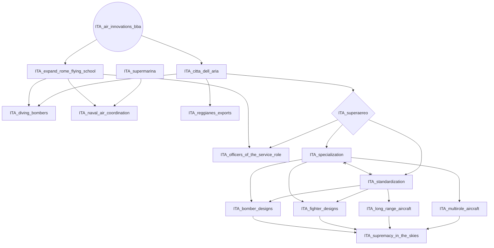
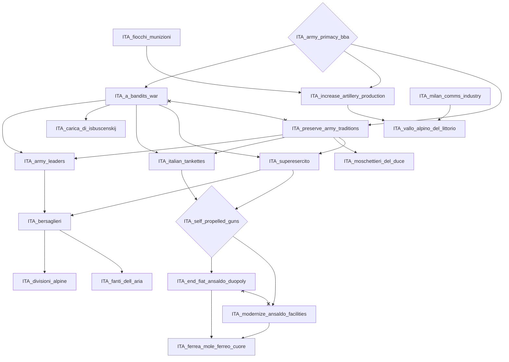
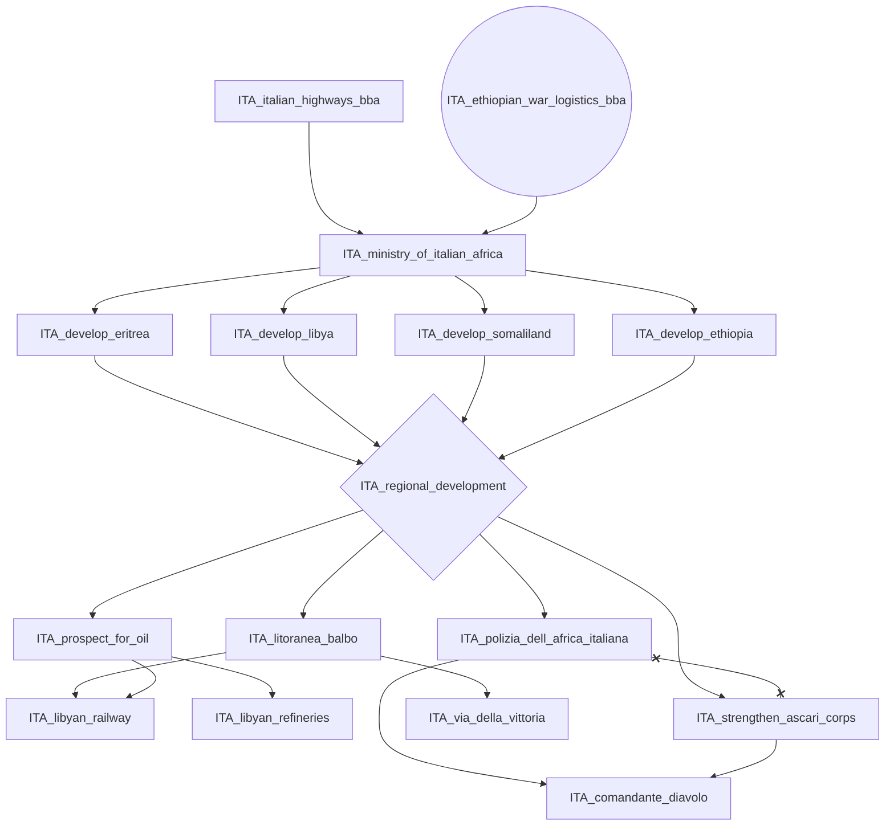
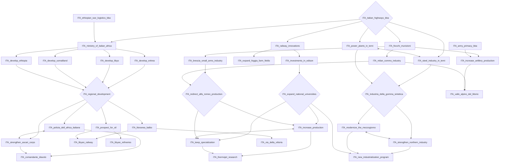
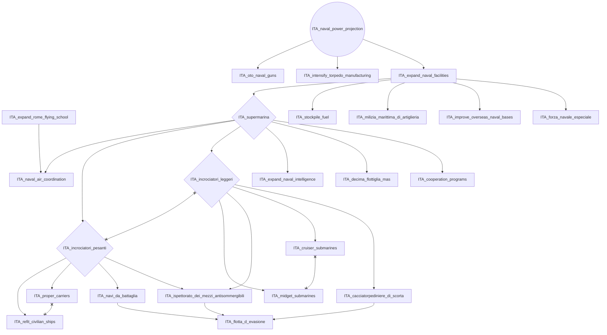
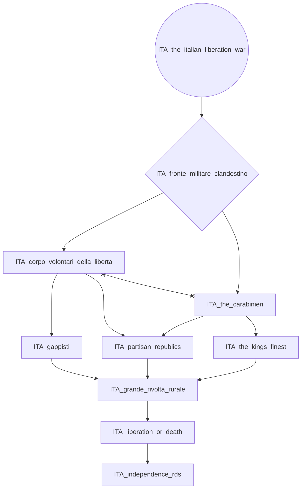
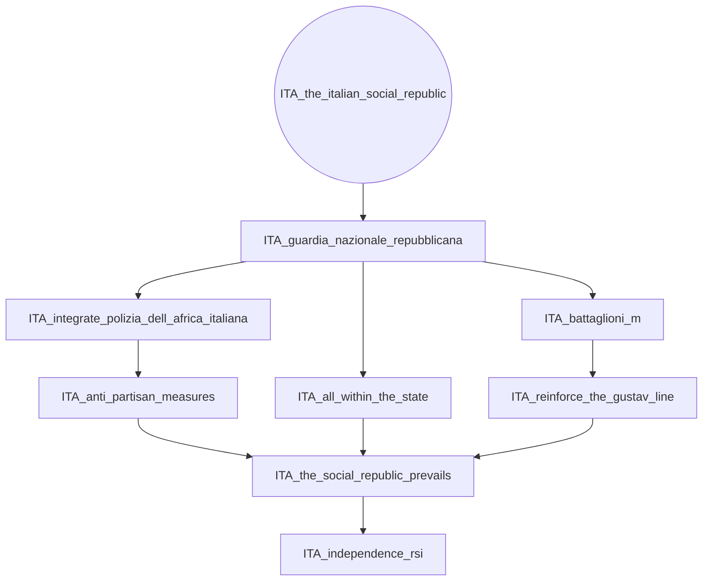

# ITA_air_innovations_bba

# ITA_army_primacy_bba

# ITA_ethiopian_war_logistics_bba

# ITA_italian_highways_bba

# ITA_naval_power_projection

# ITA_solid_progress

```mermaid
flowchart TD
    n88["ITA_a_colonial_empire"]
    n89["ITA_a_greater_purpose"]
    n90["ITA_a_leader_steps_forward"]
    n91["ITA_a_new_era_for_the_red_shirts"]
    n92["ITA_a_time_for_war"]
    n93["ITA_abolish_the_colonies"]
    n94["ITA_agents_of_the_church"]
    n95["ITA_aid_for_the_spanish_republic"]
    n96["ITA_albanian_fascist_militia"]
    n97["ITA_albanian_occupation"]
    n98["ITA_albanian_oil"]
    n99["ITA_all_roads_lead_to_rome"]
    n100["ITA_anglo_italian_agreements"]
    n101["ITA_anglo_italian_pact"]
    n102["ITA_appeal_to_the_bourgeoisie"]
    n103["ITA_appease_the_military"]
    n104["ITA_army_modernization"]
    n105["ITA_ascari"]
    n106["ITA_auxiliaries"]
    n107{"ITA_balkan_ambition"}
    n108["ITA_banda_carita"]
    n109["ITA_banda_koch"]
    n110["ITA_battaglioni_d_assalto"]
    n111{"ITA_befriend_greece"}
    n112["ITA_befriend_japan"]
    n113["ITA_befriend_portugal"]
    n114["ITA_befriend_turkey"]
    n115["ITA_believe_obey_fight"]
    n116["ITA_bend_the_bars"]
    n117{"ITA_blackshirt_loyalty"}
    n118["ITA_boost_the_grand_council_of_fascism"]
    n119["ITA_bring_back_exiled_intellectuals"]
    n120["ITA_bring_back_old_glories"]
    n121["ITA_bring_down_fascist_strongholds"]
    n122["ITA_by_blood_alone"]
    n123["ITA_caligulas_pride"]
    n124["ITA_capo_supremo"]
    n125["ITA_catholic_action"]
    n126["ITA_christian_democracy"]
    n127["ITA_claims_on_turkey_bba"]
    n128["ITA_combined_land_and_air_warfare"]
    n129["ITA_combined_research_effort"]
    n130{"ITA_common_ground"}
    n131["ITA_compagnie_auto_avio_sahariane"]
    n132["ITA_condemn_colonialism"]
    n133["ITA_consolidate_power"]
    n134{"ITA_conspiracies_in_the_shadows"}
    n135["ITA_convene_the_grand_council"]
    n136["ITA_cooperate_with_moderates"]
    n137["ITA_cooperate_with_the_mafia"]
    n138["ITA_cooperatives_for_intensive_exploitation"]
    n139{"ITA_corpo_di_truppe_volontarie"}
    n140["ITA_crush_opposition"]
    n141{"ITA_crush_the_mafia"}
    n142{"ITA_culto_del_duce"}
    n143["ITA_defend_the_land"]
    n144["ITA_defense_against_capitalism"]
    n145["ITA_defy_the_duce"]
    n146["ITA_demand_balearic_islands_bba"]
    n147["ITA_demand_ticino"]
    n148["ITA_democratic_king"]
    n149{"ITA_depose_mussolini"}
    n150["ITA_deus_vult"]
    n151["ITA_devaluate_the_lire"]
    n152{"ITA_devotion"}
    n153{"ITA_dino_grandi_focus"}
    n154["ITA_disband_the_blackshirts"]
    n155["ITA_divino_duce"]
    n156["ITA_economic_reforms"]
    n157["ITA_empower_the_carabinieri"]
    n158["ITA_empower_the_unions"]
    n159["ITA_enlist_the_bashkimi_kombetar"]
    n160["ITA_european_democracies"]
    n161["ITA_expand_intelligence_services"]
    n162["ITA_expand_the_royal_guard"]
    n163["ITA_expanded_corporatism"]
    n164["ITA_extraction_industry"]
    n165["ITA_follow_the_soviet_union"]
    n166{"ITA_foreign_affairs"}
    n167["ITA_franco_italian_pact"]
    n168["ITA_german_military_cooperation"]
    n169["ITA_gloria_al_regno_d_italia"]
    n170["ITA_gruppi_di_difesa_della_donna"]
    n171["ITA_guarantee_austrian_independence"]
    n172["ITA_heroes_of_the_nation"]
    n173["ITA_iberian_protection"]
    n174["ITA_il_sol_dell_avvenire"]
    n175["ITA_il_vento_aureo"]
    n176["ITA_improve_the_industries"]
    n177{"ITA_industrial_socialization"}
    n178["ITA_institute_the_five_year_plan"]
    n179["ITA_invite_france_to_military_partnership"]
    n180["ITA_irregulars"]
    n181["ITA_italia_libera"]
    n182["ITA_italian_hegemony"]
    n183{"ITA_italian_irredentism"}
    n184{"ITA_italian_socialism"}
    n185{"ITA_italo_balbo_focus"}
    n186{"ITA_italy_first"}
    n187["ITA_italys_destiny"]
    n188["ITA_joint_military_programs"]
    n189["ITA_la_battaglia_del_grano"]
    n190["ITA_la_battaglia_per_la_terra"]
    n191["ITA_la_battaglia_per_le_nascite"]
    n192["ITA_legge_bottai"]
    n193["ITA_liberate_gramsci"]
    n194["ITA_liberate_the_workers_of_africa"]
    n195["ITA_mafia_abroad"]
    n196["ITA_mare_nostrum_bba"]
    n197["ITA_masters_of_the_aegean"]
    n198["ITA_masters_of_the_mediterranean"]
    n199["ITA_meritocracy"]
    n200["ITA_military_agreements"]
    n201["ITA_military_cooperation"]
    n202["ITA_milizia_coloniale"]
    n203["ITA_ministero_della_cultura_popolare"]
    n204["ITA_mobilize_the_railway_guns"]
    n205["ITA_modern_musculus"]
    n206{"ITA_monarchia_d_italia"}
    n207["ITA_negotiate_italian_claims"]
    n208["ITA_negotiations_with_albania"]
    n209["ITA_new_colonial_policies"]
    n210["ITA_new_corporations"]
    n211["ITA_new_forms_of_weaponry"]
    n212["ITA_new_ricostruzione_industriale"]
    n213["ITA_new_roman_citizens"]
    n214["ITA_novus_ordo"]
    n215["ITA_oil_in_tripoli"]
    n216{"ITA_organize_strikes_in_the_north"}
    n217{"ITA_pact_of_steel"}
    n218["ITA_paramilitary_training"]
    n219["ITA_peace_preservation"]
    n220["ITA_planned_economy"]
    n221["ITA_political_commissars"]
    n222{"ITA_potential_allies_in_the_balkans"}
    n223{"ITA_power_to_the_king"}
    n224["ITA_prepare_for_the_coming_wars"]
    n225["ITA_proclaim_the_italian_empire"]
    n226["ITA_production_lines"]
    n227["ITA_pugno_alzato"]
    n228["ITA_purge_the_party"]
    n229["ITA_raise_the_peoples"]
    n230["ITA_ratify_the_stresa_front"]
    n231["ITA_reestablish_old_alliances"]
    n232["ITA_reinforce_regia_aeronautica"]
    n233["ITA_reorganize_regio_esercito"]
    n234["ITA_reorganize_the_party"]
    n235["ITA_request_control_of_french_territories"]
    n236{"ITA_revoke_the_acerbo_law"}
    n237["ITA_scientific_cooperation"]
    n238["ITA_sea_wolves_bba"]
    n239["ITA_secret_weapons"]
    n240["ITA_secure_the_borders"]
    n241{"ITA_security_militias"}
    n242["ITA_seek_british_military_cooperation"]
    n243["ITA_seek_papal_support"]
    n244["ITA_seize_old_equipment"]
    n245["ITA_servizio_informazione_militare"]
    n246{"ITA_setting_course"}
    n247{"ITA_social_stability"}
    n248(("ITA_solid_progress"))
    n249["ITA_south_american_alliances"]
    n250["ITA_spanish_italian_alliance"]
    n251["ITA_special_brigades"]
    n252["ITA_spreading_the_eagles_wings"]
    n253["ITA_steel_in_tripoli"]
    n254{"ITA_stop_the_squandering"}
    n255["ITA_strengthen_the_blackshirts"]
    n256["ITA_strengthen_the_papacy"]
    n257{"ITA_strengthen_the_regime"}
    n258["ITA_struggle_in_ethiopia"]
    n259["ITA_subdue_the_sentinels"]
    n260["ITA_support_albanian_irredentism"]
    n261["ITA_the_abyssinian_fiasco"]
    n262["ITA_the_catholic_dominion"]
    n263["ITA_the_eastern_threat"]
    n264["ITA_the_enemies_of_capitalism"]
    n265{"ITA_the_ethiopian_question"}
    n266{"ITA_the_fate_of_mussolini"}
    n267["ITA_the_fight_against_stalinism"]
    n268["ITA_the_fight_overseas"]
    n269{"ITA_the_fourth_shore"}
    n270["ITA_the_garibaldi_legion"]
    n271["ITA_the_holy_lands"]
    n272["ITA_the_italian_confederation"]
    n273["ITA_the_italian_legions"]
    n274{"ITA_the_italian_republic"}
    n275["ITA_the_king_of_the_skies"]
    n276{"ITA_the_man_of_providence"}
    n277["ITA_the_new_emperor_of_ethiopia"]
    n278["ITA_the_papacy_reborn"]
    n279["ITA_the_path_to_progress"]
    n280{"ITA_the_popular_front"}
    n281["ITA_the_republics_leadership"]
    n282{"ITA_the_southern_farmlands"}
    n283["ITA_to_live_as_a_lion"]
    n284["ITA_topple_amhara_rulers"]
    n285{"ITA_towards_a_greater_italy"}
    n286["ITA_treaty_with_germany"]
    n287{"ITA_triumph_in_africa_bba"}
    n288{"ITA_union_in_the_party"}
    n289["ITA_unite_the_opposition"]
    n290["ITA_united_anarchist_confederations"]
    n291["ITA_utilize_the_blackshirts"]
    n292["ITA_war_with_france"]
    n293{"ITA_war_with_greece"}
    n294["ITA_war_with_the_uk"]
    n259 --> n88
    n266 --> n89
    n280 --> n90
    n270 --> n91
    n150 --> n92
    n265 --> n93
    n243 --> n94
    n184 --> n95
    n260 --> n96
    n222 --> n97
    n107 --> n97
    n97 --> n98
    n273 --> n99
    n287 --> n100
    n242 --> n101
    n145 --> n102
    n130 --> n103
    n103 --> n104
    n221 --> n104
    n157 --> n104
    n268 --> n105
    n196 --> n106
    n166 --> n107
    n115 --> n108
    n108 --> n109
    n241 --> n110
    n186 --> n111
    n217 --> n112
    n186 --> n112
    n250 --> n113
    n146 --> n113
    n293 --> n114
    n111 --> n114
    n203 --> n115
    n285 --> n116
    n155 --> n117
    n276 --> n118
    n281 --> n119
    n224 --> n120
    n237 --> n121
    n88 --> n122
    n99 --> n123
    n285 --> n124
    n152 --> n124
    n278 --> n125
    n236 --> n126
    n293 --> n127
    n111 --> n127
    n131 --> n128
    n201 --> n129
    n280 --> n130
    n184 --> n130
    n233 --> n131
    n232 --> n131
    n138 --> n132
    n185 --> n133
    n153 --> n133
    n287 --> n135
    n134 --> n135
    n126 --> n136
    n148 --> n136
    n184 --> n137
    n93 --> n138
    n166 --> n139
    n136 --> n140
    n161 --> n140
    n280 --> n141
    n184 --> n141
    n287 --> n142
    n288 --> n143
    n201 --> n144
    n216 --> n145
    n282 --> n145
    n287 --> n145
    n139 --> n146
    n292 --> n147
    n235 --> n147
    n236 --> n148
    n135 --> n149
    n278 --> n150
    n287 --> n151
    n283 --> n152
    n118 --> n152
    n257 --> n152
    n149 --> n153
    n223 --> n154
    n236 --> n154
    n266 --> n155
    n234 --> n156
    n141 --> n157
    n184 --> n158
    n208 --> n159
    n181 --> n160
    n148 --> n161
    n126 --> n161
    n154 --> n162
    n291 --> n162
    n199 --> n163
    n176 --> n163
    n206 --> n164
    n288 --> n165
    n287 --> n166
    n134 --> n166
    n179 --> n167
    n217 --> n168
    n162 --> n169
    n148 --> n169
    n270 --> n170
    n222 --> n171
    n107 --> n171
    n285 --> n172
    n152 --> n172
    n196 --> n173
    n150 --> n173
    n129 --> n174
    n229 --> n174
    n150 --> n175
    n156 --> n176
    n280 --> n177
    n177 --> n178
    n153 --> n179
    n206 --> n179
    n268 --> n180
    n247 --> n181
    n252 --> n182
    n217 --> n183
    n186 --> n183
    n274 --> n184
    n149 --> n185
    n222 --> n186
    n107 --> n186
    n230 --> n187
    n230 --> n188
    n142 --> n189
    n142 --> n190
    n189 --> n191
    n190 --> n191
    n276 --> n192
    n289 --> n193
    n287 --> n193
    n268 --> n194
    n137 --> n195
    n246 --> n196
    n257 --> n196
    n117 --> n196
    n116 --> n197
    n197 --> n198
    n234 --> n199
    n228 --> n199
    n231 --> n200
    n165 --> n201
    n110 --> n202
    n255 --> n202
    n142 --> n203
    n135 --> n203
    n224 --> n204
    n99 --> n205
    n149 --> n206
    n171 --> n207
    n93 --> n208
    n209 --> n208
    n265 --> n209
    n164 --> n210
    n224 --> n211
    n178 --> n212
    n196 --> n213
    n253 --> n214
    n215 --> n214
    n269 --> n215
    n222 --> n217
    n107 --> n217
    n162 --> n218
    n291 --> n218
    n160 --> n219
    n272 --> n220
    n177 --> n221
    n166 --> n222
    n206 --> n223
    n164 --> n224
    n101 --> n225
    n167 --> n225
    n158 --> n226
    n170 --> n227
    n91 --> n227
    n133 --> n228
    n254 --> n228
    n143 --> n229
    n207 --> n230
    n247 --> n231
    n185 --> n232
    n254 --> n232
    n185 --> n233
    n254 --> n233
    n153 --> n234
    n133 --> n234
    n217 --> n235
    n183 --> n235
    n206 --> n236
    n181 --> n237
    n231 --> n237
    n168 --> n238
    n168 --> n239
    n237 --> n240
    n142 --> n241
    n135 --> n241
    n153 --> n242
    n206 --> n242
    n223 --> n243
    n145 --> n244
    n248 --> n245
    n261 --> n245
    n258 --> n245
    n169 --> n246
    n140 --> n246
    n256 --> n246
    n119 --> n247
    n173 --> n249
    n139 --> n250
    n186 --> n250
    n165 --> n251
    n143 --> n251
    n89 --> n252
    n269 --> n253
    n185 --> n254
    n153 --> n254
    n241 --> n255
    n94 --> n256
    n191 --> n257
    n116 --> n259
    n97 --> n260
    n92 --> n262
    n271 --> n262
    n187 --> n263
    n200 --> n264
    n145 --> n265
    n228 --> n266
    n143 --> n267
    n138 --> n268
    n272 --> n268
    n185 --> n269
    n254 --> n269
    n280 --> n270
    n150 --> n271
    n209 --> n272
    n196 --> n273
    n145 --> n274
    n99 --> n275
    n142 --> n276
    n287 --> n277
    n256 --> n278
    n90 --> n279
    n274 --> n280
    n184 --> n281
    n276 --> n283
    n287 --> n284
    n257 --> n285
    n117 --> n285
    n246 --> n285
    n217 --> n286
    n245 --> n287
    n279 --> n288
    n143 --> n290
    n223 --> n291
    n183 --> n292
    n183 --> n293
    n186 --> n294
    n183 --> n294
    n89 x--x n155
    n93 x--x n209
    n103 x--x n157
    n103 x--x n221
    n107 x--x n222
    n110 x--x n255
    n111 x--x n293
    n114 x--x n127
    n118 x--x n283
    n124 x--x n172
    n126 x--x n148
    n135 x--x n142
    n135 x--x n145
    n137 x--x n141
    n142 x--x n145
    n143 x--x n165
    n146 x--x n250
    n153 x--x n185
    n153 x--x n206
    n154 x--x n291
    n157 x--x n221
    n171 x--x n186
    n171 x--x n217
    n179 x--x n242
    n181 x--x n231
    n184 x--x n280
    n185 x--x n206
    n186 x--x n217
    n189 x--x n190
    n196 x--x n285
    n215 x--x n253
    n223 x--x n236
    n232 x--x n233
    n235 x--x n292
    n248 x--x n258
    n248 x--x n261
```

# ITA_struggle_in_ethiopia

```mermaid
flowchart TD
    n88["ITA_a_colonial_empire"]
    n89["ITA_a_greater_purpose"]
    n90["ITA_a_leader_steps_forward"]
    n91["ITA_a_new_era_for_the_red_shirts"]
    n92["ITA_a_time_for_war"]
    n93["ITA_abolish_the_colonies"]
    n94["ITA_agents_of_the_church"]
    n95["ITA_aid_for_the_spanish_republic"]
    n96["ITA_albanian_fascist_militia"]
    n97["ITA_albanian_occupation"]
    n98["ITA_albanian_oil"]
    n99["ITA_all_roads_lead_to_rome"]
    n100["ITA_anglo_italian_agreements"]
    n101["ITA_anglo_italian_pact"]
    n102["ITA_appeal_to_the_bourgeoisie"]
    n103["ITA_appease_the_military"]
    n104["ITA_army_modernization"]
    n105["ITA_ascari"]
    n106["ITA_auxiliaries"]
    n107{"ITA_balkan_ambition"}
    n108["ITA_banda_carita"]
    n109["ITA_banda_koch"]
    n110["ITA_battaglioni_d_assalto"]
    n111{"ITA_befriend_greece"}
    n112["ITA_befriend_japan"]
    n113["ITA_befriend_portugal"]
    n114["ITA_befriend_turkey"]
    n115["ITA_believe_obey_fight"]
    n116["ITA_bend_the_bars"]
    n117{"ITA_blackshirt_loyalty"}
    n118["ITA_boost_the_grand_council_of_fascism"]
    n119["ITA_bring_back_exiled_intellectuals"]
    n120["ITA_bring_back_old_glories"]
    n121["ITA_bring_down_fascist_strongholds"]
    n122["ITA_by_blood_alone"]
    n123["ITA_caligulas_pride"]
    n124["ITA_capo_supremo"]
    n125["ITA_catholic_action"]
    n126["ITA_christian_democracy"]
    n127["ITA_claims_on_turkey_bba"]
    n128["ITA_combined_land_and_air_warfare"]
    n129["ITA_combined_research_effort"]
    n130{"ITA_common_ground"}
    n131["ITA_compagnie_auto_avio_sahariane"]
    n132["ITA_condemn_colonialism"]
    n133["ITA_consolidate_power"]
    n134{"ITA_conspiracies_in_the_shadows"}
    n135["ITA_convene_the_grand_council"]
    n136["ITA_cooperate_with_moderates"]
    n137["ITA_cooperate_with_the_mafia"]
    n138["ITA_cooperatives_for_intensive_exploitation"]
    n139{"ITA_corpo_di_truppe_volontarie"}
    n140["ITA_crush_opposition"]
    n141{"ITA_crush_the_mafia"}
    n142{"ITA_culto_del_duce"}
    n143["ITA_defend_the_land"]
    n144["ITA_defense_against_capitalism"]
    n145["ITA_defy_the_duce"]
    n146["ITA_demand_balearic_islands_bba"]
    n147["ITA_demand_ticino"]
    n148["ITA_democratic_king"]
    n149{"ITA_depose_mussolini"}
    n150["ITA_deus_vult"]
    n151["ITA_devaluate_the_lire"]
    n152{"ITA_devotion"}
    n153{"ITA_dino_grandi_focus"}
    n154["ITA_disband_the_blackshirts"]
    n155["ITA_divino_duce"]
    n156["ITA_economic_reforms"]
    n157["ITA_empower_the_carabinieri"]
    n158["ITA_empower_the_unions"]
    n159["ITA_enlist_the_bashkimi_kombetar"]
    n160["ITA_european_democracies"]
    n161["ITA_expand_intelligence_services"]
    n162["ITA_expand_the_royal_guard"]
    n163["ITA_expanded_corporatism"]
    n164["ITA_extraction_industry"]
    n165["ITA_follow_the_soviet_union"]
    n166{"ITA_foreign_affairs"}
    n167["ITA_franco_italian_pact"]
    n168["ITA_german_military_cooperation"]
    n169["ITA_gloria_al_regno_d_italia"]
    n170["ITA_gruppi_di_difesa_della_donna"]
    n171["ITA_guarantee_austrian_independence"]
    n172["ITA_heroes_of_the_nation"]
    n173["ITA_iberian_protection"]
    n174["ITA_il_sol_dell_avvenire"]
    n175["ITA_il_vento_aureo"]
    n176["ITA_improve_the_industries"]
    n177{"ITA_industrial_socialization"}
    n178["ITA_institute_the_five_year_plan"]
    n179["ITA_invite_france_to_military_partnership"]
    n180["ITA_irregulars"]
    n181["ITA_italia_libera"]
    n182["ITA_italian_hegemony"]
    n183{"ITA_italian_irredentism"}
    n184{"ITA_italian_socialism"}
    n185{"ITA_italo_balbo_focus"}
    n186{"ITA_italy_first"}
    n187["ITA_italys_destiny"]
    n188["ITA_joint_military_programs"]
    n189["ITA_la_battaglia_del_grano"]
    n190["ITA_la_battaglia_per_la_terra"]
    n191["ITA_la_battaglia_per_le_nascite"]
    n192["ITA_legge_bottai"]
    n193["ITA_liberate_gramsci"]
    n194["ITA_liberate_the_workers_of_africa"]
    n195["ITA_mafia_abroad"]
    n196["ITA_mare_nostrum_bba"]
    n197["ITA_masters_of_the_aegean"]
    n198["ITA_masters_of_the_mediterranean"]
    n199["ITA_meritocracy"]
    n200["ITA_military_agreements"]
    n201["ITA_military_cooperation"]
    n202["ITA_milizia_coloniale"]
    n203["ITA_ministero_della_cultura_popolare"]
    n204["ITA_mobilize_the_railway_guns"]
    n205["ITA_modern_musculus"]
    n206{"ITA_monarchia_d_italia"}
    n207["ITA_negotiate_italian_claims"]
    n208["ITA_negotiations_with_albania"]
    n209["ITA_new_colonial_policies"]
    n210["ITA_new_corporations"]
    n211["ITA_new_forms_of_weaponry"]
    n212["ITA_new_ricostruzione_industriale"]
    n213["ITA_new_roman_citizens"]
    n214["ITA_novus_ordo"]
    n215["ITA_oil_in_tripoli"]
    n216{"ITA_organize_strikes_in_the_north"}
    n217{"ITA_pact_of_steel"}
    n218["ITA_paramilitary_training"]
    n219["ITA_peace_preservation"]
    n220["ITA_planned_economy"]
    n221["ITA_political_commissars"]
    n222{"ITA_potential_allies_in_the_balkans"}
    n223{"ITA_power_to_the_king"}
    n224["ITA_prepare_for_the_coming_wars"]
    n225["ITA_proclaim_the_italian_empire"]
    n226["ITA_production_lines"]
    n227["ITA_pugno_alzato"]
    n228["ITA_purge_the_party"]
    n229["ITA_raise_the_peoples"]
    n230["ITA_ratify_the_stresa_front"]
    n231["ITA_reestablish_old_alliances"]
    n232["ITA_reinforce_regia_aeronautica"]
    n233["ITA_reorganize_regio_esercito"]
    n234["ITA_reorganize_the_party"]
    n235["ITA_request_control_of_french_territories"]
    n236{"ITA_revoke_the_acerbo_law"}
    n237["ITA_scientific_cooperation"]
    n238["ITA_sea_wolves_bba"]
    n239["ITA_secret_weapons"]
    n240["ITA_secure_the_borders"]
    n241{"ITA_security_militias"}
    n242["ITA_seek_british_military_cooperation"]
    n243["ITA_seek_papal_support"]
    n244["ITA_seize_old_equipment"]
    n245["ITA_servizio_informazione_militare"]
    n246{"ITA_setting_course"}
    n247{"ITA_social_stability"}
    n248["ITA_solid_progress"]
    n249["ITA_south_american_alliances"]
    n250["ITA_spanish_italian_alliance"]
    n251["ITA_special_brigades"]
    n252["ITA_spreading_the_eagles_wings"]
    n253["ITA_steel_in_tripoli"]
    n254{"ITA_stop_the_squandering"}
    n255["ITA_strengthen_the_blackshirts"]
    n256["ITA_strengthen_the_papacy"]
    n257{"ITA_strengthen_the_regime"}
    n258(("ITA_struggle_in_ethiopia"))
    n259["ITA_subdue_the_sentinels"]
    n260["ITA_support_albanian_irredentism"]
    n261["ITA_the_abyssinian_fiasco"]
    n262["ITA_the_catholic_dominion"]
    n263["ITA_the_eastern_threat"]
    n264["ITA_the_enemies_of_capitalism"]
    n265{"ITA_the_ethiopian_question"}
    n266{"ITA_the_fate_of_mussolini"}
    n267["ITA_the_fight_against_stalinism"]
    n268["ITA_the_fight_overseas"]
    n269{"ITA_the_fourth_shore"}
    n270["ITA_the_garibaldi_legion"]
    n271["ITA_the_holy_lands"]
    n272["ITA_the_italian_confederation"]
    n273["ITA_the_italian_legions"]
    n274{"ITA_the_italian_republic"}
    n275["ITA_the_king_of_the_skies"]
    n276{"ITA_the_man_of_providence"}
    n277["ITA_the_new_emperor_of_ethiopia"]
    n278["ITA_the_papacy_reborn"]
    n279["ITA_the_path_to_progress"]
    n280{"ITA_the_popular_front"}
    n281["ITA_the_republics_leadership"]
    n282{"ITA_the_southern_farmlands"}
    n283["ITA_to_live_as_a_lion"]
    n284["ITA_topple_amhara_rulers"]
    n285{"ITA_towards_a_greater_italy"}
    n286["ITA_treaty_with_germany"]
    n287{"ITA_triumph_in_africa_bba"}
    n295["ITA_undermine_the_duce"]
    n288{"ITA_union_in_the_party"}
    n289["ITA_unite_the_opposition"]
    n290["ITA_united_anarchist_confederations"]
    n291["ITA_utilize_the_blackshirts"]
    n292["ITA_war_with_france"]
    n293{"ITA_war_with_greece"}
    n294["ITA_war_with_the_uk"]
    n259 --> n88
    n266 --> n89
    n280 --> n90
    n270 --> n91
    n150 --> n92
    n265 --> n93
    n243 --> n94
    n184 --> n95
    n260 --> n96
    n222 --> n97
    n107 --> n97
    n97 --> n98
    n273 --> n99
    n287 --> n100
    n242 --> n101
    n145 --> n102
    n130 --> n103
    n103 --> n104
    n221 --> n104
    n157 --> n104
    n268 --> n105
    n196 --> n106
    n166 --> n107
    n115 --> n108
    n108 --> n109
    n241 --> n110
    n186 --> n111
    n217 --> n112
    n186 --> n112
    n250 --> n113
    n146 --> n113
    n293 --> n114
    n111 --> n114
    n203 --> n115
    n285 --> n116
    n155 --> n117
    n276 --> n118
    n281 --> n119
    n224 --> n120
    n237 --> n121
    n88 --> n122
    n99 --> n123
    n285 --> n124
    n152 --> n124
    n278 --> n125
    n236 --> n126
    n293 --> n127
    n111 --> n127
    n131 --> n128
    n201 --> n129
    n280 --> n130
    n184 --> n130
    n233 --> n131
    n232 --> n131
    n138 --> n132
    n185 --> n133
    n153 --> n133
    n295 --> n134
    n287 --> n135
    n134 --> n135
    n126 --> n136
    n148 --> n136
    n184 --> n137
    n93 --> n138
    n166 --> n139
    n136 --> n140
    n161 --> n140
    n280 --> n141
    n184 --> n141
    n287 --> n142
    n288 --> n143
    n201 --> n144
    n216 --> n145
    n282 --> n145
    n287 --> n145
    n139 --> n146
    n292 --> n147
    n235 --> n147
    n236 --> n148
    n135 --> n149
    n278 --> n150
    n287 --> n151
    n283 --> n152
    n118 --> n152
    n257 --> n152
    n149 --> n153
    n223 --> n154
    n236 --> n154
    n266 --> n155
    n234 --> n156
    n141 --> n157
    n184 --> n158
    n208 --> n159
    n181 --> n160
    n148 --> n161
    n126 --> n161
    n154 --> n162
    n291 --> n162
    n199 --> n163
    n176 --> n163
    n206 --> n164
    n288 --> n165
    n287 --> n166
    n134 --> n166
    n179 --> n167
    n217 --> n168
    n162 --> n169
    n148 --> n169
    n270 --> n170
    n222 --> n171
    n107 --> n171
    n285 --> n172
    n152 --> n172
    n196 --> n173
    n150 --> n173
    n129 --> n174
    n229 --> n174
    n150 --> n175
    n156 --> n176
    n280 --> n177
    n177 --> n178
    n153 --> n179
    n206 --> n179
    n268 --> n180
    n247 --> n181
    n252 --> n182
    n217 --> n183
    n186 --> n183
    n274 --> n184
    n149 --> n185
    n222 --> n186
    n107 --> n186
    n230 --> n187
    n230 --> n188
    n142 --> n189
    n142 --> n190
    n189 --> n191
    n190 --> n191
    n276 --> n192
    n289 --> n193
    n287 --> n193
    n268 --> n194
    n137 --> n195
    n246 --> n196
    n257 --> n196
    n117 --> n196
    n116 --> n197
    n197 --> n198
    n234 --> n199
    n228 --> n199
    n231 --> n200
    n165 --> n201
    n110 --> n202
    n255 --> n202
    n142 --> n203
    n135 --> n203
    n224 --> n204
    n99 --> n205
    n149 --> n206
    n171 --> n207
    n93 --> n208
    n209 --> n208
    n265 --> n209
    n164 --> n210
    n224 --> n211
    n178 --> n212
    n196 --> n213
    n253 --> n214
    n215 --> n214
    n269 --> n215
    n222 --> n217
    n107 --> n217
    n162 --> n218
    n291 --> n218
    n160 --> n219
    n272 --> n220
    n177 --> n221
    n166 --> n222
    n206 --> n223
    n164 --> n224
    n101 --> n225
    n167 --> n225
    n158 --> n226
    n170 --> n227
    n91 --> n227
    n133 --> n228
    n254 --> n228
    n143 --> n229
    n207 --> n230
    n247 --> n231
    n185 --> n232
    n254 --> n232
    n185 --> n233
    n254 --> n233
    n153 --> n234
    n133 --> n234
    n217 --> n235
    n183 --> n235
    n206 --> n236
    n181 --> n237
    n231 --> n237
    n168 --> n238
    n168 --> n239
    n237 --> n240
    n142 --> n241
    n135 --> n241
    n153 --> n242
    n206 --> n242
    n223 --> n243
    n145 --> n244
    n248 --> n245
    n261 --> n245
    n258 --> n245
    n169 --> n246
    n140 --> n246
    n256 --> n246
    n119 --> n247
    n173 --> n249
    n139 --> n250
    n186 --> n250
    n165 --> n251
    n143 --> n251
    n89 --> n252
    n269 --> n253
    n185 --> n254
    n153 --> n254
    n241 --> n255
    n94 --> n256
    n191 --> n257
    n116 --> n259
    n97 --> n260
    n92 --> n262
    n271 --> n262
    n187 --> n263
    n200 --> n264
    n145 --> n265
    n228 --> n266
    n143 --> n267
    n138 --> n268
    n272 --> n268
    n185 --> n269
    n254 --> n269
    n280 --> n270
    n150 --> n271
    n209 --> n272
    n196 --> n273
    n145 --> n274
    n99 --> n275
    n142 --> n276
    n287 --> n277
    n256 --> n278
    n90 --> n279
    n274 --> n280
    n184 --> n281
    n276 --> n283
    n287 --> n284
    n257 --> n285
    n117 --> n285
    n246 --> n285
    n217 --> n286
    n245 --> n287
    n258 --> n295
    n279 --> n288
    n143 --> n290
    n223 --> n291
    n183 --> n292
    n183 --> n293
    n186 --> n294
    n183 --> n294
    n89 x--x n155
    n93 x--x n209
    n103 x--x n157
    n103 x--x n221
    n107 x--x n222
    n110 x--x n255
    n111 x--x n293
    n114 x--x n127
    n118 x--x n283
    n124 x--x n172
    n126 x--x n148
    n135 x--x n142
    n135 x--x n145
    n137 x--x n141
    n142 x--x n145
    n143 x--x n165
    n146 x--x n250
    n153 x--x n185
    n153 x--x n206
    n154 x--x n291
    n157 x--x n221
    n171 x--x n186
    n171 x--x n217
    n179 x--x n242
    n181 x--x n231
    n184 x--x n280
    n185 x--x n206
    n186 x--x n217
    n189 x--x n190
    n196 x--x n285
    n215 x--x n253
    n223 x--x n236
    n232 x--x n233
    n235 x--x n292
    n248 x--x n258
    n258 x--x n261
```

# ITA_the_abyssinian_fiasco

```mermaid
flowchart TD
    n88["ITA_a_colonial_empire"]
    n89["ITA_a_greater_purpose"]
    n90["ITA_a_leader_steps_forward"]
    n91["ITA_a_new_era_for_the_red_shirts"]
    n92["ITA_a_time_for_war"]
    n93["ITA_abolish_the_colonies"]
    n94["ITA_agents_of_the_church"]
    n95["ITA_aid_for_the_spanish_republic"]
    n96["ITA_albanian_fascist_militia"]
    n97["ITA_albanian_occupation"]
    n98["ITA_albanian_oil"]
    n99["ITA_all_roads_lead_to_rome"]
    n100["ITA_anglo_italian_agreements"]
    n101["ITA_anglo_italian_pact"]
    n102["ITA_appeal_to_the_bourgeoisie"]
    n103["ITA_appease_the_military"]
    n104["ITA_army_modernization"]
    n105["ITA_ascari"]
    n106["ITA_auxiliaries"]
    n107{"ITA_balkan_ambition"}
    n108["ITA_banda_carita"]
    n109["ITA_banda_koch"]
    n110["ITA_battaglioni_d_assalto"]
    n111{"ITA_befriend_greece"}
    n112["ITA_befriend_japan"]
    n113["ITA_befriend_portugal"]
    n114["ITA_befriend_turkey"]
    n115["ITA_believe_obey_fight"]
    n116["ITA_bend_the_bars"]
    n117{"ITA_blackshirt_loyalty"}
    n118["ITA_boost_the_grand_council_of_fascism"]
    n119["ITA_bring_back_exiled_intellectuals"]
    n120["ITA_bring_back_old_glories"]
    n121["ITA_bring_down_fascist_strongholds"]
    n122["ITA_by_blood_alone"]
    n123["ITA_caligulas_pride"]
    n124["ITA_capo_supremo"]
    n125["ITA_catholic_action"]
    n126["ITA_christian_democracy"]
    n127["ITA_claims_on_turkey_bba"]
    n128["ITA_combined_land_and_air_warfare"]
    n129["ITA_combined_research_effort"]
    n130{"ITA_common_ground"}
    n131["ITA_compagnie_auto_avio_sahariane"]
    n132["ITA_condemn_colonialism"]
    n133["ITA_consolidate_power"]
    n134{"ITA_conspiracies_in_the_shadows"}
    n135["ITA_convene_the_grand_council"]
    n136["ITA_cooperate_with_moderates"]
    n137["ITA_cooperate_with_the_mafia"]
    n138["ITA_cooperatives_for_intensive_exploitation"]
    n139{"ITA_corpo_di_truppe_volontarie"}
    n140["ITA_crush_opposition"]
    n141{"ITA_crush_the_mafia"}
    n142{"ITA_culto_del_duce"}
    n143["ITA_defend_the_land"]
    n144["ITA_defense_against_capitalism"]
    n145["ITA_defy_the_duce"]
    n146["ITA_demand_balearic_islands_bba"]
    n147["ITA_demand_ticino"]
    n148["ITA_democratic_king"]
    n149{"ITA_depose_mussolini"}
    n150["ITA_deus_vult"]
    n151["ITA_devaluate_the_lire"]
    n152{"ITA_devotion"}
    n153{"ITA_dino_grandi_focus"}
    n154["ITA_disband_the_blackshirts"]
    n155["ITA_divino_duce"]
    n156["ITA_economic_reforms"]
    n157["ITA_empower_the_carabinieri"]
    n158["ITA_empower_the_unions"]
    n159["ITA_enlist_the_bashkimi_kombetar"]
    n160["ITA_european_democracies"]
    n161["ITA_expand_intelligence_services"]
    n162["ITA_expand_the_royal_guard"]
    n163["ITA_expanded_corporatism"]
    n164["ITA_extraction_industry"]
    n165["ITA_follow_the_soviet_union"]
    n166{"ITA_foreign_affairs"}
    n167["ITA_franco_italian_pact"]
    n168["ITA_german_military_cooperation"]
    n169["ITA_gloria_al_regno_d_italia"]
    n170["ITA_gruppi_di_difesa_della_donna"]
    n171["ITA_guarantee_austrian_independence"]
    n172["ITA_heroes_of_the_nation"]
    n173["ITA_iberian_protection"]
    n174["ITA_il_sol_dell_avvenire"]
    n175["ITA_il_vento_aureo"]
    n176["ITA_improve_the_industries"]
    n177{"ITA_industrial_socialization"}
    n178["ITA_institute_the_five_year_plan"]
    n179["ITA_invite_france_to_military_partnership"]
    n180["ITA_irregulars"]
    n181["ITA_italia_libera"]
    n182["ITA_italian_hegemony"]
    n183{"ITA_italian_irredentism"}
    n184{"ITA_italian_socialism"}
    n185{"ITA_italo_balbo_focus"}
    n186{"ITA_italy_first"}
    n187["ITA_italys_destiny"]
    n188["ITA_joint_military_programs"]
    n189["ITA_la_battaglia_del_grano"]
    n190["ITA_la_battaglia_per_la_terra"]
    n191["ITA_la_battaglia_per_le_nascite"]
    n192["ITA_legge_bottai"]
    n193["ITA_liberate_gramsci"]
    n194["ITA_liberate_the_workers_of_africa"]
    n195["ITA_mafia_abroad"]
    n196["ITA_mare_nostrum_bba"]
    n197["ITA_masters_of_the_aegean"]
    n198["ITA_masters_of_the_mediterranean"]
    n199["ITA_meritocracy"]
    n200["ITA_military_agreements"]
    n201["ITA_military_cooperation"]
    n202["ITA_milizia_coloniale"]
    n203["ITA_ministero_della_cultura_popolare"]
    n204["ITA_mobilize_the_railway_guns"]
    n205["ITA_modern_musculus"]
    n206{"ITA_monarchia_d_italia"}
    n207["ITA_negotiate_italian_claims"]
    n208["ITA_negotiations_with_albania"]
    n209["ITA_new_colonial_policies"]
    n210["ITA_new_corporations"]
    n211["ITA_new_forms_of_weaponry"]
    n212["ITA_new_ricostruzione_industriale"]
    n213["ITA_new_roman_citizens"]
    n214["ITA_novus_ordo"]
    n215["ITA_oil_in_tripoli"]
    n216{"ITA_organize_strikes_in_the_north"}
    n217{"ITA_pact_of_steel"}
    n218["ITA_paramilitary_training"]
    n219["ITA_peace_preservation"]
    n220["ITA_planned_economy"]
    n221["ITA_political_commissars"]
    n222{"ITA_potential_allies_in_the_balkans"}
    n223{"ITA_power_to_the_king"}
    n224["ITA_prepare_for_the_coming_wars"]
    n225["ITA_proclaim_the_italian_empire"]
    n226["ITA_production_lines"]
    n227["ITA_pugno_alzato"]
    n228["ITA_purge_the_party"]
    n229["ITA_raise_the_peoples"]
    n230["ITA_ratify_the_stresa_front"]
    n231["ITA_reestablish_old_alliances"]
    n232["ITA_reinforce_regia_aeronautica"]
    n233["ITA_reorganize_regio_esercito"]
    n234["ITA_reorganize_the_party"]
    n235["ITA_request_control_of_french_territories"]
    n236{"ITA_revoke_the_acerbo_law"}
    n237["ITA_scientific_cooperation"]
    n238["ITA_sea_wolves_bba"]
    n239["ITA_secret_weapons"]
    n240["ITA_secure_the_borders"]
    n241{"ITA_security_militias"}
    n242["ITA_seek_british_military_cooperation"]
    n243["ITA_seek_papal_support"]
    n244["ITA_seize_old_equipment"]
    n245["ITA_servizio_informazione_militare"]
    n246{"ITA_setting_course"}
    n247{"ITA_social_stability"}
    n248["ITA_solid_progress"]
    n249["ITA_south_american_alliances"]
    n250["ITA_spanish_italian_alliance"]
    n251["ITA_special_brigades"]
    n252["ITA_spreading_the_eagles_wings"]
    n253["ITA_steel_in_tripoli"]
    n254{"ITA_stop_the_squandering"}
    n255["ITA_strengthen_the_blackshirts"]
    n256["ITA_strengthen_the_papacy"]
    n257{"ITA_strengthen_the_regime"}
    n258["ITA_struggle_in_ethiopia"]
    n259["ITA_subdue_the_sentinels"]
    n260["ITA_support_albanian_irredentism"]
    n261(("ITA_the_abyssinian_fiasco"))
    n262["ITA_the_catholic_dominion"]
    n263["ITA_the_eastern_threat"]
    n264["ITA_the_enemies_of_capitalism"]
    n265{"ITA_the_ethiopian_question"}
    n266{"ITA_the_fate_of_mussolini"}
    n267["ITA_the_fight_against_stalinism"]
    n268["ITA_the_fight_overseas"]
    n269{"ITA_the_fourth_shore"}
    n270["ITA_the_garibaldi_legion"]
    n271["ITA_the_holy_lands"]
    n272["ITA_the_italian_confederation"]
    n273["ITA_the_italian_legions"]
    n274{"ITA_the_italian_republic"}
    n275["ITA_the_king_of_the_skies"]
    n276{"ITA_the_man_of_providence"}
    n277["ITA_the_new_emperor_of_ethiopia"]
    n278["ITA_the_papacy_reborn"]
    n279["ITA_the_path_to_progress"]
    n280{"ITA_the_popular_front"}
    n281["ITA_the_republics_leadership"]
    n282{"ITA_the_southern_farmlands"}
    n283["ITA_to_live_as_a_lion"]
    n284["ITA_topple_amhara_rulers"]
    n285{"ITA_towards_a_greater_italy"}
    n286["ITA_treaty_with_germany"]
    n287{"ITA_triumph_in_africa_bba"}
    n288{"ITA_union_in_the_party"}
    n289{"ITA_unite_the_opposition"}
    n290["ITA_united_anarchist_confederations"]
    n291["ITA_utilize_the_blackshirts"]
    n292["ITA_war_with_france"]
    n293{"ITA_war_with_greece"}
    n294["ITA_war_with_the_uk"]
    n259 --> n88
    n266 --> n89
    n280 --> n90
    n270 --> n91
    n150 --> n92
    n265 --> n93
    n243 --> n94
    n184 --> n95
    n260 --> n96
    n222 --> n97
    n107 --> n97
    n97 --> n98
    n273 --> n99
    n287 --> n100
    n242 --> n101
    n145 --> n102
    n130 --> n103
    n103 --> n104
    n221 --> n104
    n157 --> n104
    n268 --> n105
    n196 --> n106
    n166 --> n107
    n115 --> n108
    n108 --> n109
    n241 --> n110
    n186 --> n111
    n217 --> n112
    n186 --> n112
    n250 --> n113
    n146 --> n113
    n293 --> n114
    n111 --> n114
    n203 --> n115
    n285 --> n116
    n155 --> n117
    n276 --> n118
    n281 --> n119
    n224 --> n120
    n237 --> n121
    n88 --> n122
    n99 --> n123
    n285 --> n124
    n152 --> n124
    n278 --> n125
    n236 --> n126
    n293 --> n127
    n111 --> n127
    n131 --> n128
    n201 --> n129
    n280 --> n130
    n184 --> n130
    n233 --> n131
    n232 --> n131
    n138 --> n132
    n185 --> n133
    n153 --> n133
    n287 --> n135
    n134 --> n135
    n126 --> n136
    n148 --> n136
    n184 --> n137
    n93 --> n138
    n166 --> n139
    n136 --> n140
    n161 --> n140
    n280 --> n141
    n184 --> n141
    n287 --> n142
    n288 --> n143
    n201 --> n144
    n216 --> n145
    n282 --> n145
    n287 --> n145
    n139 --> n146
    n292 --> n147
    n235 --> n147
    n236 --> n148
    n135 --> n149
    n278 --> n150
    n287 --> n151
    n283 --> n152
    n118 --> n152
    n257 --> n152
    n149 --> n153
    n223 --> n154
    n236 --> n154
    n266 --> n155
    n234 --> n156
    n141 --> n157
    n184 --> n158
    n208 --> n159
    n181 --> n160
    n148 --> n161
    n126 --> n161
    n154 --> n162
    n291 --> n162
    n199 --> n163
    n176 --> n163
    n206 --> n164
    n288 --> n165
    n287 --> n166
    n134 --> n166
    n179 --> n167
    n217 --> n168
    n162 --> n169
    n148 --> n169
    n270 --> n170
    n222 --> n171
    n107 --> n171
    n285 --> n172
    n152 --> n172
    n196 --> n173
    n150 --> n173
    n129 --> n174
    n229 --> n174
    n150 --> n175
    n156 --> n176
    n280 --> n177
    n177 --> n178
    n153 --> n179
    n206 --> n179
    n268 --> n180
    n247 --> n181
    n252 --> n182
    n217 --> n183
    n186 --> n183
    n274 --> n184
    n149 --> n185
    n222 --> n186
    n107 --> n186
    n230 --> n187
    n230 --> n188
    n142 --> n189
    n142 --> n190
    n189 --> n191
    n190 --> n191
    n276 --> n192
    n289 --> n193
    n287 --> n193
    n268 --> n194
    n137 --> n195
    n246 --> n196
    n257 --> n196
    n117 --> n196
    n116 --> n197
    n197 --> n198
    n234 --> n199
    n228 --> n199
    n231 --> n200
    n165 --> n201
    n110 --> n202
    n255 --> n202
    n142 --> n203
    n135 --> n203
    n224 --> n204
    n99 --> n205
    n149 --> n206
    n171 --> n207
    n93 --> n208
    n209 --> n208
    n265 --> n209
    n164 --> n210
    n224 --> n211
    n178 --> n212
    n196 --> n213
    n253 --> n214
    n215 --> n214
    n269 --> n215
    n289 --> n216
    n222 --> n217
    n107 --> n217
    n162 --> n218
    n291 --> n218
    n160 --> n219
    n272 --> n220
    n177 --> n221
    n166 --> n222
    n206 --> n223
    n164 --> n224
    n101 --> n225
    n167 --> n225
    n158 --> n226
    n170 --> n227
    n91 --> n227
    n133 --> n228
    n254 --> n228
    n143 --> n229
    n207 --> n230
    n247 --> n231
    n185 --> n232
    n254 --> n232
    n185 --> n233
    n254 --> n233
    n153 --> n234
    n133 --> n234
    n217 --> n235
    n183 --> n235
    n206 --> n236
    n181 --> n237
    n231 --> n237
    n168 --> n238
    n168 --> n239
    n237 --> n240
    n142 --> n241
    n135 --> n241
    n153 --> n242
    n206 --> n242
    n223 --> n243
    n145 --> n244
    n248 --> n245
    n261 --> n245
    n258 --> n245
    n169 --> n246
    n140 --> n246
    n256 --> n246
    n119 --> n247
    n173 --> n249
    n139 --> n250
    n186 --> n250
    n165 --> n251
    n143 --> n251
    n89 --> n252
    n269 --> n253
    n185 --> n254
    n153 --> n254
    n241 --> n255
    n94 --> n256
    n191 --> n257
    n116 --> n259
    n97 --> n260
    n92 --> n262
    n271 --> n262
    n187 --> n263
    n200 --> n264
    n145 --> n265
    n228 --> n266
    n143 --> n267
    n138 --> n268
    n272 --> n268
    n185 --> n269
    n254 --> n269
    n280 --> n270
    n150 --> n271
    n209 --> n272
    n196 --> n273
    n145 --> n274
    n99 --> n275
    n142 --> n276
    n287 --> n277
    n256 --> n278
    n90 --> n279
    n274 --> n280
    n184 --> n281
    n289 --> n282
    n276 --> n283
    n287 --> n284
    n257 --> n285
    n117 --> n285
    n246 --> n285
    n217 --> n286
    n245 --> n287
    n279 --> n288
    n261 --> n289
    n143 --> n290
    n223 --> n291
    n183 --> n292
    n183 --> n293
    n186 --> n294
    n183 --> n294
    n89 x--x n155
    n93 x--x n209
    n103 x--x n157
    n103 x--x n221
    n107 x--x n222
    n110 x--x n255
    n111 x--x n293
    n114 x--x n127
    n118 x--x n283
    n124 x--x n172
    n126 x--x n148
    n135 x--x n142
    n135 x--x n145
    n137 x--x n141
    n142 x--x n145
    n143 x--x n165
    n146 x--x n250
    n153 x--x n185
    n153 x--x n206
    n154 x--x n291
    n157 x--x n221
    n171 x--x n186
    n171 x--x n217
    n179 x--x n242
    n181 x--x n231
    n184 x--x n280
    n185 x--x n206
    n186 x--x n217
    n189 x--x n190
    n196 x--x n285
    n215 x--x n253
    n216 x--x n282
    n223 x--x n236
    n232 x--x n233
    n235 x--x n292
    n248 x--x n261
    n258 x--x n261
```

# ITA_the_italian_liberation_war

# ITA_the_italian_social_republic

