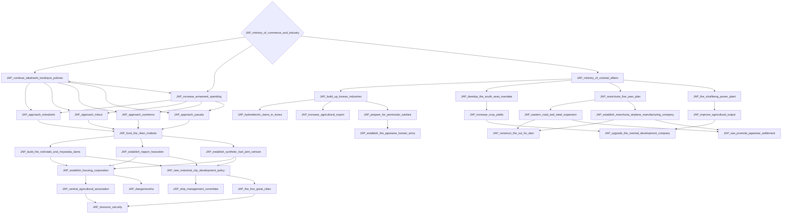
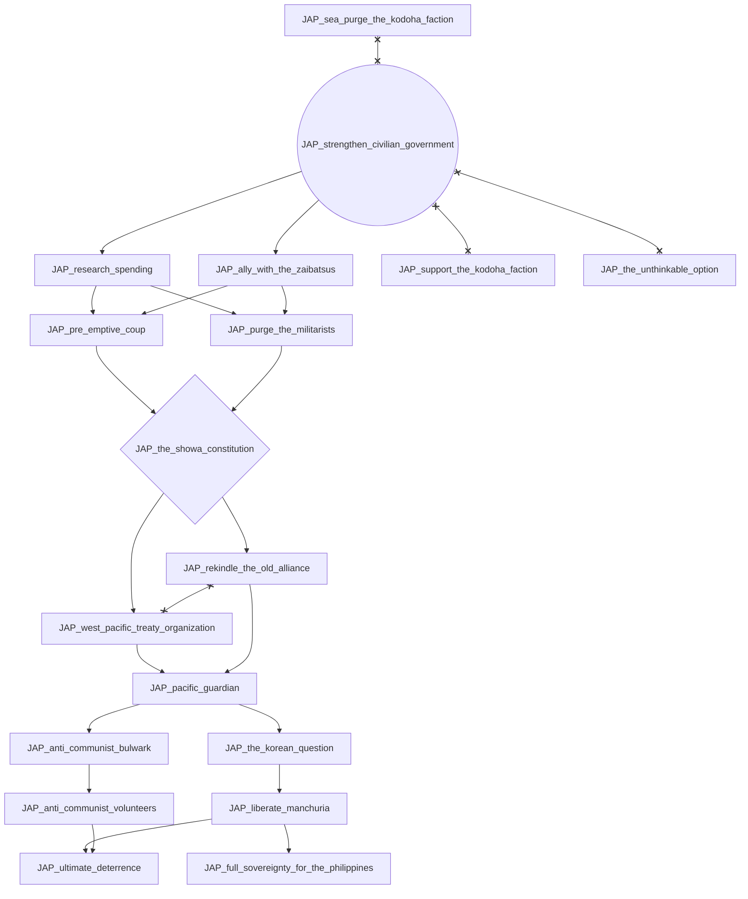
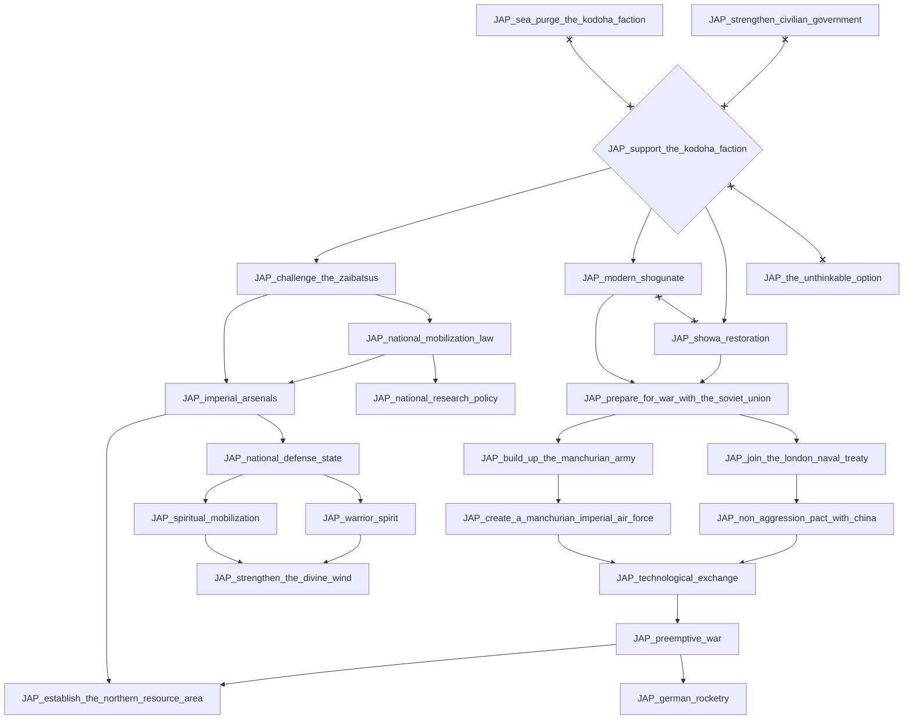
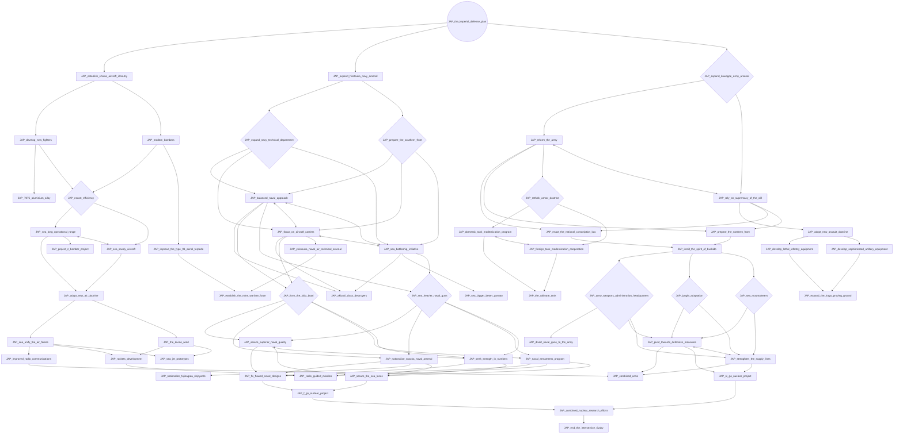
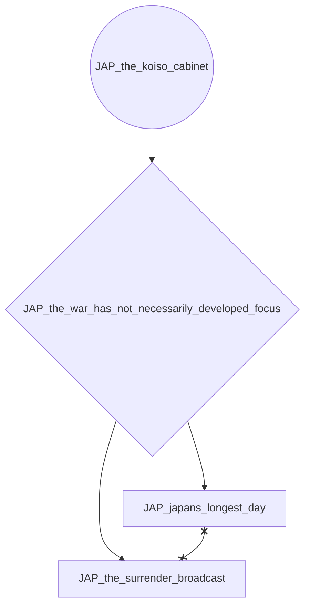
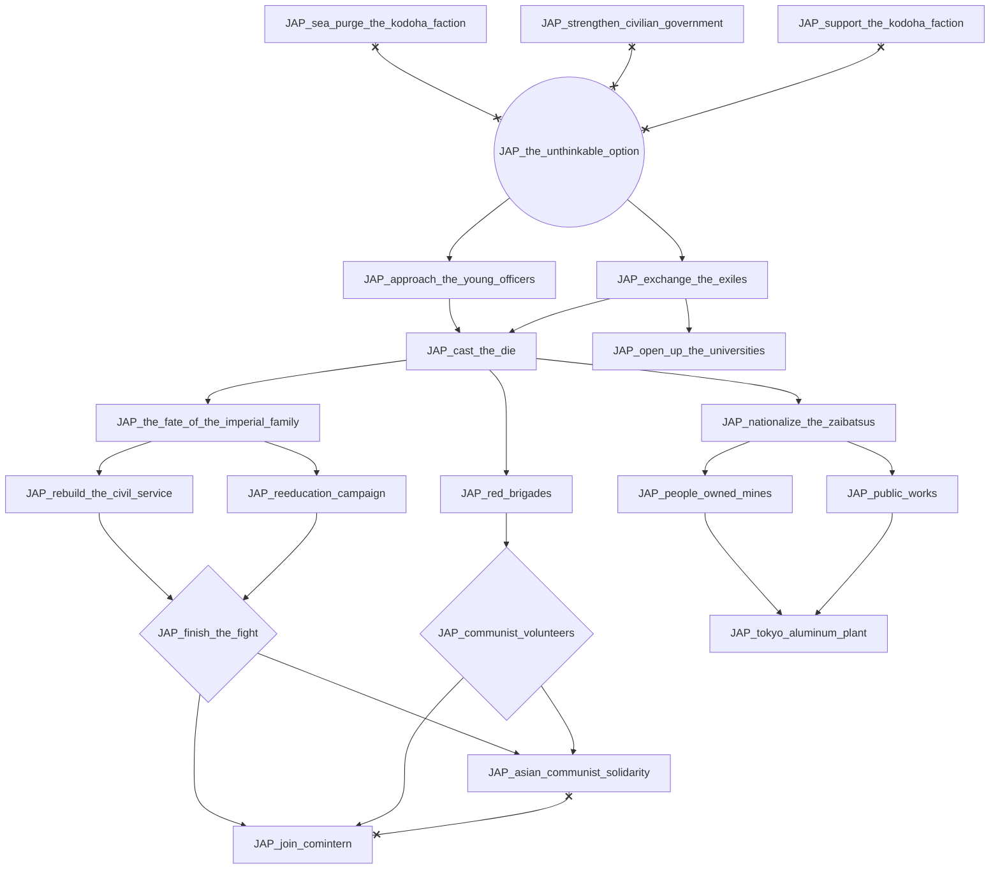

# JAP_ministry_of_commerce_and_industry

# JAP_okadas_military_purge_speech

```mermaid
flowchart TD
    n35["JAP_a_common_currency_for_all_of_asia"]
    n36["JAP_a_free_asia_pacific"]
    n37["JAP_a_functionalist_housing_policy"]
    n38["JAP_a_new_take_on_state_shintoism"]
    n39["JAP_a_pan_asian_diet"]
    n40["JAP_a_red_dawn_over_asia"]
    n41{"JAP_a_red_sun_rises_for_a_new_era"}
    n42["JAP_abe_isoo_focus"]
    n43["JAP_achieving_joubukkokudo"]
    n44["JAP_adopt_syndicalist_ideas"]
    n45["JAP_agricultural_protectionism"]
    n46["JAP_ally_the_philippines"]
    n47["JAP_an_integrated_union"]
    n48["JAP_anti_militarist_speeches_in_the_diet"]
    n49["JAP_appoint_new_generals"]
    n50["JAP_bribe_generals"]
    n51["JAP_build_an_anti_army_coalition"]
    n52["JAP_civilian_nuclear_reactor_investments"]
    n53["JAP_closer_ties_with_the_usa"]
    n54["JAP_conquer_the_army_remnants"]
    n55["JAP_cooperate_with_anarchists"]
    n56["JAP_create_greater_east_asian_treaty_organization"]
    n57{"JAP_crush_the_internal_factions"}
    n58["JAP_crush_the_spirit_of_gekokujo"]
    n59["JAP_demand_submission_from_breawakay_states"]
    n60["JAP_democratic_foreign_exchange_allocation_policy"]
    n61["JAP_democratic_nationalize_zaibatsus"]
    n62{"JAP_democratic_research_slot"}
    n63{"JAP_democratic_war_with_china"}
    n64["JAP_democratic_war_with_manchukuo"]
    n65["JAP_democratic_women_in_the_workforce"]
    n66["JAP_democratic_womens_suffrage"]
    n67["JAP_democratic_work_with_the_zaibatsus"]
    n68["JAP_development_for_the_undeveloped"]
    n69["JAP_divert_military_funds"]
    n70["JAP_draft_the_showa_constitution"]
    n71["JAP_educate_the_peasants"]
    n72["JAP_embrace_amakudari"]
    n73["JAP_ensure_civil_liberties"]
    n74{"JAP_ensure_cross_party_support"}
    n75["JAP_expand_the_metropolitan_police"]
    n76["JAP_experimental_housing_solutions"]
    n77["JAP_extensive_army_maneuvers"]
    n78["JAP_extensive_navy_maneuvers"]
    n79["JAP_form_greater_east_asian_currency_union"]
    n80["JAP_form_greater_east_asian_customs_union"]
    n81["JAP_form_national_cooperatives"]
    n82["JAP_form_pioneer_organizations"]
    n83["JAP_form_the_ldp"]
    n84["JAP_free_asians_from_soviet_opression"]
    n85["JAP_free_colonized_asian_countries"]
    n86["JAP_fukumotoism"]
    n87["JAP_fund_resistance_groups_in_asia"]
    n88["JAP_further_rural_investments"]
    n89["JAP_further_urban_investments"]
    n90["JAP_ganbarou"]
    n91{"JAP_gather_royal_pacifists_support"}
    n92["JAP_go_after_the_capitalists"]
    n93["JAP_greater_east_asian_federation"]
    n94["JAP_guardian_of_the_pacific"]
    n95["JAP_guide_the_chinese"]
    n96["JAP_guide_the_lesser_states"]
    n97["JAP_guide_the_mongols"]
    n98["JAP_hold_a_peoples_tribunal"]
    n99["JAP_ichiro_hatoyama_focus"]
    n100["JAP_ignite_the_korean_peninsula"]
    n101["JAP_implement_army_reforms"]
    n102["JAP_incorporate_buddhist_socialism"]
    n103["JAP_invest_in_foreign_industries"]
    n104["JAP_kikues_new_model"]
    n105["JAP_launch_the_income_doubling_plan"]
    n106["JAP_learn_from_the_nkvd"]
    n107["JAP_lifetime_employment"]
    n108{"JAP_limit_military_power"}
    n109["JAP_limit_the_emperors_power"]
    n110["JAP_machida_chuuji_focus"]
    n111{"JAP_minpon_shugi"}
    n112{"JAP_minshu_shugi"}
    n113["JAP_mitsumasa_yonai_focus"]
    n114["JAP_mobilize_the_proletariat"]
    n115["JAP_modernize_agriculture"]
    n116{"JAP_mountain_village_operation_units"}
    n117{"JAP_offshore_coal"}
    n118(("JAP_okadas_military_purge_speech"))
    n119{"JAP_organize_a_general_election"}
    n120["JAP_organize_the_fifth_column"]
    n121["JAP_organize_the_student_movements"]
    n122["JAP_organize_underground_resistance"]
    n123["JAP_overhaul_the_education_system"]
    n124["JAP_promote_meritocracy"]
    n125["JAP_protect_the_manchurians"]
    n126["JAP_pursue_international_trade"]
    n127["JAP_put_an_end_to_chinese_feudalism"]
    n128{"JAP_raise_support_within_the_proletarian_class"}
    n129["JAP_raise_the_red_flag_high"]
    n130["JAP_reclaim_lost_territories"]
    n131["JAP_redistribute_land_and_wealth"]
    n132["JAP_reform_the_education_system"]
    n133["JAP_return_of_the_manchukuo_exiles"]
    n134["JAP_revere_the_emperor_destroy_the_traitors"]
    n135{"JAP_revoke_the_peace_preservation_law"}
    n136["JAP_rikken_minseito_victory"]
    n137["JAP_rikken_seiyukai_victory"]
    n138["JAP_sea_fate_of_the_imperial_family"]
    n139["JAP_sea_nationalize_the_zaibatsus"]
    n140["JAP_sea_purge_the_kodoha_faction"]
    n141["JAP_sea_rekindle_the_old_alliance"]
    n142["JAP_secretly_rebuild_the_party"]
    n143["JAP_seek_foreign_investments"]
    n144["JAP_seek_yakuza_support"]
    n145["JAP_shinkansen"]
    n146["JAP_social_and_cultural_revolution"]
    n147["JAP_socialism_in_one_state"]
    n148["JAP_split_uo_zaibatsu_monopolies"]
    n149["JAP_spread_revolutionary_flames_to_south_asia"]
    n150["JAP_spread_revolutionary_flames_to_west_asia"]
    n151["JAP_spread_the_revolutuon_south"]
    n152["JAP_strike_down_the_great_pretender"]
    n153["JAP_strike_the_soviets"]
    n154["JAP_sway_disillusioned_young_officers"]
    n155{"JAP_sway_the_navy_moderates"}
    n156["JAP_taiheyo_belt"]
    n157["JAP_the_courage_to_defend_the_revolution"]
    n158["JAP_the_first_five_year_plan"]
    n159["JAP_the_ie_system_and_socialism"]
    n160["JAP_the_indochinese_soviet"]
    n161["JAP_the_labor_farmer_faction_ascendant"]
    n162["JAP_the_lecture_group_ascendant"]
    n163["JAP_the_long_march_to_victory"]
    n164["JAP_the_minitry_of_pan_asian_development"]
    n165["JAP_the_modern_ashigaru"]
    n166["JAP_the_oceanian_soviet"]
    n167["JAP_the_pacific_union_of_soviet_socialist_republics"]
    n168["JAP_the_pan_asian_revolutionary_front"]
    n169["JAP_the_south_pacific_soviet"]
    n170["JAP_the_spirit_of_the_ikko_ikki"]
    n171["JAP_the_uno_school_of_economics"]
    n172["JAP_to_rival_the_comintern"]
    n173["JAP_tokugawa_iesato_focus"]
    n174["JAP_trans_pacific_influence"]
    n175["JAP_transformation_of_nature"]
    n176["JAP_uplift_ainu_revolution_theory"]
    n177["JAP_uplift_labor_unions"]
    n178["JAP_war_communism"]
    n179["JAP_women_in_industry"]
    n180["JAP_wrestle_mongolia_from_the_soviets"]
    n181["JAP_wrestle_tuva_from_the_soviets"]
    n168 --> n35
    n92 --> n36
    n84 --> n36
    n123 --> n37
    n101 --> n38
    n49 --> n38
    n164 --> n39
    n35 --> n39
    n71 --> n39
    n152 --> n40
    n135 --> n41
    n112 --> n42
    n170 --> n43
    n88 --> n44
    n81 --> n44
    n137 --> n45
    n53 --> n46
    n79 --> n47
    n80 --> n47
    n142 --> n48
    n50 --> n49
    n69 --> n49
    n155 --> n50
    n108 --> n50
    n118 --> n51
    n115 --> n52
    n107 --> n52
    n63 --> n53
    n147 --> n54
    n138 --> n55
    n161 --> n55
    n63 --> n56
    n109 --> n57
    n73 --> n57
    n38 --> n58
    n96 --> n59
    n103 --> n60
    n143 --> n60
    n117 --> n61
    n62 --> n61
    n156 --> n62
    n132 --> n62
    n57 --> n63
    n57 --> n64
    n132 --> n65
    n66 --> n65
    n57 --> n66
    n117 --> n67
    n62 --> n67
    n164 --> n68
    n108 --> n69
    n155 --> n69
    n42 --> n70
    n110 --> n70
    n173 --> n70
    n99 --> n70
    n113 --> n70
    n168 --> n71
    n137 --> n72
    n70 --> n73
    n51 --> n74
    n118 --> n75
    n136 --> n76
    n147 --> n77
    n147 --> n78
    n56 --> n79
    n56 --> n80
    n171 --> n81
    n158 --> n82
    n89 --> n82
    n99 --> n83
    n151 --> n84
    n63 --> n85
    n159 --> n86
    n85 --> n87
    n171 --> n88
    n86 --> n89
    n131 --> n90
    n37 --> n90
    n139 --> n90
    n51 --> n91
    n151 --> n92
    n47 --> n93
    n94 --> n93
    n141 --> n94
    n100 --> n95
    n129 --> n96
    n44 --> n96
    n95 --> n97
    n138 --> n98
    n111 --> n99
    n59 --> n100
    n50 --> n101
    n69 --> n101
    n55 --> n102
    n126 --> n103
    n55 --> n104
    n57 --> n105
    n165 --> n106
    n148 --> n107
    n67 --> n107
    n61 --> n107
    n91 --> n108
    n74 --> n108
    n70 --> n109
    n112 --> n110
    n45 --> n111
    n72 --> n111
    n76 --> n112
    n124 --> n112
    n111 --> n113
    n127 --> n114
    n148 --> n115
    n67 --> n115
    n61 --> n115
    n122 --> n116
    n156 --> n117
    n145 --> n117
    n135 --> n119
    n133 --> n120
    n48 --> n121
    n48 --> n122
    n146 --> n123
    n98 --> n123
    n136 --> n124
    n100 --> n125
    n105 --> n126
    n54 --> n127
    n130 --> n127
    n121 --> n128
    n44 --> n129
    n82 --> n129
    n147 --> n130
    n123 --> n131
    n105 --> n132
    n116 --> n133
    n128 --> n133
    n133 --> n135
    n69 --> n135
    n119 --> n136
    n119 --> n137
    n162 --> n138
    n161 --> n138
    n123 --> n139
    n57 --> n141
    n118 --> n142
    n126 --> n143
    n118 --> n144
    n105 --> n145
    n138 --> n146
    n129 --> n147
    n82 --> n147
    n117 --> n148
    n62 --> n148
    n172 --> n149
    n149 --> n150
    n95 --> n151
    n125 --> n151
    n167 --> n152
    n63 --> n153
    n48 --> n154
    n91 --> n155
    n74 --> n155
    n105 --> n156
    n96 --> n157
    n86 --> n158
    n138 --> n159
    n162 --> n159
    n167 --> n160
    n41 --> n161
    n41 --> n162
    n127 --> n163
    n168 --> n164
    n159 --> n165
    n169 --> n166
    n127 --> n167
    n96 --> n168
    n167 --> n169
    n102 --> n170
    n55 --> n171
    n167 --> n172
    n111 --> n173
    n112 --> n173
    n172 --> n174
    n160 --> n175
    n102 --> n176
    n42 --> n177
    n55 --> n178
    n104 --> n179
    n172 --> n180
    n180 --> n181
    n41 x--x n119
    n42 x--x n99
    n42 x--x n110
    n42 x--x n113
    n42 x--x n173
    n56 x--x n141
    n61 x--x n67
    n61 x--x n148
    n67 x--x n148
    n69 x--x n133
    n99 x--x n110
    n99 x--x n113
    n99 x--x n173
    n108 x--x n155
    n110 x--x n113
    n110 x--x n173
    n113 x--x n173
    n118 x--x n134
    n118 x--x n140
    n136 x--x n137
    n161 x--x n162
```

# JAP_revere_the_emperor_destroy_the_traitors

```mermaid
flowchart TD
    n182["JAP_a_green_persimmon"]
    n183["JAP_a_mongol_volunteer_army"]
    n184["JAP_a_truly_righteous_army"]
    n185["JAP_a_worthy_succssor_of_meiji"]
    n186["JAP_align_the_concordia_association"]
    n187["JAP_ally_afghanistan"]
    n188{"JAP_ally_the_dragon_king"}
    n189{"JAP_ally_the_gorkhas"}
    n190["JAP_ally_the_league_of_blood"]
    n191["JAP_amaterasus_aramitama"]
    n192{"JAP_an_expedition_to_tibet"}
    n193["JAP_an_ode_to_showa_restoration"]
    n194["JAP_authorize_aid_to_ethiopia"]
    n195["JAP_battle_for_australia"]
    n196["JAP_best_the_graveyard"]
    n197["JAP_children_of_the_sun"]
    n198{"JAP_claim_the_raven_crown"}
    n199{"JAP_claim_the_scripech"}
    n200["JAP_contact_former_sakurakai_members"]
    n201["JAP_contact_the_masterless_samurai"]
    n202{"JAP_demand_tonkinese_bases"}
    n203["JAP_develop_the_chinese_resources"]
    n204["JAP_embodying_empress_jinguu"]
    n205{"JAP_embrace_kokutai"}
    n206["JAP_empower_the_emperor"]
    n207["JAP_empower_the_shogun"]
    n208["JAP_ensure_temporary_peace_with_china"]
    n209["JAP_establish_mongol_military_government"]
    n210["JAP_establish_the_gunbatsu"]
    n211["JAP_form_the_jikyoku_iinkai"]
    n212["JAP_give_it_your_all_for_the_emperor"]
    n213["JAP_grand_army_purge"]
    n214["JAP_hakko_ichiu"]
    n215["JAP_hasten_the_integration_of_taiwan"]
    n216["JAP_hokushin_ron"]
    n217["JAP_ikki_kitas_state_socialist_ideals"]
    n218["JAP_indoctrination_in_the_military_academy"]
    n219["JAP_integrate_the_government_general"]
    n220["JAP_integrate_the_great_empire_of_manchuria"]
    n221["JAP_integrate_the_kenkokutai"]
    n222["JAP_intensify_anti_guerilla_operations"]
    n223["JAP_invest_in_senbu"]
    n224["JAP_isolate_oceania"]
    n225{"JAP_kantokuen"}
    n226["JAP_launch_the_suiyuan_campaign"]
    n227["JAP_mengjiang_united_autonomous_government"]
    n228["JAP_mongol_autonomous_state"]
    n229["JAP_nanshin_ron"]
    n230["JAP_nationalize_western_corporations"]
    n231["JAP_occupy_east_timor"]
    n232["JAP_occupy_indochina"]
    n233["JAP_occupy_macau"]
    n234["JAP_occupy_siam"]
    n118["JAP_okadas_military_purge_speech"]
    n235["JAP_operation_take_australia"]
    n236["JAP_oppose_the_zaibatsus"]
    n237["JAP_politicize_the_education_system"]
    n238["JAP_prepare_for_the_final_war"]
    n239["JAP_propagandize_the_nihon_shoki"]
    n240["JAP_reinforce_the_beijing_garrison"]
    n241["JAP_remove_the_weeds_from_the_crop"]
    n242["JAP_reorganize_the_united_autonomous_government"]
    n243["JAP_reorganized_national_government"]
    n244["JAP_return_to_sakoku_ron"]
    n134(("JAP_revere_the_emperor_destroy_the_traitors"))
    n245["JAP_revisit_the_thirteen_demands"]
    n246["JAP_revitalize_rural_areas"]
    n247["JAP_sea_establish_the_northern_resource_area"]
    n248["JAP_sea_exploit_southern_resource_area"]
    n249["JAP_sea_pressure_siam"]
    n140["JAP_sea_purge_the_kodoha_faction"]
    n250["JAP_sea_supremacy_of_will"]
    n251["JAP_sea_the_showa_restoration"]
    n252["JAP_societal_bushido"]
    n253["JAP_sonnou_joui"]
    n254["JAP_soviet_japanese_neutrality_pact"]
    n255["JAP_strategic_offensives"]
    n256["JAP_strenghten_manchukuo_imperial_airforce"]
    n257["JAP_strenghten_manchukuo_imperial_army"]
    n258["JAP_strike_down_the_enemy_of_the_people"]
    n259["JAP_strike_the_southern_road"]
    n260["JAP_subdue_the_kwantung_army"]
    n261["JAP_supremacy_of_the_kempeitai"]
    n262["JAP_tennoheika_banzai"]
    n263["JAP_the_art_of_warfare"]
    n264["JAP_the_enemy_of_our_enemy"]
    n265["JAP_the_footsteps_of_jimmu"]
    n266["JAP_the_great_spiritual_evil"]
    n267{"JAP_the_imperial_colors"}
    n268["JAP_the_jeweled_spear_has_struck"]
    n269["JAP_the_persimmon_has_ripened"]
    n270["JAP_the_spirit_of_the_imperial_nation"]
    n271["JAP_the_yamato_spirit"]
    n272["JAP_to_reach_princess_kaguya"]
    n273["JAP_to_rival_zheng_yi_sao"]
    n274["JAP_unsinkable_aircraft_carriers"]
    n275["JAP_utilize_ainu_expertise"]
    n276["JAP_utilize_our_polish_friendship"]
    n277["JAP_yatagarasus_guidance"]
    n225 --> n182
    n208 --> n183
    n250 --> n184
    n206 --> n185
    n219 --> n186
    n215 --> n186
    n199 --> n187
    n189 --> n187
    n192 --> n188
    n198 --> n189
    n188 --> n189
    n251 --> n190
    n273 --> n191
    n272 --> n191
    n240 --> n192
    n251 --> n193
    n134 --> n194
    n224 --> n195
    n199 --> n196
    n189 --> n196
    n271 --> n197
    n192 --> n198
    n198 --> n199
    n188 --> n199
    n190 --> n200
    n190 --> n201
    n229 --> n202
    n240 --> n203
    n271 --> n204
    n251 --> n205
    n205 --> n206
    n205 --> n207
    n216 --> n208
    n245 --> n209
    n134 --> n210
    n240 --> n211
    n236 --> n212
    n210 --> n213
    n268 --> n214
    n260 --> n215
    n140 --> n216
    n134 --> n216
    n251 --> n217
    n251 --> n218
    n260 --> n219
    n186 --> n220
    n190 --> n221
    n255 --> n222
    n245 --> n223
    n274 --> n224
    n275 --> n225
    n209 --> n226
    n242 --> n227
    n227 --> n228
    n140 --> n229
    n134 --> n229
    n236 --> n230
    n259 --> n231
    n202 --> n232
    n243 --> n233
    n202 --> n234
    n195 --> n235
    n217 --> n236
    n252 --> n237
    n266 --> n238
    n270 --> n239
    n237 --> n239
    n245 --> n240
    n210 --> n241
    n209 --> n242
    n255 --> n243
    n267 --> n244
    n140 --> n245
    n134 --> n245
    n236 --> n246
    n182 --> n247
    n269 --> n247
    n229 --> n248
    n202 --> n249
    n218 --> n250
    n241 --> n251
    n213 --> n251
    n264 --> n252
    n276 --> n252
    n244 --> n252
    n184 --> n253
    n262 --> n253
    n229 --> n254
    n240 --> n255
    n257 --> n256
    n216 --> n257
    n266 --> n258
    n234 --> n259
    n249 --> n259
    n218 --> n260
    n184 --> n261
    n250 --> n262
    n207 --> n263
    n267 --> n264
    n271 --> n265
    n251 --> n266
    n207 --> n267
    n206 --> n267
    n265 --> n268
    n197 --> n268
    n225 --> n269
    n252 --> n270
    n239 --> n271
    n204 --> n272
    n204 --> n273
    n229 --> n274
    n216 --> n275
    n267 --> n276
    n265 --> n277
    n182 x--x n269
    n187 x--x n196
    n188 x--x n198
    n189 x--x n199
    n206 x--x n207
    n234 x--x n249
    n118 x--x n134
    n244 x--x n264
    n244 x--x n276
    n134 x--x n140
    n264 x--x n276
```

# JAP_sea_purge_the_kodoha_faction

```mermaid
flowchart TD
    n182["JAP_a_green_persimmon"]
    n183["JAP_a_mongol_volunteer_army"]
    n278["JAP_advance_one_hundred_million_fireballs"]
    n187["JAP_ally_afghanistan"]
    n188{"JAP_ally_the_dragon_king"}
    n189{"JAP_ally_the_gorkhas"}
    n192{"JAP_an_expedition_to_tibet"}
    n195["JAP_battle_for_australia"]
    n196["JAP_best_the_graveyard"]
    n198{"JAP_claim_the_raven_crown"}
    n199{"JAP_claim_the_scripech"}
    n279["JAP_crackdown_on_foreign_agents"]
    n202{"JAP_demand_tonkinese_bases"}
    n203["JAP_develop_the_chinese_resources"]
    n280["JAP_develop_the_yen_bloc"]
    n281["JAP_east_asia_development_board"]
    n282["JAP_east_asian_cooperative_society"]
    n283["JAP_empower_the_thought_police"]
    n284["JAP_enact_religious_organizations_law"]
    n208["JAP_ensure_temporary_peace_with_china"]
    n209["JAP_establish_mongol_military_government"]
    n285["JAP_expand_japan_manchukuo_economic_bloc"]
    n286["JAP_expand_the_showa_research_association"]
    n287["JAP_form_cabinet_intelligence_bureau"]
    n288["JAP_form_the_central_economic_council"]
    n289["JAP_form_the_dai_nippon_fujinkai"]
    n290["JAP_form_the_great_japan_industrial_patriotic_association"]
    n211["JAP_form_the_jikyoku_iinkai"]
    n291["JAP_form_the_yokusan_sonendan"]
    n292["JAP_formalize_japan_china_manchukuo_alliance"]
    n293["JAP_formalize_the_tonarigumi"]
    n294["JAP_found_the_air_defense_surveilance_corps"]
    n295["JAP_found_the_boeitai"]
    n296["JAP_found_the_great_japan_press_association"]
    n297["JAP_fund_propaganda_films"]
    n298["JAP_greater_east_asia_railroad"]
    n216["JAP_hokushin_ron"]
    n299{"JAP_ichioku_isshin"}
    n300["JAP_imperial_headquarters_liasion_conference"]
    n301["JAP_imperial_rule_assistance_association"]
    n302["JAP_integrate_the_great_japan_youth_party"]
    n222["JAP_intensify_anti_guerilla_operations"]
    n223["JAP_invest_in_senbu"]
    n224["JAP_isolate_oceania"]
    n303["JAP_issue_the_senjinkun_military_code"]
    n304["JAP_issue_the_shinmin_no_michi_manifesto"]
    n305["JAP_issue_the_ten_commandments_for_marriage"]
    n306["JAP_joshi_teishin_tai"]
    n225{"JAP_kantokuen"}
    n307["JAP_konoes_first_cabinet"]
    n226["JAP_launch_the_suiyuan_campaign"]
    n227["JAP_mengjiang_united_autonomous_government"]
    n308["JAP_ministry_of_greater_east_asia"]
    n228["JAP_mongol_autonomous_state"]
    n229["JAP_nanshin_ron"]
    n309["JAP_national_defense_brotherhood"]
    n310["JAP_new_order_in_east_asia"]
    n311["JAP_new_order_movement"]
    n231["JAP_occupy_east_timor"]
    n232["JAP_occupy_indochina"]
    n233["JAP_occupy_macau"]
    n234["JAP_occupy_siam"]
    n118["JAP_okadas_military_purge_speech"]
    n235["JAP_operation_take_australia"]
    n312["JAP_promote_pan_asianism"]
    n313{"JAP_promulgate_the_military_ministers_system"}
    n240["JAP_reinforce_the_beijing_garrison"]
    n314["JAP_reiterate_the_three_principles_of_hirota"]
    n242["JAP_reorganize_the_united_autonomous_government"]
    n243["JAP_reorganized_national_government"]
    n315["JAP_reprimand_hamada_kunimatsu"]
    n134["JAP_revere_the_emperor_destroy_the_traitors"]
    n245["JAP_revisit_the_thirteen_demands"]
    n247["JAP_sea_establish_the_northern_resource_area"]
    n248["JAP_sea_exploit_southern_resource_area"]
    n316["JAP_sea_greater_east_asian_co_properity_sphere"]
    n317["JAP_sea_guide_the_zaibatsus"]
    n318["JAP_sea_mil_tech_coop_with_germany"]
    n319["JAP_sea_national_defense_state"]
    n320["JAP_sea_national_spiritual_mobliization_movement"]
    n249["JAP_sea_pressure_siam"]
    n140(("JAP_sea_purge_the_kodoha_faction"))
    n321["JAP_sea_state_general_mobilization_law"]
    n322["JAP_sea_tripartite_pact"]
    n323["JAP_solidify_tohokai_rule"]
    n254["JAP_soviet_japanese_neutrality_pact"]
    n255["JAP_strategic_offensives"]
    n256["JAP_strenghten_manchukuo_imperial_airforce"]
    n257["JAP_strenghten_manchukuo_imperial_army"]
    n324["JAP_strengthen_civilian_government"]
    n259["JAP_strike_the_southern_road"]
    n325["JAP_support_the_kodoha_faction"]
    n326["JAP_supreme_council_for_direction_of_war"]
    n327["JAP_the_crysanthemum_throne"]
    n328["JAP_the_eternal_kingdom"]
    n329["JAP_the_flying_geese"]
    n330["JAP_the_harakiri_debate"]
    n331["JAP_the_metal_collection_order"]
    n269["JAP_the_persimmon_has_ripened"]
    n332["JAP_the_unthinkable_option"]
    n333["JAP_tojos_premiership"]
    n274["JAP_unsinkable_aircraft_carriers"]
    n275["JAP_utilize_ainu_expertise"]
    n334["JAP_yamamotos_premiership"]
    n225 --> n182
    n208 --> n183
    n295 --> n278
    n199 --> n187
    n189 --> n187
    n192 --> n188
    n198 --> n189
    n188 --> n189
    n240 --> n192
    n224 --> n195
    n199 --> n196
    n189 --> n196
    n192 --> n198
    n198 --> n199
    n188 --> n199
    n287 --> n279
    n229 --> n202
    n240 --> n203
    n285 --> n280
    n316 --> n281
    n140 --> n282
    n296 --> n283
    n305 --> n284
    n321 --> n284
    n216 --> n208
    n245 --> n209
    n316 --> n285
    n288 --> n286
    n320 --> n287
    n320 --> n288
    n333 --> n289
    n334 --> n289
    n327 --> n289
    n323 --> n289
    n288 --> n290
    n240 --> n211
    n301 --> n291
    n314 --> n292
    n301 --> n293
    n333 --> n294
    n334 --> n294
    n327 --> n294
    n323 --> n294
    n333 --> n295
    n334 --> n295
    n327 --> n295
    n323 --> n295
    n287 --> n296
    n333 --> n297
    n334 --> n297
    n327 --> n297
    n323 --> n297
    n329 --> n298
    n140 --> n216
    n134 --> n216
    n293 --> n299
    n319 --> n299
    n291 --> n299
    n140 --> n300
    n311 --> n301
    n291 --> n302
    n255 --> n222
    n245 --> n223
    n274 --> n224
    n301 --> n303
    n303 --> n304
    n320 --> n305
    n333 --> n306
    n334 --> n306
    n327 --> n306
    n323 --> n306
    n275 --> n225
    n330 --> n307
    n209 --> n226
    n242 --> n227
    n281 --> n308
    n227 --> n228
    n140 --> n229
    n134 --> n229
    n333 --> n309
    n307 --> n310
    n284 --> n311
    n259 --> n231
    n202 --> n232
    n243 --> n233
    n202 --> n234
    n195 --> n235
    n308 --> n312
    n280 --> n312
    n298 --> n312
    n140 --> n313
    n245 --> n240
    n315 --> n314
    n209 --> n242
    n255 --> n243
    n313 --> n315
    n140 --> n245
    n134 --> n245
    n182 --> n247
    n269 --> n247
    n229 --> n248
    n301 --> n316
    n288 --> n317
    n322 --> n318
    n301 --> n319
    n314 --> n320
    n307 --> n320
    n202 --> n249
    n320 --> n321
    n311 --> n322
    n299 --> n323
    n229 --> n254
    n240 --> n255
    n257 --> n256
    n216 --> n257
    n234 --> n259
    n249 --> n259
    n333 --> n326
    n334 --> n326
    n327 --> n326
    n323 --> n326
    n299 --> n327
    n297 --> n328
    n316 --> n329
    n313 --> n330
    n333 --> n331
    n334 --> n331
    n327 --> n331
    n323 --> n331
    n225 --> n269
    n299 --> n333
    n229 --> n274
    n216 --> n275
    n299 --> n334
    n182 x--x n269
    n187 x--x n196
    n188 x--x n198
    n189 x--x n199
    n234 x--x n249
    n118 x--x n140
    n315 x--x n330
    n134 x--x n140
    n140 x--x n324
    n140 x--x n325
    n140 x--x n332
    n323 x--x n327
    n323 x--x n333
    n323 x--x n334
    n327 x--x n333
    n327 x--x n334
    n333 x--x n334
```

# JAP_strengthen_civilian_government

# JAP_support_the_kodoha_faction

# JAP_the_imperial_defense_plan

# JAP_the_koiso_cabinet

# JAP_the_unthinkable_option

