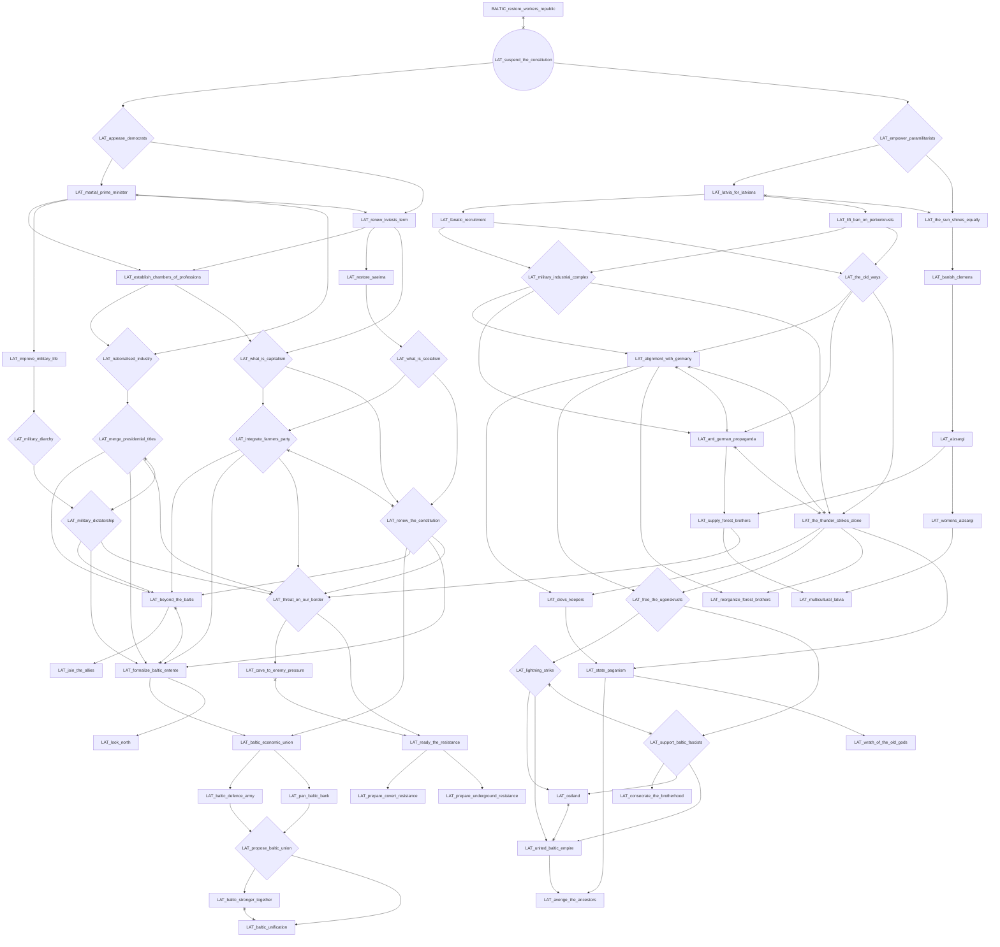

# LAT_suspend_the_constitution

```mermaid
flowchart TD
    n1["BALTIC_restore_workers_republic"]
    n2["LAT_aizsargi"]
    n3["LAT_alignment_with_germany"]
    n4["LAT_anti_german_propaganda"]
    n5{"LAT_appease_democrats"}
    n6["LAT_avenge_the_ancestors"]
    n7["LAT_baltic_defence_army"]
    n8["LAT_baltic_economic_union"]
    n9["LAT_baltic_stronger_together"]
    n10["LAT_baltic_unification"]
    n11["LAT_banish_clemens"]
    n12["LAT_beyond_the_baltic"]
    n13["LAT_cave_to_enemy_pressure"]
    n14["LAT_consecrate_the_brotherhood"]
    n15["LAT_dievs_keepers"]
    n16{"LAT_empower_paramilitarists"}
    n17["LAT_establish_chambers_of_professions"]
    n18["LAT_fanatic_recruitment"]
    n19["LAT_formalize_baltic_entente"]
    n20{"LAT_free_the_ugonskrusts"}
    n21["LAT_improve_military_life"]
    n22{"LAT_integrate_farmers_party"}
    n23["LAT_join_the_allies"]
    n24["LAT_latvia_for_latvians"]
    n25["LAT_lift_ban_on_perkonkrusts"]
    n26{"LAT_lightning_strike"}
    n27["LAT_look_north"]
    n28["LAT_martial_prime_minister"]
    n29{"LAT_merge_presidential_titles"}
    n30{"LAT_military_diarchy"}
    n31{"LAT_military_dictatorship"}
    n32{"LAT_military_industrial_complex"}
    n33["LAT_multicultural_latvia"]
    n34{"LAT_nationalised_industry"}
    n35["LAT_ostland"]
    n36["LAT_pan_baltic_bank"]
    n37["LAT_prepare_covert_resistance"]
    n38["LAT_prepare_underground_resistance"]
    n39{"LAT_propose_baltic_union"}
    n40["LAT_ready_the_resistance"]
    n41["LAT_renew_kviesis_term"]
    n42{"LAT_renew_the_constitution"}
    n43["LAT_reorganize_forest_brothers"]
    n44["LAT_restore_saeima"]
    n45["LAT_state_paganism"]
    n46["LAT_supply_forest_brothers"]
    n47{"LAT_support_baltic_fascists"}
    n48(("LAT_suspend_the_constitution"))
    n49{"LAT_the_old_ways"}
    n50["LAT_the_sun_shines_equally"]
    n51["LAT_the_thunder_strikes_alone"]
    n52{"LAT_threat_on_our_border"}
    n53["LAT_united_baltic_empire"]
    n54{"LAT_what_is_capitalism"}
    n55{"LAT_what_is_socialism"}
    n56["LAT_womens_aizsargi"]
    n57["LAT_wrath_of_the_old_gods"]
    n11 --> n2
    n49 --> n3
    n32 --> n3
    n49 --> n4
    n32 --> n4
    n48 --> n5
    n53 --> n6
    n45 --> n6
    n8 --> n7
    n19 --> n8
    n42 --> n8
    n39 --> n9
    n39 --> n10
    n50 --> n11
    n31 --> n12
    n42 --> n12
    n22 --> n12
    n29 --> n12
    n52 --> n13
    n47 --> n14
    n3 --> n15
    n51 --> n15
    n48 --> n16
    n28 --> n17
    n41 --> n17
    n24 --> n18
    n31 --> n19
    n42 --> n19
    n22 --> n19
    n29 --> n19
    n3 --> n20
    n51 --> n20
    n28 --> n21
    n54 --> n22
    n55 --> n22
    n12 --> n23
    n16 --> n24
    n24 --> n25
    n20 --> n26
    n19 --> n27
    n5 --> n28
    n34 --> n29
    n21 --> n30
    n30 --> n31
    n25 --> n32
    n18 --> n32
    n46 --> n33
    n56 --> n33
    n28 --> n34
    n17 --> n34
    n26 --> n35
    n47 --> n35
    n8 --> n36
    n40 --> n37
    n40 --> n38
    n36 --> n39
    n7 --> n39
    n52 --> n40
    n5 --> n41
    n55 --> n42
    n54 --> n42
    n51 --> n43
    n3 --> n43
    n41 --> n44
    n15 --> n45
    n51 --> n45
    n4 --> n46
    n2 --> n46
    n20 --> n47
    n25 --> n49
    n18 --> n49
    n16 --> n50
    n32 --> n51
    n49 --> n51
    n31 --> n52
    n42 --> n52
    n22 --> n52
    n29 --> n52
    n46 --> n52
    n26 --> n53
    n47 --> n53
    n41 --> n54
    n17 --> n54
    n44 --> n55
    n2 --> n56
    n45 --> n57
    n1 x--x n48
    n3 x--x n4
    n3 x--x n51
    n4 x--x n51
    n9 x--x n10
    n12 x--x n19
    n13 x--x n40
    n22 x--x n42
    n24 x--x n50
    n26 x--x n47
    n28 x--x n41
    n29 x--x n31
    n35 x--x n53
```
