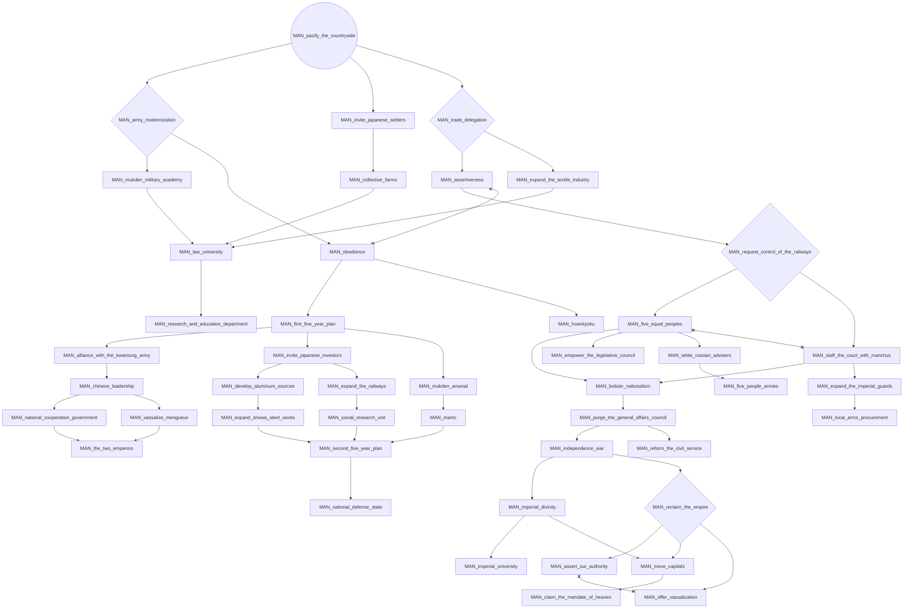

# MAN_pacify_the_countryside

```mermaid
flowchart TD
    n1["MAN_alliance_with_the_kwantung_army"]
    n2{"MAN_army_modernization"}
    n3["MAN_assert_our_authority"]
    n4["MAN_assertiveness"]
    n5["MAN_bolster_nationalism"]
    n6["MAN_chinese_leadership"]
    n7["MAN_claim_the_mandate_of_heaven"]
    n8["MAN_collective_farms"]
    n9["MAN_develop_aluminum_sources"]
    n10["MAN_empower_the_legislative_council"]
    n11["MAN_expand_showa_steel_works"]
    n12["MAN_expand_the_imperial_guards"]
    n13["MAN_expand_the_railways"]
    n14["MAN_expand_the_textile_industry"]
    n15["MAN_first_five_year_plan"]
    n16["MAN_five_equal_peoples"]
    n17["MAN_five_people_armies"]
    n18["MAN_hoankyoku"]
    n19["MAN_imperial_divinity"]
    n20["MAN_imperial_university"]
    n21["MAN_independence_war"]
    n22["MAN_invite_japanese_investors"]
    n23["MAN_invite_japanese_settlers"]
    n24["MAN_law_university"]
    n25["MAN_local_arms_procurement"]
    n26["MAN_mamc"]
    n27["MAN_move_capitals"]
    n28["MAN_mukden_arsenal"]
    n29["MAN_mukden_military_academy"]
    n30["MAN_national_cooperation_government"]
    n31["MAN_national_defense_state"]
    n32["MAN_obedience"]
    n33["MAN_offer_vassalization"]
    n34(("MAN_pacify_the_countryside"))
    n35["MAN_purge_the_general_affairs_council"]
    n36{"MAN_reclaim_the_empire"}
    n37["MAN_reform_the_civil_service"]
    n38{"MAN_request_control_of_the_railways"}
    n39["MAN_research_and_education_department"]
    n40["MAN_second_five_year_plan"]
    n41["MAN_social_research_unit"]
    n42["MAN_staff_the_court_with_manchus"]
    n43["MAN_the_two_emperors"]
    n44{"MAN_trade_delegation"}
    n45["MAN_vassalize_mengukuo"]
    n46["MAN_white_russian_advisers"]
    n15 --> n1
    n34 --> n2
    n36 --> n3
    n44 --> n4
    n42 --> n5
    n16 --> n5
    n1 --> n6
    n27 --> n7
    n23 --> n8
    n22 --> n9
    n16 --> n10
    n9 --> n11
    n42 --> n12
    n22 --> n13
    n44 --> n14
    n32 --> n15
    n38 --> n16
    n46 --> n17
    n32 --> n18
    n21 --> n19
    n19 --> n20
    n35 --> n21
    n15 --> n22
    n34 --> n23
    n8 --> n24
    n29 --> n24
    n14 --> n24
    n12 --> n25
    n28 --> n26
    n19 --> n27
    n36 --> n27
    n15 --> n28
    n2 --> n29
    n6 --> n30
    n40 --> n31
    n2 --> n32
    n36 --> n33
    n5 --> n35
    n21 --> n36
    n35 --> n37
    n4 --> n38
    n24 --> n39
    n41 --> n40
    n11 --> n40
    n26 --> n40
    n13 --> n41
    n38 --> n42
    n45 --> n43
    n30 --> n43
    n34 --> n44
    n6 --> n45
    n16 --> n46
    n3 x--x n33
    n4 x--x n32
    n16 x--x n42
```
