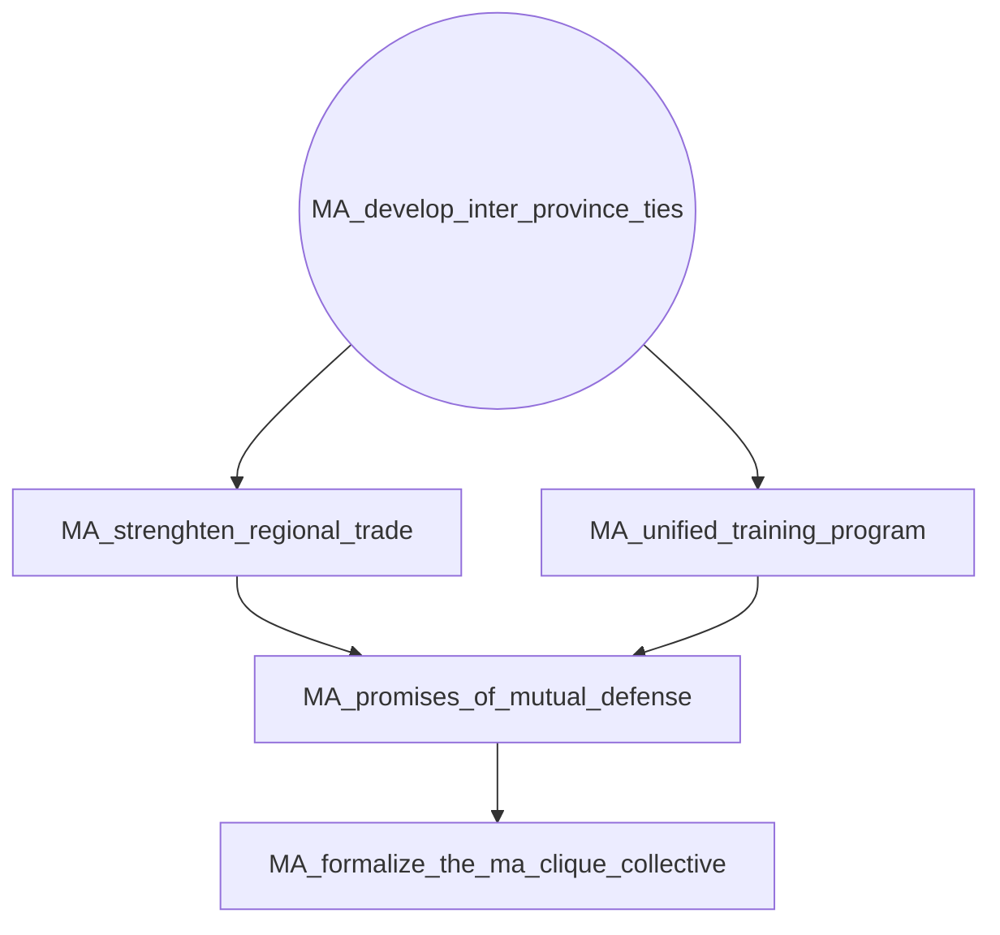

# MA_develop_inter_province_ties

```mermaid
flowchart TD
    n1(("MA_develop_inter_province_ties"))
    n2["MA_formalize_the_ma_clique_collective"]
    n3["MA_promises_of_mutual_defense"]
    n4["MA_strenghten_regional_trade"]
    n5["MA_unified_training_program"]
    n3 --> n2
    n4 --> n3
    n5 --> n3
    n1 --> n4
    n1 --> n5
```
