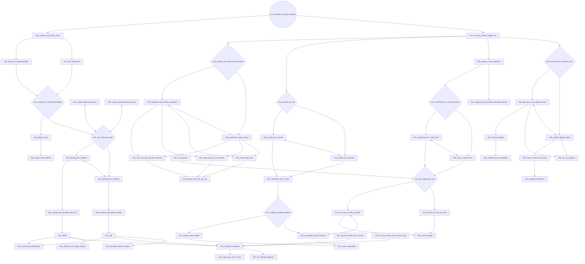
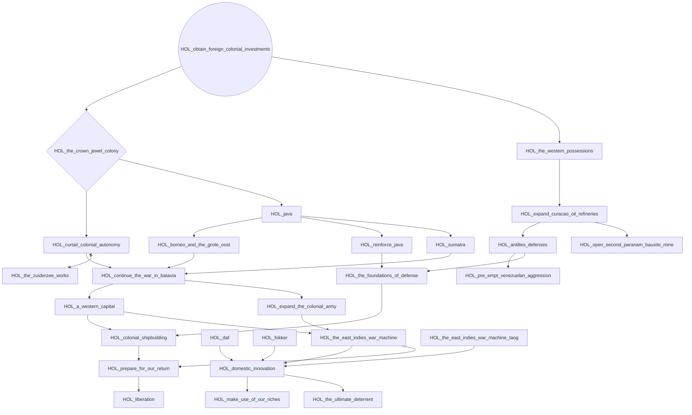
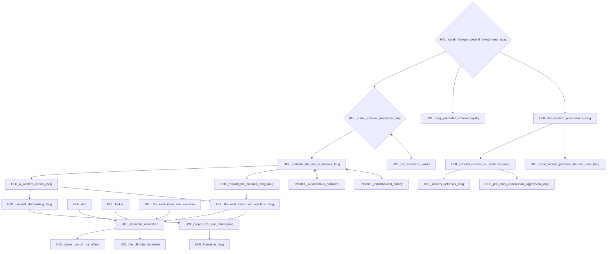

# HOL_abandon_the_gold_standard

```mermaid
flowchart TD
    n1(("HOL_abandon_the_gold_standard"))
    n2["HOL_air_cover_for_the_new_fleet"]
    n3["HOL_anti_tank_guns_for_the_continent"]
    n4{"HOL_appoint_new_supreme_commander"}
    n5["HOL_aviatic_aspirations"]
    n6["HOL_continental_shipbuilding"]
    n7["HOL_continue_the_public_works"]
    n8{"HOL_cornerstone_of_colonial_defense"}
    n9["HOL_curtail_colonial_autonomy"]
    n10["HOL_curtail_colonial_autonomy_taog"]
    n11["HOL_daf"]
    n12["HOL_develop_the_randstad"]
    n13["HOL_develop_the_zandstad"]
    n14["HOL_domestic_innovation"]
    n15["HOL_domestic_jet_engine_designs"]
    n16["HOL_domestic_vehicle_designs"]
    n17["HOL_escorts_for_the_new_fleet"]
    n18["HOL_expand_RD_facilities"]
    n19["HOL_expand_the_amsterdam_petroleum_harbor"]
    n20{"HOL_expand_the_artillerieinrichtingen"}
    n21["HOL_expand_the_ijmuiden_steel_mill"]
    n22{"HOL_expand_the_mld"}
    n23["HOL_finish_the_noordoostpolder"]
    n24["HOL_fokker"]
    n25["HOL_fortress_holland"]
    n26["HOL_friesland_agricultural_impetus"]
    n27["HOL_further_reinforce_the_ports"]
    n28["HOL_germany_is_the_greater_threat"]
    n29["HOL_join_germany"]
    n30["HOL_lessons_from_the_last_war"]
    n31["HOL_light_tanks_for_the_colonies"]
    n32["HOL_longer_range_models"]
    n33["HOL_make_use_of_our_riches"]
    n34["HOL_modernize_our_infantry_equipment"]
    n35["HOL_modernize_the_air_fleet"]
    n36["HOL_modernize_the_cruiser_fleet"]
    n37["HOL_modernize_the_grebbeline"]
    n38["HOL_naval_heritage"]
    n39["HOL_overturn_military_budget_cuts"]
    n40["HOL_philips_focus"]
    n41["HOL_prepare_naval_expansion"]
    n42{"HOL_prepare_the_inundation_lines"}
    n43["HOL_production_under_license"]
    n44["HOL_protect_against_britain"]
    n45["HOL_protect_the_colonies"]
    n46["HOL_protect_the_mainland"]
    n47["HOL_rely_on_submarines"]
    n48["HOL_secret_staff_talks"]
    n49["HOL_southward_defenses"]
    n50{"HOL_strategic_bombing_defense"}
    n51{"HOL_the_battlecruiser_plan"}
    n52["HOL_the_east_indies_war_machine"]
    n53["HOL_the_east_indies_war_machine_taog"]
    n54["HOL_the_maastunnel"]
    n55["HOL_the_ultimate_deterrent"]
    n56{"HOL_the_zuiderzee_works"}
    n57["HOL_unsinkable_aircraft_carriers"]
    n58["HOL_war_on_pacifism"]
    n51 --> n2
    n34 --> n3
    n43 --> n3
    n39 --> n4
    n32 --> n5
    n57 --> n5
    n24 --> n6
    n11 --> n6
    n1 --> n7
    n41 --> n8
    n26 --> n11
    n56 --> n12
    n56 --> n13
    n52 --> n14
    n24 --> n14
    n11 --> n14
    n53 --> n14
    n24 --> n15
    n11 --> n16
    n51 --> n17
    n40 --> n18
    n41 --> n19
    n23 --> n20
    n54 --> n20
    n12 --> n21
    n39 --> n22
    n7 --> n23
    n21 --> n24
    n28 --> n25
    n13 --> n26
    n44 --> n27
    n42 --> n28
    n31 --> n30
    n48 --> n30
    n3 --> n30
    n34 --> n31
    n43 --> n31
    n50 --> n32
    n14 --> n33
    n4 --> n34
    n46 --> n35
    n45 --> n35
    n8 --> n36
    n25 --> n37
    n2 --> n38
    n17 --> n38
    n1 --> n39
    n20 --> n40
    n39 --> n41
    n39 --> n42
    n4 --> n43
    n42 --> n44
    n22 --> n45
    n22 --> n46
    n8 --> n47
    n34 --> n48
    n43 --> n48
    n27 --> n49
    n35 --> n50
    n47 --> n51
    n36 --> n51
    n29 --> n51
    n7 --> n54
    n14 --> n55
    n20 --> n56
    n50 --> n57
    n44 --> n58
    n28 --> n58
    n2 x--x n57
    n9 x--x n56
    n10 x--x n56
    n12 x--x n13
    n28 x--x n44
    n34 x--x n43
    n36 x--x n47
    n45 x--x n46
```

# HOL_form_new_government

```mermaid
flowchart TD
    n59["HOL_a_new_dutch_unity"]
    n60["HOL_affirm_loyalty_to_moscow"]
    n2["HOL_air_cover_for_the_new_fleet"]
    n61["HOL_allied_technological_developments"]
    n62["HOL_american_west_indies_protectorate"]
    n63["HOL_assume_the_naval_burden"]
    n64["HOL_bastion_of_true_communism"]
    n65["HOL_beginnings_of_a_dutch_blitzkrieg"]
    n66["HOL_bring_socialism_south"]
    n67["HOL_cave_to_the_british"]
    n68["HOL_cave_to_the_germans"]
    n69["HOL_combined_chiefs_of_staff_representation"]
    n70["HOL_de_jeugdstorm"]
    n71["HOL_de_vaarplicht"]
    n72["HOL_de_vernieuwing"]
    n73{"HOL_decolonization"}
    n74["HOL_depillarization"]
    n75["HOL_develop_the_south"]
    n76["HOL_enemies_on_all_fronts"]
    n17["HOL_escorts_for_the_new_fleet"]
    n77["HOL_for_the_common_good"]
    n78(("HOL_form_new_government"))
    n79["HOL_form_the_benelux"]
    n80["HOL_foundations_for_a_european_union"]
    n81["HOL_french_military_mission"]
    n82{"HOL_gateway_to_europe"}
    n83{"HOL_german_technological_exchange"}
    n84["HOL_go_with_britain"]
    n85["HOL_haven_of_tolerance"]
    n86["HOL_imperial_ambitions"]
    n87["HOL_implement_the_program"]
    n29["HOL_join_germany"]
    n88["HOL_join_the_french"]
    n89["HOL_lead_the_minor_democracies"]
    n90["HOL_legacy_of_the_de_zeven_provincien_mutiny"]
    n91["HOL_lessons_from_the_low_countries"]
    n92{"HOL_maintain_trade_neutrality"}
    n93["HOL_making_the_ends_of_europe_meet"]
    n94["HOL_mobilize_the_masses"]
    n36["HOL_modernize_the_cruiser_fleet"]
    n38["HOL_naval_heritage"]
    n95{"HOL_oranje_boven"}
    n96{"HOL_placate_the_japanese"}
    n97["HOL_pre_empt_western_intervention"]
    n98{"HOL_red_is_the_new_orange"}
    n47["HOL_rely_on_submarines"]
    n99["HOL_replace_the_defeatist_government"]
    n100["HOL_request_allied_favors"]
    n101["HOL_responsibility_for_our_own_defense"]
    n102["HOL_revive_the_buffer_state_proposal"]
    n103["HOL_royal_arms_purchases"]
    n104["HOL_ship_a_day_sinking_quotas"]
    n105["HOL_socialist_industrial_support"]
    n106["HOL_soviet_technical_teams"]
    n107{"HOL_strength_over_blood"}
    n108["HOL_symbol_of_resistance"]
    n109["HOL_taking_back_french_flanders"]
    n110["HOL_taking_back_our_old_colonies"]
    n51{"HOL_the_battlecruiser_plan"}
    n111["HOL_the_best_defense"]
    n112["HOL_the_continents_best_and_brightest"]
    n113["HOL_the_fourth_ally"]
    n114["HOL_the_netherlands_first"]
    n115["HOL_the_only_man_in_the_dutch_government"]
    n116["HOL_the_singapore_conferences"]
    n117["HOL_the_united_netherlands"]
    n118{"HOL_unity_through_democracy"}
    n57["HOL_unsinkable_aircraft_carriers"]
    n119["HOL_volk_en_vaderland"]
    n120["HOL_wilhelminism"]
    n121["HOL_zandery_military_airport"]
    n72 --> n59
    n74 --> n59
    n73 --> n60
    n98 --> n60
    n51 --> n2
    n116 --> n61
    n104 --> n62
    n61 --> n62
    n96 --> n63
    n73 --> n64
    n98 --> n64
    n83 --> n65
    n64 --> n66
    n88 --> n66
    n60 --> n66
    n82 --> n67
    n82 --> n68
    n100 --> n69
    n62 --> n69
    n119 --> n70
    n99 --> n71
    n84 --> n71
    n115 --> n72
    n90 --> n73
    n115 --> n74
    n102 --> n75
    n64 --> n76
    n51 --> n17
    n105 --> n77
    n89 --> n79
    n91 --> n80
    n88 --> n81
    n78 --> n82
    n29 --> n83
    n95 --> n84
    n118 --> n84
    n76 --> n85
    n110 --> n86
    n114 --> n87
    n107 --> n29
    n73 --> n88
    n98 --> n88
    n118 --> n89
    n92 --> n90
    n79 --> n91
    n101 --> n91
    n82 --> n92
    n106 --> n93
    n105 --> n94
    n2 --> n38
    n17 --> n38
    n92 --> n95
    n29 --> n96
    n81 --> n97
    n76 --> n97
    n90 --> n98
    n95 --> n99
    n118 --> n99
    n71 --> n100
    n89 --> n101
    n59 --> n102
    n100 --> n102
    n72 --> n103
    n71 --> n104
    n116 --> n104
    n60 --> n105
    n88 --> n105
    n60 --> n106
    n119 --> n107
    n95 --> n108
    n87 --> n109
    n117 --> n110
    n47 --> n51
    n36 --> n51
    n29 --> n51
    n80 --> n111
    n80 --> n112
    n69 --> n113
    n107 --> n114
    n108 --> n115
    n99 --> n115
    n84 --> n116
    n29 --> n117
    n114 --> n117
    n67 --> n118
    n68 --> n119
    n59 --> n120
    n62 --> n121
    n60 x--x n64
    n60 x--x n88
    n2 x--x n57
    n63 x--x n65
    n64 x--x n88
    n67 x--x n68
    n67 x--x n92
    n68 x--x n92
    n84 x--x n89
    n29 x--x n114
    n90 x--x n95
```

# HOL_obtain_foreign_colonial_investments

```mermaid
flowchart TD
    n122["HOL_a_western_capital"]
    n123["HOL_antilles_defenses"]
    n124["HOL_borneo_and_the_grote_oost"]
    n125["HOL_colonial_shipbuilding"]
    n126["HOL_continue_the_war_in_batavia"]
    n9["HOL_curtail_colonial_autonomy"]
    n11["HOL_daf"]
    n14["HOL_domestic_innovation"]
    n127["HOL_expand_curacao_oil_refineries"]
    n128["HOL_expand_the_colonial_army"]
    n24["HOL_fokker"]
    n129["HOL_java"]
    n130["HOL_liberation"]
    n33["HOL_make_use_of_our_riches"]
    n131(("HOL_obtain_foreign_colonial_investments"))
    n132["HOL_open_second_paranam_bauxite_mine"]
    n133["HOL_pre_empt_venezuelan_aggression"]
    n134["HOL_prepare_for_our_return"]
    n135["HOL_reinforce_java"]
    n136["HOL_sumatra"]
    n137{"HOL_the_crown_jewel_colony"}
    n52["HOL_the_east_indies_war_machine"]
    n53["HOL_the_east_indies_war_machine_taog"]
    n138["HOL_the_foundations_of_defense"]
    n55["HOL_the_ultimate_deterrent"]
    n139["HOL_the_western_possessions"]
    n56["HOL_the_zuiderzee_works"]
    n126 --> n122
    n127 --> n123
    n129 --> n124
    n122 --> n125
    n138 --> n125
    n136 --> n126
    n124 --> n126
    n9 --> n126
    n137 --> n9
    n52 --> n14
    n24 --> n14
    n11 --> n14
    n53 --> n14
    n139 --> n127
    n126 --> n128
    n137 --> n129
    n134 --> n130
    n14 --> n33
    n127 --> n132
    n123 --> n133
    n125 --> n134
    n52 --> n134
    n129 --> n135
    n129 --> n136
    n131 --> n137
    n122 --> n52
    n128 --> n52
    n123 --> n138
    n135 --> n138
    n14 --> n55
    n131 --> n139
    n9 x--x n56
```

# HOL_obtain_foreign_colonial_investments_taog

```mermaid
flowchart TD
    n140["HOL_a_western_capital_taog"]
    n141["HOL_antilles_defenses_taog"]
    n142["HOL_colonial_shipbuilding_taog"]
    n143["HOL_continue_the_war_in_batavia_taog"]
    n10{"HOL_curtail_colonial_autonomy_taog"}
    n11["HOL_daf"]
    n14["HOL_domestic_innovation"]
    n144["HOL_expand_curacao_oil_refineries_taog"]
    n145["HOL_expand_the_colonial_army_taog"]
    n24["HOL_fokker"]
    n146["HOL_liberation_taog"]
    n33["HOL_make_use_of_our_riches"]
    n147{"HOL_obtain_foreign_colonial_investments_taog"}
    n148["HOL_open_second_paranam_bauxite_mine_taog"]
    n149["HOL_pre_empt_venezuelan_aggression_taog"]
    n150["HOL_prepare_for_our_return_taog"]
    n151["HOL_taog_guarantee_colonial_loyalty"]
    n52["HOL_the_east_indies_war_machine"]
    n53["HOL_the_east_indies_war_machine_taog"]
    n55["HOL_the_ultimate_deterrent"]
    n152["HOL_the_western_possessions_taog"]
    n56["HOL_the_zuiderzee_works"]
    n153["INSHOL_autonomous_dominion"]
    n154["INSHOL_industrialized_colony"]
    n143 --> n140
    n144 --> n141
    n140 --> n142
    n10 --> n143
    n147 --> n10
    n52 --> n14
    n24 --> n14
    n11 --> n14
    n53 --> n14
    n152 --> n144
    n143 --> n145
    n150 --> n146
    n14 --> n33
    n152 --> n148
    n144 --> n149
    n142 --> n150
    n53 --> n150
    n147 --> n151
    n140 --> n53
    n145 --> n53
    n14 --> n55
    n147 --> n152
    n143 x--x n153
    n143 x--x n154
    n10 x--x n56
```
