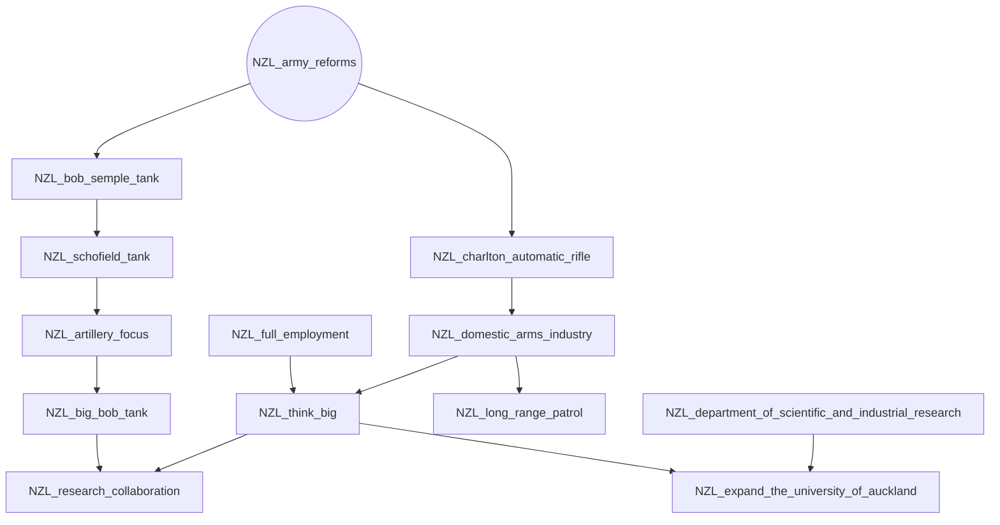
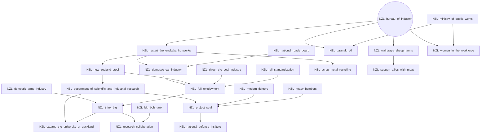
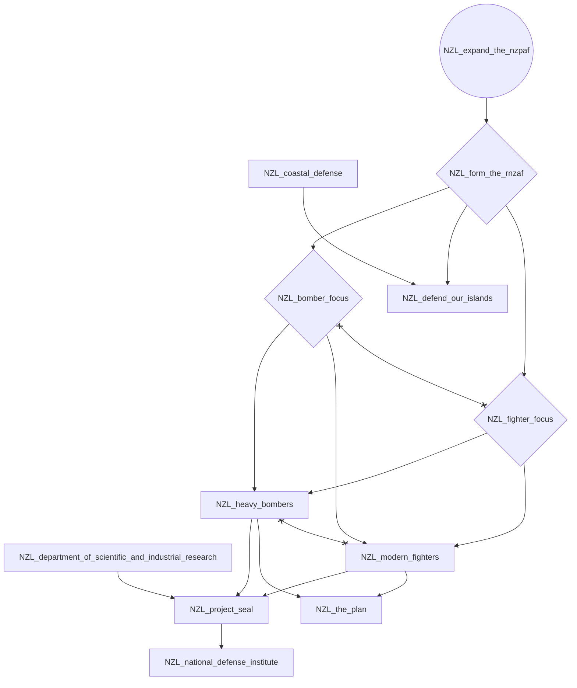
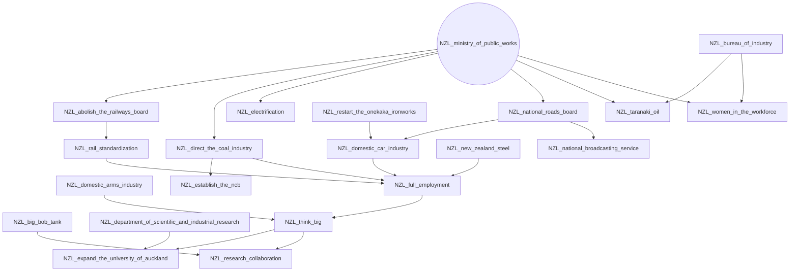
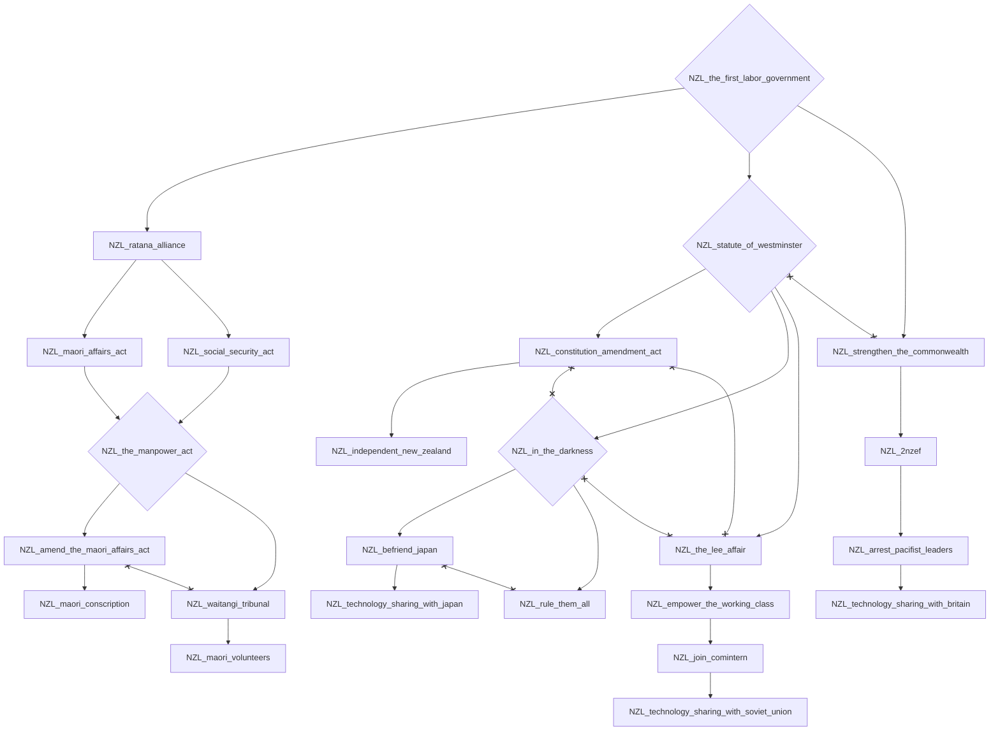
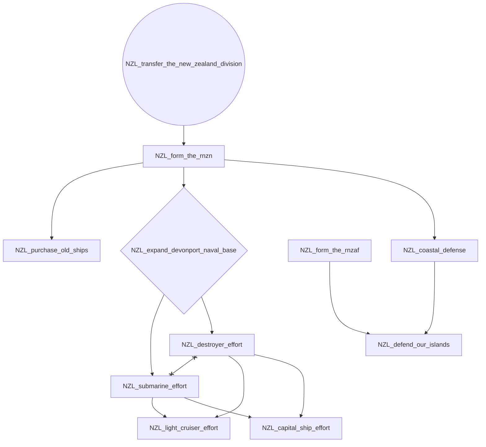

# NZL_army_reforms

```mermaid
flowchart TD
    n1(("NZL_army_reforms"))
    n2["NZL_artillery_focus"]
    n3["NZL_big_bob_tank"]
    n4["NZL_bob_semple_tank"]
    n5["NZL_charlton_automatic_rifle"]
    n6["NZL_department_of_scientific_and_industrial_research"]
    n7["NZL_domestic_arms_industry"]
    n8["NZL_expand_the_university_of_auckland"]
    n9["NZL_full_employment"]
    n10["NZL_long_range_patrol"]
    n11["NZL_research_collaboration"]
    n12["NZL_schofield_tank"]
    n13["NZL_think_big"]
    n12 --> n2
    n2 --> n3
    n1 --> n4
    n1 --> n5
    n5 --> n7
    n13 --> n8
    n6 --> n8
    n7 --> n10
    n3 --> n11
    n13 --> n11
    n4 --> n12
    n9 --> n13
    n7 --> n13
```

# NZL_bureau_of_industry

```mermaid
flowchart TD
    n3["NZL_big_bob_tank"]
    n14(("NZL_bureau_of_industry"))
    n6["NZL_department_of_scientific_and_industrial_research"]
    n15["NZL_direct_the_coal_industry"]
    n7["NZL_domestic_arms_industry"]
    n16["NZL_domestic_car_industry"]
    n8["NZL_expand_the_university_of_auckland"]
    n9["NZL_full_employment"]
    n17["NZL_heavy_bombers"]
    n18["NZL_ministry_of_public_works"]
    n19["NZL_modern_fighters"]
    n20["NZL_national_defense_institute"]
    n21["NZL_national_roads_board"]
    n22["NZL_new_zealand_steel"]
    n23["NZL_project_seal"]
    n24["NZL_rail_standardization"]
    n11["NZL_research_collaboration"]
    n25["NZL_restart_the_onekaka_ironworks"]
    n26["NZL_scrap_metal_recycling"]
    n27["NZL_support_allies_with_meat"]
    n28["NZL_taranaki_oil"]
    n13["NZL_think_big"]
    n29["NZL_wairarapa_sheep_farms"]
    n30["NZL_women_in_the_workforce"]
    n22 --> n6
    n21 --> n16
    n25 --> n16
    n13 --> n8
    n6 --> n8
    n24 --> n9
    n15 --> n9
    n22 --> n9
    n16 --> n9
    n23 --> n20
    n25 --> n22
    n17 --> n23
    n19 --> n23
    n6 --> n23
    n3 --> n11
    n13 --> n11
    n14 --> n25
    n25 --> n26
    n29 --> n27
    n18 --> n28
    n14 --> n28
    n9 --> n13
    n7 --> n13
    n14 --> n29
    n18 --> n30
    n14 --> n30
```

# NZL_expand_the_nzpaf

```mermaid
flowchart TD
    n31{"NZL_bomber_focus"}
    n32["NZL_coastal_defense"]
    n33["NZL_defend_our_islands"]
    n6["NZL_department_of_scientific_and_industrial_research"]
    n34(("NZL_expand_the_nzpaf"))
    n35{"NZL_fighter_focus"}
    n36{"NZL_form_the_rnzaf"}
    n17["NZL_heavy_bombers"]
    n19["NZL_modern_fighters"]
    n20["NZL_national_defense_institute"]
    n23["NZL_project_seal"]
    n37["NZL_the_plan"]
    n36 --> n31
    n36 --> n33
    n32 --> n33
    n36 --> n35
    n34 --> n36
    n35 --> n17
    n31 --> n17
    n35 --> n19
    n31 --> n19
    n23 --> n20
    n17 --> n23
    n19 --> n23
    n6 --> n23
    n17 --> n37
    n19 --> n37
    n31 x--x n35
    n17 x--x n19
```

# NZL_ministry_of_public_works

```mermaid
flowchart TD
    n38["NZL_abolish_the_railways_board"]
    n3["NZL_big_bob_tank"]
    n14["NZL_bureau_of_industry"]
    n6["NZL_department_of_scientific_and_industrial_research"]
    n15["NZL_direct_the_coal_industry"]
    n7["NZL_domestic_arms_industry"]
    n16["NZL_domestic_car_industry"]
    n39["NZL_electrification"]
    n40["NZL_establish_the_ncb"]
    n8["NZL_expand_the_university_of_auckland"]
    n9["NZL_full_employment"]
    n18(("NZL_ministry_of_public_works"))
    n41["NZL_national_broadcasting_service"]
    n21["NZL_national_roads_board"]
    n22["NZL_new_zealand_steel"]
    n24["NZL_rail_standardization"]
    n11["NZL_research_collaboration"]
    n25["NZL_restart_the_onekaka_ironworks"]
    n28["NZL_taranaki_oil"]
    n13["NZL_think_big"]
    n30["NZL_women_in_the_workforce"]
    n18 --> n38
    n18 --> n15
    n21 --> n16
    n25 --> n16
    n18 --> n39
    n15 --> n40
    n13 --> n8
    n6 --> n8
    n24 --> n9
    n15 --> n9
    n22 --> n9
    n16 --> n9
    n21 --> n41
    n18 --> n21
    n38 --> n24
    n3 --> n11
    n13 --> n11
    n18 --> n28
    n14 --> n28
    n9 --> n13
    n7 --> n13
    n18 --> n30
    n14 --> n30
```

# NZL_the_first_labor_government

```mermaid
flowchart TD
    n42["NZL_2nzef"]
    n43["NZL_amend_the_maori_affairs_act"]
    n44["NZL_arrest_pacifist_leaders"]
    n45["NZL_befriend_japan"]
    n46["NZL_constitution_amendment_act"]
    n47["NZL_empower_the_working_class"]
    n48{"NZL_in_the_darkness"}
    n49["NZL_independent_new_zealand"]
    n50["NZL_join_comintern"]
    n51["NZL_maori_affairs_act"]
    n52["NZL_maori_conscription"]
    n53["NZL_maori_volunteers"]
    n54["NZL_ratana_alliance"]
    n55["NZL_rule_them_all"]
    n56["NZL_social_security_act"]
    n57{"NZL_statute_of_westminster"}
    n58["NZL_strengthen_the_commonwealth"]
    n59["NZL_technology_sharing_with_britain"]
    n60["NZL_technology_sharing_with_japan"]
    n61["NZL_technology_sharing_with_soviet_union"]
    n62{"NZL_the_first_labor_government"}
    n63["NZL_the_lee_affair"]
    n64{"NZL_the_manpower_act"}
    n65["NZL_waitangi_tribunal"]
    n58 --> n42
    n64 --> n43
    n42 --> n44
    n48 --> n45
    n57 --> n46
    n63 --> n47
    n57 --> n48
    n46 --> n49
    n47 --> n50
    n54 --> n51
    n43 --> n52
    n65 --> n53
    n62 --> n54
    n48 --> n55
    n54 --> n56
    n62 --> n57
    n62 --> n58
    n44 --> n59
    n45 --> n60
    n50 --> n61
    n57 --> n63
    n56 --> n64
    n51 --> n64
    n64 --> n65
    n43 x--x n65
    n45 x--x n55
    n46 x--x n48
    n46 x--x n63
    n48 x--x n63
    n57 x--x n58
```

# NZL_transfer_the_new_zealand_division

```mermaid
flowchart TD
    n66["NZL_capital_ship_effort"]
    n32["NZL_coastal_defense"]
    n33["NZL_defend_our_islands"]
    n67["NZL_destroyer_effort"]
    n68{"NZL_expand_devonport_naval_base"}
    n36["NZL_form_the_rnzaf"]
    n69["NZL_form_the_rnzn"]
    n70["NZL_light_cruiser_effort"]
    n71["NZL_purchase_old_ships"]
    n72["NZL_submarine_effort"]
    n73(("NZL_transfer_the_new_zealand_division"))
    n67 --> n66
    n72 --> n66
    n69 --> n32
    n36 --> n33
    n32 --> n33
    n68 --> n67
    n69 --> n68
    n73 --> n69
    n67 --> n70
    n72 --> n70
    n69 --> n71
    n68 --> n72
    n67 x--x n72
```
