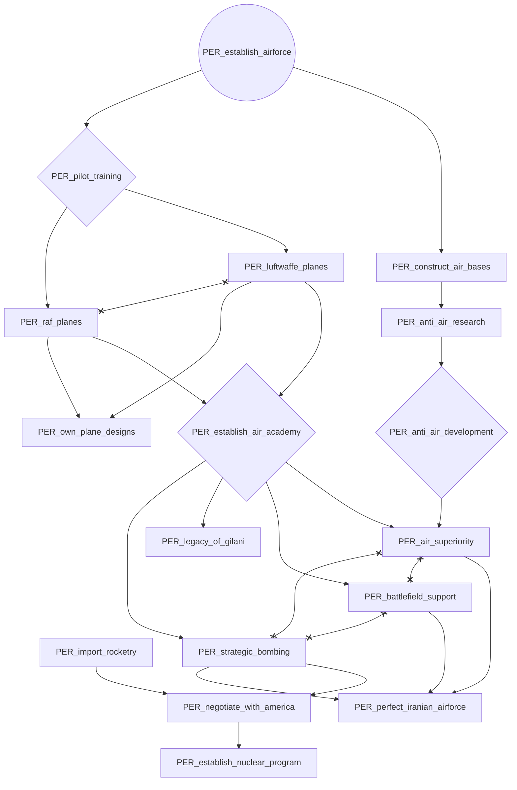
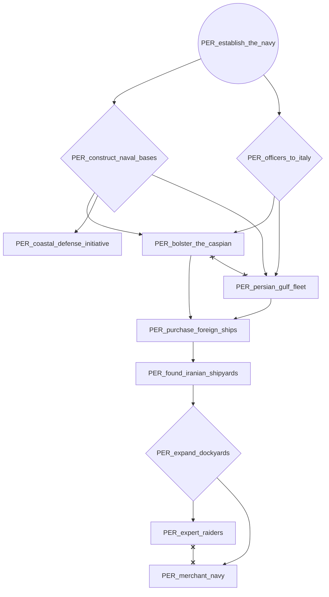
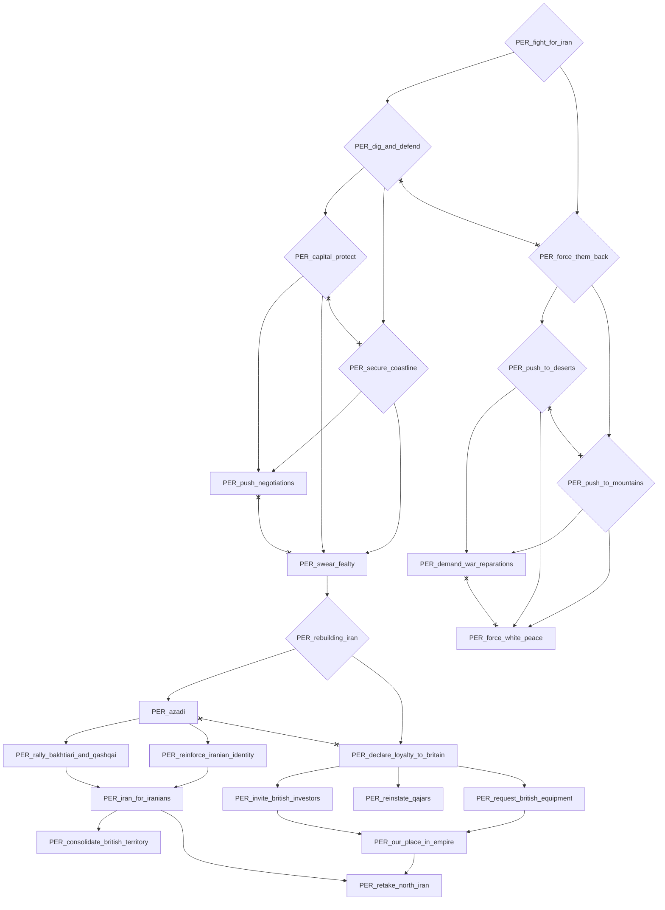
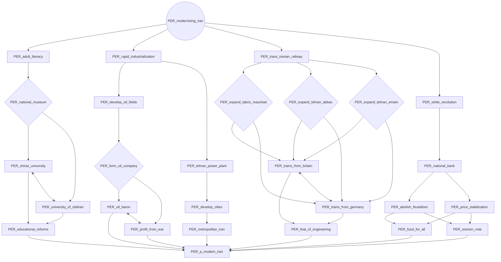
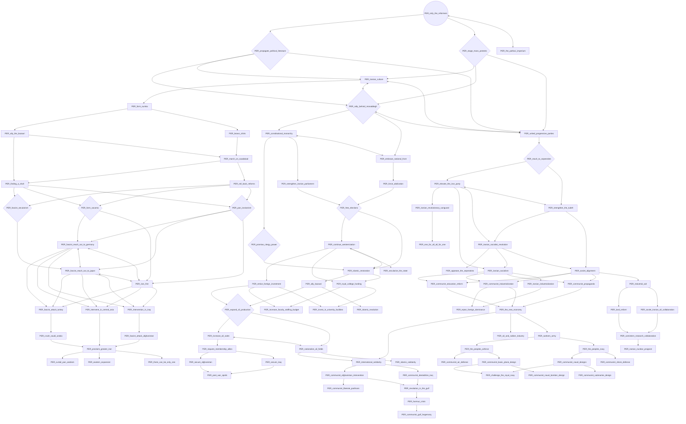
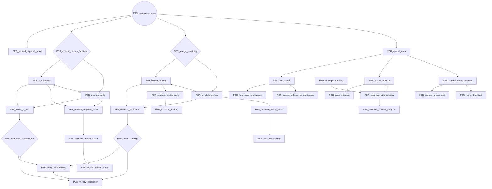

# PER_establish_airforce

```mermaid
flowchart TD
    n1["PER_air_superiority"]
    n2{"PER_anti_air_development"}
    n3["PER_anti_air_research"]
    n4["PER_battlefield_support"]
    n5["PER_construct_air_bases"]
    n6{"PER_establish_air_academy"}
    n7(("PER_establish_airforce"))
    n8["PER_establish_nuclear_program"]
    n9["PER_import_rocketry"]
    n10["PER_legacy_of_gilani"]
    n11["PER_luftwaffe_planes"]
    n12["PER_negotiate_with_america"]
    n13["PER_own_plane_designs"]
    n14["PER_perfect_iranian_airforce"]
    n15{"PER_pilot_training"}
    n16["PER_raf_planes"]
    n17["PER_strategic_bombing"]
    n6 --> n1
    n2 --> n1
    n3 --> n2
    n5 --> n3
    n6 --> n4
    n7 --> n5
    n11 --> n6
    n16 --> n6
    n12 --> n8
    n6 --> n10
    n15 --> n11
    n9 --> n12
    n17 --> n12
    n11 --> n13
    n16 --> n13
    n1 --> n14
    n17 --> n14
    n4 --> n14
    n7 --> n15
    n15 --> n16
    n6 --> n17
    n1 x--x n4
    n1 x--x n17
    n4 x--x n17
    n11 x--x n16
```

# PER_establish_the_navy

```mermaid
flowchart TD
    n18["PER_bolster_the_caspian"]
    n19["PER_coastal_defense_initiative"]
    n20{"PER_construct_naval_bases"}
    n21(("PER_establish_the_navy"))
    n22{"PER_expand_dockyards"}
    n23["PER_expert_raiders"]
    n24["PER_found_iranian_shipyards"]
    n25["PER_merchant_navy"]
    n26{"PER_officers_to_italy"}
    n27["PER_persian_gulf_fleet"]
    n28["PER_purchase_foreign_ships"]
    n20 --> n18
    n26 --> n18
    n20 --> n19
    n21 --> n20
    n24 --> n22
    n22 --> n23
    n28 --> n24
    n22 --> n25
    n21 --> n26
    n26 --> n27
    n20 --> n27
    n18 --> n28
    n27 --> n28
    n18 x--x n27
    n23 x--x n25
```

# PER_fight_for_iran

```mermaid
flowchart TD
    n29["PER_azadi"]
    n30{"PER_capital_protect"}
    n31["PER_consolidate_british_territory"]
    n32["PER_declare_loyalty_to_britain"]
    n33["PER_demand_war_reparations"]
    n34{"PER_dig_and_defend"}
    n35{"PER_fight_for_iran"}
    n36{"PER_force_them_back"}
    n37["PER_force_white_peace"]
    n38["PER_invite_british_investors"]
    n39["PER_iran_for_iranians"]
    n40["PER_our_place_in_empire"]
    n41["PER_push_negotiations"]
    n42{"PER_push_to_deserts"}
    n43{"PER_push_to_mountains"}
    n44["PER_rally_bakhtiari_and_qashqai"]
    n45{"PER_rebuilding_iran"}
    n46["PER_reinforce_iranian_identity"]
    n47["PER_reinstate_qajars"]
    n48["PER_request_british_equipment"]
    n49["PER_retake_north_iran"]
    n50{"PER_secure_coastline"}
    n51["PER_swear_fealty"]
    n45 --> n29
    n34 --> n30
    n39 --> n31
    n45 --> n32
    n42 --> n33
    n43 --> n33
    n35 --> n34
    n35 --> n36
    n42 --> n37
    n43 --> n37
    n32 --> n38
    n44 --> n39
    n46 --> n39
    n48 --> n40
    n38 --> n40
    n30 --> n41
    n50 --> n41
    n36 --> n42
    n36 --> n43
    n29 --> n44
    n51 --> n45
    n29 --> n46
    n32 --> n47
    n32 --> n48
    n40 --> n49
    n39 --> n49
    n34 --> n50
    n30 --> n51
    n50 --> n51
    n29 x--x n32
    n30 x--x n50
    n33 x--x n37
    n34 x--x n36
    n41 x--x n51
    n42 x--x n43
```

# PER_modernizing_iran

```mermaid
flowchart TD
    n52["PER_a_modern_iran"]
    n53["PER_abolish_feudalism"]
    n54["PER_adult_literacy"]
    n55["PER_develop_cities"]
    n56["PER_develop_oil_fields"]
    n57["PER_educational_reforms"]
    n58{"PER_expand_tabriz_masshad"}
    n59{"PER_expand_tehran_abbas"}
    n60{"PER_expand_tehran_emam"}
    n61["PER_feat_of_engineering"]
    n62["PER_food_for_all"]
    n63{"PER_form_oil_company"}
    n64["PER_metropolitan_iran"]
    n65(("PER_modernizing_iran"))
    n66["PER_national_bank"]
    n67{"PER_national_museum"}
    n68["PER_oil_baron"]
    n69["PER_price_stabilization"]
    n70["PER_profit_from_war"]
    n71["PER_rapid_industrialization"]
    n72["PER_shiraz_university"]
    n73["PER_tehran_power_plant"]
    n74["PER_trains_from_britain"]
    n75["PER_trains_from_germany"]
    n76["PER_trans_iranian_railway"]
    n77["PER_university_of_isfahan"]
    n78["PER_white_revolution"]
    n79["PER_women_vote"]
    n70 --> n52
    n68 --> n52
    n64 --> n52
    n62 --> n52
    n79 --> n52
    n61 --> n52
    n57 --> n52
    n66 --> n53
    n65 --> n54
    n73 --> n55
    n71 --> n56
    n77 --> n57
    n72 --> n57
    n76 --> n58
    n76 --> n59
    n76 --> n60
    n74 --> n61
    n75 --> n61
    n69 --> n62
    n53 --> n62
    n56 --> n63
    n55 --> n64
    n78 --> n66
    n54 --> n67
    n63 --> n68
    n66 --> n69
    n63 --> n70
    n65 --> n71
    n67 --> n72
    n71 --> n73
    n58 --> n74
    n60 --> n74
    n59 --> n74
    n58 --> n75
    n60 --> n75
    n59 --> n75
    n65 --> n76
    n67 --> n77
    n65 --> n78
    n69 --> n79
    n53 --> n79
    n68 x--x n70
    n72 x--x n77
    n74 x--x n75
```

# PER_rally_the_reformers

```mermaid
flowchart TD
    n80["PER_ally_bazaari"]
    n81["PER_ally_the_bazaari"]
    n82["PER_appease_the_seperatists"]
    n83["PER_brown_shirts"]
    n84["PER_challenge_the_royal_navy"]
    n85["PER_comintern_research_collaboration"]
    n86["PER_communist_afghanistan_intervention"]
    n87["PER_communist_air_defense"]
    n88["PER_communist_basic_plane_design"]
    n89["PER_communist_destabilize_iraq"]
    n90["PER_communist_education_reform"]
    n91["PER_communist_gulf_hegemony"]
    n92["PER_communist_industrialization"]
    n93["PER_communist_liberate_pashtuns"]
    n94["PER_communist_naval_bomber_design"]
    n95["PER_communist_naval_designs"]
    n96["PER_communist_propaganda"]
    n97["PER_communist_shore_defense"]
    n98["PER_communist_submarine_design"]
    n99["PER_constitutional_monarchy"]
    n100["PER_continue_westernization"]
    n101["PER_crush_saudi_arabia"]
    n102["PER_curtail_pan_arabism"]
    n103["PER_eastern_expansion"]
    n104["PER_elevate_the_iran_party"]
    n105["PER_embrace_national_front"]
    n106["PER_entice_foreign_investment"]
    n107{"PER_expand_oil_production"}
    n108["PER_fascist_attack_afghanistan"]
    n109["PER_fascist_attack_turkey"]
    n110["PER_fascist_reach_out_to_germany"]
    n111["PER_fascist_reach_out_to_japan"]
    n112{"PER_fascist_secularism"}
    n113["PER_finding_a_shah"]
    n114["PER_force_abdication"]
    n115{"PER_form_savama"}
    n116["PER_form_sumka"]
    n117{"PER_free_elections"}
    n118["PER_hormuz_crisis"]
    n119["PER_increase_faculty_staffing_budget"]
    n120["PER_increase_oil_sales"]
    n121["PER_industrial_aid"]
    n122["PER_international_solidarity"]
    n123["PER_intervene_in_central_asia"]
    n124["PER_intervention_in_iraq"]
    n125["PER_invest_in_univerity_facilities"]
    n126["PER_iran_first"]
    n127["PER_iranian_culture"]
    n128["PER_iranian_industrialization"]
    n129["PER_iranian_nuclear_program"]
    n130["PER_iranian_revolutionary_vanguard"]
    n131["PER_iranian_socialism"]
    n132["PER_iranian_socialist_revolution"]
    n133["PER_islamic_restoration"]
    n134["PER_islamic_revolution"]
    n135["PER_islamic_solidarity"]
    n136["PER_land_reform"]
    n137["PER_march_on_saadabad"]
    n138["PER_nationalize_oil_fields"]
    n139["PER_oil_and_rubber_industry"]
    n140["PER_one_for_all_all_for_one"]
    n141{"PER_pan_iranianism"}
    n142["PER_post_war_spoils"]
    n143["PER_proclaim_greater_iran"]
    n144{"PER_promise_clergy_power"}
    n145{"PER_propagate_political_literature"}
    n146{"PER_rally_behind_mosaddegh"}
    n147(("PER_rally_the_reformers"))
    n148{"PER_reach_to_seperatists"}
    n149["PER_reject_foreign_dominance"]
    n150["PER_request_membership_allies"]
    n151["PER_revolution_in_the_gulf"]
    n152["PER_roll_back_reforms"]
    n153["PER_royal_college_funding"]
    n154["PER_secularize_the_state"]
    n155["PER_secure_afghanistan"]
    n156["PER_secure_iraq"]
    n157["PER_soviet_alignment"]
    n158["PER_soviet_iranian_oil_collaboration"]
    n159{"PER_stage_mass_protests"}
    n160["PER_strengthen_iranian_parliament"]
    n161["PER_strengthen_the_tudeh"]
    n162["PER_the_new_economy"]
    n163["PER_the_pahlavi_imperium"]
    n164["PER_the_peoples_airforce"]
    n165["PER_the_peoples_navy"]
    n166["PER_there_can_be_only_one"]
    n167["PER_united_progressive_parties"]
    n168["PER_workers_army"]
    n133 --> n80
    n116 --> n81
    n132 --> n82
    n116 --> n83
    n88 --> n84
    n95 --> n84
    n158 --> n85
    n136 --> n85
    n122 --> n86
    n164 --> n87
    n164 --> n88
    n122 --> n89
    n131 --> n90
    n157 --> n90
    n118 --> n91
    n131 --> n92
    n157 --> n92
    n86 --> n93
    n88 --> n94
    n165 --> n95
    n131 --> n96
    n157 --> n96
    n165 --> n97
    n95 --> n98
    n146 --> n99
    n117 --> n100
    n109 --> n101
    n143 --> n102
    n143 --> n103
    n148 --> n104
    n146 --> n105
    n100 --> n106
    n80 --> n107
    n106 --> n107
    n124 --> n108
    n110 --> n109
    n111 --> n109
    n126 --> n109
    n115 --> n110
    n141 --> n110
    n112 --> n111
    n141 --> n111
    n152 --> n112
    n113 --> n112
    n137 --> n113
    n81 --> n113
    n105 --> n114
    n152 --> n115
    n113 --> n115
    n127 --> n116
    n114 --> n117
    n160 --> n117
    n151 --> n118
    n153 --> n119
    n106 --> n119
    n107 --> n120
    n157 --> n121
    n162 --> n122
    n138 --> n122
    n126 --> n123
    n111 --> n123
    n110 --> n123
    n110 --> n124
    n111 --> n124
    n126 --> n124
    n153 --> n125
    n106 --> n125
    n115 --> n126
    n141 --> n126
    n159 --> n127
    n145 --> n127
    n131 --> n128
    n85 --> n129
    n104 --> n130
    n132 --> n131
    n104 --> n131
    n161 --> n132
    n104 --> n132
    n117 --> n133
    n144 --> n133
    n80 --> n134
    n138 --> n135
    n121 --> n136
    n83 --> n137
    n81 --> n137
    n107 --> n138
    n162 --> n139
    n130 --> n140
    n152 --> n141
    n113 --> n141
    n156 --> n142
    n155 --> n142
    n123 --> n143
    n101 --> n143
    n108 --> n143
    n99 --> n144
    n147 --> n145
    n159 --> n146
    n145 --> n146
    n167 --> n148
    n92 --> n149
    n128 --> n149
    n120 --> n150
    n89 --> n151
    n86 --> n151
    n137 --> n152
    n133 --> n153
    n100 --> n153
    n100 --> n154
    n150 --> n155
    n150 --> n156
    n132 --> n157
    n161 --> n157
    n121 --> n158
    n147 --> n159
    n99 --> n160
    n148 --> n161
    n90 --> n162
    n96 --> n162
    n92 --> n162
    n168 --> n164
    n168 --> n165
    n143 --> n166
    n159 --> n167
    n145 --> n167
    n162 --> n168
    n99 x--x n105
    n100 x--x n133
    n104 x--x n161
    n110 x--x n111
    n110 x--x n126
    n111 x--x n126
    n120 x--x n138
    n127 x--x n146
    n127 x--x n167
    n146 x--x n167
    n147 x--x n163
```

# PER_restructure_army

```mermaid
flowchart TD
    n169["PER_bolster_infantry"]
    n170["PER_cyrus_initiative"]
    n171["PER_czech_tanks"]
    n172{"PER_desert_training"}
    n173["PER_develop_qorkhaneh"]
    n174["PER_establish_motor_arms"]
    n8["PER_establish_nuclear_program"]
    n175["PER_establish_tehran_armor"]
    n176["PER_every_man_serves"]
    n177["PER_expand_imperial_guard"]
    n178{"PER_expand_military_facilities"}
    n179["PER_expand_tehran_armor"]
    n180["PER_expand_unique_unit"]
    n181{"PER_foreign_retraining"}
    n182["PER_form_savak"]
    n183["PER_fund_state_intelligence"]
    n184["PER_future_of_war"]
    n185["PER_german_tanks"]
    n9["PER_import_rocketry"]
    n186["PER_increase_heavy_arms"]
    n187["PER_military_excellency"]
    n188["PER_motorize_infantry"]
    n12["PER_negotiate_with_america"]
    n189["PER_our_own_artillery"]
    n190["PER_recruit_bakhtiari"]
    n191(("PER_restructure_army"))
    n192["PER_reverse_engineer_tanks"]
    n193["PER_special_forces_program"]
    n194["PER_special_units"]
    n17["PER_strategic_bombing"]
    n195["PER_swedish_artillery"]
    n196{"PER_train_tank_commanders"}
    n197["PER_transfer_officers_to_intelligence"]
    n181 --> n169
    n9 --> n170
    n178 --> n171
    n173 --> n172
    n169 --> n173
    n195 --> n173
    n169 --> n174
    n12 --> n8
    n192 --> n175
    n172 --> n176
    n196 --> n176
    n191 --> n177
    n191 --> n178
    n175 --> n179
    n193 --> n180
    n191 --> n181
    n194 --> n182
    n182 --> n183
    n185 --> n184
    n171 --> n184
    n178 --> n185
    n194 --> n9
    n195 --> n186
    n172 --> n187
    n196 --> n187
    n174 --> n188
    n9 --> n12
    n17 --> n12
    n186 --> n189
    n193 --> n190
    n185 --> n192
    n171 --> n192
    n194 --> n193
    n191 --> n194
    n181 --> n195
    n184 --> n196
    n182 --> n197
    n169 x--x n195
    n171 x--x n185
    n176 x--x n187
```

# PER_the_pahlavi_imperium

```mermaid
flowchart TD
    n198["PER_absolute_monarchy"]
    n199["PER_absorb_byzantines"]
    n200["PER_align_with_axis"]
    n201["PER_assassinate_reza_shah"]
    n202["PER_assessing_the_opposition"]
    n203["PER_bolster_civilian_industry"]
    n204{"PER_choose_a_shahbanu"}
    n205{"PER_clamp_azerbaijani_dissidence"}
    n206{"PER_clamp_kurdish_dissidence"}
    n207["PER_clash_of_titans"]
    n208["PER_demand_afghan_territory"]
    n209["PER_demand_iraqi_territory"]
    n210["PER_demand_west_asia"]
    n211["PER_donate_oil_fields"]
    n212["PER_embrace_industrial_powers"]
    n213["PER_embrace_opulence"]
    n214["PER_emperor_for_people"]
    n215["PER_establish_northern_buffer_states"]
    n216["PER_establish_special_unit"]
    n217["PER_first_iranian_empire"]
    n218["PER_foothold_in_indus"]
    n219["PER_forced_secularization"]
    n220["PER_fund_imperial_excellency"]
    n221["PER_glory_of_cyrus"]
    n222["PER_his_fathers_footsteps"]
    n223["PER_imperial_expansionism"]
    n224["PER_imperial_funded_universities"]
    n225["PER_increase_education_funding"]
    n226["PER_increase_military_funding"]
    n227["PER_invasion_of_india"]
    n228["PER_last_thousand_years"]
    n229{"PER_legacy_of_greatness"}
    n230["PER_limit_foreign_influence"]
    n231["PER_march_to_nile"]
    n232["PER_middle_east_protectorate"]
    n233["PER_military_high_schools"]
    n234["PER_modernize_iran_economy"]
    n235["PER_open_abadan"]
    n236["PER_path_through_iraq"]
    n237["PER_persian_german_trade"]
    n238["PER_plant_resistance_cells"]
    n239["PER_preemptive_strike"]
    n240["PER_preparatory_mobilization"]
    n241["PER_prepare_for_worst"]
    n242["PER_question_of_resources"]
    n243["PER_rally_ancient_history"]
    n147["PER_rally_the_reformers"]
    n244["PER_rebuild_persepolis"]
    n245["PER_reclaim_turkish_peninsula"]
    n246["PER_reintegrate_anatolia"]
    n247["PER_revive_old_ways"]
    n248["PER_root_out_conspiracies"]
    n249["PER_royal_visit_germany"]
    n250["PER_shahanshah"]
    n251["PER_spoils_of_war"]
    n252["PER_stand_our_ground"]
    n253["PER_stand_with_germany"]
    n254["PER_stand_with_giants"]
    n255["PER_state_atheism"]
    n256["PER_subserviant_to_noone"]
    n257{"PER_take_regional_tour"}
    n258["PER_tehran_moscow_pact"]
    n259["PER_the_memphis_initiative"]
    n163{"PER_the_pahlavi_imperium"}
    n260["PER_the_unification_initiative"]
    n261["PER_third_persian_empire"]
    n262["PER_trial_fifty_three"]
    n263["PER_uphold_civil_rights"]
    n264["PER_upscale_military_production"]
    n265["PER_usurp_afghanistan"]
    n266["PER_venerate_islam"]
    n267["PER_war_plan_cambyses"]
    n268["PER_war_plan_darius"]
    n269["PER_war_plan_xerxes"]
    n270["PER_we_survived"]
    n271["PER_we_will_survive"]
    n272{"PER_wether_the_storm"}
    n248 --> n198
    n207 --> n199
    n253 --> n200
    n229 --> n201
    n229 --> n202
    n252 --> n203
    n261 --> n204
    n260 --> n205
    n260 --> n206
    n245 --> n207
    n258 --> n208
    n258 --> n209
    n267 --> n210
    n200 --> n211
    n257 --> n212
    n204 --> n213
    n204 --> n214
    n239 --> n215
    n223 --> n216
    n198 --> n217
    n268 --> n218
    n254 --> n219
    n229 --> n219
    n213 --> n220
    n227 --> n221
    n246 --> n221
    n231 --> n221
    n201 --> n222
    n202 --> n223
    n229 --> n224
    n254 --> n225
    n254 --> n226
    n218 --> n227
    n265 --> n227
    n256 --> n228
    n220 --> n228
    n263 --> n228
    n234 --> n228
    n163 --> n229
    n257 --> n230
    n236 --> n231
    n251 --> n232
    n226 --> n233
    n212 --> n234
    n225 --> n235
    n267 --> n236
    n254 --> n237
    n242 --> n238
    n238 --> n239
    n241 --> n239
    n264 --> n240
    n203 --> n240
    n242 --> n241
    n272 --> n242
    n250 --> n243
    n243 --> n244
    n269 --> n245
    n245 --> n246
    n205 --> n247
    n206 --> n247
    n229 --> n248
    n237 --> n249
    n261 --> n250
    n217 --> n250
    n200 --> n251
    n272 --> n252
    n212 --> n253
    n163 --> n254
    n205 --> n255
    n206 --> n255
    n230 --> n256
    n217 --> n257
    n223 --> n258
    n231 --> n259
    n202 --> n260
    n222 --> n261
    n254 --> n262
    n214 --> n263
    n252 --> n264
    n268 --> n265
    n205 --> n266
    n206 --> n266
    n209 --> n267
    n208 --> n267
    n209 --> n268
    n208 --> n268
    n209 --> n269
    n208 --> n269
    n271 --> n270
    n215 --> n270
    n240 --> n271
    n249 --> n272
    n233 --> n272
    n201 x--x n248
    n212 x--x n230
    n213 x--x n214
    n229 x--x n254
    n242 x--x n252
    n147 x--x n163
    n247 x--x n255
    n247 x--x n266
    n255 x--x n266
```
