# POL_assemble_the_regency_council

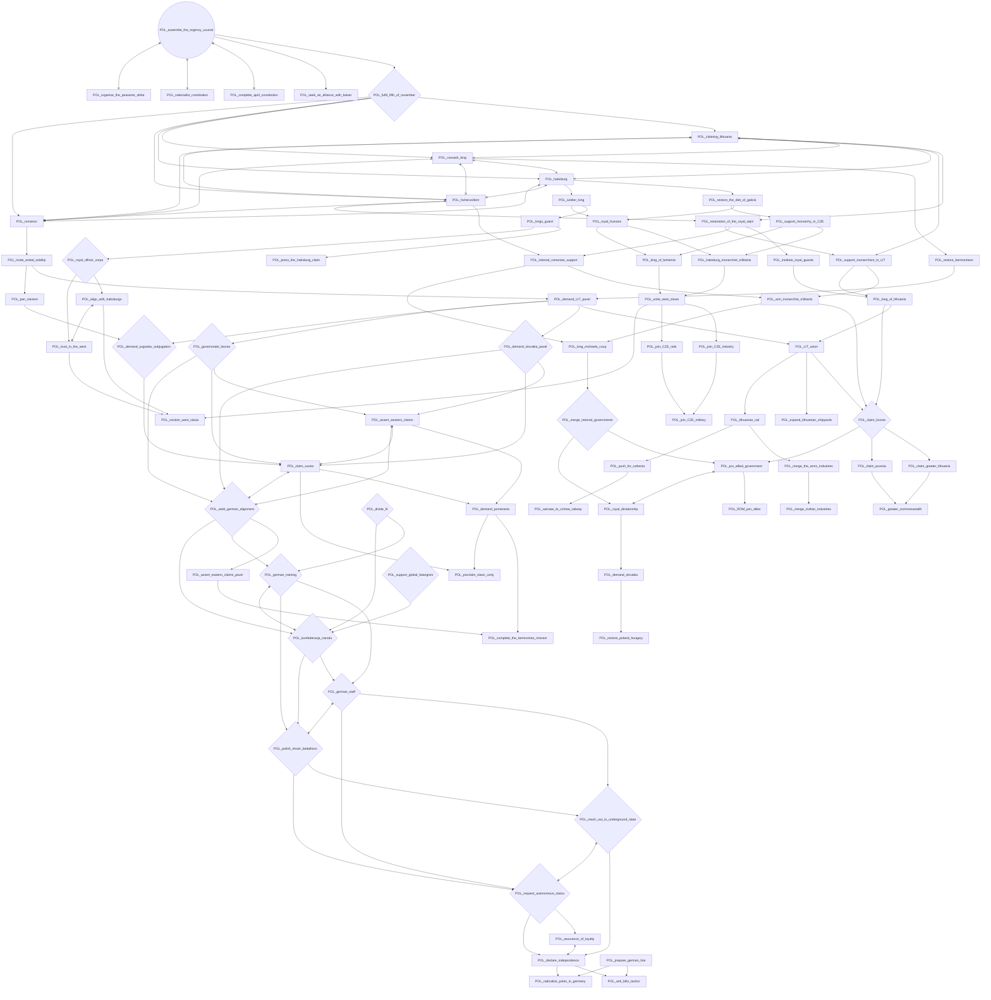

# POL_clamp_down_on_danzig

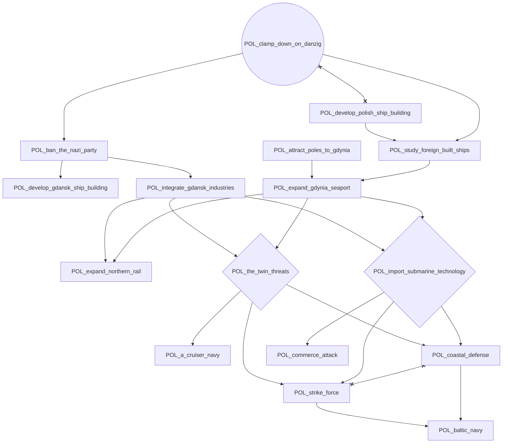

# POL_complete_april_constitution

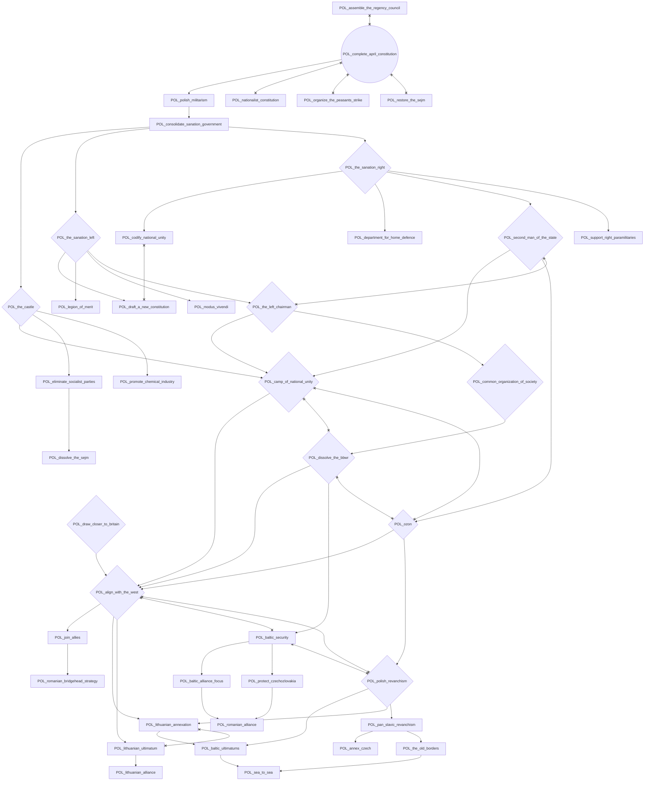

# POL_develop_polish_ship_building

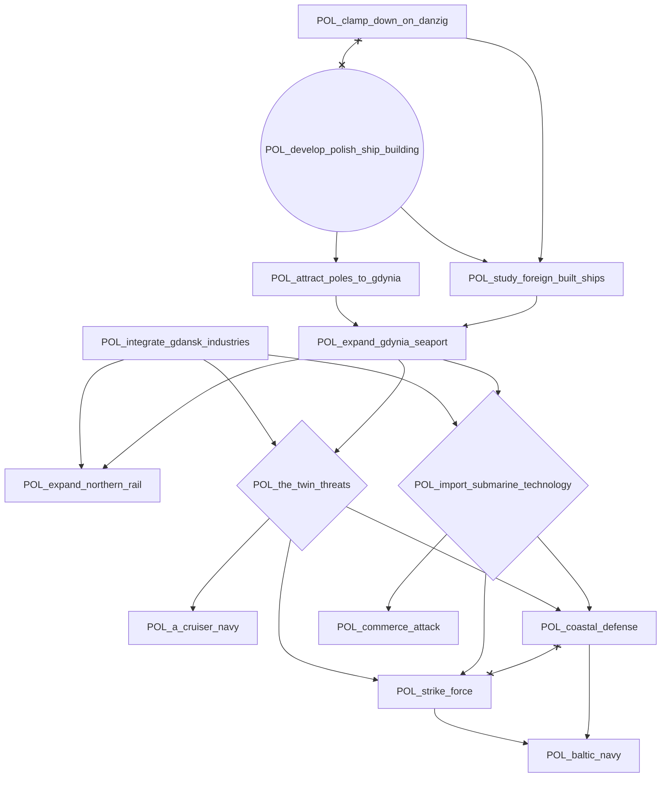

# POL_expand_polish_intelligence_no_mtg

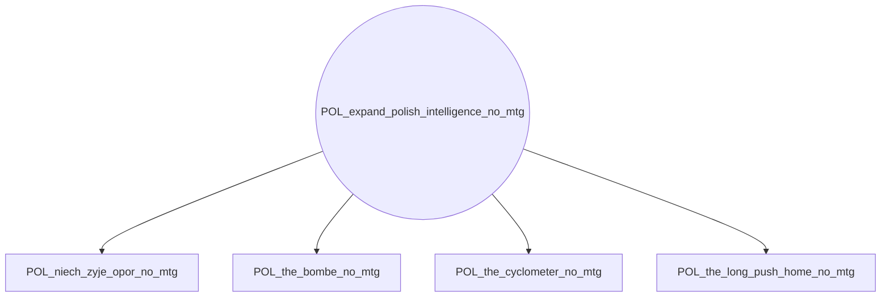

# POL_nationalist_constitution

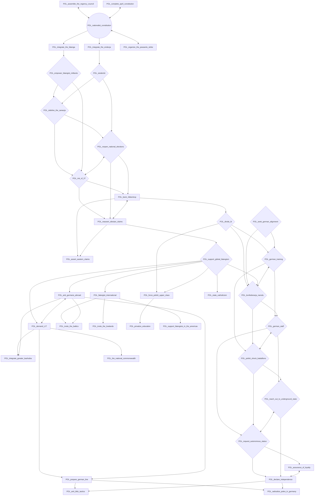

# POL_organize_the_peasants_strike

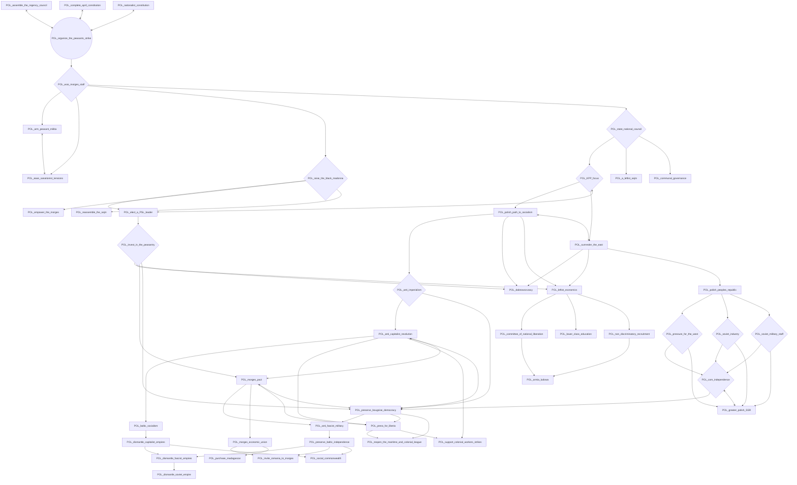

# POL_prepare_for_the_inevitable

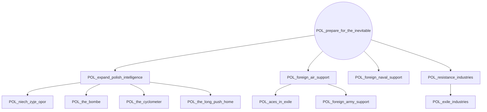

# POL_prepare_for_the_next_war

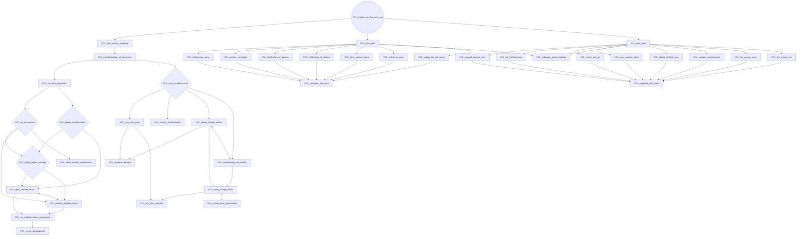

# POL_restore_the_sejm

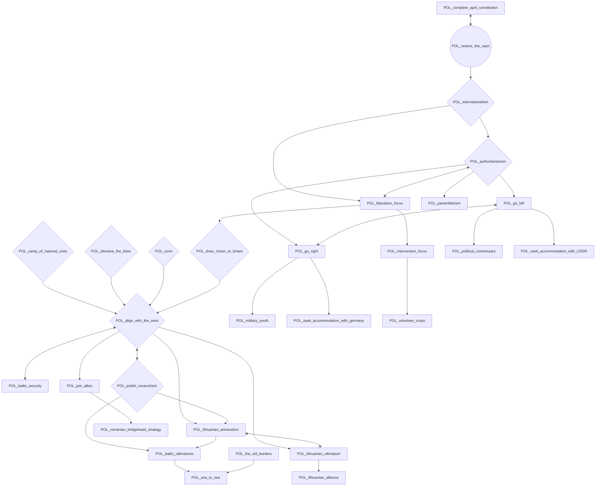

# POL_the_between_the_seas_concept

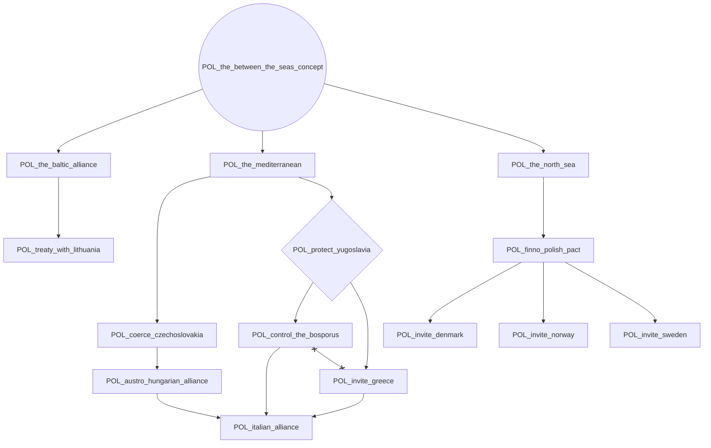

# POL_the_four_year_plan

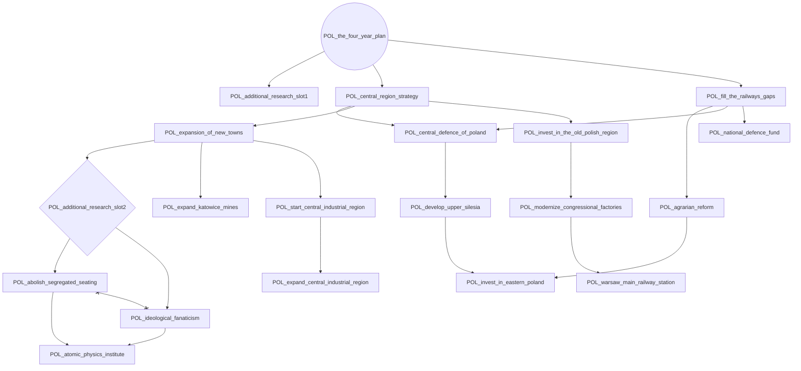
