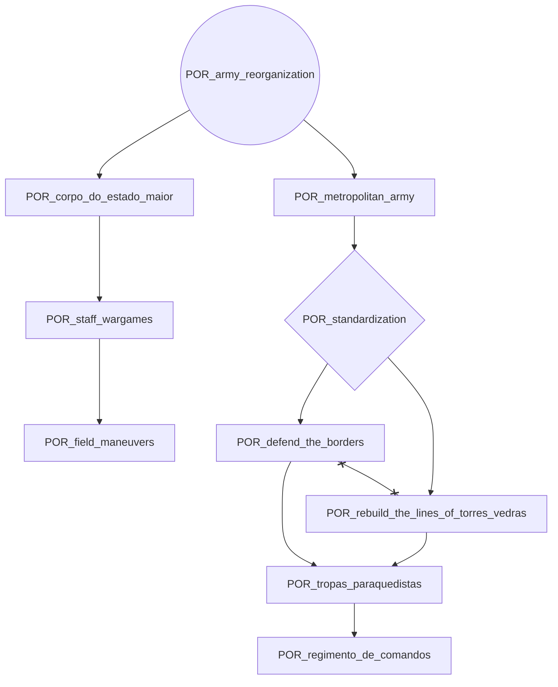
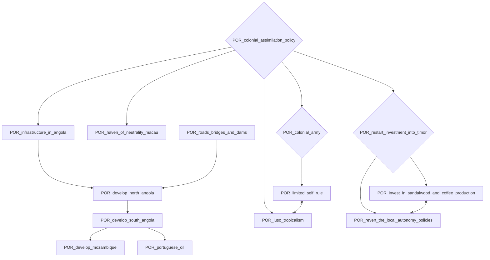
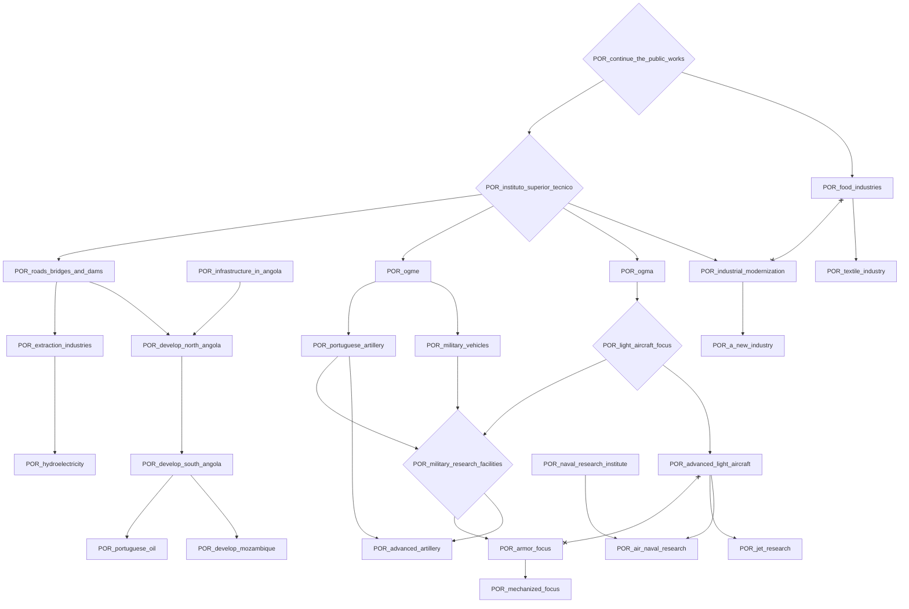
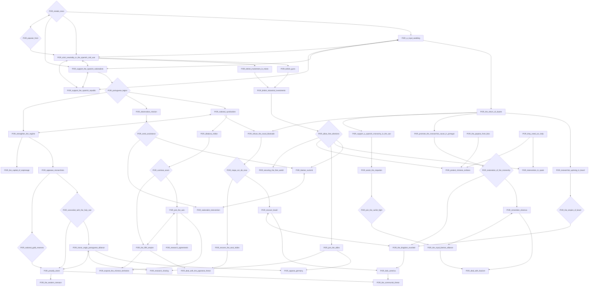
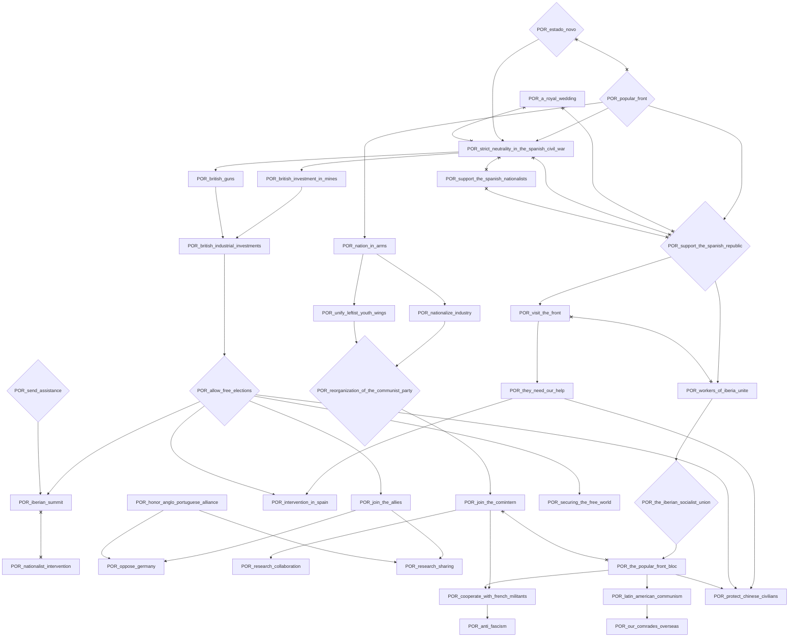
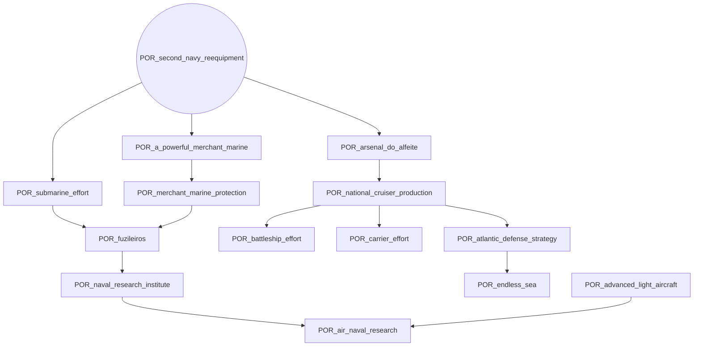

# POR_army_reorganization

```mermaid
flowchart TD
    n1(("POR_army_reorganization"))
    n2["POR_corpo_do_estado_maior"]
    n3["POR_defend_the_borders"]
    n4["POR_field_maneuvers"]
    n5["POR_metropolitan_army"]
    n6["POR_rebuild_the_lines_of_torres_vedras"]
    n7["POR_regimento_de_comandos"]
    n8["POR_staff_wargames"]
    n9{"POR_standardization"}
    n10["POR_tropas_paraquedistas"]
    n1 --> n2
    n9 --> n3
    n8 --> n4
    n1 --> n5
    n9 --> n6
    n10 --> n7
    n2 --> n8
    n5 --> n9
    n3 --> n10
    n6 --> n10
    n3 x--x n6
```

# POR_colonial_assimilation_policy

```mermaid
flowchart TD
    n11{"POR_colonial_army"}
    n12{"POR_colonial_assimilation_policy"}
    n13["POR_develop_mozambique"]
    n14["POR_develop_north_angola"]
    n15["POR_develop_south_angola"]
    n16["POR_haven_of_neutrality_macau"]
    n17["POR_infrastructure_in_angola"]
    n18["POR_invest_in_sandalwood_and_coffee_production"]
    n19["POR_limited_self_rule"]
    n20["POR_luso_tropicalism"]
    n21["POR_portuguese_oil"]
    n22{"POR_restart_investment_into_timor"}
    n23["POR_revert_the_local_autonomy_policies"]
    n24["POR_roads_bridges_and_dams"]
    n12 --> n11
    n15 --> n13
    n17 --> n14
    n24 --> n14
    n14 --> n15
    n12 --> n16
    n12 --> n17
    n22 --> n18
    n11 --> n19
    n12 --> n20
    n15 --> n21
    n12 --> n22
    n22 --> n23
    n18 x--x n23
    n19 x--x n20
```

# POR_continue_the_public_works

```mermaid
flowchart TD
    n25["POR_a_new_industry"]
    n26["POR_advanced_artillery"]
    n27["POR_advanced_light_aircraft"]
    n28["POR_air_naval_research"]
    n29["POR_armor_focus"]
    n30{"POR_continue_the_public_works"}
    n13["POR_develop_mozambique"]
    n14["POR_develop_north_angola"]
    n15["POR_develop_south_angola"]
    n31["POR_extraction_industries"]
    n32["POR_food_industries"]
    n33["POR_hydroelectricity"]
    n34["POR_industrial_modernization"]
    n17["POR_infrastructure_in_angola"]
    n35{"POR_instituto_superior_tecnico"}
    n36["POR_jet_research"]
    n37{"POR_light_aircraft_focus"}
    n38["POR_mechanized_focus"]
    n39{"POR_military_research_facilities"}
    n40["POR_military_vehicles"]
    n41["POR_naval_research_institute"]
    n42["POR_ogma"]
    n43["POR_ogme"]
    n44["POR_portuguese_artillery"]
    n21["POR_portuguese_oil"]
    n24["POR_roads_bridges_and_dams"]
    n45["POR_textile_industry"]
    n34 --> n25
    n44 --> n26
    n39 --> n26
    n37 --> n27
    n41 --> n28
    n27 --> n28
    n39 --> n29
    n15 --> n13
    n17 --> n14
    n24 --> n14
    n14 --> n15
    n24 --> n31
    n30 --> n32
    n31 --> n33
    n35 --> n34
    n30 --> n35
    n27 --> n36
    n42 --> n37
    n29 --> n38
    n40 --> n39
    n44 --> n39
    n37 --> n39
    n43 --> n40
    n35 --> n42
    n35 --> n43
    n43 --> n44
    n15 --> n21
    n35 --> n24
    n32 --> n45
    n27 x--x n29
    n32 x--x n34
```

# POR_estado_novo

```mermaid
flowchart TD
    n46["POR_a_royal_wedding"]
    n47{"POR_allow_free_elections"}
    n48["POR_appease_monarchists"]
    n49["POR_assist_the_requetes"]
    n50["POR_british_guns"]
    n51["POR_british_industrial_investments"]
    n52["POR_british_investment_in_mines"]
    n53{"POR_camisas_azuis"}
    n54{"POR_concordat_with_the_holy_see"}
    n55["POR_deal_with_fascism"]
    n56["POR_deal_with_the_japanese_threat"]
    n57["POR_ditadura_militar"]
    n58{"POR_estado_novo"}
    n59["POR_expand_the_chinese_territories"]
    n60["POR_honor_anglo_portuguese_alliance"]
    n61["POR_iberian_summit"]
    n62["POR_intervention_in_spain"]
    n63["POR_join_the_allies"]
    n64["POR_join_the_axis"]
    n65{"POR_join_the_carlist_fight"}
    n66["POR_latin_america"]
    n67{"POR_mapa_cor_de_rosa"}
    n68["POR_monarchist_uprising_in_brazil"]
    n69{"POR_national_gold_reserves"}
    n70["POR_national_syndicalism"]
    n71["POR_nationalist_intervention"]
    n72["POR_observation_mission"]
    n73["POR_oppose_germany"]
    n74{"POR_popular_front"}
    n75{"POR_portuguese_legion"}
    n76["POR_promote_the_monarchist_cause_in_portugal"]
    n77["POR_protect_chinese_civilians"]
    n78["POR_proudly_alone"]
    n79["POR_recover_brazil"]
    n80["POR_recover_the_east_indies"]
    n81["POR_refuse_the_naval_blockade"]
    n82["POR_remember_olivenca"]
    n83["POR_research_agreements"]
    n84["POR_research_sharing"]
    n85{"POR_restoration_of_the_monarchy"}
    n86["POR_securing_the_free_world"]
    n87{"POR_send_assistance"}
    n88["POR_strengthen_the_regime"]
    n89["POR_strict_neutrality_in_the_spanish_civil_war"]
    n90["POR_support_a_spanish_monarchy_in_the_war"]
    n91["POR_support_the_spanish_nationalists"]
    n92["POR_support_the_spanish_republic"]
    n93["POR_the_capital_of_espionage"]
    n94["POR_the_communist_threat"]
    n95["POR_the_eastern_menace"]
    n96{"POR_the_empire_of_brazil"}
    n97["POR_the_fifth_empire"]
    n98["POR_the_kingdom_reunited"]
    n99["POR_the_popular_front_bloc"]
    n100["POR_the_return_of_duarte"]
    n101["POR_the_royal_iberian_alliance"]
    n102["POR_they_need_our_help"]
    n58 --> n46
    n51 --> n47
    n88 --> n48
    n90 --> n49
    n89 --> n50
    n52 --> n51
    n50 --> n51
    n89 --> n52
    n57 --> n53
    n48 --> n54
    n82 --> n55
    n101 --> n55
    n97 --> n56
    n80 --> n56
    n70 --> n57
    n64 --> n59
    n97 --> n59
    n54 --> n60
    n47 --> n61
    n87 --> n61
    n102 --> n62
    n47 --> n62
    n47 --> n63
    n53 --> n64
    n49 --> n65
    n98 --> n66
    n79 --> n66
    n81 --> n67
    n100 --> n68
    n48 --> n69
    n75 --> n70
    n87 --> n71
    n75 --> n72
    n63 --> n73
    n60 --> n73
    n91 --> n75
    n100 --> n76
    n102 --> n77
    n47 --> n77
    n99 --> n77
    n69 --> n78
    n54 --> n78
    n67 --> n79
    n67 --> n80
    n70 --> n81
    n100 --> n81
    n85 --> n82
    n64 --> n83
    n63 --> n84
    n60 --> n84
    n76 --> n85
    n47 --> n86
    n72 --> n87
    n75 --> n88
    n74 --> n89
    n58 --> n89
    n100 --> n90
    n58 --> n91
    n88 --> n93
    n66 --> n94
    n78 --> n94
    n78 --> n95
    n68 --> n96
    n53 --> n97
    n85 --> n98
    n96 --> n98
    n46 --> n100
    n65 --> n101
    n46 x--x n89
    n46 x--x n91
    n46 x--x n92
    n58 x--x n74
    n60 x--x n78
    n61 x--x n71
    n64 x--x n97
    n70 x--x n88
    n79 x--x n98
    n82 x--x n101
    n89 x--x n91
    n89 x--x n92
    n91 x--x n92
```

# POR_popular_front

```mermaid
flowchart TD
    n46["POR_a_royal_wedding"]
    n47{"POR_allow_free_elections"}
    n103["POR_anti_fascism"]
    n50["POR_british_guns"]
    n51["POR_british_industrial_investments"]
    n52["POR_british_investment_in_mines"]
    n104["POR_cooperate_with_french_militants"]
    n58{"POR_estado_novo"}
    n60["POR_honor_anglo_portuguese_alliance"]
    n61["POR_iberian_summit"]
    n62["POR_intervention_in_spain"]
    n63["POR_join_the_allies"]
    n105["POR_join_the_comintern"]
    n106["POR_latin_american_communism"]
    n107["POR_nation_in_arms"]
    n71["POR_nationalist_intervention"]
    n108["POR_nationalize_industry"]
    n73["POR_oppose_germany"]
    n109["POR_our_comrades_overseas"]
    n74{"POR_popular_front"}
    n77["POR_protect_chinese_civilians"]
    n110{"POR_reorganization_of_the_communist_party"}
    n111["POR_research_collaboration"]
    n84["POR_research_sharing"]
    n86["POR_securing_the_free_world"]
    n87{"POR_send_assistance"}
    n89["POR_strict_neutrality_in_the_spanish_civil_war"]
    n91["POR_support_the_spanish_nationalists"]
    n92{"POR_support_the_spanish_republic"}
    n112{"POR_the_iberian_socialist_union"}
    n99["POR_the_popular_front_bloc"]
    n102["POR_they_need_our_help"]
    n113["POR_unify_leftist_youth_wings"]
    n114["POR_visit_the_front"]
    n115["POR_workers_of_iberia_unite"]
    n51 --> n47
    n104 --> n103
    n89 --> n50
    n52 --> n51
    n50 --> n51
    n89 --> n52
    n105 --> n104
    n99 --> n104
    n47 --> n61
    n87 --> n61
    n102 --> n62
    n47 --> n62
    n47 --> n63
    n110 --> n105
    n99 --> n106
    n74 --> n107
    n107 --> n108
    n63 --> n73
    n60 --> n73
    n106 --> n109
    n102 --> n77
    n47 --> n77
    n99 --> n77
    n108 --> n110
    n113 --> n110
    n105 --> n111
    n63 --> n84
    n60 --> n84
    n47 --> n86
    n74 --> n89
    n58 --> n89
    n74 --> n92
    n115 --> n112
    n112 --> n99
    n114 --> n102
    n107 --> n113
    n92 --> n114
    n92 --> n115
    n46 x--x n89
    n46 x--x n92
    n58 x--x n74
    n61 x--x n71
    n105 x--x n99
    n89 x--x n91
    n89 x--x n92
    n91 x--x n92
    n114 x--x n115
```

# POR_second_navy_reequipment

```mermaid
flowchart TD
    n116["POR_a_powerful_merchant_marine"]
    n27["POR_advanced_light_aircraft"]
    n28["POR_air_naval_research"]
    n117["POR_arsenal_do_alfeite"]
    n118["POR_atlantic_defense_strategy"]
    n119["POR_battleship_effort"]
    n120["POR_carrier_effort"]
    n121["POR_endless_sea"]
    n122["POR_fuzileiros"]
    n123["POR_merchant_marine_protection"]
    n124["POR_national_cruiser_production"]
    n41["POR_naval_research_institute"]
    n125(("POR_second_navy_reequipment"))
    n126["POR_submarine_effort"]
    n125 --> n116
    n41 --> n28
    n27 --> n28
    n125 --> n117
    n124 --> n118
    n124 --> n119
    n124 --> n120
    n118 --> n121
    n126 --> n122
    n123 --> n122
    n116 --> n123
    n117 --> n124
    n122 --> n41
    n125 --> n126
```
