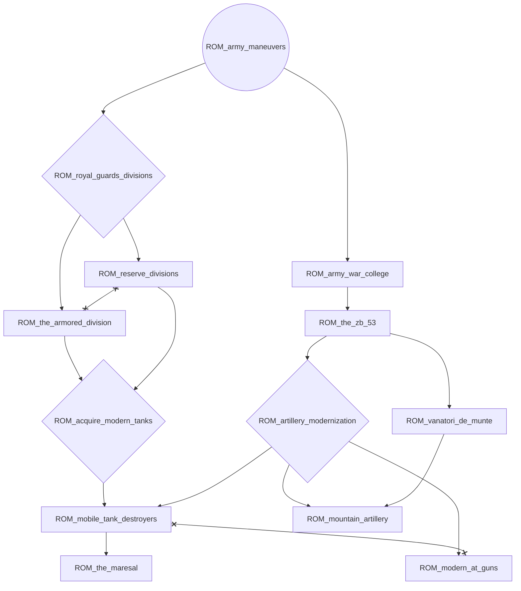
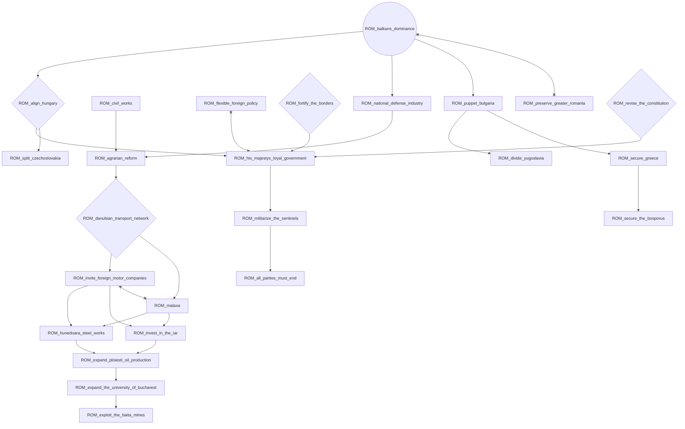
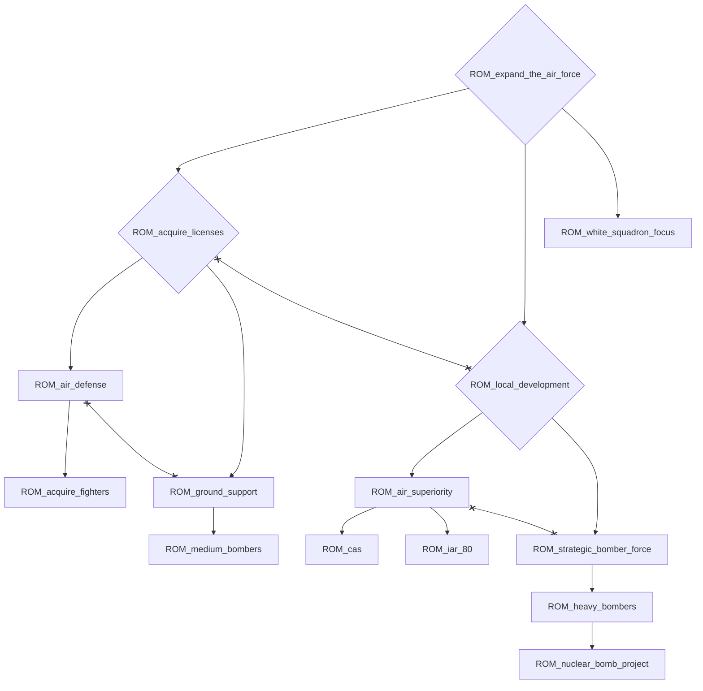
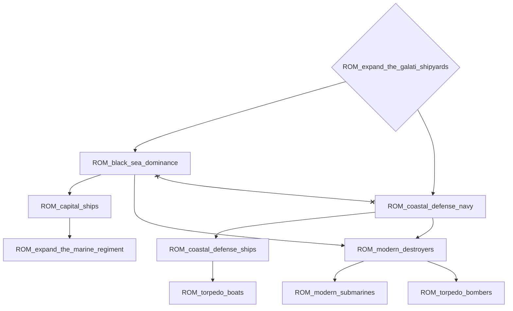
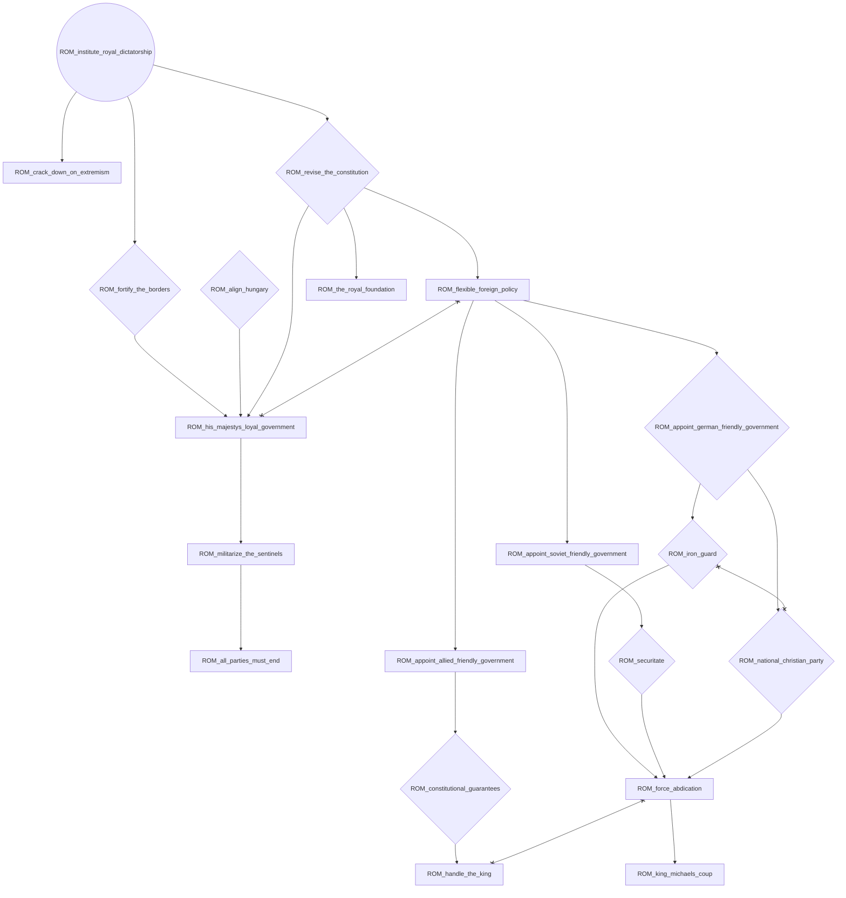
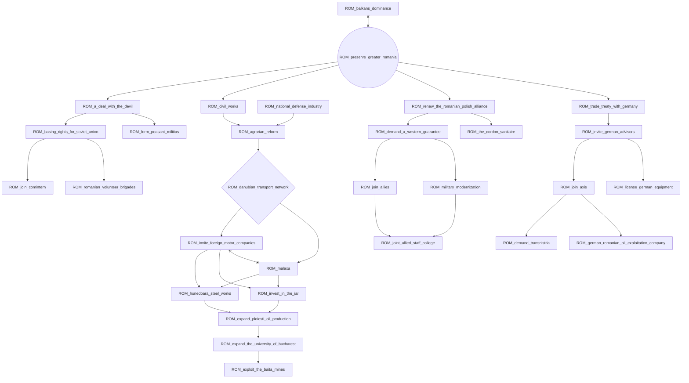

# ROM_army_maneuvers

```mermaid
flowchart TD
    n1{"ROM_acquire_modern_tanks"}
    n2(("ROM_army_maneuvers"))
    n3["ROM_army_war_college"]
    n4{"ROM_artillery_modernization"}
    n5["ROM_mobile_tank_destroyers"]
    n6["ROM_modern_at_guns"]
    n7["ROM_mountain_artillery"]
    n8["ROM_reserve_divisions"]
    n9{"ROM_royal_guards_divisions"}
    n10["ROM_the_armored_division"]
    n11["ROM_the_maresal"]
    n12["ROM_the_zb_53"]
    n13["ROM_vanatori_de_munte"]
    n10 --> n1
    n8 --> n1
    n2 --> n3
    n12 --> n4
    n1 --> n5
    n4 --> n5
    n4 --> n6
    n4 --> n7
    n13 --> n7
    n9 --> n8
    n2 --> n9
    n9 --> n10
    n5 --> n11
    n3 --> n12
    n12 --> n13
    n5 x--x n6
    n8 x--x n10
```

# ROM_balkans_dominance

```mermaid
flowchart TD
    n14["ROM_agrarian_reform"]
    n15{"ROM_align_hungary"}
    n16["ROM_all_parties_must_end"]
    n17(("ROM_balkans_dominance"))
    n18["ROM_civil_works"]
    n19{"ROM_danubian_transport_network"}
    n20["ROM_divide_yugoslavia"]
    n21["ROM_expand_ploiesti_oil_production"]
    n22["ROM_expand_the_university_of_bucharest"]
    n23["ROM_exploit_the_baita_mines"]
    n24["ROM_flexible_foreign_policy"]
    n25{"ROM_fortify_the_borders"}
    n26["ROM_his_majestys_loyal_government"]
    n27["ROM_hunedoara_steel_works"]
    n28["ROM_invest_in_the_iar"]
    n29["ROM_invite_foreign_motor_companies"]
    n30["ROM_malaxa"]
    n31["ROM_militarize_the_sentinels"]
    n32["ROM_national_defense_industry"]
    n33["ROM_preserve_greater_romania"]
    n34["ROM_puppet_bulgaria"]
    n35{"ROM_revise_the_constitution"}
    n36["ROM_secure_greece"]
    n37["ROM_secure_the_bosporus"]
    n38["ROM_split_czechoslovakia"]
    n18 --> n14
    n32 --> n14
    n17 --> n15
    n31 --> n16
    n14 --> n19
    n34 --> n20
    n28 --> n21
    n27 --> n21
    n21 --> n22
    n22 --> n23
    n25 --> n26
    n15 --> n26
    n35 --> n26
    n29 --> n27
    n30 --> n27
    n29 --> n28
    n30 --> n28
    n19 --> n29
    n19 --> n30
    n26 --> n31
    n17 --> n32
    n17 --> n34
    n34 --> n36
    n36 --> n37
    n15 --> n38
    n17 x--x n33
    n24 x--x n26
    n29 x--x n30
```

# ROM_expand_the_air_force

```mermaid
flowchart TD
    n39["ROM_acquire_fighters"]
    n40{"ROM_acquire_licenses"}
    n41["ROM_air_defense"]
    n42["ROM_air_superiority"]
    n43["ROM_cas"]
    n44{"ROM_expand_the_air_force"}
    n45["ROM_ground_support"]
    n46["ROM_heavy_bombers"]
    n47["ROM_iar_80"]
    n48{"ROM_local_development"}
    n49["ROM_medium_bombers"]
    n50["ROM_nuclear_bomb_project"]
    n51["ROM_strategic_bomber_force"]
    n52["ROM_white_squadron_focus"]
    n41 --> n39
    n44 --> n40
    n40 --> n41
    n48 --> n42
    n42 --> n43
    n40 --> n45
    n51 --> n46
    n42 --> n47
    n44 --> n48
    n45 --> n49
    n46 --> n50
    n48 --> n51
    n44 --> n52
    n40 x--x n48
    n41 x--x n45
    n42 x--x n51
```

# ROM_expand_the_galati_shipyards

```mermaid
flowchart TD
    n53["ROM_black_sea_dominance"]
    n54["ROM_capital_ships"]
    n55["ROM_coastal_defense_navy"]
    n56["ROM_coastal_defense_ships"]
    n57{"ROM_expand_the_galati_shipyards"}
    n58["ROM_expand_the_marine_regiment"]
    n59["ROM_modern_destroyers"]
    n60["ROM_modern_submarines"]
    n61["ROM_torpedo_boats"]
    n62["ROM_torpedo_bombers"]
    n57 --> n53
    n53 --> n54
    n57 --> n55
    n55 --> n56
    n54 --> n58
    n55 --> n59
    n53 --> n59
    n59 --> n60
    n56 --> n61
    n59 --> n62
    n53 x--x n55
```

# ROM_institute_royal_dictatorship

```mermaid
flowchart TD
    n15{"ROM_align_hungary"}
    n16["ROM_all_parties_must_end"]
    n63["ROM_appoint_allied_friendly_government"]
    n64{"ROM_appoint_german_friendly_government"}
    n65["ROM_appoint_soviet_friendly_government"]
    n66{"ROM_constitutional_guarantees"}
    n67["ROM_crack_down_on_extremism"]
    n24["ROM_flexible_foreign_policy"]
    n68["ROM_force_abdication"]
    n25{"ROM_fortify_the_borders"}
    n69["ROM_handle_the_king"]
    n26["ROM_his_majestys_loyal_government"]
    n70(("ROM_institute_royal_dictatorship"))
    n71{"ROM_iron_guard"}
    n72["ROM_king_michaels_coup"]
    n31["ROM_militarize_the_sentinels"]
    n73{"ROM_national_christian_party"}
    n35{"ROM_revise_the_constitution"}
    n74{"ROM_securitate"}
    n75["ROM_the_royal_foundation"]
    n31 --> n16
    n24 --> n63
    n24 --> n64
    n24 --> n65
    n63 --> n66
    n70 --> n67
    n35 --> n24
    n71 --> n68
    n74 --> n68
    n73 --> n68
    n70 --> n25
    n66 --> n69
    n25 --> n26
    n15 --> n26
    n35 --> n26
    n64 --> n71
    n68 --> n72
    n26 --> n31
    n64 --> n73
    n70 --> n35
    n65 --> n74
    n35 --> n75
    n24 x--x n26
    n68 x--x n69
    n71 x--x n73
```

# ROM_preserve_greater_romania

```mermaid
flowchart TD
    n76["ROM_a_deal_with_the_devil"]
    n14["ROM_agrarian_reform"]
    n17["ROM_balkans_dominance"]
    n77["ROM_basing_rights_for_soviet_union"]
    n18["ROM_civil_works"]
    n19{"ROM_danubian_transport_network"}
    n78["ROM_demand_a_western_guarantee"]
    n79["ROM_demand_transnistria"]
    n21["ROM_expand_ploiesti_oil_production"]
    n22["ROM_expand_the_university_of_bucharest"]
    n23["ROM_exploit_the_baita_mines"]
    n80["ROM_form_peasant_militias"]
    n81["ROM_german_romanian_oil_exploitation_company"]
    n27["ROM_hunedoara_steel_works"]
    n28["ROM_invest_in_the_iar"]
    n29["ROM_invite_foreign_motor_companies"]
    n82["ROM_invite_german_advisors"]
    n83["ROM_join_allies"]
    n84["ROM_join_axis"]
    n85["ROM_join_comintern"]
    n86["ROM_joint_allied_staff_college"]
    n87["ROM_license_german_equipment"]
    n30["ROM_malaxa"]
    n88["ROM_military_modernization"]
    n32["ROM_national_defense_industry"]
    n33(("ROM_preserve_greater_romania"))
    n89["ROM_renew_the_romanian_polish_alliance"]
    n90["ROM_romanian_volunteer_brigades"]
    n91["ROM_the_cordon_sanitaire"]
    n92["ROM_trade_treaty_with_germany"]
    n33 --> n76
    n18 --> n14
    n32 --> n14
    n76 --> n77
    n33 --> n18
    n14 --> n19
    n89 --> n78
    n84 --> n79
    n28 --> n21
    n27 --> n21
    n21 --> n22
    n22 --> n23
    n76 --> n80
    n84 --> n81
    n29 --> n27
    n30 --> n27
    n29 --> n28
    n30 --> n28
    n19 --> n29
    n92 --> n82
    n78 --> n83
    n82 --> n84
    n77 --> n85
    n83 --> n86
    n88 --> n86
    n82 --> n87
    n19 --> n30
    n78 --> n88
    n33 --> n89
    n77 --> n90
    n89 --> n91
    n33 --> n92
    n17 x--x n33
    n29 x--x n30
```
