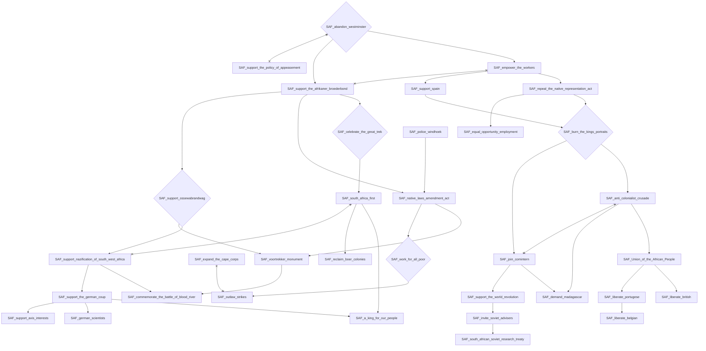
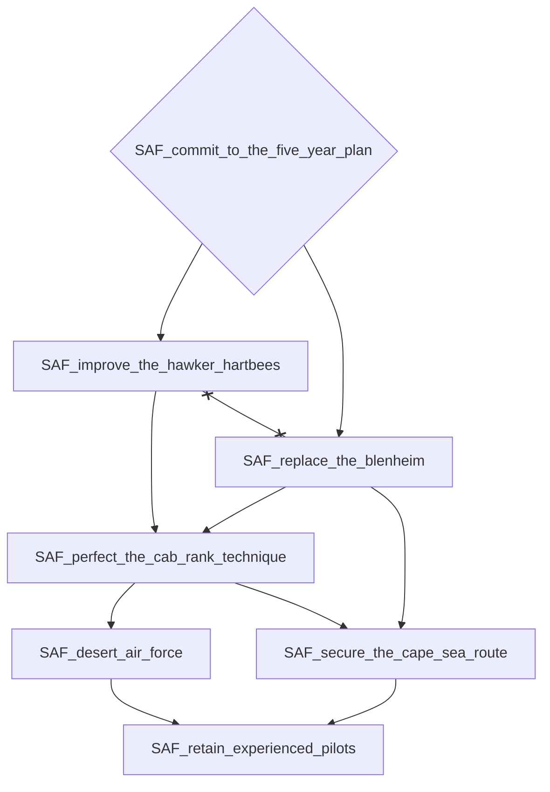
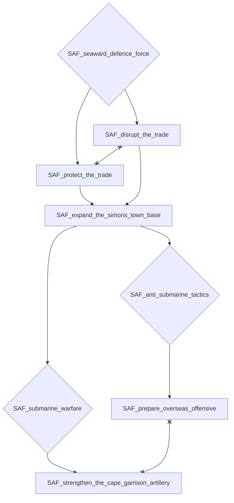
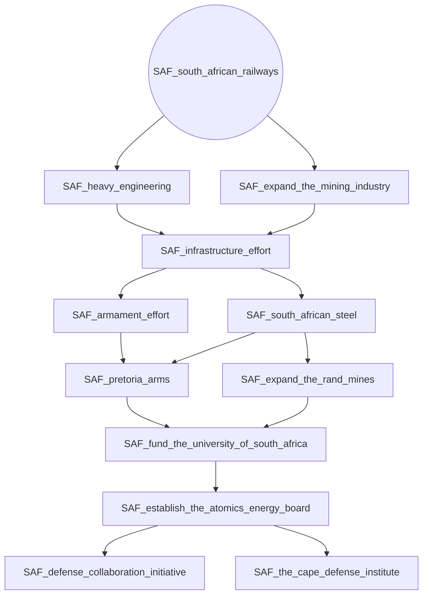
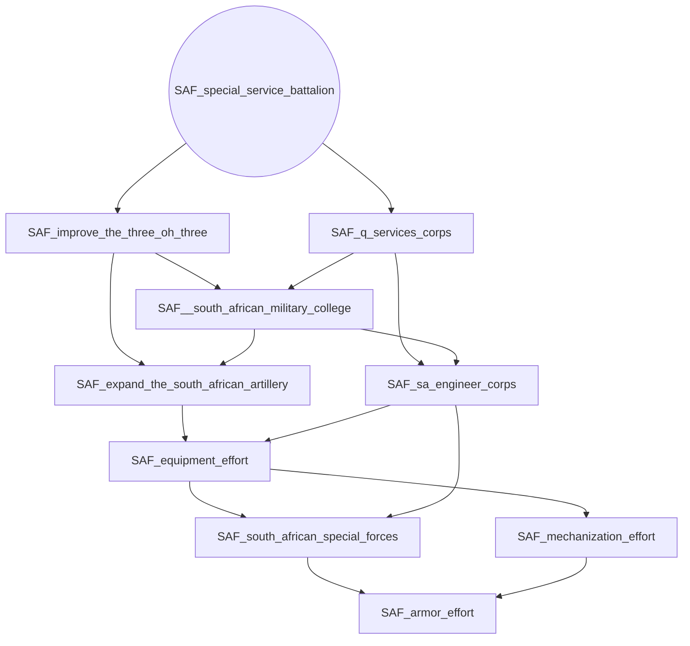
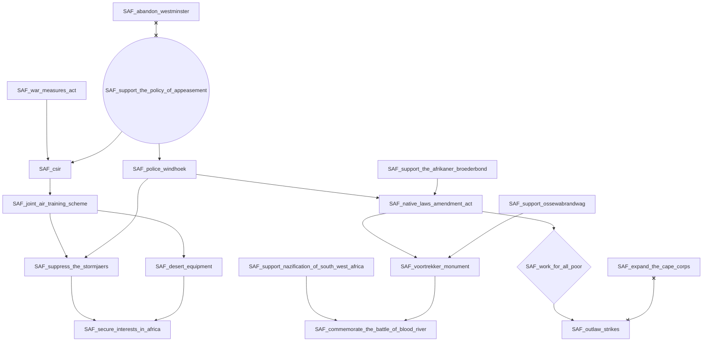
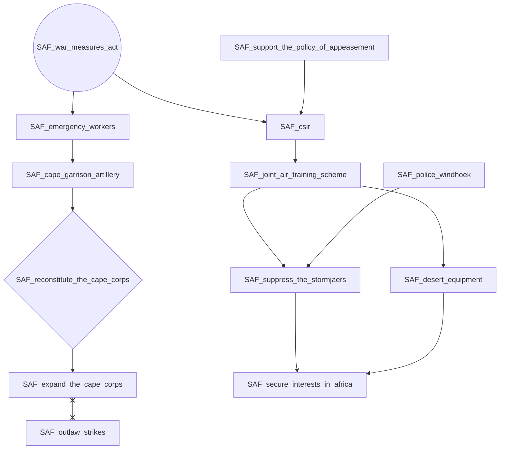

# SAF_abandon_westminster

# SAF_commit_to_the_five_year_plan

# SAF_seaward_defence_force

# SAF_south_african_railways

# SAF_special_service_battalion

# SAF_support_the_policy_of_appeasement

# SAF_war_measures_act

