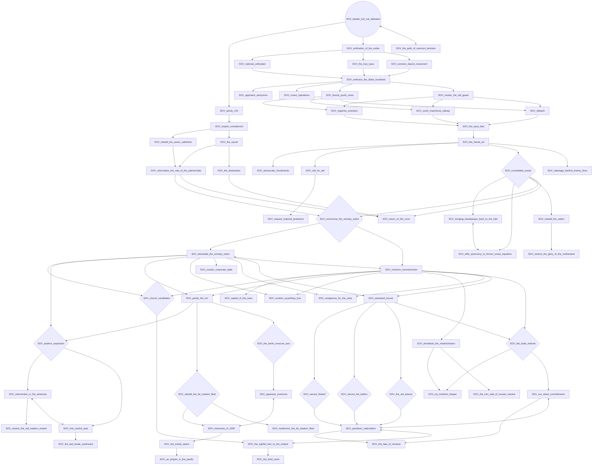
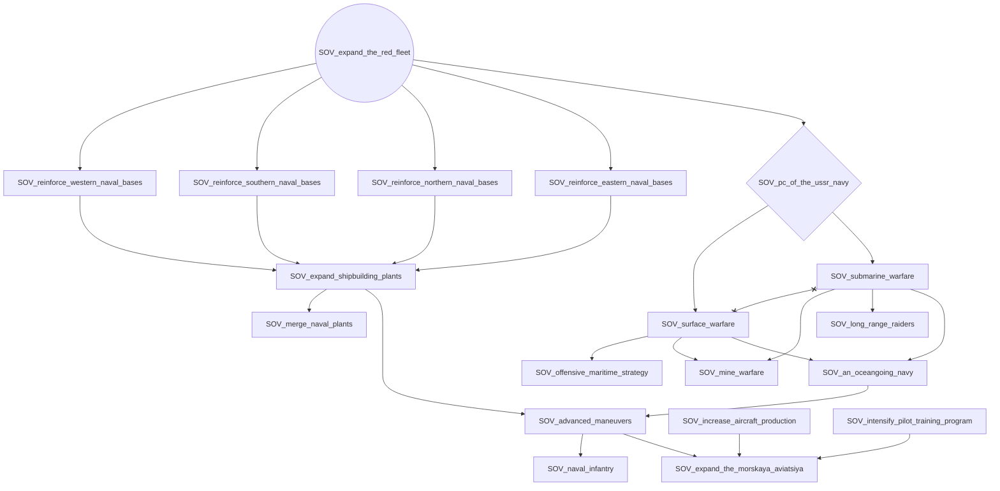
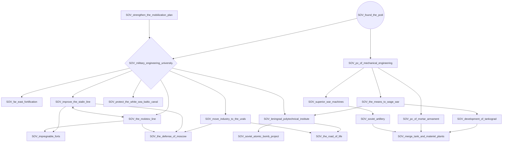
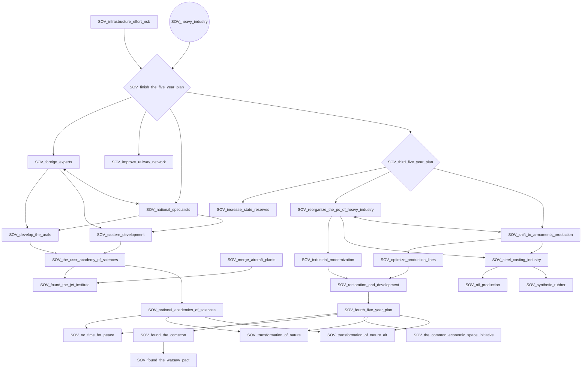
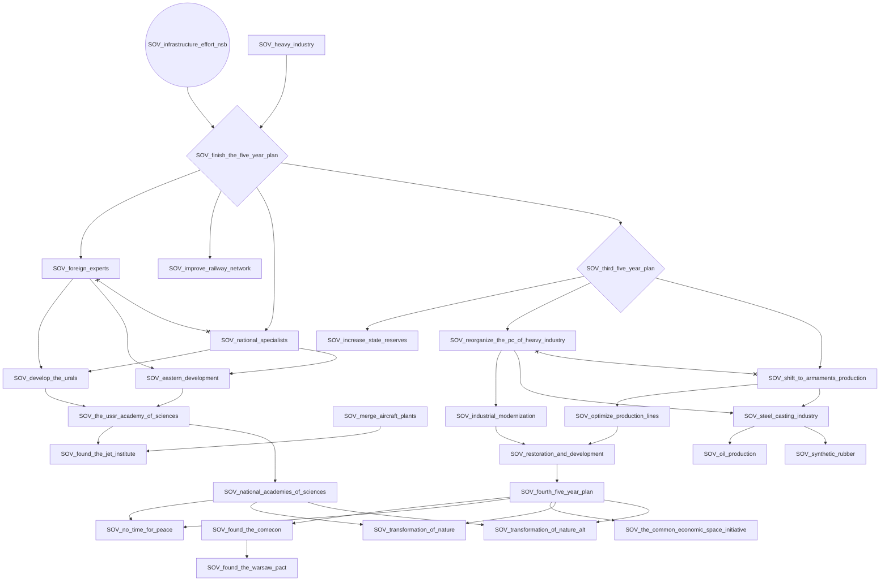
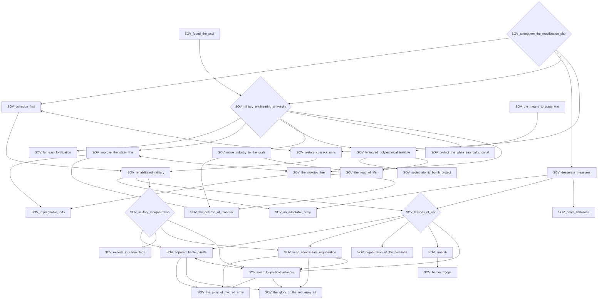
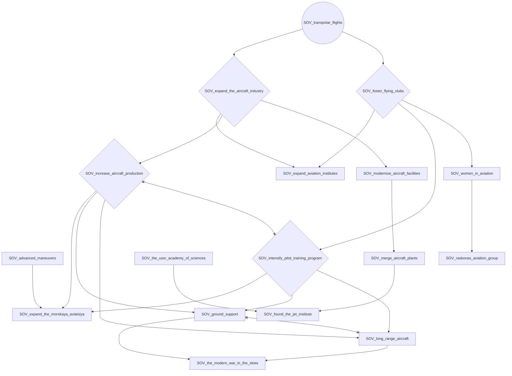

# SOV_beaten_but_not_defeated

# SOV_expand_the_red_fleet

# SOV_found_the_pcdi

# SOV_heavy_industry

# SOV_infrastructure_effort_nsb

# SOV_strengthen_the_mobilization_plan

# SOV_the_path_of_marxism_leninism

```mermaid
flowchart TD
    n152["SOV_a_global_class_struggle"]
    n153["SOV_a_new_theory_of_revolution"]
    n154["SOV_a_sustainable_economy"]
    n155["SOV_addressing_internal_affairs"]
    n156["SOV_administrative_reforms"]
    n157["SOV_align_the_zinovyevites"]
    n158{"SOV_all_power_to_the_soviets"}
    n159["SOV_annex_tannu_tuva"]
    n160["SOV_anti_capitalist_policies"]
    n161["SOV_anti_fascist_policies"]
    n162["SOV_approach_germany"]
    n163["SOV_approach_primakov"]
    n164["SOV_approach_tukhachevsky"]
    n165["SOV_architect_of_communism"]
    n166["SOV_autonomous_soviet_republics"]
    n167["SOV_back_to_the_nep"]
    n168{"SOV_baltic_security"}
    n169["SOV_ban_excessive_hero_worship"]
    n5["SOV_beaten_but_not_defeated"]
    n170["SOV_behead_the_snake"]
    n171["SOV_brilliant_genius"]
    n172["SOV_bring_old_trotskyists_back"]
    n173["SOV_carry_revolution_east"]
    n174{"SOV_claim_on_bessarabia"}
    n175["SOV_claims_in_baltic"]
    n176{"SOV_claims_on_poland"}
    n177["SOV_clandestine_cells"]
    n178["SOV_collectivist_propaganda"]
    n179["SOV_committee_in_exile"]
    n180["SOV_concessions_to_foreign_powers"]
    n181["SOV_control_scandinavia"]
    n182{"SOV_cooperation_against_stalin"}
    n183{"SOV_coup_detat"}
    n184["SOV_covert_support_for_spanish_poum"]
    n185{"SOV_curtailment_of_the_collective_farms"}
    n186["SOV_demand_balkan_submission"]
    n187["SOV_demand_eastern_poland"]
    n188["SOV_depoliticize_the_military"]
    n189["SOV_development_aid_for_eastern_allies"]
    n190["SOV_dissent_in_the_party"]
    n191["SOV_divert_attention_towards_military"]
    n192["SOV_eliminate_the_left"]
    n193["SOV_end_the_khalkhin_gol_conflict"]
    n194["SOV_eradicate_western_fascism"]
    n195{"SOV_expand_the_agitprop"}
    n196["SOV_father_of_nations"]
    n197["SOV_for_the_common_good"]
    n198["SOV_fortify_mongolian_border"]
    n199["SOV_freedom_of_debate_unity_of_action"]
    n200["SOV_funds_for_the_cause"]
    n201{"SOV_gain_support_from_party_members"}
    n202["SOV_great_commander"]
    n203{"SOV_incorporate_local_organizations"}
    n204["SOV_infiltrate_the_nkvd"]
    n205{"SOV_inheritor_of_the_mantle_of_lenin"}
    n206["SOV_integrate_smirnovs_bloc"]
    n207{"SOV_international_revolutionary_marxist_centre"}
    n208["SOV_international_union_of_soviet_republics"]
    n209["SOV_intervention_in_china"]
    n210{"SOV_leader_of_the_party_and_the_people"}
    n211["SOV_left_eliminate_right"]
    n212{"SOV_left_opposition_coup"}
    n213["SOV_left_purges"]
    n214["SOV_liberate_ryutin"]
    n215["SOV_liberation_of_the_european_proletariat"]
    n216{"SOV_long_live_the_workers_government"}
    n217{"SOV_middle_east_diplomacy"}
    n218["SOV_military_support"]
    n219["SOV_nkvd_primacy"]
    n220["SOV_offer_poland_protection"]
    n221["SOV_organization_centralization_discipline"]
    n222["SOV_organize_the_wreckers"]
    n223["SOV_organize_uprisings_in_the_country"]
    n224["SOV_paced_industrialization"]
    n225["SOV_patriarch_of_all_russia"]
    n226["SOV_planned_economy"]
    n227["SOV_policy_of_collective_security"]
    n228["SOV_policy_of_individual_security"]
    n229["SOV_positive_heroism"]
    n230["SOV_preemptive_invasion_of_iran"]
    n231{"SOV_prepare_a_war_with_japan"}
    n232["SOV_proclaim_soviet_hegemony"]
    n233["SOV_reconcile_japan"]
    n234["SOV_recover_alaska"]
    n235["SOV_recover_the_kuril_islands"]
    n236["SOV_regional_development"]
    n237["SOV_reigniting_the_revolutionary_spirit"]
    n238["SOV_respect_baltic_self_determination"]
    n239["SOV_return_democracy_to_the_party"]
    n240{"SOV_reverse_the_collectivization_process"}
    n241["SOV_revive_the_stakhanovite_movement"]
    n242["SOV_right_purges"]
    n243["SOV_secure_leningrad"]
    n244["SOV_secure_the_administration"]
    n245["SOV_seek_a_defense_pact_with_the_allies"]
    n246["SOV_seek_balkan_cooperation"]
    n247["SOV_send_military_advisors_to_spain"]
    n248["SOV_socialism_in_one_country"]
    n249["SOV_socialist_emulation"]
    n250["SOV_socialist_humanism"]
    n251["SOV_socialist_realism"]
    n252["SOV_soviet_japanese_pact_against_usa_focus"]
    n253["SOV_spheres_of_influence_in_china"]
    n254{"SOV_stalins_cult_of_personality"}
    n255["SOV_strengthen_heavy_industry"]
    n256["SOV_strengthen_the_trade_unions"]
    n257["SOV_support_afghan_ideology"]
    n258["SOV_support_the_kuomintang"]
    n259["SOV_sway_the_railway_workers"]
    n260["SOV_system_decentralization"]
    n261["SOV_the_anti_soviet_trotskyist_center"]
    n262["SOV_the_bloc_of_rights_and_trotskyites"]
    n263["SOV_the_builder_of_the_red_army"]
    n264["SOV_the_centre"]
    n265["SOV_the_collectivization_process"]
    n266{"SOV_the_comintern"}
    n267["SOV_the_construction_of_communism"]
    n268["SOV_the_end_of_the_imperialist_era"]
    n269["SOV_the_enemies_of_the_people"]
    n270{"SOV_the_faithful_servant_of_lenin"}
    n271["SOV_the_fight_for_the_pacific"]
    n272["SOV_the_fourth_international"]
    n273["SOV_the_gobi_gambit"]
    n274["SOV_the_khakimov_proposal"]
    n275["SOV_the_komsomol"]
    n276{"SOV_the_left_opposition"}
    n277["SOV_the_military_conspiracy"]
    n278{"SOV_the_need_for_policy_changes"}
    n279["SOV_the_new_soviet_woman"]
    n280["SOV_the_onslaught_on_colonialism"]
    n56{"SOV_the_path_of_marxism_leninism"}
    n281["SOV_the_peoples_revolution"]
    n282["SOV_the_permanent_revolution"]
    n283["SOV_the_plan_for_the_coup"]
    n284["SOV_the_power_of_the_peasantry"]
    n285{"SOV_the_right_opposition"}
    n286["SOV_the_socialist_bulwark"]
    n287["SOV_the_southern_thrust"]
    n288["SOV_the_stalin_constitution"]
    n289["SOV_the_supreme_soviet"]
    n290{"SOV_the_threat_from_the_land_of_the_rising_sun"}
    n291["SOV_the_trade_union_as_labor_organizer"]
    n292["SOV_the_vanguard_of_the_true_revolution"]
    n293["SOV_the_workers_dictatorship"]
    n294["SOV_the_zinovyevite_terrorist_center"]
    n295["SOV_they_will_know_fear"]
    n296["SOV_two_red_flags"]
    n297["SOV_undermine_stalins_authority"]
    n298["SOV_victory_over_devastation"]
    n299["SOV_war_economy"]
    n300["SOV_war_heroes"]
    n301["SOV_war_measures_in_the_east"]
    n282 --> n152
    n185 --> n153
    n224 --> n154
    n56 --> n155
    n185 --> n156
    n182 --> n157
    n260 --> n158
    n301 --> n159
    n266 --> n160
    n227 --> n161
    n228 --> n162
    n160 --> n162
    n206 --> n163
    n206 --> n164
    n270 --> n165
    n210 --> n165
    n236 --> n166
    n185 --> n167
    n266 --> n168
    n270 --> n169
    n277 --> n170
    n205 --> n171
    n276 --> n172
    n152 --> n173
    n176 --> n174
    n168 --> n175
    n238 --> n176
    n175 --> n176
    n223 --> n177
    n195 --> n178
    n272 --> n179
    n172 --> n179
    n240 --> n180
    n243 --> n181
    n201 --> n182
    n190 --> n183
    n240 --> n184
    n183 --> n185
    n174 --> n186
    n176 --> n187
    n263 --> n188
    n237 --> n188
    n266 --> n189
    n278 --> n190
    n276 --> n191
    n285 --> n191
    n278 --> n192
    n231 --> n193
    n245 --> n194
    n155 --> n195
    n202 --> n196
    n165 --> n196
    n203 --> n197
    n207 --> n197
    n301 --> n198
    n254 --> n199
    n164 --> n200
    n163 --> n200
    n179 --> n200
    n276 --> n201
    n285 --> n201
    n205 --> n202
    n210 --> n202
    n156 --> n203
    n153 --> n203
    n276 --> n204
    n285 --> n204
    n254 --> n205
    n276 --> n206
    n153 --> n207
    n156 --> n207
    n226 --> n207
    n166 --> n208
    n273 --> n209
    n296 --> n209
    n258 --> n209
    n205 --> n210
    n270 --> n210
    n276 --> n211
    n164 --> n212
    n163 --> n212
    n212 --> n213
    n182 --> n214
    n162 --> n215
    n212 --> n216
    n266 --> n217
    n276 --> n218
    n285 --> n218
    n155 --> n219
    n176 --> n220
    n265 --> n221
    n293 --> n221
    n276 --> n222
    n278 --> n223
    n167 --> n224
    n300 --> n225
    n251 --> n225
    n167 --> n226
    n266 --> n227
    n266 --> n228
    n195 --> n229
    n257 --> n230
    n273 --> n231
    n296 --> n231
    n258 --> n231
    n269 --> n232
    n266 --> n233
    n160 --> n234
    n231 --> n235
    n158 --> n236
    n216 --> n237
    n168 --> n238
    n182 --> n239
    n285 --> n240
    n229 --> n241
    n183 --> n242
    n238 --> n243
    n175 --> n243
    n294 --> n244
    n161 --> n245
    n174 --> n246
    n266 --> n247
    n264 --> n248
    n178 --> n249
    n298 --> n250
    n249 --> n251
    n233 --> n252
    n233 --> n253
    n262 --> n254
    n263 --> n255
    n237 --> n255
    n158 --> n256
    n203 --> n256
    n217 --> n257
    n290 --> n258
    n276 --> n259
    n285 --> n259
    n263 --> n260
    n237 --> n260
    n294 --> n261
    n277 --> n262
    n216 --> n263
    n56 --> n264
    n248 --> n265
    n244 --> n265
    n56 --> n266
    n199 --> n267
    n280 --> n268
    n173 --> n268
    n207 --> n269
    n254 --> n270
    n234 --> n271
    n276 --> n272
    n290 --> n273
    n245 --> n274
    n195 --> n275
    n56 --> n276
    n293 --> n277
    n285 --> n278
    n155 --> n279
    n152 --> n280
    n256 --> n281
    n212 --> n282
    n179 --> n282
    n297 --> n283
    n177 --> n283
    n183 --> n284
    n56 --> n285
    n184 --> n286
    n217 --> n287
    n264 --> n288
    n281 --> n289
    n266 --> n290
    n167 --> n291
    n212 --> n292
    n200 --> n292
    n261 --> n293
    n288 --> n294
    n254 --> n295
    n290 --> n296
    n223 --> n297
    n197 --> n298
    n221 --> n299
    n241 --> n300
    n189 --> n301
    n153 x--x n156
    n165 x--x n202
    n5 x--x n56
    n175 x--x n238
    n178 x--x n229
    n180 x--x n184
    n182 x--x n192
    n182 x--x n211
    n186 x--x n246
    n187 x--x n220
    n191 x--x n218
    n193 x--x n235
    n197 x--x n256
    n205 x--x n270
    n213 x--x n239
    n227 x--x n228
    n233 x--x n290
    n236 x--x n256
    n237 x--x n263
    n239 x--x n242
    n257 x--x n287
    n258 x--x n273
    n258 x--x n296
    n264 x--x n276
    n264 x--x n285
    n273 x--x n296
    n276 x--x n285
```

# SOV_transpolar_flights

