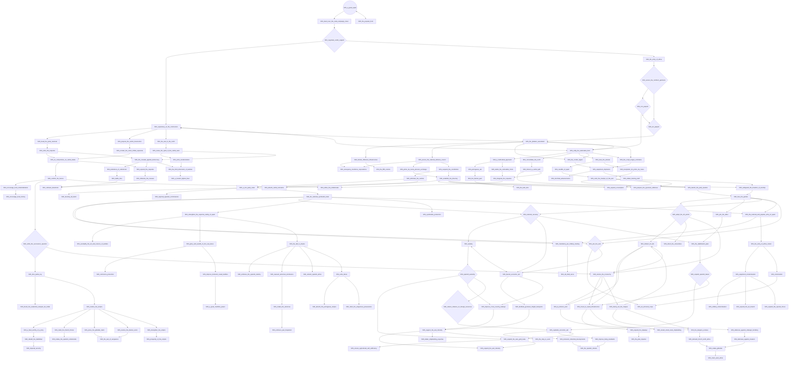
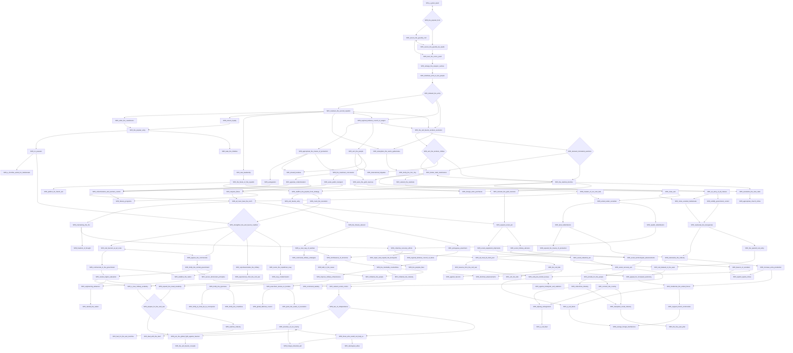

# SPA_a_great_spain

```mermaid
flowchart TD
    n1["SPA_a_fleet_worthy_of_a_king"]
    n2["SPA_a_great_maritime_power"]
    n3(("SPA_a_great_spain"))
    n4["SPA_a_methodical_approach"]
    n5["SPA_a_modern_fighter_fleet"]
    n6["SPA_a_one_party_state"]
    n7["SPA_absorb_carlist_remnants"]
    n8["SPA_absorb_the_portuguese_empire"]
    n9{"SPA_adopt_the_26_points"}
    n10["SPA_all_shall_serve"]
    n11["SPA_an_armored_corps"]
    n12["SPA_arms_modernization"]
    n13["SPA_artillery_modernization"]
    n14["SPA_autarky"]
    n15["SPA_banish_the_party_leaders"]
    n16["SPA_battle_rites"]
    n17["SPA_bolster_offensive_infrastructure"]
    n18["SPA_capitalist_economic_aid"]
    n19["SPA_caudillo_of_spain"]
    n20["SPA_claim_the_aragonese_possessions"]
    n21["SPA_claim_the_french_throne"]
    n22["SPA_claim_west_africa"]
    n23["SPA_commerce_protection"]
    n24{"SPA_con_paquito"}
    n25["SPA_confirm_the_fueros"]
    n26["SPA_consolidate_the_north"]
    n27["SPA_contact_the_union_militar_espanola"]
    n28["SPA_cultivate_fanaticism"]
    n29["SPA_defenders_of_catholicism"]
    n30["SPA_defenses_against_invasion"]
    n31["SPA_defenses_against_strategic_bombing"]
    n32["SPA_demand_french_north_africa"]
    n33["SPA_develop_all_talent"]
    n34["SPA_dictator_for_life"]
    n35["SPA_dios_patria_rey"]
    n36["SPA_direct_the_universities"]
    n37["SPA_doctrinal_advancements"]
    n38["SPA_domestic_industrial_developments"]
    n39["SPA_eliminate_the_carlists"]
    n40["SPA_embrace_pan_hispanism"]
    n41["SPA_embrace_the_spanish_destiny"]
    n42["SPA_emergency_munitions_corporations"]
    n43["SPA_encourage_local_industrialization"]
    n44["SPA_encourage_local_mining"]
    n45["SPA_ensure_agricultural_self_sufficiency"]
    n46["SPA_equipment_modernization"]
    n47["SPA_equipment_shipments"]
    n48["SPA_establish_the_directory"]
    n49["SPA_exemplify_the_art_and_science_of_warfare"]
    n50["SPA_expand_conscription"]
    n51{"SPA_expand_spanish_bases"}
    n52["SPA_expand_the_air_branch"]
    n53["SPA_expand_the_axis_gold_trade"]
    n54["SPA_expand_the_requetes"]
    n55["SPA_expand_the_slipways"]
    n56["SPA_expand_the_special_forces"]
    n57["SPA_expand_the_war_industry"]
    n58["SPA_extol_the_martyrs_of_the_war"]
    n59["SPA_facilitate_pyrenees_freight_transports"]
    n60["SPA_fascist_economic_aid"]
    n61["SPA_foment_a_carlist_split"]
    n62["SPA_found_the_academia_vazquez_de_mella"]
    n63["SPA_fuse_the_parties"]
    n64["SPA_glory_and_wealth_on_the_sea_lanes"]
    n65["SPA_hand_over_the_ceda_campaign_chest"]
    n66["SPA_head_the_junta_nacional"]
    n67["SPA_imperial_security"]
    n68["SPA_improve_cross_country_railways"]
    n69["SPA_improve_domestic_naval_facilities"]
    n70["SPA_improve_living_standards"]
    n71["SPA_integrate_the_requetes"]
    n72["SPA_invest_in_naval_infrastructure"]
    n73["SPA_italian_shipbuilding_expertise"]
    n74["SPA_join_the_allies"]
    n75{"SPA_join_the_axis"}
    n76["SPA_la_division_azul"]
    n77["SPA_mandatory_pre_military_training"]
    n78["SPA_martyrdom_for_primo_de_rivera"]
    n79["SPA_militarize_the_masses"]
    n80["SPA_motorization"]
    n81{"SPA_national_recovery"}
    n82{"SPA_negotiate_carlist_support"}
    n83["SPA_no_compromise_on_carlist_ideals"]
    n84["SPA_obtain_training_staff"]
    n85["SPA_portuguese_aid"]
    n86["SPA_prepare_the_carlist_insurrection"]
    n87["SPA_prepare_the_pyrenees_defenses"]
    n88["SPA_press_the_gibraltar_claim"]
    n89["SPA_primo_de_rivera_prisoner_exchange"]
    n90["SPA_prosperity_of_the_empire"]
    n91["SPA_reassert_american_dominance"]
    n92["SPA_rebuild_the_battlefleet"]
    n93["SPA_reclaim_spanish_africa"]
    n94{"SPA_reduce_reliance_on_foreign_resources"}
    n95["SPA_regional_agrarian_commissions"]
    n96["SPA_restart_small_scale_shipbuilding"]
    n97["SPA_restore_the_empire"]
    n98["SPA_restore_the_iberian_union"]
    n99["SPA_restore_the_monarchy"]
    n100["SPA_retake_gibraltar"]
    n101["SPA_retake_the_americas"]
    n102["SPA_retake_the_spanish_netherlands"]
    n103["SPA_revive_the_spirit_of_the_carlist_wars"]
    n104["SPA_safeguard_the_freedom_of_worship"]
    n105["SPA_save_the_alcazar"]
    n106["SPA_secure_the_national_defense_council"]
    n107{"SPA_secure_the_northern_garrisons"}
    n108{"SPA_settle_the_succession_question"}
    n109{"SPA_sin_paquito"}
    n110{"SPA_spanish_austerity"}
    n111["SPA_stamp_out_the_maquis"]
    n112["SPA_strengthen_the_empire"]
    n113["SPA_strengthen_the_supreme_reality_of_spain"]
    n114["SPA_support_the_war_industry"]
    n115["SPA_supremacy_of_the_communion"]
    n116["SPA_suspend_the_constitution"]
    n117["SPA_syndicalize_production"]
    n118["SPA_tackle_the_vulnerable_fronts"]
    n119["SPA_the_army_of_africa"]
    n120["SPA_the_army_of_africa_model"]
    n121["SPA_the_condor_legion"]
    n122["SPA_the_corpo_truppe_volontarie"]
    n123["SPA_the_crusade_against_democracy"]
    n124["SPA_the_duty_to_work"]
    n125["SPA_the_fifth_column"]
    n126["SPA_the_iberian_pact"]
    n127["SPA_the_latin_bloc"]
    n128["SPA_the_national_and_popular_army_of_spain"]
    n129["SPA_the_national_syndicalist_state"]
    n130["SPA_the_phalanx_ascendant"]
    n131["SPA_the_plan_imperial"]
    n132["SPA_the_spanish_miracle"]
    n133["SPA_the_stabilization_plan"]
    n134["SPA_the_tangiers_enclave"]
    n135["SPA_the_third_dimension_of_warfare"]
    n136["SPA_the_war_in_the_north"]
    n137["SPA_the_war_of_vengeance"]
    n138["SPA_the_will_to_empire"]
    n139["SPA_unify_the_nationalist_front"]
    n140["SPA_unite_iberia"]
    n141["SPA_unite_the_requetes"]
    n142["SPA_utilize_the_intellectuals"]
    n143["SPR_the_popular_front"]
    n97 --> n1
    n69 --> n2
    n139 --> n4
    n135 --> n5
    n48 --> n6
    n39 --> n6
    n39 --> n7
    n140 --> n8
    n63 --> n9
    n77 --> n10
    n80 --> n11
    n75 --> n11
    n103 --> n12
    n46 --> n13
    n81 --> n14
    n58 --> n15
    n61 --> n15
    n29 --> n16
    n130 --> n17
    n51 --> n18
    n94 --> n18
    n105 --> n19
    n140 --> n20
    n97 --> n21
    n100 --> n22
    n64 --> n23
    n107 --> n24
    n83 --> n25
    n139 --> n26
    n86 --> n27
    n79 --> n28
    n16 --> n28
    n123 --> n29
    n31 --> n30
    n111 --> n31
    n134 --> n32
    n6 --> n33
    n9 --> n34
    n108 --> n35
    n9 --> n36
    n47 --> n37
    n18 --> n38
    n116 --> n39
    n101 --> n40
    n138 --> n41
    n17 --> n42
    n106 --> n42
    n25 --> n43
    n43 --> n44
    n53 --> n45
    n120 --> n46
    n122 --> n47
    n121 --> n47
    n116 --> n48
    n89 --> n48
    n113 --> n49
    n48 --> n50
    n58 --> n50
    n133 --> n51
    n46 --> n52
    n110 --> n53
    n123 --> n54
    n83 --> n54
    n72 --> n55
    n46 --> n56
    n114 --> n57
    n53 --> n57
    n78 --> n58
    n19 --> n58
    n60 --> n59
    n75 --> n60
    n81 --> n60
    n26 --> n61
    n35 --> n62
    n15 --> n63
    n104 --> n63
    n113 --> n64
    n3 --> n65
    n115 --> n66
    n92 --> n67
    n60 --> n68
    n110 --> n68
    n64 --> n69
    n18 --> n70
    n118 --> n71
    n61 --> n71
    n51 --> n72
    n34 --> n72
    n99 --> n72
    n114 --> n73
    n63 --> n74
    n129 --> n75
    n63 --> n75
    n34 --> n76
    n99 --> n76
    n129 --> n77
    n128 --> n77
    n105 --> n78
    n54 --> n79
    n120 --> n80
    n129 --> n81
    n63 --> n81
    n65 --> n82
    n27 --> n83
    n141 --> n83
    n47 --> n84
    n4 --> n85
    n115 --> n86
    n48 --> n87
    n58 --> n87
    n97 --> n88
    n106 --> n89
    n112 --> n90
    n138 --> n91
    n1 --> n92
    n138 --> n93
    n110 --> n94
    n6 --> n95
    n72 --> n96
    n35 --> n97
    n97 --> n98
    n9 --> n99
    n108 --> n99
    n32 --> n100
    n30 --> n100
    n91 --> n101
    n21 --> n102
    n136 --> n103
    n48 --> n104
    n58 --> n104
    n139 --> n105
    n130 --> n106
    n119 --> n107
    n25 --> n108
    n107 --> n109
    n14 --> n110
    n34 --> n111
    n99 --> n111
    n97 --> n112
    n129 --> n113
    n59 --> n114
    n68 --> n114
    n82 --> n115
    n106 --> n116
    n129 --> n117
    n4 --> n118
    n82 --> n119
    n128 --> n120
    n130 --> n121
    n139 --> n121
    n130 --> n122
    n139 --> n122
    n141 --> n123
    n103 --> n123
    n114 --> n124
    n17 --> n125
    n85 --> n126
    n126 --> n127
    n129 --> n128
    n63 --> n128
    n6 --> n129
    n109 --> n130
    n55 --> n131
    n70 --> n132
    n38 --> n132
    n74 --> n133
    n81 --> n133
    n76 --> n134
    n111 --> n134
    n123 --> n135
    n12 --> n135
    n115 --> n136
    n88 --> n137
    n98 --> n137
    n113 --> n138
    n24 --> n139
    n138 --> n140
    n66 --> n141
    n71 --> n142
    n25 --> n142
    n3 x--x n143
    n14 x--x n60
    n18 x--x n53
    n24 x--x n109
    n34 x--x n99
    n115 x--x n130
    n115 x--x n139
    n130 x--x n139
```

# SPR_the_popular_front

```mermaid
flowchart TD
    n3["SPA_a_great_spain"]
    n144["SPR_a_frontline_suited_for_intellectuals"]
    n145["SPR_a_new_military_academy"]
    n146["SPR_a_new_way_of_warfare"]
    n147["SPR_a_red_fleet"]
    n148["SPR_a_red_iberia"]
    n149["SPR_against_fascism"]
    n150["SPR_against_trotskyism_and_stalinism"]
    n151["SPR_agrarian_collectivization"]
    n152["SPR_all_must_bear_the_torch"]
    n153["SPR_all_must_do_their_part"]
    n154["SPR_an_army_of_all_classes"]
    n155["SPR_anarchism_knows_no_borders"]
    n156["SPR_anti_fascist_unity"]
    n157["SPR_appeal_for_increased_autonomy"]
    n158["SPR_appropriate_church_riches"]
    n159["SPR_appropriate_the_means_of_production"]
    n160["SPR_arm_the_people"]
    n161["SPR_arm_the_tide"]
    n162{"SPR_arm_the_workers_militias"}
    n163["SPR_autogestion"]
    n164["SPR_avenge_foreign_interference"]
    n165["SPR_beacon_of_socialism"]
    n166["SPR_class_war"]
    n167["SPR_collective_recovery_efforts"]
    n168["SPR_collectivization_and_workers_control"]
    n169["SPR_collectivize_industry"]
    n170["SPR_communal_autarky"]
    n171["SPR_communal_military_strategies"]
    n172["SPR_communists_in_the_government"]
    n173["SPR_connect_the_country"]
    n174["SPR_crush_the_revolution"]
    n175["SPR_deal_with_the_devil"]
    n176{"SPR_demand_ministerial_positions"}
    n177{"SPR_disband_the_army"}
    n178["SPR_distribute_arms_to_the_people"]
    n179["SPR_doctrinal_advancements"]
    n180["SPR_end_fascism_at_all_costs"]
    n181["SPR_enemies_of_our_enemy"]
    n182["SPR_engineering_advances"]
    n183["SPR_enlarge_the_weapon_caches"]
    n184["SPR_enlist_the_carabineros"]
    n185["SPR_ensure_loyalty"]
    n186["SPR_expand_soviet_aid"]
    n187["SPR_expand_the_means_of_production"]
    n188["SPR_expand_the_naval_academy"]
    n189["SPR_experiences_from_the_civil_war"]
    n190["SPR_exploit_spains_riches"]
    n191["SPR_faith_in_the_cause"]
    n192["SPR_foreign_arms_purchases"]
    n193["SPR_foreign_industrial_aid"]
    n194["SPR_fortify_la_linea_de_la_concepcion"]
    n195["SPR_fortify_the_central_government"]
    n196["SPR_fortify_the_coastlines"]
    n197["SPR_fortify_the_iron_ring"]
    n198["SPR_fortify_the_pyrenees"]
    n199["SPR_freedom_of_thought"]
    n200["SPR_fuel_for_the_war_machine"]
    n201["SPR_global_defense_council"]
    n202["SPR_hinder_nkvd_interference"]
    n203["SPR_ideological_allies"]
    n204["SPR_improve_military_infrastructure"]
    n205["SPR_increase_arms_production"]
    n206["SPR_international_brigades"]
    n207["SPR_invite_socialist_intellectuals"]
    n208["SPR_join_the_global_fight_against_fascism"]
    n209["SPR_land_redistribution"]
    n210["SPR_lessons_from_the_civil_war"]
    n211["SPR_literacy_programs"]
    n212["SPR_maintain_the_second_republic"]
    n213["SPR_maintaining_the_fire"]
    n214["SPR_masters_of_our_own_fate"]
    n215["SPR_militarize_the_industry"]
    n216["SPR_militarize_the_people"]
    n217["SPR_modernize_the_armed_forces"]
    n218["SPR_mujeres_libres"]
    n219["SPR_nationalize_the_industry"]
    n220["SPR_navy_modernization"]
    n221["SPR_new_leadership"]
    n222["SPR_no_pasaran"]
    n223["SPR_oppose_the_communists"]
    n224["SPR_petition_for_french_aid"]
    n225["SPR_plant_the_seeds_of_revolution"]
    n226["SPR_portuguese_anarchism"]
    n227{"SPR_prepare_for_the_next_war"}
    n228["SPR_provide_for_the_people"]
    n229["SPR_reaffirm_the_popular_front_strategy"]
    n230["SPR_rebuild_the_nation"]
    n231["SPR_red_bulwark_in_the_west"]
    n232["SPR_reeducate_the_bourgeoisie"]
    n233["SPR_regional_defense_council_of_aragon"]
    n234["SPR_regional_defense_council_of_iberia"]
    n235["SPR_relocate_the_gold_reserves"]
    n236["SPR_repair_and_expand_the_dockyards"]
    n237["SPR_reprofessionalize_the_military"]
    n238["SPR_restore_higher_education"]
    n239["SPR_revive_the_republican_navy"]
    n240["SPR_secularize_the_new_state"]
    n241["SPR_secure_democratic_principles"]
    n242["SPR_secure_the_guardia_civil"]
    n243["SPR_secure_the_guardia_de_asalto"]
    n244["SPR_seize_public_transport"]
    n245["SPR_seize_the_gold_reserves"]
    n246["SPR_shared_burdens"]
    n247["SPR_slipway_enlargement"]
    n248["SPR_solidify_government_control"]
    n249["SPR_soviet_equipment_shipments"]
    n250["SPR_soviet_industrial_aid"]
    n251["SPR_soviet_military_advisors"]
    n252["SPR_soviet_recovery_aid"]
    n253["SPR_soviet_technological_advancements"]
    n254["SPR_stabilize_the_nation"]
    n255{"SPR_strengthen_the_anti_fascist_coalition"}
    n256["SPR_strengthen_the_euzko_gudarostea"]
    n257["SPR_subvert_soviet_control"]
    n258["SPR_subvert_the_stalinists"]
    n259["SPR_support_french_communists"]
    n260["SPR_take_the_initiative"]
    n261["SPR_the_anti_fascist_crusade"]
    n262["SPR_the_anti_fascist_workers_revolution"]
    n263["SPR_the_five_year_plan"]
    n264["SPR_the_future_of_the_republic"]
    n265["SPR_the_inevitable_counterblow"]
    n266["SPR_the_maximum_concession"]
    n267["SPR_the_peoples_fleet"]
    n268["SPR_the_popular_army"]
    n143{"SPR_the_popular_front"}
    n269["SPR_the_red_tide"]
    n270["SPR_the_spanish_red_army"]
    n271["SPR_the_stalinist_doctrine"]
    n272["SPR_the_threats_abound"]
    n273["SPR_those_who_would_not_help_us"]
    n274["SPR_torchbearers_of_tomorrow"]
    n275["SPR_train_the_union_youth"]
    n276["SPR_transplant_soviet_industry"]
    n277["SPR_unify_the_london_bureau"]
    n278["SPR_united_under_socialism"]
    n279{"SPR_war_of_independence"}
    n280["SPR_wartime_industry"]
    n281["SPR_wealth_redistribution"]
    n222 --> n144
    n189 --> n145
    n238 --> n145
    n272 --> n146
    n247 --> n147
    n277 --> n148
    n217 --> n148
    n269 --> n149
    n277 --> n150
    n266 --> n151
    n218 --> n152
    n214 --> n152
    n168 --> n152
    n167 --> n153
    n187 --> n153
    n271 --> n154
    n216 --> n155
    n229 --> n156
    n231 --> n157
    n252 --> n157
    n240 --> n158
    n233 --> n159
    n233 --> n160
    n269 --> n161
    n262 --> n162
    n159 --> n163
    n148 --> n164
    n259 --> n164
    n219 --> n165
    n258 --> n166
    n281 --> n167
    n213 --> n167
    n163 --> n168
    n244 --> n168
    n151 --> n168
    n228 --> n169
    n215 --> n170
    n146 --> n171
    n180 --> n172
    n228 --> n173
    n229 --> n174
    n181 --> n175
    n262 --> n176
    n178 --> n177
    n183 --> n178
    n269 --> n179
    n210 --> n179
    n255 --> n180
    n279 --> n181
    n254 --> n182
    n238 --> n182
    n275 --> n183
    n212 --> n184
    n212 --> n185
    n235 --> n186
    n174 --> n186
    n209 --> n187
    n220 --> n188
    n238 --> n188
    n237 --> n189
    n165 --> n190
    n205 --> n190
    n274 --> n191
    n245 --> n192
    n273 --> n193
    n181 --> n193
    n198 --> n194
    n223 --> n195
    n198 --> n196
    n256 --> n197
    n204 --> n198
    n213 --> n199
    n280 --> n200
    n155 --> n201
    n162 --> n202
    n176 --> n202
    n273 --> n203
    n265 --> n204
    n219 --> n205
    n160 --> n206
    n162 --> n206
    n166 --> n207
    n154 --> n207
    n227 --> n208
    n278 --> n209
    n153 --> n210
    n168 --> n211
    n218 --> n211
    n177 --> n212
    n152 --> n213
    n245 --> n214
    n265 --> n215
    n265 --> n216
    n191 --> n216
    n205 --> n217
    n157 --> n217
    n244 --> n218
    n151 --> n218
    n209 --> n219
    n232 --> n219
    n239 --> n220
    n212 --> n221
    n268 --> n222
    n255 --> n223
    n264 --> n224
    n155 --> n225
    n272 --> n226
    n145 --> n227
    n188 --> n227
    n252 --> n228
    n271 --> n229
    n264 --> n229
    n182 --> n230
    n270 --> n231
    n250 --> n231
    n207 --> n232
    n248 --> n232
    n177 --> n233
    n226 --> n234
    n271 --> n235
    n264 --> n235
    n167 --> n236
    n255 --> n237
    n195 --> n238
    n172 --> n238
    n255 --> n239
    n202 --> n240
    n271 --> n240
    n195 --> n241
    n143 --> n242
    n143 --> n243
    n266 --> n244
    n266 --> n245
    n202 --> n245
    n160 --> n246
    n159 --> n246
    n169 --> n247
    n173 --> n247
    n154 --> n248
    n186 --> n249
    n249 --> n250
    n251 --> n250
    n186 --> n251
    n250 --> n252
    n253 --> n252
    n249 --> n253
    n251 --> n253
    n195 --> n254
    n172 --> n254
    n174 --> n255
    n222 --> n255
    n262 --> n256
    n212 --> n256
    n252 --> n257
    n241 --> n257
    n202 --> n258
    n217 --> n259
    n268 --> n260
    n208 --> n261
    n177 --> n262
    n276 --> n263
    n221 --> n264
    n234 --> n265
    n274 --> n265
    n159 --> n266
    n160 --> n266
    n236 --> n267
    n185 --> n268
    n184 --> n268
    n153 --> n269
    n232 --> n270
    n176 --> n271
    n162 --> n271
    n152 --> n272
    n279 --> n273
    n146 --> n274
    n167 --> n274
    n243 --> n275
    n242 --> n275
    n169 --> n276
    n173 --> n276
    n210 --> n277
    n165 --> n277
    n166 --> n278
    n214 --> n278
    n257 --> n279
    n227 --> n280
    n278 --> n281
    n3 x--x n143
    n180 x--x n223
    n181 x--x n208
    n181 x--x n273
    n202 x--x n271
    n212 x--x n233
    n212 x--x n262
    n233 x--x n262
    n242 x--x n243
```
