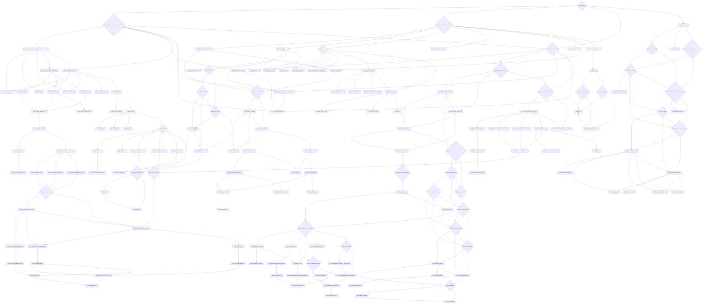

# SWE_defense_act

```mermaid
flowchart TD
    n1["SWE_acquire_ww2_tanks_and_wrecks"]
    n2["SWE_affordable_housing"]
    n3{"SWE_airforce_modernization"}
    n4["SWE_align_more_closely_with_the_landsorganisationen"]
    n5["SWE_all_cards_on_deck"]
    n6["SWE_allow_landsverk_to_operate"]
    n7["SWE_appeal_for_support"]
    n8["SWE_approach_the_allies"]
    n9{"SWE_aquire_modern_panzers"}
    n10["SWE_archapeligo_harrasment"]
    n11{"SWE_as_the_barometer_falls"}
    n12{"SWE_attack_Landsorganisationen"}
    n13["SWE_beneath_sticks_and_stones"]
    n14["SWE_betray_germany_plan"]
    n15["SWE_bofors_anti_tank_gun"]
    n16["SWE_bofors_fly_swatter"]
    n17["SWE_bornholm_crisis"]
    n18["SWE_cement_control_of_the_baltic"]
    n19["SWE_central_nordic_army_command"]
    n20["SWE_centralized_military_aid"]
    n21["SWE_coalition_war_cabinet"]
    n22["SWE_coastal_support"]
    n23{"SWE_continue_the_second_industrial_revolution"}
    n24["SWE_crusade_against_bolshevism"]
    n25["SWE_danish_alignment"]
    n26["SWE_decentralized_nordic_army_command"]
    n27["SWE_decentralized_nordic_volunteer_group"]
    n28["SWE_deep_mining_complexes"]
    n29{"SWE_defense_above_all"}
    n30{"SWE_defense_act"}
    n31["SWE_defense_in_depth"]
    n32{"SWE_delegation_to_berlin"}
    n33["SWE_demand_atlantic_resource_rights"]
    n34["SWE_demand_demilitarization_of_finnish_border"]
    n35{"SWE_domestic_designs"}
    n36["SWE_economic_deregulation"]
    n37{"SWE_economic_independence"}
    n38{"SWE_economic_integration"}
    n39["SWE_education_reform"]
    n40["SWE_en_svensk_tiger"]
    n41["SWE_end_the_fubkrieg"]
    n42["SWE_establish_nordland"]
    n43["SWE_establish_politburo"]
    n44["SWE_extend_the_time_of_preparedness"]
    n45{"SWE_finland_claims"}
    n46["SWE_finlands_cause_is_ours"]
    n47["SWE_finnish_buffer_state"]
    n48["SWE_finnish_integration"]
    n49["SWE_five_year_plan"]
    n50{"SWE_foreign_designs"}
    n51["SWE_form_rfsu"]
    n52{"SWE_form_saab"}
    n53["SWE_formation_flying"]
    n54["SWE_ga_pa_tactics"]
    n55["SWE_germanify_sweden"]
    n56{"SWE_gotaverken"}
    n57{"SWE_government_weapons_contract"}
    n58["SWE_greater_nordic_reich"]
    n59["SWE_hedgehog_defense"]
    n60["SWE_hemvarnet"]
    n61["SWE_husqvarna_vapenfabrik"]
    n62{"SWE_hygenic_housing"}
    n63["SWE_increase_intelligence_funding"]
    n64{"SWE_individual_liberty_and_prosperity_for_all"}
    n65["SWE_infrastructure"]
    n66["SWE_italian_destroyers"]
    n67["SWE_jagartrupper"]
    n68["SWE_join_allies_for_colonies"]
    n69{"SWE_join_the_anti_soviet_pact"}
    n70["SWE_karnvapenprogram"]
    n71["SWE_king_in_council"]
    n72["SWE_kockums"]
    n73["SWE_kp_bill"]
    n74["SWE_land_air_warfare"]
    n75["SWE_landverk_l_62"]
    n76["SWE_let_fly_all_guns"]
    n77["SWE_license_skf_ball_bearings"]
    n78["SWE_lindholmens_varv"]
    n79["SWE_liquidate_the_monarchy"]
    n80["SWE_lottakaren"]
    n81["SWE_lynx_winter_armored_cars"]
    n82["SWE_marauder_bombers"]
    n83["SWE_meet_with_the_king"]
    n84["SWE_merge_army_complexes"]
    n85{"SWE_military_independence"}
    n86{"SWE_military_integration"}
    n87["SWE_mobilization_of_society"]
    n88{"SWE_mythologize_swedish_history"}
    n89["SWE_narvik_crisis"]
    n90["SWE_neither_death_nor_dishonor"]
    n91["SWE_nordic_centralized_air_command"]
    n92["SWE_nordic_defense_fleet"]
    n93["SWE_nordic_protection_complex"]
    n94["SWE_nordljus"]
    n95["SWE_norma_projektilfabrik"]
    n96["SWE_operation_save_denmark"]
    n97["SWE_operation_save_norway"]
    n98{"SWE_organize_a_putsch"}
    n99{"SWE_paid_holidays"}
    n100["SWE_peoples_commissar_for_defense"]
    n101["SWE_per_albin_bus"]
    n102["SWE_per_albin_line"]
    n103["SWE_police_reforms"]
    n104["SWE_preemptive_strike"]
    n105{"SWE_prevent_a_red_dictatorship"}
    n106{"SWE_privately_managed_holidays"}
    n107["SWE_promote_nordic_identity"]
    n108["SWE_radiojanst"]
    n109["SWE_rapid_mobilization"]
    n110["SWE_rapid_response_force"]
    n111["SWE_rationing"]
    n112["SWE_reclaiming_the_rus"]
    n113["SWE_refit_gotaverken_for_rapid_repairs"]
    n114["SWE_refuge_for_revolutionaries"]
    n115["SWE_refuge_from_war"]
    n116["SWE_reject_saltsjobaden"]
    n117["SWE_research_slot_1"]
    n118["SWE_research_slot_2"]
    n119["SWE_restoring_order"]
    n120["SWE_retool_dockyards"]
    n121["SWE_revoke_anti_militia_laws"]
    n122{"SWE_ring_a_ding_ding"}
    n123["SWE_rockets"]
    n124["SWE_rule_the_baltic"]
    n125["SWE_saltsjobaden_agreement"]
    n126["SWE_sami_reconcilliation"]
    n127["SWE_scandinavian_defense_union"]
    n128["SWE_scramble_for_the_baltic"]
    n129["SWE_secret_mobilization"]
    n130["SWE_sieze_landsverk"]
    n131["SWE_socialist_reforms"]
    n132["SWE_special_forces"]
    n133["SWE_specialized_equipment"]
    n134["SWE_standardize_equipment"]
    n135["SWE_starve_the_fascists_of_iron"]
    n136["SWE_strike_the_capitalist_beast_down"]
    n137["SWE_support_danish_communists"]
    n138["SWE_support_norwegian_communists"]
    n139["SWE_surface_raiders"]
    n140["SWE_swedes_not_sweden_to_finlands_aid"]
    n141["SWE_swedish_finnish_defense_agreement"]
    n142["SWE_swedish_shooting_movement"]
    n143["SWE_tank_development"]
    n144{"SWE_the_aland_issue"}
    n145["SWE_the_aland_question"]
    n146["SWE_the_barrel"]
    n147{"SWE_the_cross_we_bear"}
    n148["SWE_the_lion_of_the_north_rises"]
    n149["SWE_the_narvik_solution"]
    n150["SWE_the_new_order"]
    n151{"SWE_the_nordic_defense_council"}
    n152{"SWE_the_old_enemy_stirs"}
    n153["SWE_the_threat_of_the_iron_curtain"]
    n154{"SWE_totalforsvar"}
    n155["SWE_train_the_sheltered"]
    n156["SWE_undermine_the_fascists"]
    n157{"SWE_unify_the_national_socialist_movement"}
    n158["SWE_united_kingdoms_of_sweden_and_norway"]
    n159{"SWE_universal_basic_income"}
    n160["SWE_unrestricted_submarine_warfare"]
    n161["SWE_uranium_project"]
    n162["SWE_urbanization"]
    n163["SWE_varnplikt"]
    n164["SWE_vasa_ii"]
    n165["SWE_volvo"]
    n166["SWE_war_games"]
    n167["SWE_winter_drill"]
    n168{"SWE_work_projects_for_the_unemployed"}
    n127 --> n1
    n64 --> n2
    n53 --> n3
    n82 --> n3
    n23 --> n4
    n124 --> n5
    n57 --> n6
    n156 --> n7
    n121 --> n7
    n88 --> n8
    n165 --> n9
    n120 --> n10
    n130 --> n11
    n6 --> n11
    n83 --> n12
    n59 --> n13
    n107 --> n14
    n16 --> n15
    n57 --> n16
    n88 --> n17
    n92 --> n18
    n151 --> n19
    n19 --> n20
    n23 --> n21
    n124 --> n22
    n30 --> n23
    n141 --> n24
    n69 --> n24
    n48 --> n24
    n33 --> n25
    n151 --> n26
    n19 --> n27
    n29 --> n28
    n168 --> n29
    n62 --> n29
    n11 --> n31
    n157 --> n32
    n17 --> n33
    n144 --> n34
    n52 --> n35
    n116 --> n36
    n32 --> n37
    n32 --> n38
    n125 --> n39
    n4 --> n40
    n21 --> n40
    n13 --> n41
    n143 --> n41
    n45 --> n42
    n79 --> n43
    n127 --> n44
    n153 --> n44
    n55 --> n45
    n107 --> n45
    n23 --> n46
    n152 --> n46
    n100 --> n47
    n34 --> n48
    n43 --> n49
    n52 --> n50
    n4 --> n51
    n21 --> n51
    n16 --> n52
    n35 --> n53
    n50 --> n53
    n31 --> n54
    n74 --> n54
    n85 --> n55
    n86 --> n55
    n57 --> n56
    n30 --> n57
    n25 --> n58
    n158 --> n58
    n48 --> n58
    n31 --> n59
    n154 --> n60
    n57 --> n61
    n162 --> n62
    n1 --> n63
    n168 --> n64
    n62 --> n64
    n125 --> n65
    n116 --> n65
    n56 --> n66
    n163 --> n67
    n8 --> n68
    n88 --> n69
    n44 --> n70
    n12 --> n71
    n56 --> n72
    n9 --> n73
    n122 --> n73
    n11 --> n74
    n16 --> n75
    n143 --> n76
    n125 --> n77
    n116 --> n77
    n56 --> n78
    n131 --> n79
    n115 --> n79
    n103 --> n79
    n154 --> n80
    n9 --> n81
    n122 --> n81
    n35 --> n82
    n50 --> n82
    n7 --> n83
    n156 --> n83
    n20 --> n84
    n37 --> n85
    n38 --> n85
    n37 --> n86
    n38 --> n86
    n13 --> n87
    n119 --> n88
    n71 --> n88
    n88 --> n89
    n27 --> n90
    n91 --> n90
    n92 --> n90
    n19 --> n91
    n19 --> n92
    n84 --> n93
    n92 --> n94
    n57 --> n95
    n154 --> n96
    n154 --> n97
    n157 --> n98
    n64 --> n99
    n29 --> n99
    n43 --> n100
    n163 --> n101
    n59 --> n102
    n110 --> n102
    n136 --> n103
    n148 --> n104
    n166 --> n104
    n152 --> n105
    n64 --> n106
    n29 --> n106
    n85 --> n107
    n86 --> n107
    n162 --> n108
    n154 --> n109
    n74 --> n110
    n163 --> n111
    n24 --> n112
    n56 --> n113
    n115 --> n114
    n136 --> n115
    n99 --> n116
    n106 --> n116
    n125 --> n117
    n116 --> n117
    n41 --> n118
    n98 --> n119
    n56 --> n120
    n105 --> n121
    n165 --> n122
    n3 --> n123
    n56 --> n124
    n99 --> n125
    n106 --> n125
    n4 --> n126
    n21 --> n126
    n159 --> n127
    n88 --> n128
    n154 --> n129
    n57 --> n130
    n136 --> n131
    n153 --> n132
    n132 --> n133
    n57 --> n134
    n49 --> n135
    n4 --> n136
    n100 --> n137
    n100 --> n138
    n120 --> n139
    n23 --> n140
    n152 --> n140
    n144 --> n141
    n69 --> n141
    n60 --> n142
    n110 --> n143
    n88 --> n144
    n23 --> n145
    n152 --> n145
    n3 --> n146
    n97 --> n147
    n96 --> n147
    n90 --> n147
    n70 --> n148
    n133 --> n148
    n21 --> n149
    n45 --> n150
    n152 --> n151
    n30 --> n152
    n159 --> n153
    n147 --> n153
    n163 --> n154
    n167 --> n155
    n105 --> n156
    n7 --> n157
    n121 --> n157
    n89 --> n158
    n138 --> n159
    n137 --> n159
    n47 --> n159
    n120 --> n160
    n55 --> n161
    n30 --> n162
    n167 --> n163
    n124 --> n164
    n134 --> n165
    n63 --> n166
    n70 --> n166
    n21 --> n167
    n162 --> n168
    n4 x--x n21
    n6 x--x n130
    n8 x--x n89
    n19 x--x n26
    n23 x--x n152
    n29 x--x n64
    n31 x--x n74
    n32 x--x n98
    n34 x--x n141
    n35 x--x n50
    n37 x--x n38
    n42 x--x n150
    n46 x--x n140
    n46 x--x n145
    n53 x--x n82
    n55 x--x n107
    n71 x--x n119
    n73 x--x n81
    n85 x--x n86
    n99 x--x n106
    n105 x--x n151
    n109 x--x n129
    n116 x--x n125
    n120 x--x n124
    n121 x--x n156
    n123 x--x n146
    n127 x--x n153
    n140 x--x n145
```
