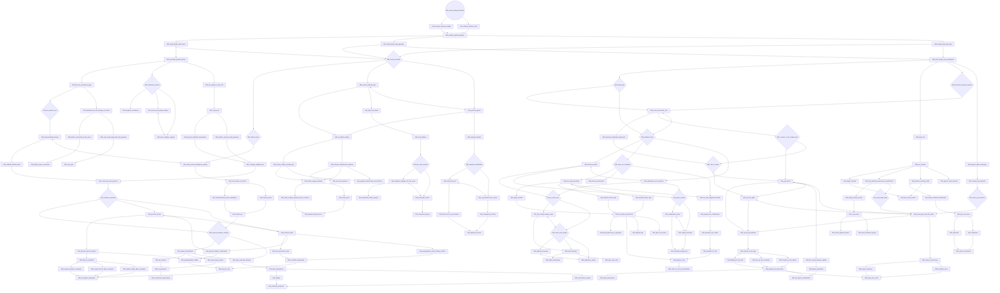

# SWI_swiss_guiding_principles

```mermaid
flowchart TD
    n1{"SWI_a_swiss_navy"}
    n2{"SWI_abandon_neutrality"}
    n3["SWI_adopt_romansh"]
    n4["SWI_air_production"]
    n5["SWI_air_research"]
    n6["SWI_airspace_surveillance"]
    n7["SWI_aktion_nationaler_widerstand"]
    n8["SWI_all_adults_training"]
    n9{"SWI_allied_gold"}
    n10["SWI_alpine_aspirations"]
    n11["SWI_alpine_redoubt"]
    n12["SWI_alpine_specialization"]
    n13["SWI_american_industrial_investments"]
    n14["SWI_anti_tank_divisions"]
    n15{"SWI_armed_neutrality"}
    n16["SWI_arsenal_of_the_alps"]
    n17["SWI_artillery"]
    n18["SWI_ask_for_vorarlberg"]
    n19["SWI_attack_from_the_mountains"]
    n20["SWI_axis_gold"]
    n21["SWI_ban_democratic_party"]
    n22["SWI_ban_foreign_nazi_propaganda"]
    n23["SWI_ban_national_movement_for_switzerland"]
    n24["SWI_ban_the_communist_party"]
    n25["SWI_become_german_puppet"]
    n26["SWI_bring_democracy_to_germany"]
    n27["SWI_buero_ha"]
    n28["SWI_build_naval_bases"]
    n29["SWI_buy_foreign_surplus_ships"]
    n30["SWI_case_north"]
    n31["SWI_case_west"]
    n32["SWI_centralize_switzerland"]
    n33["SWI_citizen_supply_mandate"]
    n34["SWI_closer_democratic_ties"]
    n35["SWI_closer_ties_with_germany"]
    n36["SWI_complete_siegfried_line"]
    n37{"SWI_connect_to_the_maginot_line"}
    n38["SWI_crack_down_on_dissent"]
    n39["SWI_defend_the_skies"]
    n40["SWI_demand_french_alps"]
    n41["SWI_demand_italian_alps"]
    n42["SWI_emergency_industry"]
    n43["SWI_empower_the_council"]
    n44["SWI_enhanced_training"]
    n45["SWI_exiled_government"]
    n46["SWI_expand_federal_police_intelligence"]
    n47["SWI_expand_special_forces"]
    n48["SWI_expand_spy_networks"]
    n49["SWI_expand_the_confederation"]
    n50{"SWI_expand_weapons_industry"}
    n51["SWI_expanded_military_support"]
    n52{"SWI_expedite_mobilization"}
    n53["SWI_export_saboteurs"]
    n54["SWI_extended_supply_lines"]
    n55{"SWI_federal_police"}
    n56["SWI_fight_until_death"]
    n57["SWI_fighting_for_the_hills"]
    n58["SWI_floating_fortresses"]
    n59["SWI_fly_over_the_mountains"]
    n60["SWI_fortify_austrian_border"]
    n61["SWI_fortify_border_with_france"]
    n62["SWI_fortify_border_with_germany"]
    n63["SWI_fortify_border_with_italy"]
    n64["SWI_fortify_sargans_gotthard_and_st_maurice"]
    n65["SWI_fortify_the_jura"]
    n66["SWI_fortify_ticino"]
    n67["SWI_freeze_german_assets"]
    n68["SWI_frontier_defense_plan"]
    n69["SWI_fund_resistance_groups"]
    n70["SWI_german_industrial_investments"]
    n71["SWI_german_military_collaboration"]
    n72{"SWI_gotthard_union"}
    n73["SWI_guisans_coup"]
    n74["SWI_heer_und_haus"]
    n75["SWI_increase_defense_budget"]
    n76["SWI_industrial_production"]
    n77["SWI_infiltrate_federal_police"]
    n78["SWI_integrate_refugees_into_the_army"]
    n79["SWI_join_france"]
    n80["SWI_join_the_allies"]
    n81["SWI_join_the_axis"]
    n82["SWI_jump_into_action"]
    n83["SWI_lay_the_groundwork"]
    n84["SWI_liberate_italy"]
    n85["SWI_license_axis_plane_designs"]
    n86["SWI_limited_censorship_of_the_press"]
    n87["SWI_luftschutz"]
    n88["SWI_martial_law"]
    n89["SWI_mechanized_support"]
    n90["SWI_military_exercises_with_germany"]
    n91["SWI_military_police"]
    n92{"SWI_modernize_airforce"}
    n93["SWI_mountaneer_paratroopers"]
    n94["SWI_multipurpose_tanks"]
    n95["SWI_national_defense_fund"]
    n96["SWI_national_redoubt"]
    n97["SWI_naval_industry"]
    n98["SWI_neutral_entente"]
    n99["SWI_oasis_of_democracy"]
    n100["SWI_ortswehren"]
    n101["SWI_panoramaheim_branch"]
    n102["SWI_patriotic_shooting_clubs"]
    n103{"SWI_plains_warfare"}
    n104["SWI_pre_empt_anschluss"]
    n105["SWI_prepare_infrastructure_and_industry"]
    n106["SWI_president_for_life"]
    n107{"SWI_press_for_vorarlberg"}
    n108["SWI_pro_helvetia"]
    n109["SWI_professionalize_militias"]
    n110["SWI_prolonged_service"]
    n111["SWI_promote_guisan"]
    n112["SWI_promote_henne"]
    n113["SWI_promote_tobler"]
    n114["SWI_propagandize_swiss_military_tradition"]
    n115["SWI_protect_liechtenstein"]
    n116{"SWI_purchase_american_planes"}
    n117["SWI_purchase_german_planes"]
    n118["SWI_reaffirm_spiritual_defense"]
    n119["SWI_reduce_military_training_age"]
    n120["SWI_request_austrian_occupation"]
    n121["SWI_request_french_alps_occupation"]
    n122["SWI_request_italian_alps_occupation"]
    n123["SWI_return_to_the_old_switzerland"]
    n124["SWI_rig_infrastructure_to_blow"]
    n125["SWI_rolling_fortresses"]
    n126["SWI_secret_pact_with_the_allies"]
    n127{"SWI_seek_allied_trade"}
    n128["SWI_seek_trade_agreement_with_germany"]
    n129{"SWI_share_spy_networks"}
    n130["SWI_spab_counter_intelligence_agency"]
    n131["SWI_spirit_of_resistance"]
    n132["SWI_spirit_of_saint_bernard"]
    n133["SWI_submarine_raiders"]
    n134["SWI_support_allied_espionage"]
    n135["SWI_swiss_airplane_designs"]
    n136["SWI_swiss_armored_divisions"]
    n137(("SWI_swiss_guiding_principles"))
    n138["SWI_swiss_heavy_planes"]
    n139{"SWI_swiss_ship_designs"}
    n140["SWI_switzerland_on_the_offense"]
    n141{"SWI_take_a_stance"}
    n142["SWI_take_over_france"]
    n143["SWI_tank_development"]
    n144["SWI_the_alpine_confederation"]
    n145["SWI_the_alpine_protectorate"]
    n146["SWI_the_alpine_supremacy"]
    n147{"SWI_the_army_position"}
    n148{"SWI_the_national_front"}
    n149["SWI_the_new_eidgenossenschaft"]
    n150["SWI_the_petition_of_the_200"]
    n151["SWI_the_second_helvetic_republic"]
    n152["SWI_thunder_in_the_valleys"]
    n153["SWI_tighten_press_censorship"]
    n154["SWI_total_defense"]
    n155["SWI_train_navy_staff"]
    n156["SWI_train_swiss_women"]
    n157["SWI_veteran_sharpshooter_divisions"]
    n158["SWI_volunteer_force"]
    n159["SWI_weapons_of_democracy"]
    n160["SWI_withdraw_from_the_league_of_nations"]
    n140 --> n1
    n98 --> n1
    n35 --> n2
    n108 --> n3
    n138 --> n4
    n5 --> n4
    n12 --> n5
    n92 --> n6
    n102 --> n7
    n111 --> n8
    n68 --> n8
    n22 --> n9
    n151 --> n10
    n104 --> n11
    n50 --> n12
    n34 --> n13
    n157 --> n14
    n62 --> n15
    n63 --> n15
    n61 --> n15
    n83 --> n16
    n143 --> n17
    n25 --> n18
    n65 --> n19
    n128 --> n20
    n113 --> n21
    n62 --> n22
    n63 --> n22
    n108 --> n23
    n117 --> n24
    n112 --> n25
    n145 --> n26
    n22 --> n27
    n97 --> n28
    n1 --> n29
    n60 --> n30
    n150 --> n31
    n114 --> n32
    n21 --> n32
    n157 --> n33
    n119 --> n33
    n9 --> n34
    n116 --> n34
    n77 --> n35
    n36 --> n35
    n70 --> n36
    n90 --> n36
    n34 --> n37
    n130 --> n38
    n19 --> n39
    n42 --> n39
    n104 --> n40
    n104 --> n41
    n124 --> n42
    n49 --> n43
    n110 --> n44
    n159 --> n45
    n38 --> n46
    n64 --> n47
    n66 --> n47
    n134 --> n48
    n149 --> n49
    n88 --> n50
    n2 --> n50
    n78 --> n51
    n96 --> n52
    n99 --> n53
    n94 --> n54
    n125 --> n54
    n15 --> n55
    n68 --> n56
    n16 --> n57
    n139 --> n58
    n16 --> n59
    n23 --> n60
    n118 --> n61
    n118 --> n62
    n118 --> n63
    n33 --> n64
    n52 --> n65
    n33 --> n66
    n30 --> n67
    n15 --> n68
    n30 --> n69
    n31 --> n70
    n113 --> n71
    n112 --> n71
    n9 --> n72
    n145 --> n73
    n106 --> n73
    n7 --> n74
    n137 --> n75
    n89 --> n76
    n17 --> n76
    n101 --> n77
    n147 --> n78
    n141 --> n79
    n37 --> n79
    n141 --> n80
    n109 --> n81
    n32 --> n81
    n53 --> n82
    n158 --> n82
    n159 --> n82
    n80 --> n83
    n79 --> n83
    n126 --> n83
    n145 --> n84
    n92 --> n85
    n160 --> n86
    n74 --> n87
    n91 --> n88
    n46 --> n88
    n143 --> n89
    n31 --> n90
    n38 --> n91
    n117 --> n92
    n4 --> n93
    n103 --> n94
    n137 --> n95
    n111 --> n96
    n29 --> n97
    n139 --> n97
    n72 --> n98
    n126 --> n99
    n74 --> n100
    n148 --> n101
    n108 --> n102
    n98 --> n103
    n140 --> n103
    n107 --> n104
    n157 --> n105
    n119 --> n105
    n43 --> n106
    n72 --> n107
    n27 --> n108
    n25 --> n109
    n71 --> n109
    n147 --> n110
    n15 --> n111
    n2 --> n112
    n2 --> n113
    n113 --> n114
    n107 --> n115
    n22 --> n116
    n61 --> n117
    n75 --> n118
    n95 --> n118
    n8 --> n119
    n18 --> n120
    n18 --> n121
    n18 --> n122
    n73 --> n123
    n52 --> n124
    n103 --> n125
    n129 --> n126
    n127 --> n126
    n23 --> n127
    n160 --> n128
    n48 --> n129
    n55 --> n130
    n87 --> n131
    n100 --> n131
    n108 --> n132
    n139 --> n133
    n22 --> n134
    n92 --> n135
    n50 --> n136
    n12 --> n138
    n1 --> n139
    n72 --> n140
    n13 --> n141
    n37 --> n141
    n145 --> n142
    n136 --> n143
    n159 --> n144
    n10 --> n144
    n11 --> n145
    n40 --> n145
    n41 --> n145
    n120 --> n146
    n122 --> n146
    n121 --> n146
    n81 --> n146
    n154 --> n147
    n24 --> n148
    n107 --> n149
    n117 --> n150
    n79 --> n151
    n16 --> n152
    n86 --> n153
    n56 --> n154
    n97 --> n155
    n3 --> n156
    n102 --> n156
    n8 --> n157
    n99 --> n158
    n152 --> n159
    n59 --> n159
    n57 --> n159
    n24 --> n160
    n12 x--x n136
    n29 x--x n139
    n34 x--x n72
    n58 x--x n133
    n65 x--x n124
    n68 x--x n111
    n78 x--x n110
    n79 x--x n80
    n79 x--x n126
    n80 x--x n126
    n85 x--x n135
    n94 x--x n125
    n98 x--x n140
    n101 x--x n130
    n104 x--x n149
    n112 x--x n113
```
