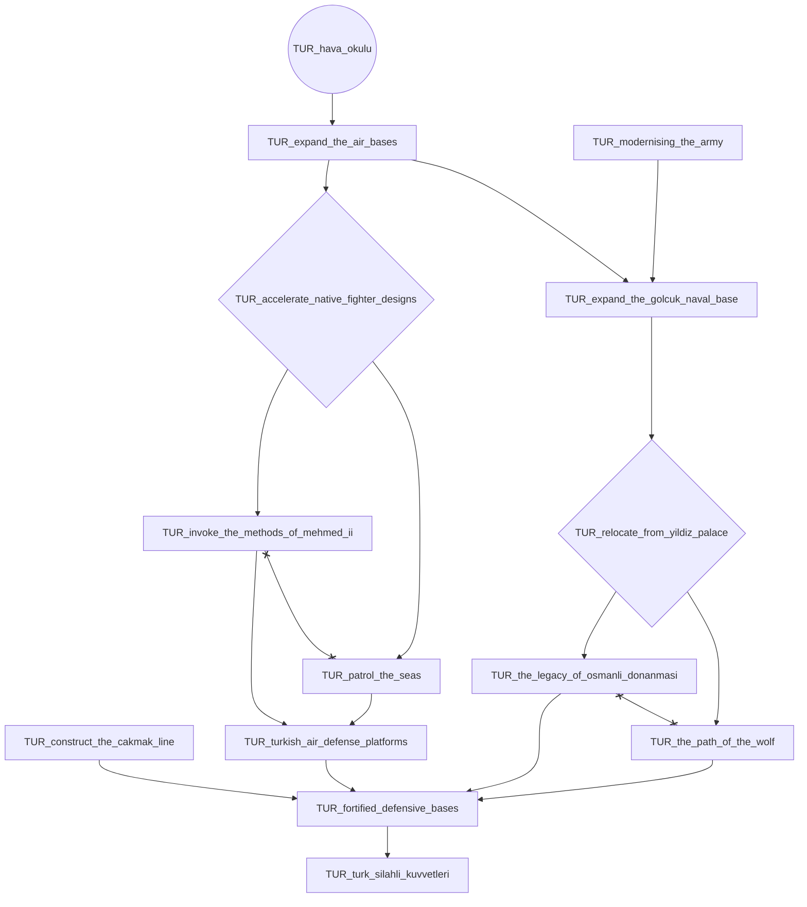
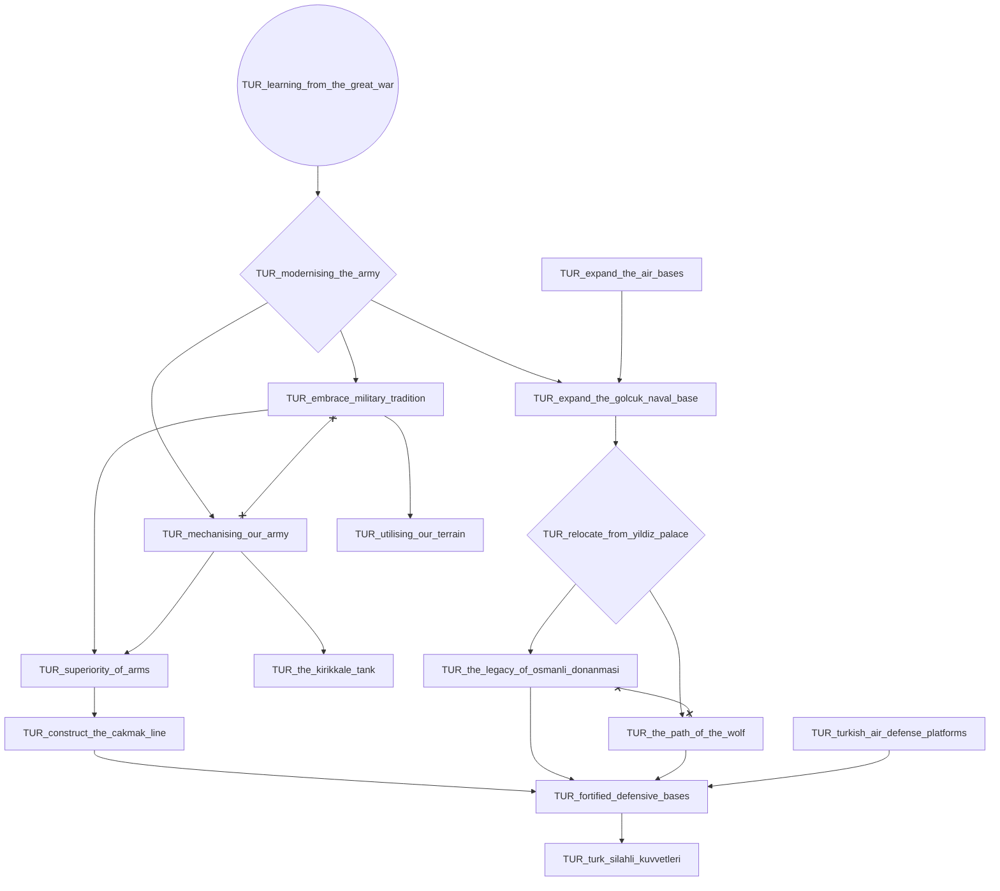

# TUR_hava_okulu

```mermaid
flowchart TD
    n1{"TUR_accelerate_native_fighter_designs"}
    n2["TUR_construct_the_cakmak_line"]
    n3["TUR_expand_the_air_bases"]
    n4["TUR_expand_the_golcuk_naval_base"]
    n5["TUR_fortified_defensive_bases"]
    n6(("TUR_hava_okulu"))
    n7["TUR_invoke_the_methods_of_mehmed_ii"]
    n8["TUR_modernising_the_army"]
    n9["TUR_patrol_the_seas"]
    n10{"TUR_relocate_from_yildiz_palace"}
    n11["TUR_the_legacy_of_osmanli_donanmasi"]
    n12["TUR_the_path_of_the_wolf"]
    n13["TUR_turk_silahli_kuvvetleri"]
    n14["TUR_turkish_air_defense_platforms"]
    n3 --> n1
    n6 --> n3
    n8 --> n4
    n3 --> n4
    n2 --> n5
    n11 --> n5
    n12 --> n5
    n14 --> n5
    n1 --> n7
    n1 --> n9
    n4 --> n10
    n10 --> n11
    n10 --> n12
    n5 --> n13
    n9 --> n14
    n7 --> n14
    n7 x--x n9
    n11 x--x n12
```

# TUR_learning_from_the_great_war

```mermaid
flowchart TD
    n2["TUR_construct_the_cakmak_line"]
    n15["TUR_embrace_military_tradition"]
    n3["TUR_expand_the_air_bases"]
    n4["TUR_expand_the_golcuk_naval_base"]
    n5["TUR_fortified_defensive_bases"]
    n16(("TUR_learning_from_the_great_war"))
    n17["TUR_mechanising_our_army"]
    n8{"TUR_modernising_the_army"}
    n10{"TUR_relocate_from_yildiz_palace"}
    n18["TUR_superiority_of_arms"]
    n19["TUR_the_kirikkale_tank"]
    n11["TUR_the_legacy_of_osmanli_donanmasi"]
    n12["TUR_the_path_of_the_wolf"]
    n13["TUR_turk_silahli_kuvvetleri"]
    n14["TUR_turkish_air_defense_platforms"]
    n20["TUR_utilising_our_terrain"]
    n18 --> n2
    n8 --> n15
    n8 --> n4
    n3 --> n4
    n2 --> n5
    n11 --> n5
    n12 --> n5
    n14 --> n5
    n8 --> n17
    n16 --> n8
    n4 --> n10
    n15 --> n18
    n17 --> n18
    n17 --> n19
    n10 --> n11
    n10 --> n12
    n5 --> n13
    n15 --> n20
    n15 x--x n17
    n11 x--x n12
```

# TUR_the_montreux_convention

```mermaid
flowchart TD
    n21["TUR_a_common_destiny_for_all_of_turkey"]
    n22{"TUR_abuse_the_office_of_soil_products"}
    n23{"TUR_adana_to_baku_highway"}
    n24["TUR_aligning_bulgaria"]
    n25{"TUR_american_motor_factories"}
    n26{"TUR_annul_the_ankara_anlasmasi"}
    n27["TUR_anti_bolshevik_mediterranean_bloc"]
    n28["TUR_applying_british_oil_embargoes_on_iraq"]
    n29["TUR_approve_the_funkplan"]
    n30["TUR_arctic_wolves_training_program"]
    n31["TUR_assess_our_future"]
    n32["TUR_avenge_the_treaty_of_sevres"]
    n33["TUR_balkan_defense_council"]
    n34{"TUR_bomber_schematics"}
    n35["TUR_brace_against_the_red_menace"]
    n36["TUR_british_dockyards_in_turkey"]
    n37["TUR_capitalise_on_rising_kurdish_nationalism"]
    n38["TUR_carve_up_greece"]
    n39["TUR_cin_turkleri"]
    n40{"TUR_cleanse_iberia_of_bolshevism"}
    n41["TUR_collaborative_civil_works_programme"]
    n42["TUR_collectivising_our_agriculture"]
    n43["TUR_combined_operational_strategies"]
    n44["TUR_connecting_our_capitals"]
    n45{"TUR_continue_the_policy_of_etatism"}
    n46["TUR_continue_the_sumerbank_industrialization_scheme"]
    n47["TUR_continue_to_prioritise_balkan_integrity"]
    n48["TUR_controlling_the_skies_of_europe"]
    n49["TUR_cooperate_with_the_debt_council"]
    n50["TUR_cooperative_research_centers"]
    n51{"TUR_court_the_spanish"}
    n52["TUR_create_the_balkan_central_bank"]
    n53["TUR_create_the_turkish_workers_militia"]
    n54["TUR_crowning_ourselves_with_the_fin_ugor"]
    n55["TUR_crush_the_warmongers_in_rome"]
    n56["TUR_cypriot_and_oniki_ilhak"]
    n57["TUR_deal_for_the_oniki_islands"]
    n58{"TUR_democratic_capstone_focus"}
    n59["TUR_democratic_transition_focus"]
    n60["TUR_desert_camel_corps"]
    n61{"TUR_dissolve_the_ODPA"}
    n62["TUR_edirne_research_exchange"]
    n63["TUR_end_the_british_hegemony"]
    n64["TUR_entice_the_greeks"]
    n65["TUR_establish_the_committee_of_pan_turkism"]
    n66["TUR_expanded_credit_on_our_debts"]
    n67["TUR_expanding_our_armaments"]
    n68["TUR_expanding_our_navy"]
    n69["TUR_expanding_the_saadabad_pact"]
    n70["TUR_extend_an_olive_branch_to_bulgaria"]
    n71["TUR_fatherland_first"]
    n72["TUR_foreign_brigades_for_the_revolution"]
    n73["TUR_form_the_redshirts"]
    n74["TUR_fortifying_contentious_areas"]
    n75["TUR_fortifying_the_bosporus"]
    n76["TUR_fully_integrate_the_is_bank"]
    n77["TUR_georgian_manganese_extraction"]
    n78["TUR_guarding_our_western_frontiers"]
    n79["TUR_halk_ve_devlet"]
    n80["TUR_holding_our_first_multi_party_election"]
    n81["TUR_host_exiled_scientists"]
    n82["TUR_hunt_down_fifth_columnist_islamists"]
    n83["TUR_imperial_factories"]
    n84{"TUR_increase_german_military_aid"}
    n85["TUR_integrate_german_officers_into_the_army"]
    n86["TUR_integrate_the_fascist_council"]
    n87{"TUR_integrated_armed_forces"}
    n88["TUR_intervene_in_the_spanish_civil_war"]
    n89{"TUR_invite_bulgaria"}
    n90{"TUR_invite_german_officers_to_izmir"}
    n91["TUR_issue_an_ultimatium_to_the_bulgarians"]
    n92["TUR_join_the_allies"]
    n93{"TUR_join_the_axis"}
    n94["TUR_join_the_central_powers"]
    n95["TUR_joint_budgets_on_fortifications"]
    n96["TUR_joint_caucasian_turkish_officer_school"]
    n97["TUR_kemalism_and_the_modern_movement"]
    n98["TUR_kemalist_socialist_theory"]
    n99["TUR_konfederasyon"]
    n100["TUR_learning_from_the_tripolitanian_war"]
    n101["TUR_liberate_the_kurdish_diaspora"]
    n102["TUR_lift_the_ban_on_other_political_parties"]
    n103["TUR_lift_the_turkiye_komunist_partisis_exile"]
    n104["TUR_loosen_the_laws_on_secularism"]
    n105{"TUR_mediterranean_merchant_fleet"}
    n106["TUR_millet_mektebi_focus"]
    n107["TUR_misak_i_milli"]
    n108["TUR_nationalise_all_private_industry"]
    n109["TUR_officers_of_the_revolution"]
    n110["TUR_pack_for_a_long_winter"]
    n111["TUR_partnership_pact_with_bulgaria"]
    n112["TUR_patriotism_over_internationalism"]
    n113["TUR_peace_at_home"]
    n114["TUR_peace_in_the_world"]
    n115["TUR_peninsular_network_of_factories"]
    n116["TUR_permit_regional_elections"]
    n117["TUR_pivot_to_the_past"]
    n118["TUR_preempt_bulgarian_alignment"]
    n119["TUR_press_the_austro_hungarian_claim"]
    n120{"TUR_pressure_portugal_to_join"}
    n121["TUR_privatize_our_infrastructure"]
    n122["TUR_privatize_the_anadolu_agency"]
    n123["TUR_provide_refuge_to_the_victims_of_fascism"]
    n124["TUR_punish_french_weakness"]
    n125["TUR_purchase_italian_light_tanks"]
    n126["TUR_purge_the_kemalists"]
    n127["TUR_purify_the_diyanet"]
    n128{"TUR_ratify_the_six_arrows"}
    n129["TUR_readdress_the_montreux_convention"]
    n130["TUR_reaffirm_the_balkan_pact"]
    n131["TUR_realize_the_nightmare_of_meiji"]
    n132["TUR_rebuilding_our_nation"]
    n133{"TUR_rebuke_the_treaty_of_kars"}
    n134["TUR_rebuke_the_treaty_of_lausanne"]
    n135{"TUR_reclaim_macedonia"}
    n136["TUR_reclaiming_our_lost_empire"]
    n137["TUR_reconciling_kemalism_with_bolshevism"]
    n138["TUR_reconfigure_our_foreign_policy"]
    n139["TUR_recover_the_kardzhali_vilayet"]
    n140["TUR_refining_our_strategies"]
    n141{"TUR_rehabilitate_the_kadro_movement"}
    n142["TUR_reinstate_the_darulfununu_sahane"]
    n143["TUR_reinvigorate_turkish_nationalism"]
    n144["TUR_renew_the_turkish_soviet_non_aggression_pact"]
    n145["TUR_restack_the_officer_corps"]
    n146["TUR_restore_the_divan"]
    n147["TUR_restoring_our_nations_pride"]
    n148["TUR_return_of_the_sultan"]
    n149["TUR_reuniting_thrace_through_force"]
    n150{"TUR_revive_turkish_revolutionism"}
    n151{"TUR_salt_the_scars_of_the_great_war"}
    n152["TUR_scrapping_our_debts"]
    n153["TUR_secure_the_iraqi_oil"]
    n154["TUR_securing_iran"]
    n155["TUR_seize_religious_property"]
    n156["TUR_seizing_the_romanian_oil_fields"]
    n157["TUR_soviet_tank_factories"]
    n158["TUR_stop_the_stalinist_charade"]
    n159{"TUR_strengthening_our_navies"}
    n160["TUR_strike_at_the_fascist_menace"]
    n161["TUR_strike_the_british_imperialists"]
    n162["TUR_subdue_the_magyars"]
    n163["TUR_support_the_golden_square"]
    n164["TUR_supporting_the_east"]
    n165["TUR_taking_over_defense_of_the_gulf"]
    n166["TUR_taking_responsibility_for_the_air_war"]
    n167["TUR_the_anglo_turkish_agreement"]
    n168["TUR_the_balkan_academy_of_science"]
    n169["TUR_the_batumi_accord"]
    n170["TUR_the_chester_concession"]
    n171["TUR_the_clodius_agreement"]
    n172["TUR_the_damascus_diktat"]
    n173["TUR_the_german_turkish_friendship_treaty"]
    n174["TUR_the_guardians_of_kemalism"]
    n175["TUR_the_hatay_issue"]
    n176["TUR_the_international_of_proletarian_freethinkers"]
    n177{"TUR_the_italo_turkish_naval_academy"}
    n178["TUR_the_mediterranean_entente"]
    n179{"TUR_the_montreux_convention"}
    n180["TUR_the_pan_national_association_of_ulemas"]
    n181["TUR_the_petra_proposal"]
    n182["TUR_the_pontic_redoubt"]
    n183["TUR_the_red_apples_of_sevres"]
    n184["TUR_the_sanayiciler"]
    n185["TUR_the_second_five_year_plan"]
    n186["TUR_the_sun_language_theory"]
    n187["TUR_the_treaty_for_prosperity_and_trade"]
    n188["TUR_the_turkish_tank_project"]
    n189{"TUR_the_tuz_golu_training_facility"}
    n190["TUR_three_year_industrial_plan"]
    n191["TUR_treaty_of_saadabad"]
    n192["TUR_turanist_ambition"]
    n193["TUR_turk_ulusu"]
    n194["TUR_turkish_panzers"]
    n195["TUR_turkish_state_railways"]
    n196["TUR_unite_the_azeri_diaspora"]
    n197["TUR_united_against_imperialism"]
    n198["TUR_utilize_foreign_capital"]
    n199["TUR_variant_turkish_tax_focus"]
    n200["TUR_victory_or_death_against_communism"]
    n201["TUR_we_must_not_fall"]
    n88 --> n21
    n193 --> n22
    n71 --> n22
    n182 --> n22
    n123 --> n23
    n157 --> n23
    n94 --> n24
    n119 --> n24
    n170 --> n25
    n107 --> n26
    n61 --> n27
    n167 --> n28
    n171 --> n29
    n96 --> n30
    n128 --> n31
    n159 --> n32
    n130 --> n33
    n170 --> n34
    n115 --> n35
    n43 --> n35
    n62 --> n35
    n181 --> n36
    n188 --> n37
    n137 --> n37
    n89 --> n38
    n192 --> n39
    n120 --> n40
    n105 --> n40
    n178 --> n41
    n152 --> n42
    n137 --> n42
    n70 --> n43
    n118 --> n43
    n52 --> n44
    n187 --> n44
    n179 --> n45
    n45 --> n46
    n76 --> n46
    n58 --> n47
    n22 --> n47
    n151 --> n47
    n92 --> n48
    n184 --> n49
    n84 --> n50
    n41 --> n50
    n120 --> n51
    n105 --> n51
    n33 --> n52
    n190 --> n52
    n112 --> n53
    n192 --> n54
    n115 --> n55
    n43 --> n55
    n62 --> n55
    n139 --> n56
    n73 --> n57
    n71 --> n57
    n121 --> n58
    n114 --> n58
    n80 --> n59
    n198 --> n59
    n164 --> n60
    n123 --> n61
    n168 --> n62
    n70 --> n62
    n118 --> n62
    n51 --> n63
    n40 --> n63
    n89 --> n64
    n194 --> n65
    n48 --> n66
    n68 --> n66
    n59 --> n67
    n92 --> n68
    n24 --> n69
    n87 --> n70
    n86 --> n71
    n145 --> n71
    n158 --> n72
    n161 --> n72
    n86 --> n73
    n95 --> n74
    n44 --> n74
    n41 --> n75
    n179 --> n76
    n79 --> n77
    n176 --> n78
    n96 --> n78
    n53 --> n79
    n102 --> n80
    n167 --> n81
    n21 --> n82
    n180 --> n83
    n93 --> n84
    n134 --> n85
    n65 --> n85
    n97 --> n86
    n74 --> n87
    n97 --> n88
    n98 --> n88
    n178 --> n89
    n29 --> n90
    n37 --> n91
    n42 --> n91
    n25 --> n92
    n34 --> n92
    n90 --> n93
    n177 --> n93
    n135 --> n94
    n197 --> n95
    n52 --> n95
    n129 --> n96
    n141 --> n97
    n141 --> n98
    n133 --> n99
    n32 --> n100
    n160 --> n100
    n26 --> n101
    n122 --> n102
    n155 --> n103
    n78 --> n103
    n143 --> n104
    n75 --> n105
    n45 --> n106
    n76 --> n106
    n201 --> n107
    n200 --> n107
    n147 --> n107
    n72 --> n107
    n91 --> n107
    n79 --> n108
    n176 --> n109
    n84 --> n110
    n66 --> n111
    n98 --> n112
    n128 --> n113
    n175 --> n114
    n70 --> n115
    n118 --> n115
    n59 --> n116
    n58 --> n117
    n87 --> n118
    n135 --> n119
    n64 --> n120
    n38 --> n120
    n67 --> n121
    n116 --> n121
    n76 --> n122
    n128 --> n122
    n169 --> n123
    n51 --> n124
    n40 --> n124
    n171 --> n125
    n117 --> n126
    n104 --> n127
    n76 --> n128
    n45 --> n128
    n23 --> n129
    n47 --> n130
    n183 --> n131
    n126 --> n132
    n107 --> n133
    n163 --> n134
    n153 --> n134
    n148 --> n135
    n24 --> n136
    n103 --> n137
    n58 --> n138
    n22 --> n138
    n151 --> n138
    n107 --> n139
    n172 --> n140
    n150 --> n141
    n180 --> n142
    n136 --> n142
    n150 --> n143
    n138 --> n144
    n127 --> n145
    n86 --> n145
    n126 --> n146
    n63 --> n147
    n124 --> n147
    n85 --> n147
    n146 --> n148
    n132 --> n148
    n139 --> n149
    n128 --> n150
    n45 --> n150
    n57 --> n151
    n77 --> n151
    n82 --> n151
    n109 --> n152
    n189 --> n153
    n111 --> n154
    n176 --> n155
    n96 --> n155
    n111 --> n156
    n169 --> n157
    n100 --> n158
    n27 --> n159
    n176 --> n159
    n159 --> n160
    n100 --> n161
    n192 --> n162
    n189 --> n163
    n136 --> n164
    n36 --> n165
    n154 --> n165
    n115 --> n166
    n188 --> n166
    n138 --> n167
    n74 --> n168
    n144 --> n169
    n28 --> n170
    n81 --> n170
    n173 --> n171
    n24 --> n172
    n138 --> n173
    n195 --> n174
    n185 --> n174
    n31 --> n175
    n27 --> n176
    n129 --> n176
    n125 --> n177
    n177 --> n178
    n69 --> n180
    n136 --> n180
    n172 --> n180
    n92 --> n181
    n186 --> n182
    n199 --> n182
    n145 --> n182
    n60 --> n183
    n83 --> n183
    n142 --> n183
    n140 --> n183
    n128 --> n184
    n195 --> n185
    n143 --> n185
    n143 --> n186
    n185 --> n186
    n190 --> n187
    n30 --> n188
    n93 --> n189
    n130 --> n190
    n128 --> n191
    n56 --> n192
    n149 --> n192
    n99 --> n192
    n196 --> n192
    n101 --> n192
    n174 --> n193
    n199 --> n193
    n175 --> n193
    n110 --> n194
    n113 --> n195
    n133 --> n196
    n33 --> n197
    n49 --> n198
    n174 --> n199
    n186 --> n199
    n63 --> n200
    n124 --> n200
    n85 --> n200
    n165 --> n200
    n154 --> n201
    n27 x--x n92
    n27 x--x n93
    n27 x--x n129
    n27 x--x n178
    n32 x--x n160
    n38 x--x n64
    n40 x--x n51
    n45 x--x n76
    n47 x--x n117
    n47 x--x n138
    n63 x--x n124
    n70 x--x n118
    n92 x--x n93
    n92 x--x n129
    n92 x--x n178
    n93 x--x n129
    n93 x--x n178
    n94 x--x n119
    n97 x--x n98
    n99 x--x n196
    n101 x--x n196
    n110 x--x n189
    n113 x--x n150
    n117 x--x n138
    n129 x--x n178
    n141 x--x n143
    n153 x--x n163
```
