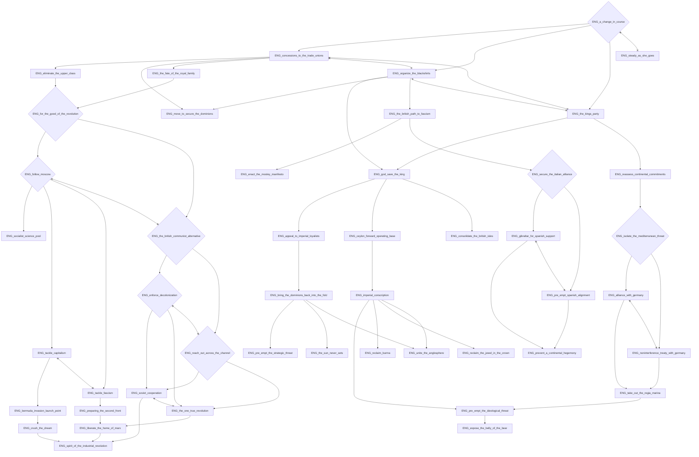
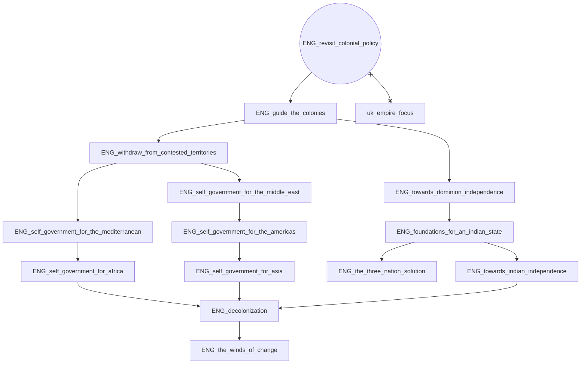
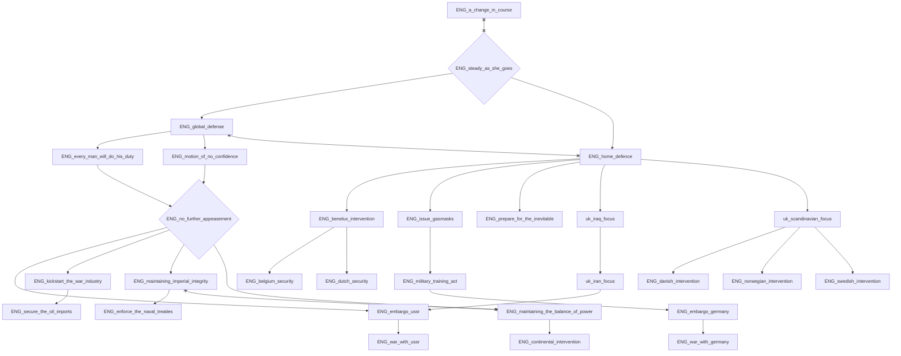
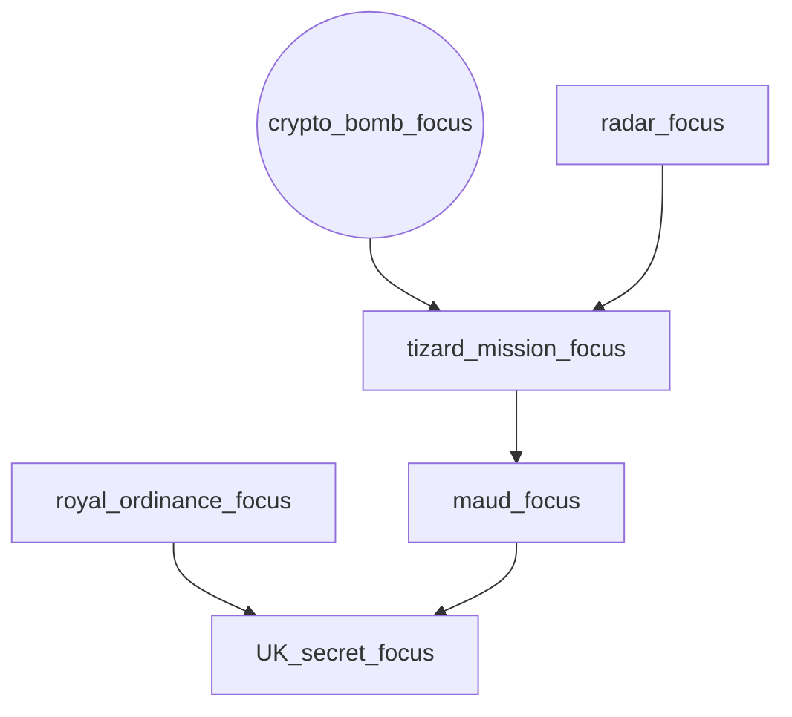
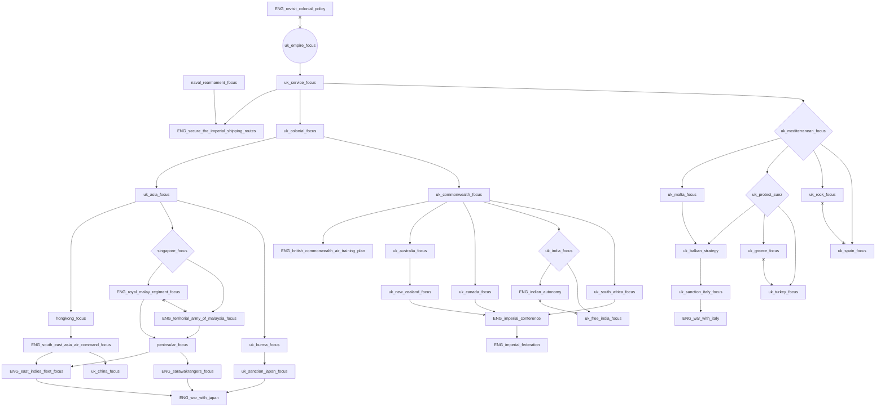

# ENG_a_change_in_course

```mermaid
flowchart TD
    n1{"ENG_a_change_in_course"}
    n2["ENG_alliance_with_germany"]
    n3["ENG_appeal_to_imperial_loyalists"]
    n4["ENG_bermuda_invasion_launch_point"]
    n5["ENG_bring_the_dominions_back_into_the_fold"]
    n6["ENG_ceylon_forward_operating_base"]
    n7["ENG_concessions_to_the_trade_unions"]
    n8["ENG_consolidate_the_british_isles"]
    n9["ENG_crush_the_dream"]
    n10["ENG_eliminate_the_upper_class"]
    n11["ENG_enact_the_mosley_manifesto"]
    n12{"ENG_enforce_decolonization"}
    n13["ENG_expose_the_belly_of_the_bear"]
    n14{"ENG_follow_moscow"}
    n15{"ENG_for_the_good_of_the_revolution"}
    n16["ENG_gibraltar_for_spanish_support"]
    n17["ENG_god_save_the_king"]
    n18["ENG_imperial_conscription"]
    n19{"ENG_isolate_the_mediterranean_threat"}
    n20["ENG_liberate_the_home_of_marx"]
    n21["ENG_move_to_secure_the_dominions"]
    n22["ENG_noninterference_treaty_with_germany"]
    n23["ENG_organize_the_blackshirts"]
    n24["ENG_pre_empt_spanish_alignment"]
    n25["ENG_pre_empt_the_ideological_threat"]
    n26["ENG_pre_empt_the_strategic_threat"]
    n27["ENG_preparing_the_second_front"]
    n28["ENG_prevent_a_continental_hegemony"]
    n29{"ENG_reach_out_across_the_channel"}
    n30["ENG_reassess_continental_commitments"]
    n31["ENG_reclaim_burma"]
    n32["ENG_reclaim_the_jewel_in_the_crown"]
    n33{"ENG_secure_the_italian_alliance"}
    n34["ENG_socialist_science_pool"]
    n35["ENG_soviet_cooperation"]
    n36["ENG_spirit_of_the_industrial_revolution"]
    n37["ENG_steady_as_she_goes"]
    n38["ENG_tackle_capitalism"]
    n39["ENG_tackle_fascism"]
    n40["ENG_take_out_the_regia_marina"]
    n41{"ENG_the_british_communist_alternative"}
    n42["ENG_the_british_path_to_fascism"]
    n43["ENG_the_fate_of_the_royal_family"]
    n44["ENG_the_kings_party"]
    n45["ENG_the_one_true_revolution"]
    n46["ENG_the_sun_never_sets"]
    n47["ENG_unite_the_anglosphere"]
    n19 --> n2
    n17 --> n3
    n38 --> n4
    n3 --> n5
    n17 --> n6
    n1 --> n7
    n17 --> n8
    n4 --> n9
    n7 --> n10
    n42 --> n11
    n41 --> n12
    n25 --> n13
    n15 --> n14
    n43 --> n15
    n10 --> n15
    n33 --> n16
    n44 --> n17
    n23 --> n17
    n6 --> n18
    n30 --> n19
    n45 --> n20
    n27 --> n20
    n23 --> n21
    n7 --> n21
    n19 --> n22
    n1 --> n23
    n33 --> n24
    n18 --> n25
    n40 --> n25
    n5 --> n26
    n39 --> n27
    n16 --> n28
    n24 --> n28
    n41 --> n29
    n44 --> n30
    n18 --> n31
    n18 --> n32
    n42 --> n33
    n14 --> n34
    n12 --> n35
    n29 --> n35
    n35 --> n36
    n20 --> n36
    n9 --> n36
    n14 --> n38
    n14 --> n39
    n22 --> n40
    n2 --> n40
    n15 --> n41
    n23 --> n42
    n7 --> n43
    n1 --> n44
    n12 --> n45
    n29 --> n45
    n5 --> n46
    n18 --> n47
    n5 --> n47
    n1 x--x n37
    n2 x--x n22
    n7 x--x n23
    n7 x--x n44
    n12 x--x n29
    n14 x--x n41
    n16 x--x n24
    n23 x--x n44
    n35 x--x n45
    n38 x--x n39
```

# ENG_revisit_colonial_policy

```mermaid
flowchart TD
    n48["ENG_decolonization"]
    n49["ENG_foundations_for_an_indian_state"]
    n50["ENG_guide_the_colonies"]
    n51(("ENG_revisit_colonial_policy"))
    n52["ENG_self_government_for_africa"]
    n53["ENG_self_government_for_asia"]
    n54["ENG_self_government_for_the_americas"]
    n55["ENG_self_government_for_the_mediterranean"]
    n56["ENG_self_government_for_the_middle_east"]
    n57["ENG_the_three_nation_solution"]
    n58["ENG_the_winds_of_change"]
    n59["ENG_towards_dominion_independence"]
    n60["ENG_towards_indian_independence"]
    n61["ENG_withdraw_from_contested_territories"]
    n62["uk_empire_focus"]
    n52 --> n48
    n53 --> n48
    n60 --> n48
    n59 --> n49
    n51 --> n50
    n55 --> n52
    n54 --> n53
    n56 --> n54
    n61 --> n55
    n61 --> n56
    n49 --> n57
    n48 --> n58
    n50 --> n59
    n49 --> n60
    n50 --> n61
    n51 x--x n62
```

# ENG_steady_as_she_goes

```mermaid
flowchart TD
    n1["ENG_a_change_in_course"]
    n63["ENG_belgium_security"]
    n64["ENG_benelux_intervention"]
    n65["ENG_continental_intervention"]
    n66["ENG_danish_intervention"]
    n67["ENG_dutch_security"]
    n68["ENG_embargo_germany"]
    n69["ENG_embargo_ussr"]
    n70["ENG_enforce_the_naval_treaties"]
    n71["ENG_every_man_will_do_his_duty"]
    n72["ENG_global_defense"]
    n73["ENG_home_defence"]
    n74["ENG_issue_gasmasks"]
    n75["ENG_kickstart_the_war_industry"]
    n76["ENG_maintaining_imperial_integrity"]
    n77["ENG_maintaining_the_balance_of_power"]
    n78["ENG_military_training_act"]
    n79["ENG_motion_of_no_confidence"]
    n80{"ENG_no_further_appeasement"}
    n81["ENG_norwegian_intervention"]
    n82["ENG_prepare_for_the_inevitable"]
    n83["ENG_secure_the_oil_imports"]
    n37{"ENG_steady_as_she_goes"}
    n84["ENG_swedish_intervention"]
    n85["ENG_war_with_germany"]
    n86["ENG_war_with_ussr"]
    n87["uk_iran_focus"]
    n88["uk_iraq_focus"]
    n89["uk_scandinavian_focus"]
    n64 --> n63
    n73 --> n64
    n77 --> n65
    n89 --> n66
    n64 --> n67
    n78 --> n68
    n87 --> n69
    n80 --> n69
    n76 --> n70
    n72 --> n71
    n37 --> n72
    n37 --> n73
    n73 --> n74
    n80 --> n75
    n80 --> n76
    n80 --> n77
    n74 --> n78
    n72 --> n79
    n71 --> n80
    n79 --> n80
    n89 --> n81
    n73 --> n82
    n75 --> n83
    n89 --> n84
    n68 --> n85
    n69 --> n86
    n88 --> n87
    n73 --> n88
    n73 --> n89
    n1 x--x n37
    n72 x--x n73
    n76 x--x n77
```

# crypto_bomb_focus

```mermaid
flowchart TD
    n90["UK_secret_focus"]
    n91(("crypto_bomb_focus"))
    n92["maud_focus"]
    n93["radar_focus"]
    n94["royal_ordinance_focus"]
    n95["tizard_mission_focus"]
    n94 --> n90
    n92 --> n90
    n95 --> n92
    n91 --> n95
    n93 --> n95
```

# limited_rearmament_focus

```mermaid
flowchart TD
    n96["ENG_a_s_warfare"]
    n97["ENG_anti_non_contact_committee"]
    n98["ENG_anti_submarine_training_school"]
    n99["ENG_chiefs_of_staff_committee"]
    n100["ENG_expand_the_repair_yards"]
    n101["ENG_expand_the_secret_intelligence_service_focus"]
    n102["ENG_motorized_focus"]
    n103["ENG_parachute_regiments"]
    n104["ENG_secure_the_imperial_shipping_routes"]
    n105["ENG_special_air_service"]
    n106["ENG_tank_focus"]
    n107["ENG_vanguard"]
    n108["ENG_vickers_experimental_facility_focus"]
    n90["UK_secret_focus"]
    n109["air_defense_focus"]
    n110["air_rearmament_focus"]
    n111["aircraft_production_focus"]
    n112["bomber_command_focus"]
    n113["coastal_command_focus"]
    n91["crypto_bomb_focus"]
    n114["fighter_command_focus"]
    n115["general_rearmament_focus"]
    n116(("limited_rearmament_focus"))
    n92["maud_focus"]
    n117["naval_rearmament_focus"]
    n93["radar_focus"]
    n94["royal_ordinance_focus"]
    n118["shadow_scheme_focus"]
    n95["tizard_mission_focus"]
    n119["uk_amphibious_focus"]
    n120["uk_battleship_focus"]
    n121["uk_carrier_focus"]
    n122["uk_convoy_focus"]
    n123["uk_destroyer_focus"]
    n124["uk_extra_tech_slot"]
    n125["uk_industrial_focus"]
    n126["uk_jet_focus"]
    n127["uk_service_focus"]
    n128["uk_small_arms_focus"]
    n129{"uk_waves_focus"}
    n123 --> n96
    n117 --> n97
    n122 --> n98
    n110 --> n99
    n117 --> n99
    n120 --> n100
    n121 --> n100
    n116 --> n101
    n116 --> n102
    n105 --> n103
    n117 --> n104
    n127 --> n104
    n115 --> n105
    n102 --> n106
    n120 --> n107
    n125 --> n108
    n94 --> n90
    n92 --> n90
    n116 --> n109
    n115 --> n110
    n114 --> n111
    n112 --> n111
    n113 --> n111
    n110 --> n112
    n110 --> n113
    n110 --> n114
    n116 --> n115
    n95 --> n92
    n115 --> n117
    n109 --> n93
    n125 --> n94
    n116 --> n118
    n91 --> n95
    n93 --> n95
    n117 --> n119
    n129 --> n120
    n129 --> n121
    n123 --> n122
    n117 --> n123
    n125 --> n124
    n118 --> n125
    n111 --> n126
    n94 --> n128
    n117 --> n129
    n120 x--x n121
```

# uk_empire_focus

```mermaid
flowchart TD
    n130["ENG_british_commonwealth_air_training_plan"]
    n131["ENG_east_indies_fleet_focus"]
    n132["ENG_imperial_conference"]
    n133["ENG_imperial_federation"]
    n134["ENG_indian_autonomy"]
    n51["ENG_revisit_colonial_policy"]
    n135["ENG_royal_malay_regiment_focus"]
    n136["ENG_sarawakrangers_focus"]
    n104["ENG_secure_the_imperial_shipping_routes"]
    n137["ENG_south_east_asia_air_command_focus"]
    n138["ENG_territorial_army_of_malaysia_focus"]
    n139["ENG_war_with_italy"]
    n140["ENG_war_with_japan"]
    n141["hongkong_focus"]
    n117["naval_rearmament_focus"]
    n142["peninsular_focus"]
    n143{"singapore_focus"}
    n144["uk_asia_focus"]
    n145["uk_australia_focus"]
    n146["uk_balkan_strategy"]
    n147["uk_burma_focus"]
    n148["uk_canada_focus"]
    n149["uk_china_focus"]
    n150["uk_colonial_focus"]
    n151["uk_commonwealth_focus"]
    n62(("uk_empire_focus"))
    n152["uk_free_india_focus"]
    n153["uk_greece_focus"]
    n154{"uk_india_focus"}
    n155["uk_malta_focus"]
    n156{"uk_mediterranean_focus"}
    n157["uk_new_zealand_focus"]
    n158{"uk_protect_suez"}
    n159["uk_rock_focus"]
    n160["uk_sanction_italy_focus"]
    n161["uk_sanction_japan_focus"]
    n127["uk_service_focus"]
    n162["uk_south_africa_focus"]
    n163["uk_spain_focus"]
    n164["uk_turkey_focus"]
    n151 --> n130
    n142 --> n131
    n137 --> n131
    n148 --> n132
    n157 --> n132
    n162 --> n132
    n132 --> n133
    n154 --> n134
    n143 --> n135
    n142 --> n136
    n117 --> n104
    n127 --> n104
    n141 --> n137
    n143 --> n138
    n160 --> n139
    n161 --> n140
    n136 --> n140
    n131 --> n140
    n144 --> n141
    n135 --> n142
    n138 --> n142
    n144 --> n143
    n150 --> n144
    n151 --> n145
    n158 --> n146
    n155 --> n146
    n144 --> n147
    n151 --> n148
    n137 --> n149
    n127 --> n150
    n150 --> n151
    n154 --> n152
    n158 --> n153
    n151 --> n154
    n156 --> n155
    n127 --> n156
    n145 --> n157
    n156 --> n158
    n156 --> n159
    n146 --> n160
    n147 --> n161
    n62 --> n127
    n151 --> n162
    n156 --> n163
    n158 --> n164
    n134 x--x n152
    n51 x--x n62
    n135 x--x n138
    n153 x--x n164
    n159 x--x n163
```
