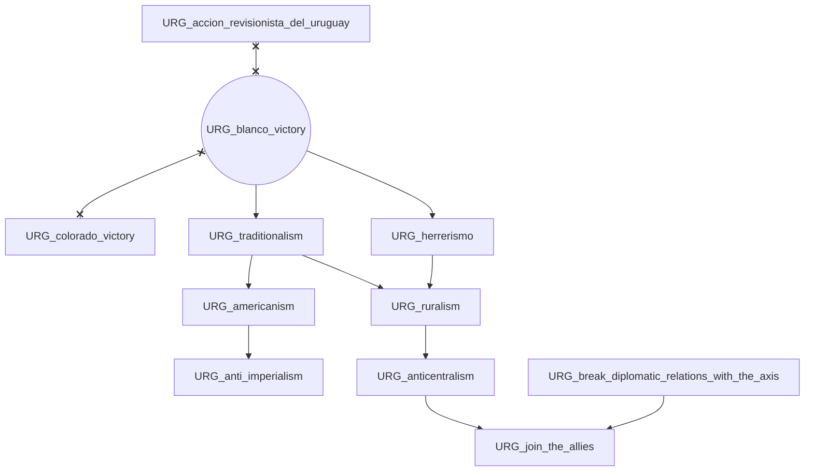
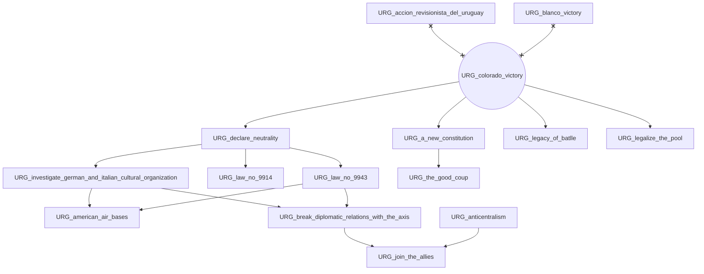
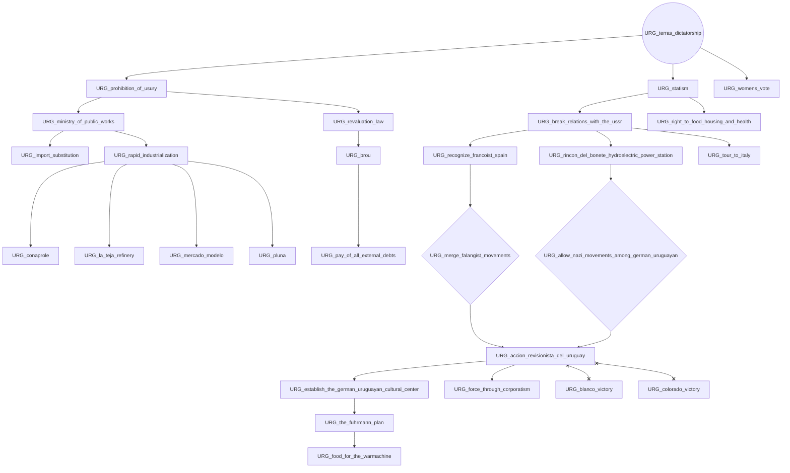

# URG_blanco_victory

```mermaid
flowchart TD
    n1["URG_accion_revisionista_del_uruguay"]
    n2["URG_americanism"]
    n3["URG_anti_imperialism"]
    n4["URG_anticentralism"]
    n5(("URG_blanco_victory"))
    n6["URG_break_diplomatic_relations_with_the_axis"]
    n7["URG_colorado_victory"]
    n8["URG_herrerismo"]
    n9["URG_join_the_allies"]
    n10["URG_ruralism"]
    n11["URG_traditionalism"]
    n11 --> n2
    n2 --> n3
    n10 --> n4
    n5 --> n8
    n6 --> n9
    n4 --> n9
    n8 --> n10
    n11 --> n10
    n5 --> n11
    n1 x--x n5
    n5 x--x n7
```

# URG_colorado_victory

```mermaid
flowchart TD
    n12["URG_a_new_constitution"]
    n1["URG_accion_revisionista_del_uruguay"]
    n13["URG_american_air_bases"]
    n4["URG_anticentralism"]
    n5["URG_blanco_victory"]
    n6["URG_break_diplomatic_relations_with_the_axis"]
    n7(("URG_colorado_victory"))
    n14["URG_declare_neutrality"]
    n15["URG_investigate_german_and_italian_cultural_organization"]
    n9["URG_join_the_allies"]
    n16["URG_law_no_9914"]
    n17["URG_law_no_9943"]
    n18["URG_legacy_of_batlle"]
    n19["URG_legalize_the_pool"]
    n20["URG_the_good_coup"]
    n7 --> n12
    n15 --> n13
    n17 --> n13
    n15 --> n6
    n17 --> n6
    n7 --> n14
    n14 --> n15
    n6 --> n9
    n4 --> n9
    n14 --> n16
    n14 --> n17
    n7 --> n18
    n7 --> n19
    n12 --> n20
    n1 x--x n7
    n5 x--x n7
```

# URG_terras_dictatorship

```mermaid
flowchart TD
    n1["URG_accion_revisionista_del_uruguay"]
    n21{"URG_allow_nazi_movements_among_german_uruguayan"}
    n5["URG_blanco_victory"]
    n22["URG_break_relations_with_the_ussr"]
    n23["URG_brou"]
    n7["URG_colorado_victory"]
    n24["URG_conaprole"]
    n25["URG_establish_the_german_uruguayan_cultural_center"]
    n26["URG_food_for_the_warmachine"]
    n27["URG_force_through_corporatism"]
    n28["URG_import_substitution"]
    n29["URG_la_teja_refinery"]
    n30["URG_mercado_modelo"]
    n31{"URG_merge_falangist_movements"}
    n32["URG_ministry_of_public_works"]
    n33["URG_pay_of_all_external_debts"]
    n34["URG_pluna"]
    n35["URG_prohibition_of_usury"]
    n36["URG_rapid_industrialization"]
    n37["URG_recognize_francoist_spain"]
    n38["URG_revaluation_law"]
    n39["URG_right_to_food_housing_and_health"]
    n40["URG_rincon_del_bonete_hydroelectric_power_station"]
    n41["URG_statism"]
    n42(("URG_terras_dictatorship"))
    n43["URG_the_fuhrmann_plan"]
    n44["URG_tour_to_italy"]
    n45["URG_womens_vote"]
    n21 --> n1
    n31 --> n1
    n40 --> n21
    n41 --> n22
    n38 --> n23
    n36 --> n24
    n1 --> n25
    n43 --> n26
    n1 --> n27
    n32 --> n28
    n36 --> n29
    n36 --> n30
    n37 --> n31
    n35 --> n32
    n23 --> n33
    n36 --> n34
    n42 --> n35
    n32 --> n36
    n22 --> n37
    n35 --> n38
    n41 --> n39
    n22 --> n40
    n42 --> n41
    n25 --> n43
    n22 --> n44
    n42 --> n45
    n1 x--x n5
    n1 x--x n7
```
