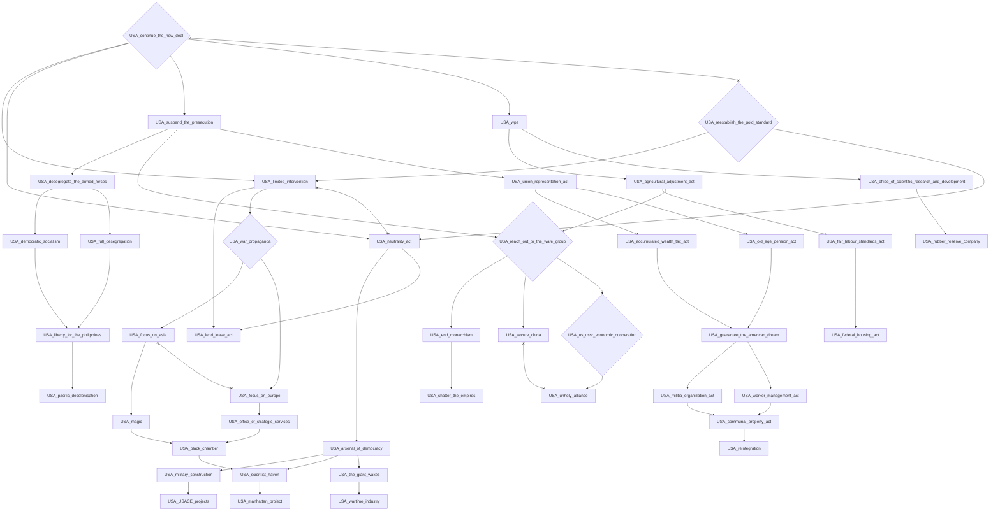
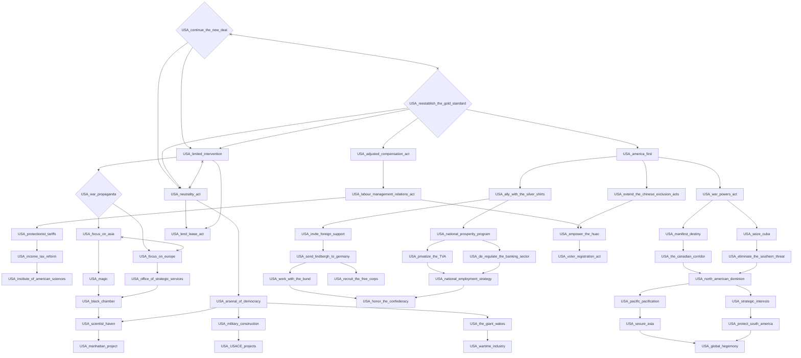
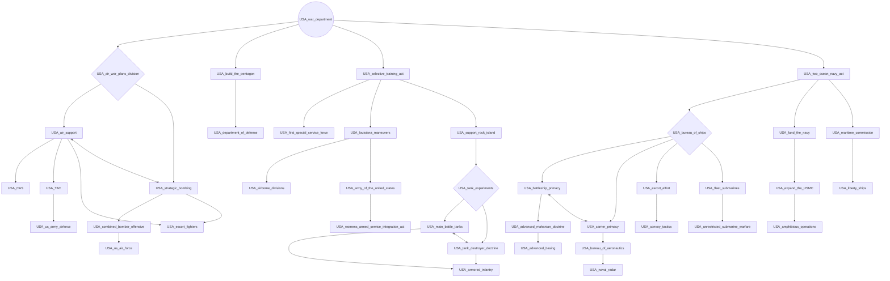
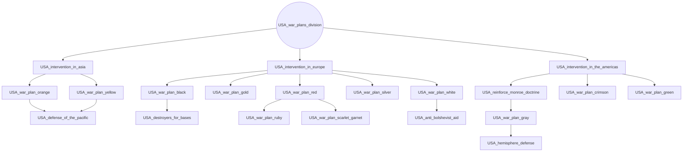

# USA_continue_the_new_deal

```mermaid
flowchart TD
    n1["USA_USACE_projects"]
    n2["USA_accumulated_wealth_tax_act"]
    n3["USA_agricultural_adjustment_act"]
    n4["USA_arsenal_of_democracy"]
    n5["USA_black_chamber"]
    n6["USA_communal_property_act"]
    n7{"USA_continue_the_new_deal"}
    n8["USA_democratic_socialism"]
    n9["USA_desegregate_the_armed_forces"]
    n10["USA_end_monarchism"]
    n11["USA_fair_labour_standards_act"]
    n12["USA_federal_housing_act"]
    n13["USA_focus_on_asia"]
    n14["USA_focus_on_europe"]
    n15["USA_full_desegregation"]
    n16["USA_guarantee_the_american_dream"]
    n17["USA_lend_lease_act"]
    n18["USA_liberty_for_the_philippines"]
    n19["USA_limited_intervention"]
    n20["USA_magic"]
    n21["USA_manhattan_project"]
    n22["USA_military_construction"]
    n23["USA_militia_organization_act"]
    n24["USA_neutrality_act"]
    n25["USA_office_of_scientific_research_and_development"]
    n26["USA_office_of_strategic_services"]
    n27["USA_old_age_pension_act"]
    n28["USA_pacific_decolonisation"]
    n29{"USA_reach_out_to_the_ware_group"}
    n30{"USA_reestablish_the_gold_standard"}
    n31["USA_reintegration"]
    n32["USA_rubber_reserve_company"]
    n33["USA_scientist_haven"]
    n34["USA_secure_china"]
    n35["USA_shatter_the_empires"]
    n36["USA_suspend_the_presecution"]
    n37["USA_the_giant_wakes"]
    n38["USA_unholy_alliance"]
    n39["USA_union_representation_act"]
    n40{"USA_us_ussr_economic_cooperation"}
    n41{"USA_war_propaganda"}
    n42["USA_wartime_industry"]
    n43["USA_worker_management_act"]
    n44["USA_wpa"]
    n22 --> n1
    n39 --> n2
    n44 --> n3
    n24 --> n4
    n20 --> n5
    n26 --> n5
    n43 --> n6
    n23 --> n6
    n9 --> n8
    n36 --> n9
    n29 --> n10
    n3 --> n11
    n11 --> n12
    n41 --> n13
    n41 --> n14
    n9 --> n15
    n27 --> n16
    n2 --> n16
    n24 --> n17
    n19 --> n17
    n8 --> n18
    n15 --> n18
    n7 --> n19
    n30 --> n19
    n13 --> n20
    n33 --> n21
    n4 --> n22
    n16 --> n23
    n7 --> n24
    n30 --> n24
    n44 --> n25
    n14 --> n26
    n39 --> n27
    n18 --> n28
    n36 --> n29
    n3 --> n29
    n6 --> n31
    n25 --> n32
    n5 --> n33
    n4 --> n33
    n29 --> n34
    n10 --> n35
    n7 --> n36
    n4 --> n37
    n40 --> n38
    n36 --> n39
    n29 --> n40
    n19 --> n41
    n37 --> n42
    n16 --> n43
    n7 --> n44
    n7 x--x n30
    n13 x--x n14
    n19 x--x n24
    n34 x--x n38
```

# USA_reestablish_the_gold_standard

```mermaid
flowchart TD
    n1["USA_USACE_projects"]
    n45["USA_adjusted_compensation_act"]
    n46["USA_ally_with_the_silver_shirts"]
    n47["USA_america_first"]
    n4["USA_arsenal_of_democracy"]
    n5["USA_black_chamber"]
    n7{"USA_continue_the_new_deal"}
    n48["USA_de_regulate_the_banking_sector"]
    n49["USA_eliminate_the_southern_threat"]
    n50["USA_empower_the_huac"]
    n51["USA_extend_the_chinese_exclusion_acts"]
    n13["USA_focus_on_asia"]
    n14["USA_focus_on_europe"]
    n52["USA_global_hegemony"]
    n53["USA_honor_the_confederacy"]
    n54["USA_income_tax_reform"]
    n55["USA_institute_of_american_sciences"]
    n56["USA_invite_foreign_support"]
    n57["USA_labour_management_relations_act"]
    n17["USA_lend_lease_act"]
    n19["USA_limited_intervention"]
    n20["USA_magic"]
    n21["USA_manhattan_project"]
    n58["USA_manifest_destiny"]
    n22["USA_military_construction"]
    n59["USA_national_employment_strategy"]
    n60["USA_national_prosperity_program"]
    n24["USA_neutrality_act"]
    n61["USA_north_american_dominion"]
    n26["USA_office_of_strategic_services"]
    n62["USA_pacific_pacification"]
    n63["USA_privatize_the_TVA"]
    n64["USA_protect_south_america"]
    n65["USA_protectionist_tariffs"]
    n66["USA_recruit_the_free_corps"]
    n30{"USA_reestablish_the_gold_standard"}
    n33["USA_scientist_haven"]
    n67["USA_secure_asia"]
    n68["USA_seize_cuba"]
    n69["USA_send_lindbergh_to_germany"]
    n70["USA_strategic_interests"]
    n71["USA_the_canadian_corridor"]
    n37["USA_the_giant_wakes"]
    n72["USA_voter_registration_act"]
    n73["USA_war_powers_act"]
    n41{"USA_war_propaganda"}
    n42["USA_wartime_industry"]
    n74["USA_work_with_the_bund"]
    n22 --> n1
    n30 --> n45
    n47 --> n46
    n30 --> n47
    n24 --> n4
    n20 --> n5
    n26 --> n5
    n60 --> n48
    n68 --> n49
    n51 --> n50
    n57 --> n50
    n47 --> n51
    n41 --> n13
    n41 --> n14
    n67 --> n52
    n64 --> n52
    n74 --> n53
    n59 --> n53
    n65 --> n54
    n54 --> n55
    n46 --> n56
    n45 --> n57
    n24 --> n17
    n19 --> n17
    n7 --> n19
    n30 --> n19
    n13 --> n20
    n33 --> n21
    n73 --> n58
    n4 --> n22
    n63 --> n59
    n48 --> n59
    n46 --> n60
    n7 --> n24
    n30 --> n24
    n71 --> n61
    n49 --> n61
    n14 --> n26
    n61 --> n62
    n60 --> n63
    n70 --> n64
    n57 --> n65
    n69 --> n66
    n5 --> n33
    n4 --> n33
    n62 --> n67
    n73 --> n68
    n56 --> n69
    n61 --> n70
    n58 --> n71
    n4 --> n37
    n50 --> n72
    n47 --> n73
    n19 --> n41
    n37 --> n42
    n69 --> n74
    n7 x--x n30
    n13 x--x n14
    n19 x--x n24
```

# USA_war_department

```mermaid
flowchart TD
    n75["USA_CAS"]
    n76["USA_TAC"]
    n77["USA_advanced_basing"]
    n78["USA_advanced_mahanian_doctrine"]
    n79["USA_air_support"]
    n80{"USA_air_war_plans_division"}
    n81["USA_airborne_divisions"]
    n82["USA_amphibious_operations"]
    n83["USA_armored_infantry"]
    n84["USA_army_of_the_united_states"]
    n85["USA_battleship_primacy"]
    n86["USA_build_the_pentagon"]
    n87["USA_bureau_of_aeronautics"]
    n88{"USA_bureau_of_ships"}
    n89["USA_carrier_primacy"]
    n90["USA_combined_bomber_offensive"]
    n91["USA_convoy_tactics"]
    n92["USA_department_of_defense"]
    n93["USA_escort_effort"]
    n94["USA_escort_fighters"]
    n95["USA_expand_the_USMC"]
    n96["USA_first_special_service_force"]
    n97["USA_fleet_submarines"]
    n98["USA_fund_the_navy"]
    n99["USA_liberty_ships"]
    n100["USA_louisiana_maneuvers"]
    n101["USA_main_battle_tanks"]
    n102["USA_maritime_commission"]
    n103["USA_naval_radar"]
    n104["USA_selective_training_act"]
    n105["USA_strategic_bombing"]
    n106["USA_support_rock_island"]
    n107["USA_tank_destroyer_doctrine"]
    n108{"USA_tank_experiments"}
    n109["USA_two_ocean_navy_act"]
    n110["USA_unrestricted_submarine_warfare"]
    n111["USA_us_air_force"]
    n112["USA_us_army_airforce"]
    n113(("USA_war_department"))
    n114["USA_womens_armed_service_integration_act"]
    n79 --> n75
    n79 --> n76
    n78 --> n77
    n85 --> n78
    n80 --> n79
    n113 --> n80
    n100 --> n81
    n95 --> n82
    n101 --> n83
    n107 --> n83
    n100 --> n84
    n88 --> n85
    n113 --> n86
    n89 --> n87
    n109 --> n88
    n88 --> n89
    n105 --> n90
    n93 --> n91
    n86 --> n92
    n88 --> n93
    n79 --> n94
    n105 --> n94
    n98 --> n95
    n104 --> n96
    n88 --> n97
    n109 --> n98
    n102 --> n99
    n104 --> n100
    n108 --> n101
    n109 --> n102
    n87 --> n103
    n113 --> n104
    n80 --> n105
    n104 --> n106
    n108 --> n107
    n106 --> n108
    n113 --> n109
    n97 --> n110
    n90 --> n111
    n76 --> n112
    n84 --> n114
    n79 x--x n105
    n85 x--x n89
    n101 x--x n107
```

# USA_war_plans_division

```mermaid
flowchart TD
    n115["USA_anti_bolshevist_aid"]
    n116["USA_defense_of_the_pacific"]
    n117["USA_destroyers_for_bases"]
    n118["USA_hemisphere_defense"]
    n119["USA_intervention_in_asia"]
    n120["USA_intervention_in_europe"]
    n121["USA_intervention_in_the_americas"]
    n122["USA_reinforce_monroe_doctrine"]
    n123["USA_war_plan_black"]
    n124["USA_war_plan_crimson"]
    n125["USA_war_plan_gold"]
    n126["USA_war_plan_gray"]
    n127["USA_war_plan_green"]
    n128["USA_war_plan_orange"]
    n129["USA_war_plan_red"]
    n130["USA_war_plan_ruby"]
    n131["USA_war_plan_scarlet_garnet"]
    n132["USA_war_plan_silver"]
    n133["USA_war_plan_white"]
    n134["USA_war_plan_yellow"]
    n135(("USA_war_plans_division"))
    n133 --> n115
    n134 --> n116
    n128 --> n116
    n123 --> n117
    n126 --> n118
    n135 --> n119
    n135 --> n120
    n135 --> n121
    n121 --> n122
    n120 --> n123
    n121 --> n124
    n120 --> n125
    n122 --> n126
    n121 --> n127
    n119 --> n128
    n120 --> n129
    n129 --> n130
    n129 --> n131
    n120 --> n132
    n120 --> n133
    n119 --> n134
```
