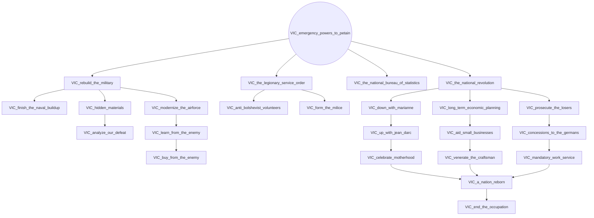

# VIC_emergency_powers_to_petain

```mermaid
flowchart TD
    n1["VIC_a_nation_reborn"]
    n2["VIC_aid_small_businesses"]
    n3["VIC_analyze_our_defeat"]
    n4["VIC_anti_bolshevist_volunteers"]
    n5["VIC_buy_from_the_enemy"]
    n6["VIC_celebrate_motherhood"]
    n7["VIC_concessions_to_the_germans"]
    n8["VIC_down_with_marianne"]
    n9(("VIC_emergency_powers_to_petain"))
    n10["VIC_end_the_occupation"]
    n11["VIC_finish_the_naval_buildup"]
    n12["VIC_form_the_milice"]
    n13["VIC_hidden_materials"]
    n14["VIC_learn_from_the_enemy"]
    n15["VIC_long_term_economic_planning"]
    n16["VIC_mandatory_work_service"]
    n17["VIC_modernize_the_airforce"]
    n18["VIC_prosecute_the_losers"]
    n19["VIC_rebuild_the_military"]
    n20["VIC_the_legionary_service_order"]
    n21["VIC_the_national_bureau_of_statistics"]
    n22["VIC_the_national_revolution"]
    n23["VIC_up_with_jean_darc"]
    n24["VIC_venerate_the_craftsman"]
    n6 --> n1
    n24 --> n1
    n16 --> n1
    n15 --> n2
    n13 --> n3
    n20 --> n4
    n14 --> n5
    n23 --> n6
    n18 --> n7
    n22 --> n8
    n1 --> n10
    n19 --> n11
    n20 --> n12
    n19 --> n13
    n17 --> n14
    n22 --> n15
    n7 --> n16
    n19 --> n17
    n22 --> n18
    n9 --> n19
    n9 --> n20
    n9 --> n21
    n9 --> n22
    n8 --> n23
    n2 --> n24
```
