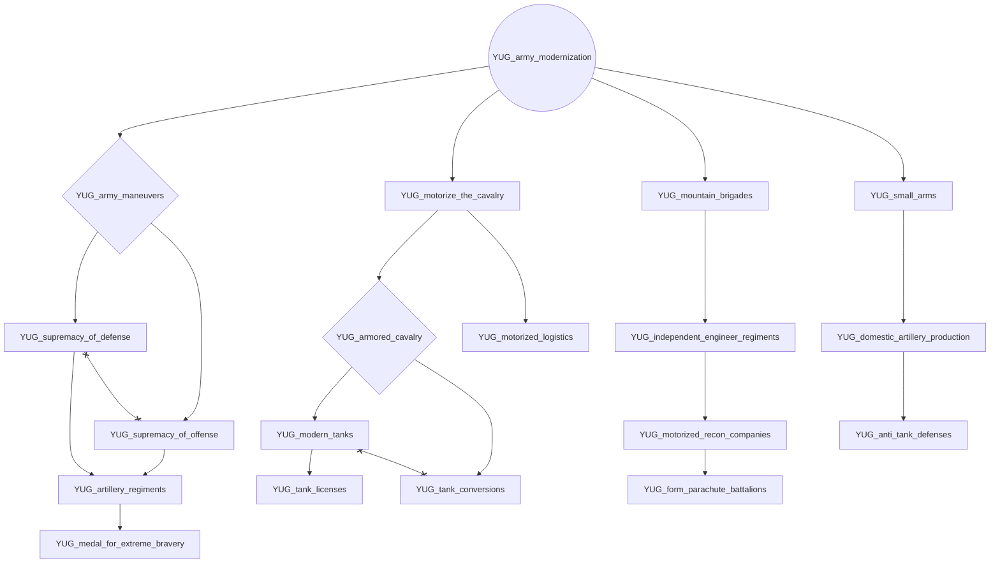
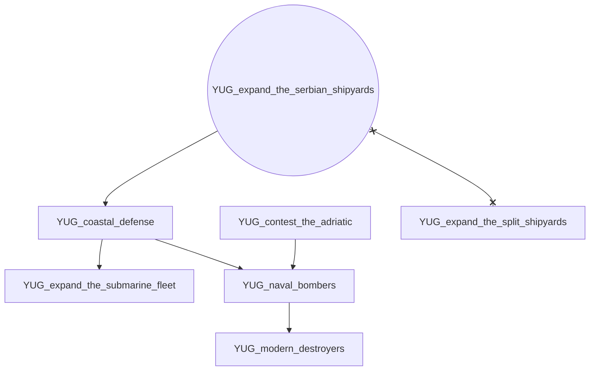
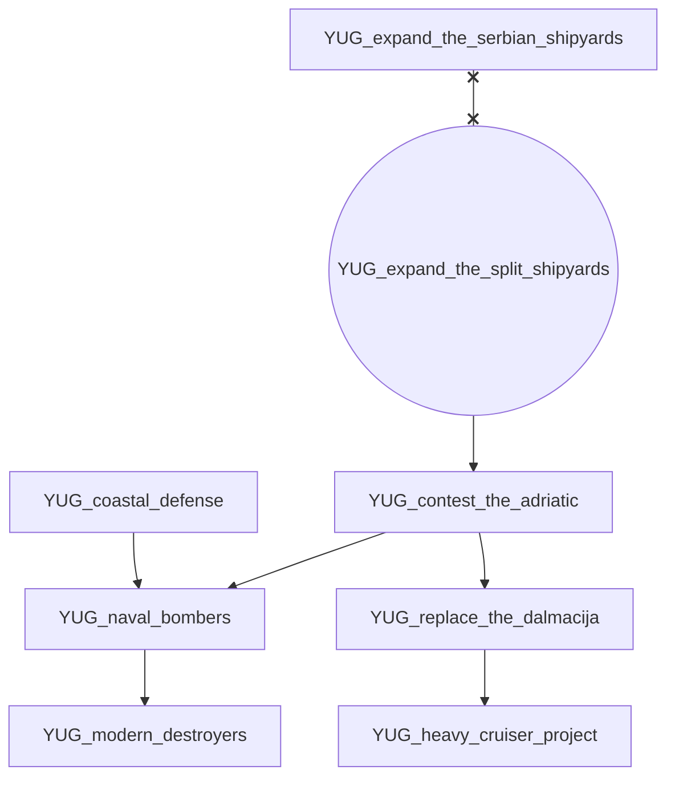
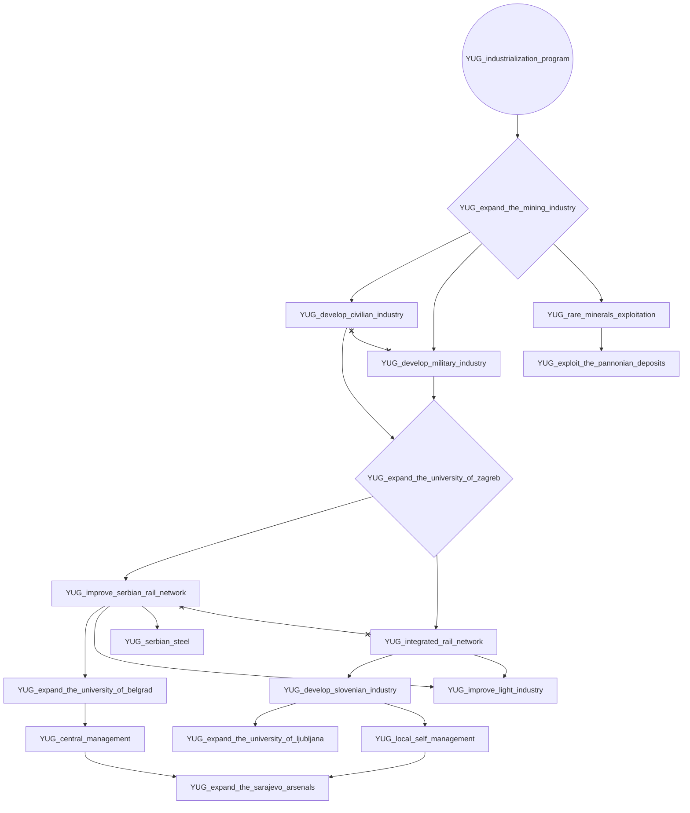
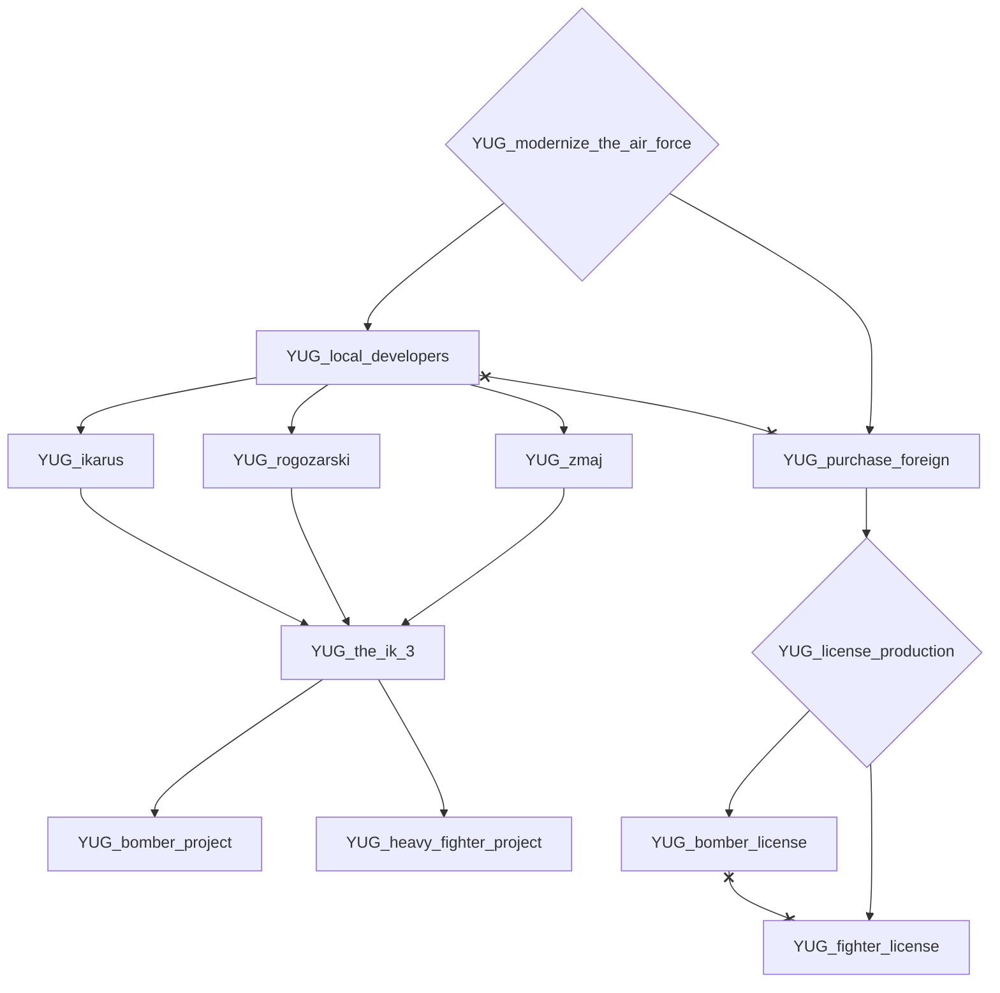
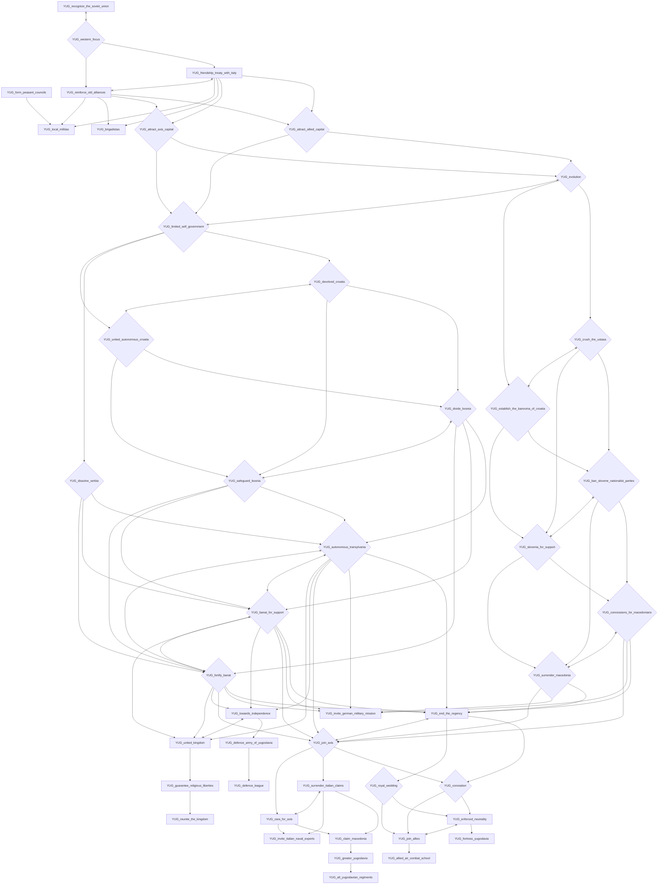

# YUG_army_modernization

# YUG_expand_the_serbian_shipyards

# YUG_expand_the_split_shipyards

# YUG_industrialization_program

# YUG_modernize_the_air_force

# YUG_recognize_the_soviet_union

```mermaid
flowchart TD
    n58{"YUG_abolish_the_monarchy"}
    n59["YUG_federal_defense_council"]
    n60["YUG_form_peasant_councils"]
    n61["YUG_form_the_federal_republic"]
    n62["YUG_friendship_treaty_with_italy"]
    n63["YUG_invite_albania"]
    n64["YUG_invite_bulgaria"]
    n65["YUG_invite_greece"]
    n66["YUG_invite_hungary"]
    n67["YUG_invite_romania"]
    n68["YUG_invite_turkey"]
    n69["YUG_join_comintern"]
    n70["YUG_local_militias"]
    n71["YUG_mutual_economic_aid"]
    n72["YUG_pan_balkan_workers_congress"]
    n73["YUG_pan_slavic_workers_congress"]
    n74(("YUG_recognize_the_soviet_union"))
    n75["YUG_reinforce_old_alliances"]
    n76["YUG_research_collaboration"]
    n77["YUG_western_focus"]
    n78["YUG_yugoslavian_path_to_communism"]
    n60 --> n58
    n71 --> n58
    n61 --> n59
    n74 --> n60
    n78 --> n61
    n69 --> n61
    n73 --> n63
    n73 --> n64
    n72 --> n65
    n72 --> n66
    n72 --> n67
    n65 --> n68
    n66 --> n68
    n67 --> n68
    n58 --> n69
    n75 --> n70
    n62 --> n70
    n60 --> n70
    n74 --> n71
    n64 --> n72
    n63 --> n72
    n59 --> n72
    n78 --> n73
    n69 --> n76
    n58 --> n78
    n69 x--x n78
    n74 x--x n77
```

# YUG_western_focus

