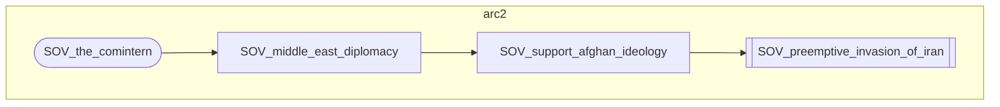
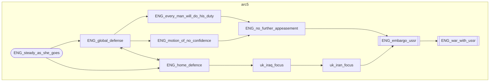
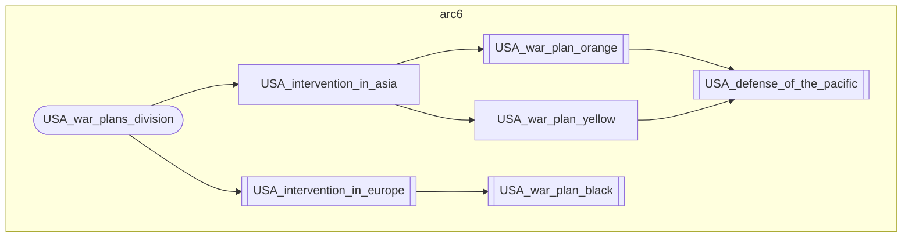

# Scenarios Catalog (vanilla)

The six arcs the vanilla director can run, one per major. This is the vanilla
counterpart of the Rt56 catalog; the arc schema lives in
`docs/gdd/Scenarios.md`. The pool is the **content-portable** subset of the full
Rt56 catalog: an arc is ported only if its key focuses exist in vanilla without
substitution and without a DLC gate.

Cross-reference: `docs/gdd/Scenarios.md` defines the arc schema (aggressor,
targets, joiners, ladder, levers, derail, telemetry). This file lists which
focus branches become which arc and their target variants.

## Arc anatomy

- **Type**: every vanilla arc is `historical` (no flip gate; the Rt56 overlay
  carries the flip and imperial arcs, whose focus branches are DLC-gated in
  vanilla).
- **Target variants**: every arc has two interchangeable target sets, A and B,
  rolled 50/50 at pick. The roll is fixed for the session and logs `sc_variant`.
- **Vanilla port is content only in mechanics**: the engine is shared with the
  Rt56 overlay (same files, same macros); only focus/event ids and the pool
  composition differ. See `docs/adr/0001-full-scenario-engine-in-vanilla-port.md`.

## Implemented arcs

| # | Aggressor | Arc | Variant A | Variant B | Key focuses |
|---|---|---|---|---|---|
| 1 | GER | Axis expansion | CZE, POL | FRA, ENG | `danzig_or_war`, `demand_sudetenland`, `war_with_france`, `around_maginot`, `remilitarize_the_rhineland`, `anschluss` |
| 2 | SOV | Southern thrust | TUR, IRQ, PER | PAK, RAJ, AFG | `preemptive_invasion_of_iran` |
| 3 | JAP | Japanese expansion | CHI, PHI | BRM, INS, MAL | `reinforce_the_beijing_garrison`, `strike_the_southern_road`, `revisit_the_thirteen_demands`, `occupy_siam` |
| 4 | ITA | Italian expansion | YUG, GRE | FRA, ENG | `italys_destiny`, `war_with_greece`, `foreign_affairs`, `ratify_the_stresa_front` |
| 5 | ENG | Anti-Soviet drive | SOV | SOV | `war_with_ussr`, `embargo_ussr`, `steady_as_she_goes` |
| 6 | USA | American war plan | JAP | ENG, CAN | `war_plan_orange`, `war_plan_black`, `defense_of_the_pacific`, `intervention_in_europe` |

## Excluded majors

- **FRA**: the Bonapartist branch is Rt56-only (`FRA_action_francaise`,
  `FRA_brumaire_movement`, `FRA_the_new_continental_system` and the rest do not
  exist in vanilla), and the revanchist and Plan XIV branches are likewise
  absent. No French arc is content-portable, so arc id 7 is left as a documented
  gap rather than filled with a substituted arc.
- **HUN**: the Habsburg restoration arc is out of scope for this pool by user
  decision; its vanilla focuses do exist should it be added later.

## Pool and selection

- Random sessions pick from the pool with equal weights, over arcs whose
  aggressor exists. Pin options exist for all six.
- A derail repicks the next eligible never-derailed arc; a derailed arc never
  re-enters the pool in the same session.
- Target variants are rolled at pick (50/50) and remain fixed for the session.

## Focus paths per arc

Which focus branch each scenario pushes, derived from the vanilla trees (node
and edge data generated from `docs/gdd/National Focuses/*.md` by
`.scratch/scripts/build_scenario_graphs.py`). Reading a diagram:

- **`([id])` rounded** - a branch entry / path root (not itself boosted).
- **`[[id]]` double-bordered** - a key focus the director boosts with
  `$ai_scenario_focus_boost()` and logs with `sc_focus`.
- **`[id]` plain** - an intermediate prerequisite on the path (not boosted).
- **`A --> B`** - B requires A.
- **`A x--x B`** - mutually exclusive: taking one hides the other, so the boost
  on the wrong side of a fork is dead.

### Germany

#### Arc 1: Axis expansion

```mermaid
flowchart TD
    subgraph arc1
        GER_anschluss[["GER_anschluss"]]
        GER_around_maginot[["GER_around_maginot"]]
        GER_befriend_czechoslovakia(["GER_befriend_czechoslovakia"])
        GER_danzig_for_slovakia["GER_danzig_for_slovakia"]
        GER_danzig_or_war[["GER_danzig_or_war"]]
        GER_demand_sudetenland[["GER_demand_sudetenland"]]
        GER_fate_of_czechoslovakia["GER_fate_of_czechoslovakia"]
        GER_first_vienna_award["GER_first_vienna_award"]
        GER_heed_von_neuraths_concerns["GER_heed_von_neuraths_concerns"]
        GER_integrate_czechoslovakia["GER_integrate_czechoslovakia"]
        GER_operation_weserubung["GER_operation_weserubung"]
        GER_reassert_eastern_claims["GER_reassert_eastern_claims"]
        GER_remilitarize_the_rhineland(["GER_remilitarize_the_rhineland"])
        GER_reorganize_the_wehrmacht["GER_reorganize_the_wehrmacht"]
        GER_war_with_france[["GER_war_with_france"]]
        GER_anschluss --> GER_demand_sudetenland
        GER_anschluss --> GER_reassert_eastern_claims
        GER_around_maginot --> GER_war_with_france
        GER_befriend_czechoslovakia --> GER_integrate_czechoslovakia
        GER_danzig_for_slovakia --> GER_around_maginot
        GER_danzig_or_war --> GER_around_maginot
        GER_danzig_or_war --> GER_operation_weserubung
        GER_demand_sudetenland --> GER_first_vienna_award
        GER_fate_of_czechoslovakia --> GER_danzig_for_slovakia
        GER_first_vienna_award --> GER_fate_of_czechoslovakia
        GER_heed_von_neuraths_concerns --> GER_anschluss
        GER_integrate_czechoslovakia --> GER_danzig_for_slovakia
        GER_operation_weserubung --> GER_war_with_france
        GER_reassert_eastern_claims --> GER_danzig_or_war
        GER_remilitarize_the_rhineland --> GER_heed_von_neuraths_concerns
        GER_remilitarize_the_rhineland --> GER_reorganize_the_wehrmacht
        GER_reorganize_the_wehrmacht --> GER_anschluss
        GER_befriend_czechoslovakia x--x GER_demand_sudetenland
        GER_danzig_for_slovakia x--x GER_danzig_or_war
        GER_heed_von_neuraths_concerns x--x GER_reorganize_the_wehrmacht
    end
```

### Soviet Union

#### Arc 2: Soviet southern thrust

### Japan

#### Arc 3: Japanese expansion

```mermaid
flowchart TD
    subgraph arc3
        JAP_demand_tonkinese_bases["JAP_demand_tonkinese_bases"]
        JAP_nanshin_ron["JAP_nanshin_ron"]
        JAP_occupy_siam[["JAP_occupy_siam"]]
        JAP_reinforce_the_beijing_garrison[["JAP_reinforce_the_beijing_garrison"]]
        JAP_revere_the_emperor_destroy_the_traitors(["JAP_revere_the_emperor_destroy_the_traitors"])
        JAP_revisit_the_thirteen_demands[["JAP_revisit_the_thirteen_demands"]]
        JAP_sea_pressure_siam["JAP_sea_pressure_siam"]
        JAP_sea_purge_the_kodoha_faction(["JAP_sea_purge_the_kodoha_faction"])
        JAP_strike_the_southern_road[["JAP_strike_the_southern_road"]]
        JAP_demand_tonkinese_bases --> JAP_occupy_siam
        JAP_demand_tonkinese_bases --> JAP_sea_pressure_siam
        JAP_nanshin_ron --> JAP_demand_tonkinese_bases
        JAP_occupy_siam --> JAP_strike_the_southern_road
        JAP_revere_the_emperor_destroy_the_traitors --> JAP_nanshin_ron
        JAP_revere_the_emperor_destroy_the_traitors --> JAP_revisit_the_thirteen_demands
        JAP_revisit_the_thirteen_demands --> JAP_reinforce_the_beijing_garrison
        JAP_sea_pressure_siam --> JAP_strike_the_southern_road
        JAP_sea_purge_the_kodoha_faction --> JAP_nanshin_ron
        JAP_sea_purge_the_kodoha_faction --> JAP_revisit_the_thirteen_demands
        JAP_occupy_siam x--x JAP_sea_pressure_siam
        JAP_revere_the_emperor_destroy_the_traitors x--x JAP_sea_purge_the_kodoha_faction
    end
```

<!-- italy -->

#### Arc 4: Italian expansion

```mermaid
flowchart TD
    subgraph arc4
        ITA_balkan_ambition["ITA_balkan_ambition"]
        ITA_conspiracies_in_the_shadows["ITA_conspiracies_in_the_shadows"]
        ITA_foreign_affairs[["ITA_foreign_affairs"]]
        ITA_guarantee_austrian_independence["ITA_guarantee_austrian_independence"]
        ITA_italian_irredentism["ITA_italian_irredentism"]
        ITA_italy_first["ITA_italy_first"]
        ITA_italys_destiny[["ITA_italys_destiny"]]
        ITA_negotiate_italian_claims["ITA_negotiate_italian_claims"]
        ITA_pact_of_steel["ITA_pact_of_steel"]
        ITA_potential_allies_in_the_balkans["ITA_potential_allies_in_the_balkans"]
        ITA_ratify_the_stresa_front[["ITA_ratify_the_stresa_front"]]
        ITA_servizio_informazione_militare["ITA_servizio_informazione_militare"]
        ITA_solid_progress(["ITA_solid_progress"])
        ITA_struggle_in_ethiopia(["ITA_struggle_in_ethiopia"])
        ITA_the_abyssinian_fiasco(["ITA_the_abyssinian_fiasco"])
        ITA_triumph_in_africa_bba["ITA_triumph_in_africa_bba"]
        ITA_undermine_the_duce["ITA_undermine_the_duce"]
        ITA_war_with_greece[["ITA_war_with_greece"]]
        ITA_balkan_ambition --> ITA_guarantee_austrian_independence
        ITA_balkan_ambition --> ITA_italy_first
        ITA_balkan_ambition --> ITA_pact_of_steel
        ITA_conspiracies_in_the_shadows --> ITA_foreign_affairs
        ITA_foreign_affairs --> ITA_balkan_ambition
        ITA_foreign_affairs --> ITA_potential_allies_in_the_balkans
        ITA_guarantee_austrian_independence --> ITA_negotiate_italian_claims
        ITA_italian_irredentism --> ITA_war_with_greece
        ITA_italy_first --> ITA_italian_irredentism
        ITA_negotiate_italian_claims --> ITA_ratify_the_stresa_front
        ITA_pact_of_steel --> ITA_italian_irredentism
        ITA_potential_allies_in_the_balkans --> ITA_guarantee_austrian_independence
        ITA_potential_allies_in_the_balkans --> ITA_italy_first
        ITA_potential_allies_in_the_balkans --> ITA_pact_of_steel
        ITA_ratify_the_stresa_front --> ITA_italys_destiny
        ITA_servizio_informazione_militare --> ITA_triumph_in_africa_bba
        ITA_solid_progress --> ITA_servizio_informazione_militare
        ITA_struggle_in_ethiopia --> ITA_servizio_informazione_militare
        ITA_struggle_in_ethiopia --> ITA_undermine_the_duce
        ITA_the_abyssinian_fiasco --> ITA_servizio_informazione_militare
        ITA_triumph_in_africa_bba --> ITA_foreign_affairs
        ITA_undermine_the_duce --> ITA_conspiracies_in_the_shadows
        ITA_balkan_ambition x--x ITA_potential_allies_in_the_balkans
        ITA_guarantee_austrian_independence x--x ITA_italy_first
        ITA_guarantee_austrian_independence x--x ITA_pact_of_steel
        ITA_italy_first x--x ITA_pact_of_steel
        ITA_solid_progress x--x ITA_struggle_in_ethiopia
        ITA_solid_progress x--x ITA_the_abyssinian_fiasco
        ITA_struggle_in_ethiopia x--x ITA_the_abyssinian_fiasco
    end
```

### United Kingdom

#### Arc 5: British anti-Soviet drive

### United States

#### Arc 6: American war plan

