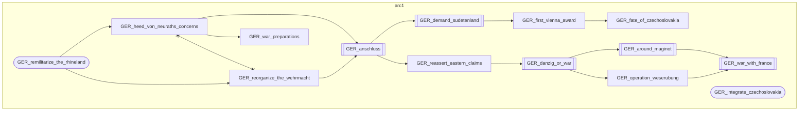
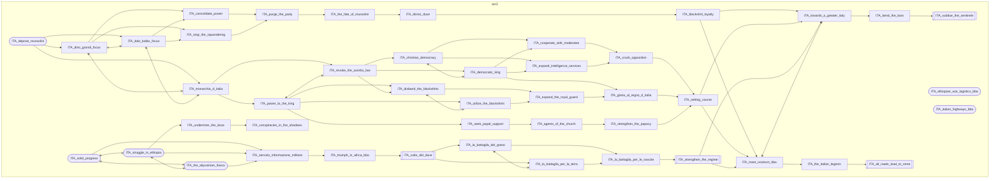
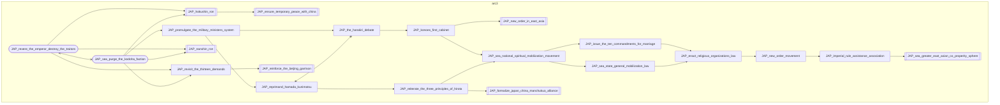

# Scenarios Catalog

Generated from `docs/scenarios/*.toml` by `core/tools/build_scenario_catalog.py` -
do not edit by hand. The arc schema lives in `docs/gdd/Scenarios.md`.

## Reading a diagram

- `([id])` rounded - a branch entry / path root.
- `[[id]]` double-bordered - a key focus the director boosts and logs.
- `[id]` plain - an intermediate prerequisite, boosted as part of the path closure.
- `A --> B` - B requires A.
- `A x--x B` - mutually exclusive: taking one hides the other.

## Germany

| # | Aggressor | Arc | Variant a | Variant b | Key focuses | Status |
|---|---|---|---|---|---|---|
| 1 | GER | Nazi germany scenario | CZE, POL | FRA, ENG | `remilitarize_the_rhineland`, `anschluss`, `demand_sudetenland`, `danzig_or_war`, `around_maginot`, `war_with_france` | ready |

### Arc 1: Nazi germany scenario

The historical arc: Germany remilitarizes, absorbs Austria, pressures
Czechoslovakia and Poland through ultimatums, then turns on France. The
variant roll picks the eastern pair (CZE, POL) or the western pair
(FRA, ENG); the ladder releases claims and incidents at the crises rung
and ultimatums plus join offers at peak.

**Telemetry labels**: `sc_goal`: cze_on_ger, eng_on_ger, fra_on_ger, ger_on_cze, ger_on_eng, ger_on_fra, ger_on_pol, pol_on_ger; `sc_justify`: ger_on_cze, ger_on_eng, ger_on_fra, ger_on_pol.

```mermaid
flowchart TD
    subgraph arc1
        GER_anschluss[["GER_anschluss"]]
        GER_around_maginot[["GER_around_maginot"]]
        GER_danzig_or_war[["GER_danzig_or_war"]]
        GER_demand_sudetenland[["GER_demand_sudetenland"]]
        GER_fate_of_czechoslovakia["GER_fate_of_czechoslovakia"]
        GER_first_vienna_award["GER_first_vienna_award"]
        GER_heed_von_neuraths_concerns["GER_heed_von_neuraths_concerns"]
        GER_integrate_czechoslovakia(["GER_integrate_czechoslovakia"])
        GER_operation_weserubung["GER_operation_weserubung"]
        GER_reassert_eastern_claims["GER_reassert_eastern_claims"]
        GER_remilitarize_the_rhineland(["GER_remilitarize_the_rhineland"])
        GER_reorganize_the_wehrmacht["GER_reorganize_the_wehrmacht"]
        GER_war_preparations["GER_war_preparations"]
        GER_war_with_france[["GER_war_with_france"]]
        GER_anschluss --> GER_demand_sudetenland
        GER_anschluss --> GER_reassert_eastern_claims
        GER_around_maginot --> GER_war_with_france
        GER_danzig_or_war --> GER_around_maginot
        GER_danzig_or_war --> GER_operation_weserubung
        GER_demand_sudetenland --> GER_first_vienna_award
        GER_first_vienna_award --> GER_fate_of_czechoslovakia
        GER_heed_von_neuraths_concerns --> GER_anschluss
        GER_heed_von_neuraths_concerns --> GER_war_preparations
        GER_operation_weserubung --> GER_war_with_france
        GER_reassert_eastern_claims --> GER_danzig_or_war
        GER_remilitarize_the_rhineland --> GER_heed_von_neuraths_concerns
        GER_remilitarize_the_rhineland --> GER_reorganize_the_wehrmacht
        GER_reorganize_the_wehrmacht --> GER_anschluss
        GER_heed_von_neuraths_concerns x--x GER_reorganize_the_wehrmacht
    end
```

## Italy

| # | Aggressor | Arc | Variant a | Variant b | Key focuses | Status |
|---|---|---|---|---|---|---|
| 2 | ITA | Fascist italy scenario | ENG, FRA | YUG, SWI | `ethiopian_war_logistics_bba`, `italian_highways_bba`, `culto_del_duce`, `strengthen_the_regime`, `subdue_the_sentinels`, `ethiopian_war_logistics_bba`, `italian_highways_bba`, `culto_del_duce`, `strengthen_the_regime`, `all_roads_lead_to_rome` | ready |

### Arc 2: Fascist italy scenario

The historical arc: Italy consolidates at home and in Ethiopia, then presses
its rivals around the Mediterranean. The variant roll picks the western pair
(ENG, FRA) or the Adriatic-Alpine pair (YUG, SWI); the ladder releases claims
and incidents at the crises rung and ultimatums plus join offers at peak.

**Telemetry labels**: `sc_goal`: eng_on_ita, fra_on_ita, ita_on_eng, ita_on_fra, ita_on_swi, ita_on_yug, swi_on_ita, yug_on_ita; `sc_justify`: ita_on_eng, ita_on_fra, ita_on_swi, ita_on_yug.

```mermaid
flowchart TD
    subgraph arc2
        ITA_agents_of_the_church["ITA_agents_of_the_church"]
        ITA_all_roads_lead_to_rome[["ITA_all_roads_lead_to_rome"]]
        ITA_bend_the_bars["ITA_bend_the_bars"]
        ITA_blackshirt_loyalty["ITA_blackshirt_loyalty"]
        ITA_christian_democracy["ITA_christian_democracy"]
        ITA_consolidate_power["ITA_consolidate_power"]
        ITA_conspiracies_in_the_shadows["ITA_conspiracies_in_the_shadows"]
        ITA_cooperate_with_moderates["ITA_cooperate_with_moderates"]
        ITA_crush_opposition["ITA_crush_opposition"]
        ITA_culto_del_duce[["ITA_culto_del_duce"]]
        ITA_democratic_king["ITA_democratic_king"]
        ITA_depose_mussolini(["ITA_depose_mussolini"])
        ITA_dino_grandi_focus["ITA_dino_grandi_focus"]
        ITA_disband_the_blackshirts["ITA_disband_the_blackshirts"]
        ITA_divino_duce["ITA_divino_duce"]
        ITA_ethiopian_war_logistics_bba(["ITA_ethiopian_war_logistics_bba"])
        ITA_expand_intelligence_services["ITA_expand_intelligence_services"]
        ITA_expand_the_royal_guard["ITA_expand_the_royal_guard"]
        ITA_gloria_al_regno_d_italia["ITA_gloria_al_regno_d_italia"]
        ITA_italian_highways_bba(["ITA_italian_highways_bba"])
        ITA_italo_balbo_focus["ITA_italo_balbo_focus"]
        ITA_la_battaglia_del_grano["ITA_la_battaglia_del_grano"]
        ITA_la_battaglia_per_la_terra["ITA_la_battaglia_per_la_terra"]
        ITA_la_battaglia_per_le_nascite["ITA_la_battaglia_per_le_nascite"]
        ITA_mare_nostrum_bba["ITA_mare_nostrum_bba"]
        ITA_monarchia_d_italia["ITA_monarchia_d_italia"]
        ITA_power_to_the_king["ITA_power_to_the_king"]
        ITA_purge_the_party["ITA_purge_the_party"]
        ITA_revoke_the_acerbo_law["ITA_revoke_the_acerbo_law"]
        ITA_seek_papal_support["ITA_seek_papal_support"]
        ITA_servizio_informazione_militare["ITA_servizio_informazione_militare"]
        ITA_setting_course["ITA_setting_course"]
        ITA_solid_progress(["ITA_solid_progress"])
        ITA_stop_the_squandering["ITA_stop_the_squandering"]
        ITA_strengthen_the_papacy["ITA_strengthen_the_papacy"]
        ITA_strengthen_the_regime[["ITA_strengthen_the_regime"]]
        ITA_struggle_in_ethiopia(["ITA_struggle_in_ethiopia"])
        ITA_subdue_the_sentinels[["ITA_subdue_the_sentinels"]]
        ITA_the_abyssinian_fiasco(["ITA_the_abyssinian_fiasco"])
        ITA_the_fate_of_mussolini["ITA_the_fate_of_mussolini"]
        ITA_the_italian_legions["ITA_the_italian_legions"]
        ITA_towards_a_greater_italy["ITA_towards_a_greater_italy"]
        ITA_triumph_in_africa_bba["ITA_triumph_in_africa_bba"]
        ITA_undermine_the_duce["ITA_undermine_the_duce"]
        ITA_utilize_the_blackshirts["ITA_utilize_the_blackshirts"]
        ITA_agents_of_the_church --> ITA_strengthen_the_papacy
        ITA_bend_the_bars --> ITA_subdue_the_sentinels
        ITA_blackshirt_loyalty --> ITA_mare_nostrum_bba
        ITA_blackshirt_loyalty --> ITA_towards_a_greater_italy
        ITA_christian_democracy --> ITA_cooperate_with_moderates
        ITA_christian_democracy --> ITA_expand_intelligence_services
        ITA_consolidate_power --> ITA_purge_the_party
        ITA_cooperate_with_moderates --> ITA_crush_opposition
        ITA_crush_opposition --> ITA_setting_course
        ITA_culto_del_duce --> ITA_la_battaglia_del_grano
        ITA_culto_del_duce --> ITA_la_battaglia_per_la_terra
        ITA_democratic_king --> ITA_cooperate_with_moderates
        ITA_democratic_king --> ITA_expand_intelligence_services
        ITA_democratic_king --> ITA_gloria_al_regno_d_italia
        ITA_depose_mussolini --> ITA_dino_grandi_focus
        ITA_depose_mussolini --> ITA_italo_balbo_focus
        ITA_depose_mussolini --> ITA_monarchia_d_italia
        ITA_dino_grandi_focus --> ITA_consolidate_power
        ITA_dino_grandi_focus --> ITA_stop_the_squandering
        ITA_disband_the_blackshirts --> ITA_expand_the_royal_guard
        ITA_divino_duce --> ITA_blackshirt_loyalty
        ITA_expand_intelligence_services --> ITA_crush_opposition
        ITA_expand_the_royal_guard --> ITA_gloria_al_regno_d_italia
        ITA_gloria_al_regno_d_italia --> ITA_setting_course
        ITA_italo_balbo_focus --> ITA_consolidate_power
        ITA_italo_balbo_focus --> ITA_stop_the_squandering
        ITA_la_battaglia_del_grano --> ITA_la_battaglia_per_le_nascite
        ITA_la_battaglia_per_la_terra --> ITA_la_battaglia_per_le_nascite
        ITA_la_battaglia_per_le_nascite --> ITA_strengthen_the_regime
        ITA_mare_nostrum_bba --> ITA_the_italian_legions
        ITA_monarchia_d_italia --> ITA_power_to_the_king
        ITA_monarchia_d_italia --> ITA_revoke_the_acerbo_law
        ITA_power_to_the_king --> ITA_disband_the_blackshirts
        ITA_power_to_the_king --> ITA_seek_papal_support
        ITA_power_to_the_king --> ITA_utilize_the_blackshirts
        ITA_purge_the_party --> ITA_the_fate_of_mussolini
        ITA_revoke_the_acerbo_law --> ITA_christian_democracy
        ITA_revoke_the_acerbo_law --> ITA_democratic_king
        ITA_revoke_the_acerbo_law --> ITA_disband_the_blackshirts
        ITA_seek_papal_support --> ITA_agents_of_the_church
        ITA_servizio_informazione_militare --> ITA_triumph_in_africa_bba
        ITA_setting_course --> ITA_mare_nostrum_bba
        ITA_setting_course --> ITA_towards_a_greater_italy
        ITA_solid_progress --> ITA_servizio_informazione_militare
        ITA_stop_the_squandering --> ITA_purge_the_party
        ITA_strengthen_the_papacy --> ITA_setting_course
        ITA_strengthen_the_regime --> ITA_mare_nostrum_bba
        ITA_strengthen_the_regime --> ITA_towards_a_greater_italy
        ITA_struggle_in_ethiopia --> ITA_servizio_informazione_militare
        ITA_struggle_in_ethiopia --> ITA_undermine_the_duce
        ITA_the_abyssinian_fiasco --> ITA_servizio_informazione_militare
        ITA_the_fate_of_mussolini --> ITA_divino_duce
        ITA_the_italian_legions --> ITA_all_roads_lead_to_rome
        ITA_towards_a_greater_italy --> ITA_bend_the_bars
        ITA_triumph_in_africa_bba --> ITA_culto_del_duce
        ITA_undermine_the_duce --> ITA_conspiracies_in_the_shadows
        ITA_utilize_the_blackshirts --> ITA_expand_the_royal_guard
        ITA_christian_democracy x--x ITA_democratic_king
        ITA_dino_grandi_focus x--x ITA_italo_balbo_focus
        ITA_dino_grandi_focus x--x ITA_monarchia_d_italia
        ITA_disband_the_blackshirts x--x ITA_utilize_the_blackshirts
        ITA_italo_balbo_focus x--x ITA_monarchia_d_italia
        ITA_la_battaglia_del_grano x--x ITA_la_battaglia_per_la_terra
        ITA_mare_nostrum_bba x--x ITA_towards_a_greater_italy
        ITA_power_to_the_king x--x ITA_revoke_the_acerbo_law
        ITA_solid_progress x--x ITA_struggle_in_ethiopia
        ITA_solid_progress x--x ITA_the_abyssinian_fiasco
        ITA_struggle_in_ethiopia x--x ITA_the_abyssinian_fiasco
    end
```

## Japan

| # | Aggressor | Arc | Variant a | Variant b | Key focuses | Status |
|---|---|---|---|---|---|---|
| 3 | JAP | Militarist japan scenario | CHI, AST | SOV, MON | `reinforce_the_beijing_garrison`, `new_order_in_east_asia`, `sea_greater_east_asian_co_properity_sphere`, `nanshin_ron`, `ensure_temporary_peace_with_china`, `formalize_japan_china_manchukuo_alliance`, `sea_greater_east_asian_co_properity_sphere`, `hokushin_ron` | ready |

### Arc 3: Militarist japan scenario

The historical arc.

**Telemetry labels**: `sc_goal`: ast_on_jap, chi_on_jap, jap_on_ast, jap_on_chi, jap_on_mon, jap_on_sov, mon_on_jap, sov_on_jap; `sc_justify`: jap_on_ast, jap_on_chi, jap_on_mon, jap_on_sov.

```mermaid
flowchart TD
    subgraph arc3
        JAP_enact_religious_organizations_law["JAP_enact_religious_organizations_law"]
        JAP_ensure_temporary_peace_with_china[["JAP_ensure_temporary_peace_with_china"]]
        JAP_formalize_japan_china_manchukuo_alliance[["JAP_formalize_japan_china_manchukuo_alliance"]]
        JAP_hokushin_ron[["JAP_hokushin_ron"]]
        JAP_imperial_rule_assistance_association["JAP_imperial_rule_assistance_association"]
        JAP_issue_the_ten_commandments_for_marriage["JAP_issue_the_ten_commandments_for_marriage"]
        JAP_konoes_first_cabinet["JAP_konoes_first_cabinet"]
        JAP_nanshin_ron[["JAP_nanshin_ron"]]
        JAP_new_order_in_east_asia[["JAP_new_order_in_east_asia"]]
        JAP_new_order_movement["JAP_new_order_movement"]
        JAP_promulgate_the_military_ministers_system["JAP_promulgate_the_military_ministers_system"]
        JAP_reinforce_the_beijing_garrison[["JAP_reinforce_the_beijing_garrison"]]
        JAP_reiterate_the_three_principles_of_hirota["JAP_reiterate_the_three_principles_of_hirota"]
        JAP_reprimand_hamada_kunimatsu["JAP_reprimand_hamada_kunimatsu"]
        JAP_revere_the_emperor_destroy_the_traitors(["JAP_revere_the_emperor_destroy_the_traitors"])
        JAP_revisit_the_thirteen_demands["JAP_revisit_the_thirteen_demands"]
        JAP_sea_greater_east_asian_co_properity_sphere[["JAP_sea_greater_east_asian_co_properity_sphere"]]
        JAP_sea_national_spiritual_mobliization_movement["JAP_sea_national_spiritual_mobliization_movement"]
        JAP_sea_purge_the_kodoha_faction(["JAP_sea_purge_the_kodoha_faction"])
        JAP_sea_state_general_mobilization_law["JAP_sea_state_general_mobilization_law"]
        JAP_the_harakiri_debate["JAP_the_harakiri_debate"]
        JAP_enact_religious_organizations_law --> JAP_new_order_movement
        JAP_hokushin_ron --> JAP_ensure_temporary_peace_with_china
        JAP_imperial_rule_assistance_association --> JAP_sea_greater_east_asian_co_properity_sphere
        JAP_issue_the_ten_commandments_for_marriage --> JAP_enact_religious_organizations_law
        JAP_konoes_first_cabinet --> JAP_new_order_in_east_asia
        JAP_konoes_first_cabinet --> JAP_sea_national_spiritual_mobliization_movement
        JAP_new_order_movement --> JAP_imperial_rule_assistance_association
        JAP_promulgate_the_military_ministers_system --> JAP_reprimand_hamada_kunimatsu
        JAP_promulgate_the_military_ministers_system --> JAP_the_harakiri_debate
        JAP_reiterate_the_three_principles_of_hirota --> JAP_formalize_japan_china_manchukuo_alliance
        JAP_reiterate_the_three_principles_of_hirota --> JAP_sea_national_spiritual_mobliization_movement
        JAP_reprimand_hamada_kunimatsu --> JAP_reiterate_the_three_principles_of_hirota
        JAP_revere_the_emperor_destroy_the_traitors --> JAP_hokushin_ron
        JAP_revere_the_emperor_destroy_the_traitors --> JAP_nanshin_ron
        JAP_revere_the_emperor_destroy_the_traitors --> JAP_revisit_the_thirteen_demands
        JAP_revisit_the_thirteen_demands --> JAP_reinforce_the_beijing_garrison
        JAP_sea_national_spiritual_mobliization_movement --> JAP_issue_the_ten_commandments_for_marriage
        JAP_sea_national_spiritual_mobliization_movement --> JAP_sea_state_general_mobilization_law
        JAP_sea_purge_the_kodoha_faction --> JAP_hokushin_ron
        JAP_sea_purge_the_kodoha_faction --> JAP_nanshin_ron
        JAP_sea_purge_the_kodoha_faction --> JAP_promulgate_the_military_ministers_system
        JAP_sea_purge_the_kodoha_faction --> JAP_revisit_the_thirteen_demands
        JAP_sea_state_general_mobilization_law --> JAP_enact_religious_organizations_law
        JAP_the_harakiri_debate --> JAP_konoes_first_cabinet
        JAP_reprimand_hamada_kunimatsu x--x JAP_the_harakiri_debate
        JAP_revere_the_emperor_destroy_the_traitors x--x JAP_sea_purge_the_kodoha_faction
    end
```
